# 使用 LSTM 的泰卢固语语料库的深度学习语言模型

> 原文：<https://medium.com/analytics-vidhya/deep-learning-language-model-for-telugu-corpus-using-lstm-10cedbf9f654?source=collection_archive---------6----------------------->

来源:psiĥedelisto/cc0[维基共享资源]

语言建模是用于文本生成的现代自然语言处理的重要组成部分之一。它的应用领域非常广泛，比如:机器翻译、拼写纠正、语音识别、摘要、问题回答、情感分析等等。

这里，我们使用长短期记忆(LSTM) RNN 处理基于印度语言之一-泰卢固语的语料库来建立语言模型。rnn 使用具有隐藏记忆层的网络，以最高的概率预测下一步。rnn 使用反向传播来使用我们输入的文本，以学习如何生成下一个字母或字符作为其输出。

该模型的 LSTM 部分允许我们建立一个具有改进的长期依赖性学习的 RNN 模型，即更好的记忆，这有助于改进我们将生成的那些单词的性能。

**关于文集**

本文中使用的全部语料库都是文本文件的形式。你可以从维基百科或新闻文章等各种来源创建自己的语料库。

# 加载数据

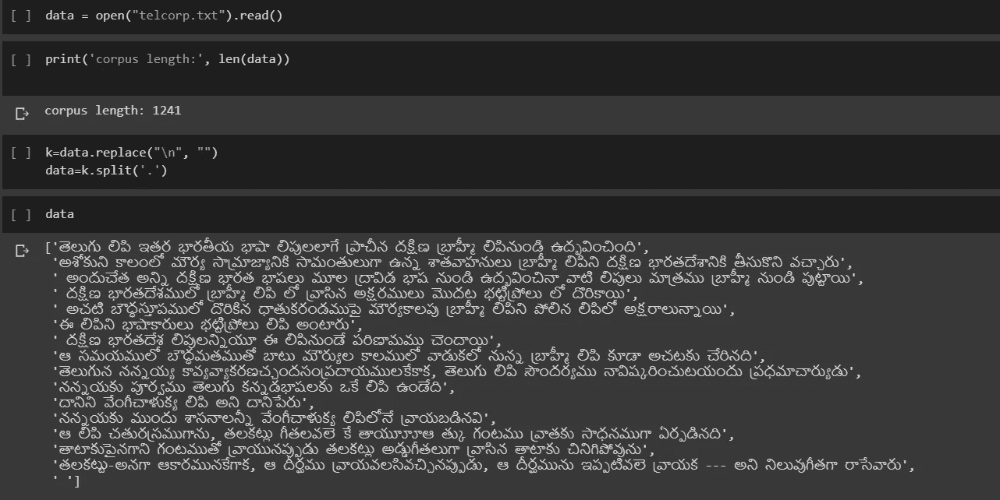

你可以看到，语料库包含泰卢固语的句子。现在，我们对其进行标记以获得唯一的单词。

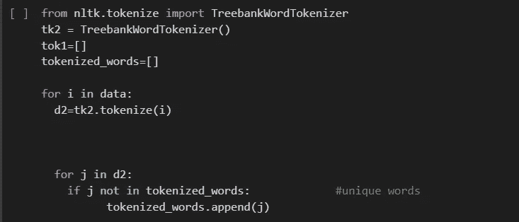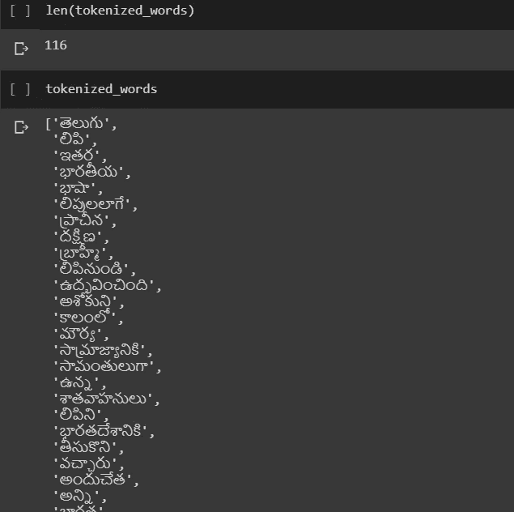

# **编码**

我们现在对标记化的单词进行编码。

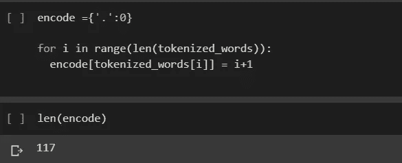

声明返回编码列表的函数:

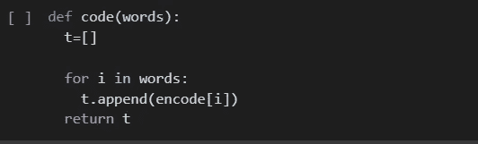

现在，我们采用 4 个单词的窗口大小，并尝试预测句子中出现的下一个单词。我们前进了 3 步，将句子分成包含 4 个输入单词和下一个要预测的单词的编码值的小数组。我们将它们添加到整个语料库的两个不同的列表中。

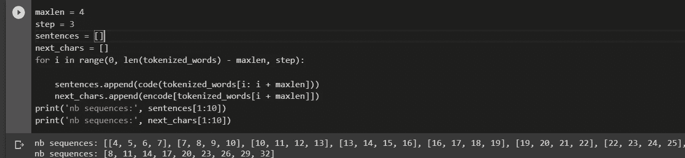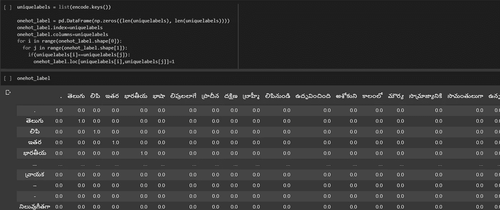

标记化的独热向量数组:

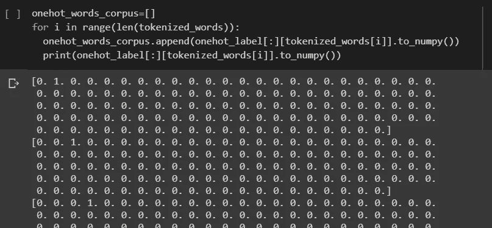

窗口中单词和下一个单词的一键表示数组。

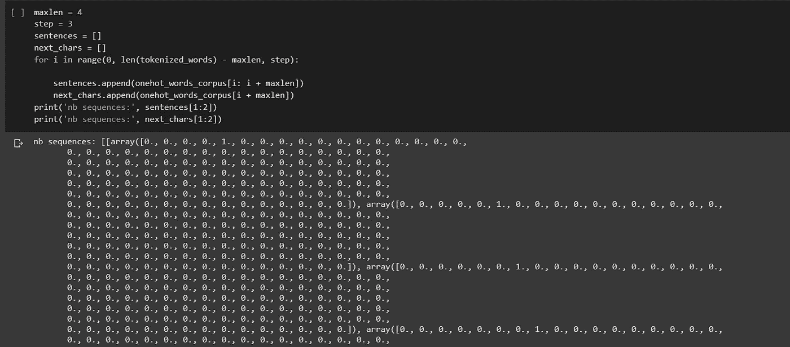

**定义输入和目标**

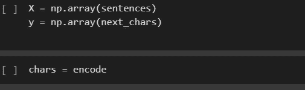

# **训练**

定义基于 LSTM 的模型:

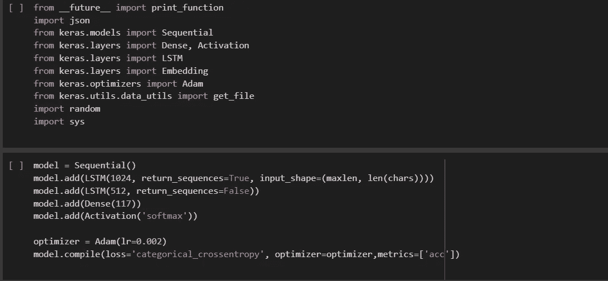

为 30 个时期训练模型:

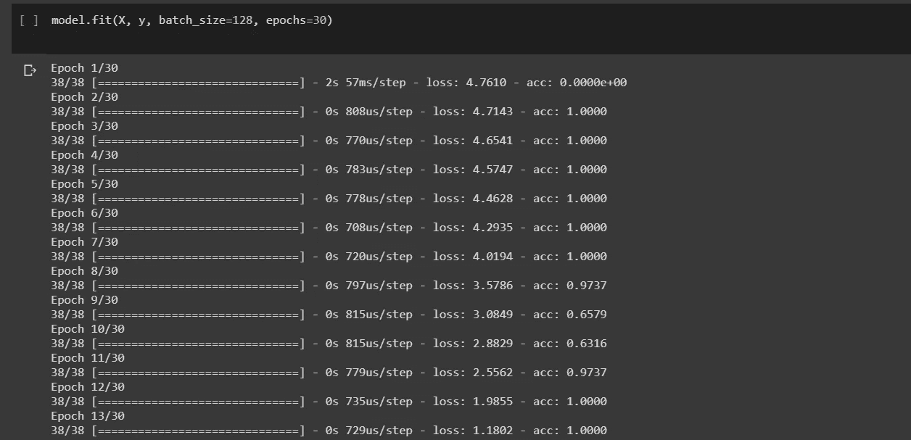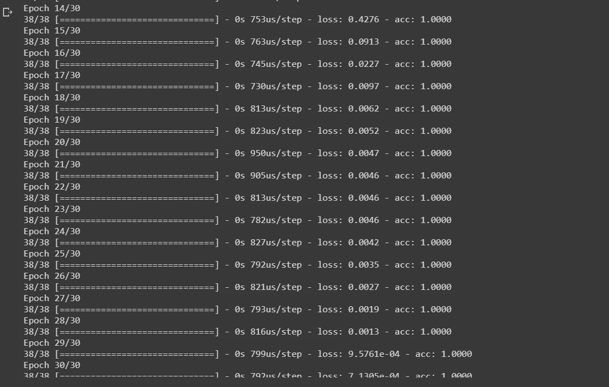

# **测试**

例句:

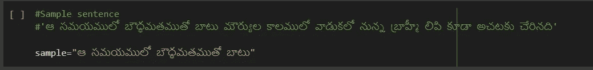

预测下一个单词:

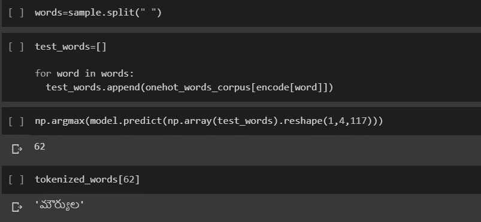

# 结论:

你可以看到我们成功地完成了预测下一个单词的任务，给定一个句子中的一组单词。

面临的挑战是获得一个大的语料库，并在此基础上训练模型。