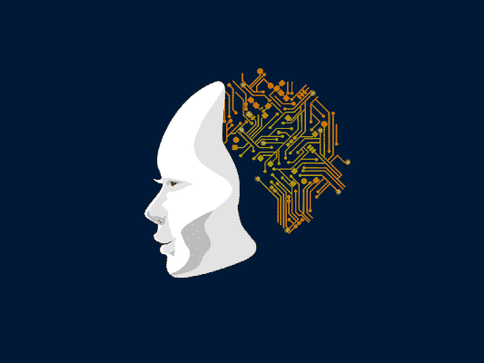

# 深度学习|机器学习| AI-清除困惑。

> 原文：<https://medium.com/analytics-vidhya/deep-learning-machine-learning-ai-clearing-the-confusion-1b9accdcd2dd?source=collection_archive---------18----------------------->

> 如果你不困惑，你就没有注意。—汤姆·彼得斯

## 深度学习|机器学习|人工智能

这些术语让很多人感到困惑&如果你也是其中之一，让我们一起来解决它吧！

作为程序员或极客，明智地使用这些术语很重要，因为它们不是同一个兄弟！

**人工智能:一把更大的伞。**

人工智能是 ML 或 DL(深度学习)的更广泛的保护伞。简单来说，我们可以说这三者在某种意义上是相互关联的。

**|了解区别:**

**AI** :让机器通过经验学习。机器根据新的输入调整它们的反应，从而完成类似人类的任务。通过处理大量数据和识别其中的模式，可以训练它们完成特定的任务。

**例子:**我们可以把 AI 想象成在建造一座巨大的建筑，第一座建筑花了好几年才完成。所以大部分的劳动都没有看到最后的结果。从事这项工作的人对他们的手艺感到自豪，他们砌砖和凿石头，这些都将被放置在这个巨大的结构中。

因此，作为人工智能研究人员，我们应该把自己想象成卑微的制砖工人，他们的工作是研究如何构建组件，学习程序/算法等。总有一天，在某个地方，有人会将这些模块集成到智能系统中。比如，砖块和水泥成分会形成巨大的建筑。

人工智能的一些现实生活例子:(一)苹果 Siri(二)下棋计算机。

> **机器学习:让机器学习**

在明确了对 AI 的理解之后，就到了困惑和深入机器学习的时候了。

理解 AI 后想到的第一个问题是“在我们已经有了 AI 的情况下，是什么让 ML 产生了？?"所以，要回答这个问题，讨论人工智能患者面临的问题是很重要的。

一、如何高效训练大型复杂模型？

二。如何训练更健壮版本的 AI 系统？

三。研究人员面临的问题是设计大脑的运作模式？

这些问题具有较高的影响力，让机器学习应运而生。

机器学习有方法和模型，而人工智能有符号方法。机器学习使计算机能够做出数据驱动的决策，并执行某项任务。它在某些模型上训练自己，并在接触到新数据时进行改进。

假设你去市场买芒果，那里有 1000 个芒果。所以，你很难选择哪一个是最好的。因此，假设你选择了一个芒果，并得出结论，较大且亮黄色的芒果是甜的，而较小且浅黄色的芒果只有一半时间是甜的。但是有一天你去市场买橘子，但是现在你不能用芒果的逻辑来分析它们，所以在这个时候这是没有价值的，所以你必须再次学习橘子的所有知识。但这并没有我们想象的那么难。但是如果我们不得不对这个逻辑进行编程呢？问题是每次你做出新的结论时，你都必须手动修改规则，这变得难以阅读和理解，需要花费很多努力，研究编码的时间。

代码看起来像这样，但是每次都需要修改

这就是现在机器学习发挥作用的地方，它允许机器从例子和经验中学习，而不需要显式编程。因此，你要做的不是编写代码，而是将数据提供给通用算法/机器。

> **深度学习:深入学习的海洋。**

深度学习并不新鲜，但如今它的炒作越来越多，越来越受关注。你可以将深度学习模型视为一个火箭引擎，它的燃料是我们提供给这些算法的大量数据。这个领域是一种特殊的机器学习，它受到我们称为神经元的脑细胞的功能的启发，这导致了人工神经网络的概念。

它在所有人工神经元之间建立数据连接，并根据数据模式调整它们。数据越大，神经元越多。它会自动学习多个抽象层次。从而允许系统学习复杂的函数映射，而不依赖于任何特定的算法。

**例如:**假设我们有一台机器可以识别给定的动物形象是猫还是狗？

现在假设我们被要求用最大似然法来解决这个问题。我们要做的第一件事是定义给定动物的特征，例如，检查它是否有胡须？或者检查动物有没有尖耳朵？或者尾巴是弯的还是直的？简而言之，我们会定义特征，让机器识别哪些特征更重要，并将其分类到特定的动物中。

现在，当涉及到深度学习时，它向前迈出了一步。它自动识别哪些特征对分类最重要。与机器学习相比，我们必须手动给出特征。

到目前为止，我们可以得出结论，人工智能是 ML 和深度学习所在的更广泛的保护伞。

我们可以得出的第二个结论是“深度学习**是**机器学习”，具有一些高级版本和功能，即它是机器学习的下一次进化。

# **|概要:**

机器学习使用算法来解析数据，从数据中学习，并根据所学做出明智的决策。

深度学习将算法分层构建，以创建一个人工“神经网络”，它可以学习并自行做出智能决策

深度学习是机器学习的子领域。虽然两者都属于人工智能的广泛类别，但深度学习通常是最像人类的人工智能的背后。