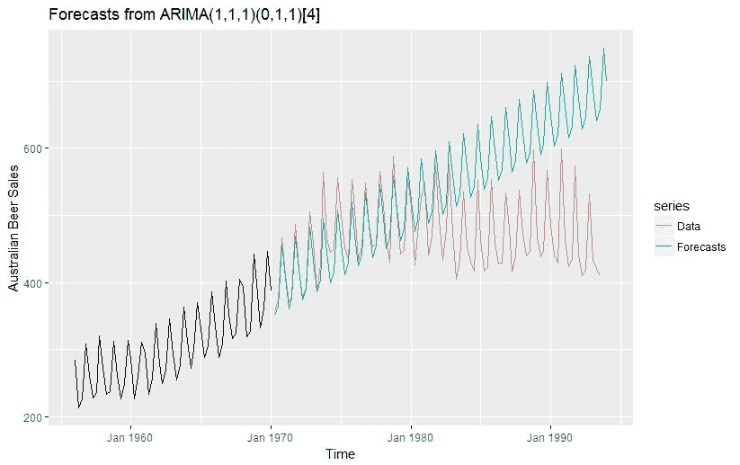

# 基于传统机器学习模型的时间序列深度学习模型

> 原文：<https://medium.com/analytics-vidhya/deep-learning-models-for-time-series-analyse-over-traditional-machine-learning-models-9d1954050b39?source=collection_archive---------16----------------------->

时间序列预测是机器学习的一个重要领域。这一点很重要，因为有太多的预测问题涉及到时间因素。然而，虽然时间组件增加了额外的信息，但与许多其他预测任务相比，它也使时间序列问题更难处理。

有几种类型的模型可用于时间序列预测。但是传统的机器学习模型在时间序列分析上是失败的。这是由于某些挑战:

1.每次您想要生成新的预测时，都需要重新训练您的模型。

2.必须取消训练/测试分裂。

3.预测的不确定性和预测本身一样重要，甚至更重要。

**挑战 1:每次您想要生成新的预测时，您都需要重新训练您的模型**

对于大多数 ML 模型，您训练一个模型，测试它，必要时重新训练它，直到您得到满意的结果，然后在维持/验证数据集上评估它。一旦您对模型性能感到满意，它就会被部署到生产中。几个月后，如果有大量新的训练数据，您可能需要更新模型。模型训练是一次性的活动，或者最多定期进行，以保持模型的性能，从而考虑新的信息。

对于时间序列模型，情况并非如此。相反，每当我们想要生成新的预测时，我们都必须从头开始重新训练我们的模型。

我们将使用 ARIMA 模型来预测澳大利亚的季度啤酒销量(数据集取自 Hyndman 的预测包 R)。首先，我们将根据 1956 年至 1970 年的数据训练一个模型，然后根据 1970 年至 1973 年的数据进行测试。(使用季节性 ARIMA(1，1，1)(0，1，1)模型)我们可以得到一个相当不错的预测(MAPE =1.94%)

接下来，如果我们将使用相同的模型来预测 1993 年之前的销售情况。天气预报不再那么好了。同一个 ARIMA (1，1，1) (0，1，1)模型对 1990 年至 1993 年的销售额进行了预测，其 MAPE = 44.92%的精度更差。

相反，我们必须重新调整第二个模型，考虑新的数据和销售模式的变化，比如 ARIMA (1，1，1) (1，1，2)模型。我们得到了相当接近的精度，即 MAPE=5.22%。当开发数据集的分布和生产数据集的分布不同时，ML 项目中的常见陷阱就会发生。对于时间序列，几乎总是如此。解决这个问题的唯一方法是在每次获得新数据时重新训练模型。

请注意，这与连续学习不同，在连续学习中，已经训练好的模型会随着新数据的到来而更新(尽管这将是一个有趣的研究主题，以了解连续学习是否可以应用于时间序列预测)。

**挑战 2:不可能进行训练/测试分割:**

让我们回到寻找 ML 模型的基本方法。通常，您使用训练集构建模型，然后在测试集上对其进行评估。这要求您有足够的数据来留出一个测试集，并且仍然有数据来构建模型。但是与图像处理或 NLP 中使用的数据集相比，时间序列数据通常非常小。某一产品在某一给定地点的两年周销售数据只有 104 个数据点(几乎不足以捕捉任何季节性)。对于如此小的数据集，我们没有足够的时间留出 20%或 30%的数据用于测试。

特定方式的交叉验证可以帮助我们拆分时间序列数据来训练和测试模型。

随机分割时间序列数据集不起作用，因为数据的时间部分会被打乱。对于时间序列预测问题，我们以下列方式执行交叉验证。

1.时间序列交叉验证的折叠是以正向链接方式创建的

2.假设我们有一个在 *n* 年期间消费者对一种产品的年度需求的时间序列。折叠的创建方式如下:

我们逐步选择新的训练和测试集。我们从一个训练集开始，该训练集具有拟合模型所需的最小数量的观察值。逐步地，我们随着每一次折叠改变我们的训练和测试集。

**挑战 3:预测的不确定性与预测本身一样重要，甚至更重要:**

将预测与其他监督学习任务区分开来的另一点是，你的预测几乎总是会出错。在给定足够的训练数据的情况下，处理图像分类问题或 NLP 问题的人可以合理地期望最终准确地分类所有新的输入样本。您所要做的就是确保您的训练数据和真实数据是从同一个分布中采样的。您准确预测下周将售出多少件 M 号阿迪达斯红色衬衫的可能性有多大？所以，你需要的不仅仅是一个点的预测，还有对预测不确定性的度量。

在需求预测和库存应用程序中，预测的不确定性对于使用预测的应用程序至关重要。预测的不确定性(由预测间隔或预测分位数表示)是您将用来计算安全库存的因素，也就是您希望保持的额外库存数量，以确保您不会失去任何客户。

**为什么深度学习是为了预测？**

正如我们在上面看到的，我们面临着某些挑战，这些挑战限制了我们使用传统的机器学习模型，并导致我们使用它们时预测的短期下降。为了克服这些瓶颈，我们使用能够克服这些挑战的神经网络。

## 以下是将深度学习添加到时间序列分析中的 5 个理由:

1.**易于提取的特征**

深度学习的深度神经网络能够减少对特征工程过程、数据缩放过程和静态数据的需求，这在时间序列预测中是必需的。这些网络可以自己学习，也可以通过训练从原始输入数据中提取特征，这正是时间序列预测所需要的。在神经网络模型中，对象序列可以被视为一维图像。这个模型是神经网络可以提炼出的最相关的元素。因此，神经网络被广泛应用于时间序列预测。

2.**擅长轻松提取图案:**

时间序列预测基本上是寻找模式，并最终跨越长序列。递归神经网络(RNN)在时间序列预测中具有很高的适用性。RNN 中的每个神经元都能够利用其内部记忆来保持先前输入的信息。这种[使得它们对于顺序数据和时间序列来说是很好的](https://towardsdatascience.com/recurrent-neural-networks-and-lstm-4b601dd822a5)。RNN 有环路，允许信息在读取输入时穿过神经元。它们有助于掌握数据的时间依赖性，并且可以轻松识别哪些先前的观察结果是重要的，以及它们如何与当前的预测相关。它可以从映射的输入中了解什么信息是重要的，并且可以根据需要动态地改变这个上下文。

3.**从训练数据中容易预测:**

长短记忆网络(LSTM)是一种神经网络，可以根据之前遇到的数据进行预测。除了在其他领域的应用，LTSM 在时间序列中非常受欢迎。可以使用深度学习模型(如随机森林、梯度推进回归器和时间延迟神经网络)在不同的时间点表示数据。

4.**支持多输入多输出:**

时间序列预测通常需要处理多个输入并预测多个时间步长。同样，可以应用神经网络，其允许映射函数的固定/倍数数量的输入。它们[支持](https://www.oreilly.com/ideas/3-reasons-to-add-deep-learning-to-your-time-series-toolkit)多元输入，从而支持多元预测。复杂时间序列评估需要多变量和多步预测。神经网络还支持任意数量的输出值，有助于时间序列预测中的多个输出。

**5。** **没有对数据做任何假设:**

当我们使用神经网络时，它们不会考虑任何假设。在神经网络中，数据可以是任何时间的。神经网络的设计方式使得它们能够提取最有用的特征用于森林。他们不会等待任何特定类型的数据。它们是通用逼近器，这意味着深度学习可以表示各种各样的函数来进行预测。由于具有通用功能，它们可用于时间序列分析，以轻松捕捉趋势、模式和季节性。

少数神经网络是:

1.人工神经网络

2.时间滞后神经网络

3.季节性人工神经网络

4.递归神经网络(RNN (LSTM))

5.卷积神经网络(CNN)

对于这些主题，我附上了参考和理解的链接。我将为他的每一个博客创建一个单独的博客，以一种简化的方式详细介绍。

感谢你阅读这篇博客。您已经完成了博客的结尾。

**参考文献:**

1.**让有经验的机器学习实践者感到惊讶的 3 个关于时间序列预测的事实**—[https://towardsdatascience . com/3-facts-about-time-series-forecasting-that-surprise-experied-machine-learning-practices-69c 18 ee 89387](https://towardsdatascience.com/3-facts-about-time-series-forecasting-that-surprise-experienced-machine-learning-practitioners-69c18ee89387)

2.**使用交叉验证提高您的模型性能**—[https://www . analyticsvidhya . com/blog/2018/05/Improve-Model-Performance-Cross-Validation-in-python-r/](https://www.analyticsvidhya.com/blog/2018/05/improve-model-performance-cross-validation-in-python-r/)

3.通用近似定理—[https://en . Wikipedia . org/wiki/Universal _ Approximation _ theory](https://en.wikipedia.org/wiki/Universal_approximation_theorem)

4.**时间序列建模与预测的初步研究**——【https://arxiv.org/ftp/arxiv/papers/1302/1302.6613.pdf 

5.**使用** **递归神经网络**—[https://blog . statsbot . co/Time-Series-Prediction-Using-Recurrent-Neural-Networks-lst ms-807 fa 6 ca 7 f](https://blog.statsbot.co/time-series-prediction-using-recurrent-neural-networks-lstms-807fa6ca7f)

6.**如何使用卷积神经网络进行时间序列分类—**[https://towardsdatascience . com/How-to-Use-convolutionary-Neural-Networks-for-Time-Series-Classification-56 B1 b 0a 07 a 57](https://towardsdatascience.com/how-to-use-convolutional-neural-networks-for-time-series-classification-56b1b0a07a57)

**时间序列预测的神经网络模型—**[https://www . research gate . net/publication/227446910 _ Neural _ Network _ Models _ for _ Time _ Series _ Forecasts](https://www.researchgate.net/publication/227446910_Neural_Network_Models_for_Time_Series_Forecasts)