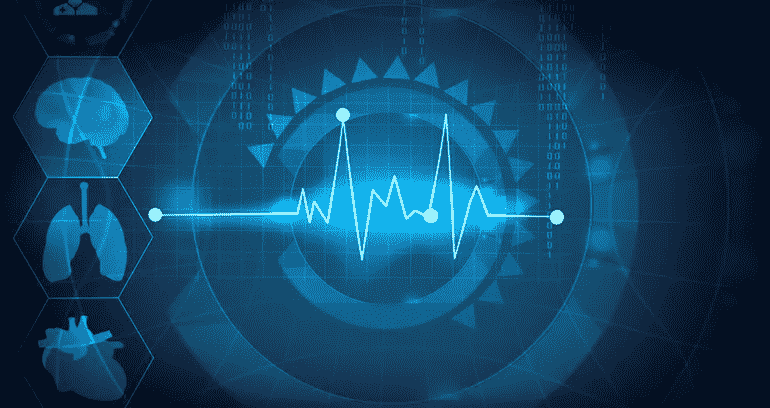

# 医疗保健中用于决策的深度学习/ NLP 技术

> 原文：<https://medium.com/analytics-vidhya/deep-learning-nlp-techniques-in-healthcare-for-decision-making-a3406641dd84?source=collection_archive---------6----------------------->

# **简介**

电子健康记录在医院和其他医疗机构中的普遍采用产生了大量真实世界的信息，这对进行临床研究是非常有价值的。在过去的许多年里，电子健康记录(EHR)系统被诊所和医院广泛采用。分析这个巨大的…