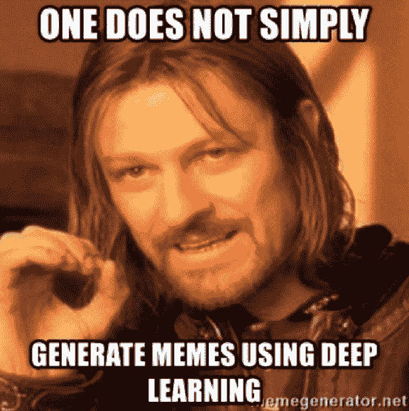
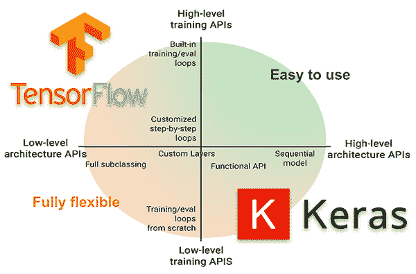
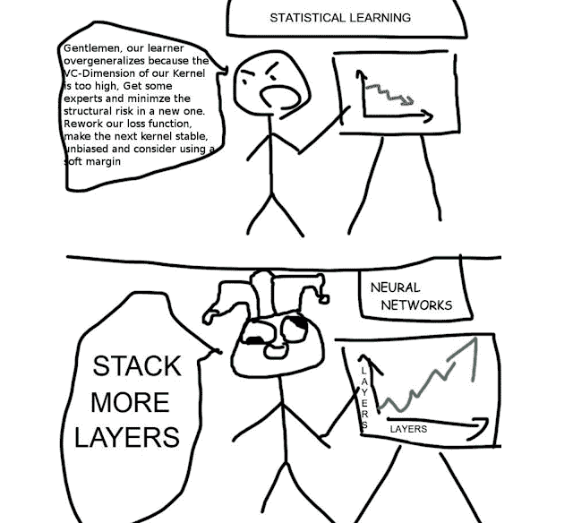

# 深度学习:不是很深

> 原文：<https://medium.com/analytics-vidhya/deep-learning-not-very-deep-73bb5d5ebdca?source=collection_archive---------17----------------------->

在这十年里，深度学习是一个众所周知的术语——这是一项令人惊讶的非常强大的技术。许多人认为深度学习很难理解。但幸运的是，他们错了。

深度学习非常依赖神经网络，而这些神经网络是人脑的复制品。所以如果你了解人类的大脑，你可以很容易地学习深度学习。

所以深度学习是机器学习和人工智能的一个子集，它模仿人脑处理数据和识别数据中的模式的工作。

对于 3d 模拟，您可以查看这段 youtube 视频:

我们来看看深度学习的一些应用。如今，DL 应用于各种主要的公共部门，如医疗保健、人脸识别、网络安全、翻译、NLP。

[深度学习技术如何用于产生迷因的一个很好的例子](http://bit.ly/meme_deep_learning_system)。

查看上面的文章。

现在了解一下做深度学习用的工具。深度学习中使用的主要工具是一种编程语言，可以从从 R 到 python 的各种范围中选择。但是现在 Python 越来越受欢迎，因为这种语言有很好的框架。

框架是由 google，Theano，pytorch awesome 深度学习库创建和维护的 tensorflow。

根据 tensorflow 网站:

“无论您是专家还是初学者，TensorFlow 都是一个端到端的平台，让您可以轻松构建和部署 ML 模型。”

图片来源:[谷歌& quora](https://www.quora.com/Is-Keras-better-than-Tensorflow-for-deep-learning)

现在由[**Fran ois Chollet**](https://www.google.com/search?client=ubuntu&hs=gRz&sxsrf=ACYBGNTzq8CTDYpbm_egtiBfr3uKfTY1jw:1578828807060&q=Fran%C3%A7ois+Chollet&stick=H4sIAAAAAAAAAOPgE-LVT9c3NEw2LDIqKssrUIJwMyxNsspNCpK0NDLKrfST83NyUpNLMvPz9Ivz00rKE4tSrfKLMtMz8xJzFBJLSzLyi4oXsQq6FSXmHV6en1ms4JwB0lECAHAnyrdeAAAA&sa=X&ved=2ahUKEwiquNLR-_3mAhUJWCsKHUbvDYMQmxMoATB8egQIahAL&cshid=1578829027417136)**创建的 keras 帮助用户非常容易地构建神经网络，并轻松地将它们部署到生产中。这就像是前端包装器，让我们用张量流做深度学习编码，就像糖引用糖果一样。**

**与在纯 tensorflow 中硬编码每个神经网络连接相比，您可以用 keras 创建一个深度学习模型，只需大约 5 行代码。**

**在张量流中它相当长:**

**Keras 使得快速获得托管模型并将其提供给云变得非常容易。**

**但两者各有利弊。Keras 让事情变得更快，tensorflow 让您能够更好地控制构建您的网络。**

**你可以试试这些，发现深度学习的世界。**

**使用 keras 和 tensorflow 的示例代码片段:**

**今天到此为止。**

****