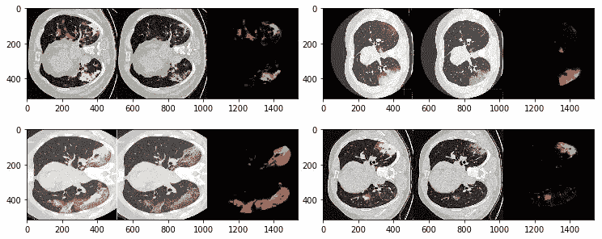

# 利用艾森对新冠肺炎数据进行深度学习

> 原文：<https://medium.com/analytics-vidhya/deep-learning-on-covid-19-data-with-eisen-7ad5b5657ff9?source=collection_archive---------27----------------------->

不需要多此一举就可以发展的更快！


# TL；速度三角形定位法(dead reckoning)

我尝试过使用[艾森](http://eisen.ai)对 COVID 数据进行深度学习。似乎这个包中已经包含了对大多数公开可用的数据集进行实验所需的所有部分。

我编写了一个小例子，展示了从互联网上获得的 100 幅图像的开放数据集[中分割肺部数据。艾森已经预先构建了能够处理这些数据的数据集，并允许我在几分钟后训练我的第一个模型。](http://medicalsegmentation.com/covid19/)

事件虽然我不认为我能在 5 分钟内制作出一个艺术模型，但我认为在疫情期间拥有快速原型和开发工具将有助于迭代更快。能够利用开发人员社区，例如 Eisen 周围的社区，他们关心为医疗 DL 构建尽可能好的工具，这是更快获得实际结果的关键。

在过去的几周里，我们看到了一些研究，展示了使用 ML/DL 方法分析新冠肺炎全球疫情数据时可以做些什么。已经宣布了一些不同的公共倡议，并公布了一些数据。

虽然我们仍在等待一个大型医学图像数据集，可用于生存预测、ICU 工作量、并发症和长期结果等关键任务，但一些较小的努力已经产生了公开可用的数据集，如可获得的[和](http://medicalsegmentation.com/covid19/)[数据集。](https://github.com/UCSD-AI4H/COVID-CT)

我已经看到了很多关于这些(和其他)数据集的讨论，一些人已经开始了他们自己的 GitHub 项目，在这些数据上运行他们的模型。不幸的是，他们经常从头开始编码，这导致了错误和结果缺乏可重复性。

几周以来， [Eisen](http://eisen.ai) 原生支持两个最重要的新冠肺炎数据集。为了创建一个在这个数据集上训练的深度学习模型，人们只需要编写几行代码，就可以开始一个功能完整、无 bug 且可重复的训练操作。

我已经决定尝试 Eisen 提供的与新冠肺炎数据相关的功能。目前有两个数据集可用。对于 [UCSD 数据集](https://github.com/UCSD-AI4H/COVID-CT)，可以使用以下行来实例化它们:

```
**from** eisen.datasets **import** UCSDCovid19

dataset **=** UCSDCovid19(
    '/abs/path/to/data',
    'positive',
    'negative',
    transform,
)# docs here [http://docs.eisen.ai/eisen/api.html#eisen.datasets.UCSDCovid19](http://docs.eisen.ai/eisen/api.html#eisen.datasets.UCSDCovid19)
```

以及下面的 [MedSegCovid19](http://medicalsegmentation.com/covid19/) 数据集片段。

```
**from** eisen.datasets **import** MedSegCovid19

dataset **=** MedSegCovid19(
    '/abs/path/to/data',
    'tr_im.nii',
    'tr_mask.nii',
    transform,
)# docs here 
[http://docs.eisen.ai/eisen/api.html#eisen.datasets.MedSegCovid19](http://docs.eisen.ai/eisen/api.html#eisen.datasets.MedSegCovid19)
```

我对在 MedSegCovid19 数据集上试用 Eisen 很感兴趣，因为它似乎更大一些，并且是为分段量身定制的，这是我的热情所在:)

你可以在这里找到一个谷歌实验室[笔记本](https://colab.research.google.com/drive/19LtjHV5T9pLoxIXOiZTWVQ7X4pKysNKL?usp=sharing)，你可以在游乐场模式下打开它，并在谷歌赞助的 GPU 上运行。

只是逗逗你，我也有一些定性的结果要展示。这些都是在仅仅 55 个时代的训练(通过 Colab 的几分钟训练)后实现的。如果你熟悉新冠肺炎在肺部 CT 图像中的样子，你可能会意识到该算法已经做得不错了，尽管它还没有经过完全的训练。



通过 Eisen 进行 55 个周期的 UNet 训练后的预测结果。4 例的定性结果。从左至右:分割叠加、原始图像、软预测。

从‘eisen’导入必要的模块后，我声明了几个数据转换和数据集本身。

```
# declare data transforms
map_intensities = FixedMeanStdNormalization(['image'], mean=208.0, std=388.0)
add_channel = AddChannelDimension(['image'])
label_to_onehot = LabelMapToOneHot(['label'], classes=[1, 2, 3])# create a transform to manipulate and load data
tform = Compose([map_intensities, add_channel, label_to_onehot])# create a dataset from the training set of the MSD dataset
dset_train = MedSegCovid19(
    '/content', 
    'tr_im.nii.gz', 
    mask_file='tr_mask.nii.gz', 
    transform=tform
)
```

然后，我根据艾森团队在他们的[文档](http://docs.eisen.ai)页面上提供的[这个例子](http://bit.ly/2HjLlfh)中所做的，实例化了 data_loader、模型和训练工作流。

你可以在下面的要点中找到完整的代码，[或者笔记本](https://colab.research.google.com/drive/19LtjHV5T9pLoxIXOiZTWVQ7X4pKysNKL?usp=sharing)。

我还写了一点代码来对测试/验证提供的数据运行模型。上面可以看到这段代码的结果。

当然，你可以玩 Eisen 模型，尝试 Eisen 本身或 torchvision 等其他软件包的不同架构，看看哪种模型效果最好。能够这么快就把训练/验证和测试管道放在一起，真是太方便了！