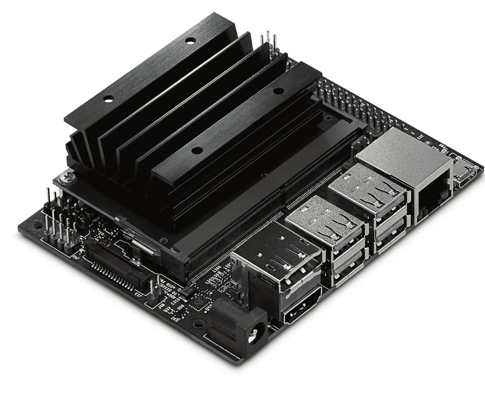
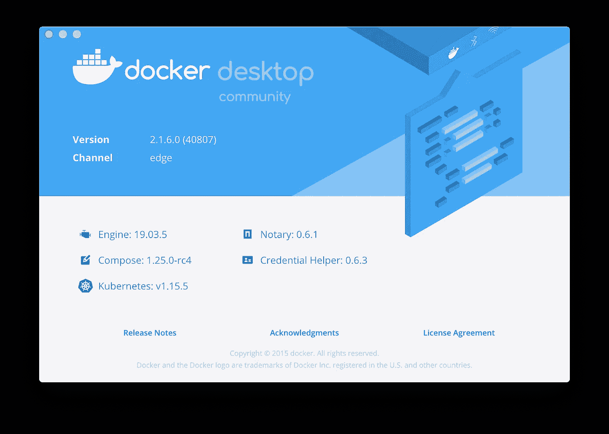
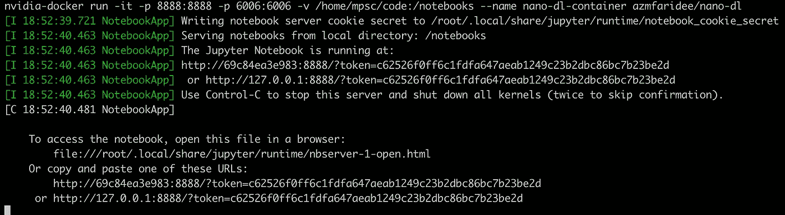
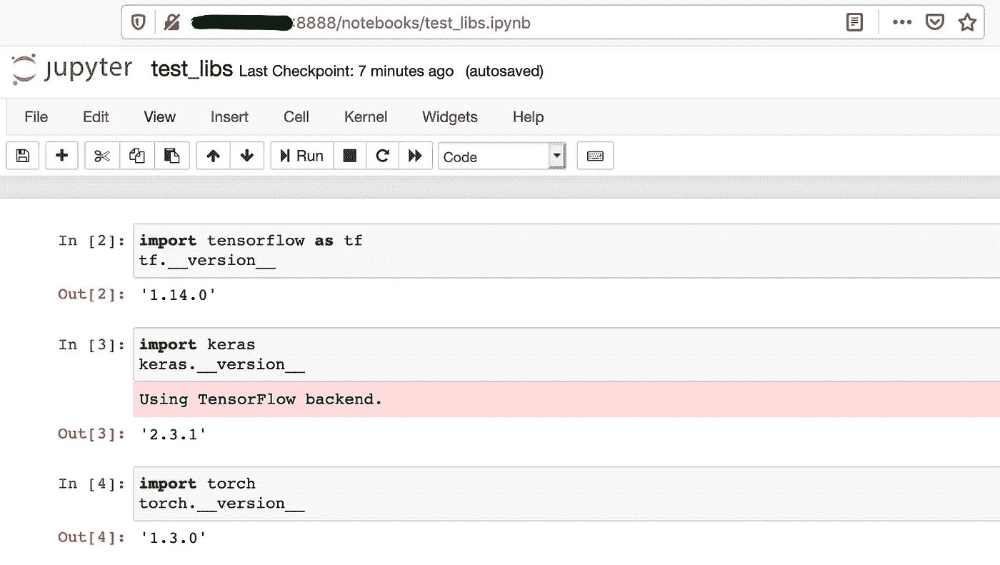
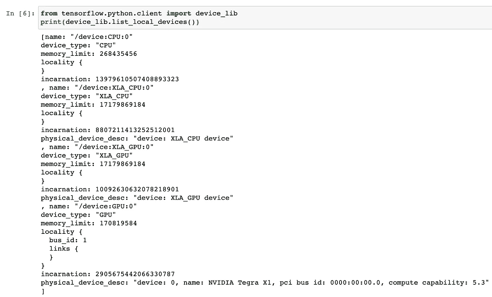

# Jetson Nano 上的深度学习:简化 Docker 构建

> 原文：<https://medium.com/analytics-vidhya/deep-learning-on-jetson-nano-streamlining-docker-builds-699c8ef4a379?source=collection_archive---------8----------------------->

虽然 Jetson Nano 的默认图像附带了许多用于构建深度学习应用程序的有用包，但 TensorFlow、Keras、Pytorch 或 Jupyter 笔记本不在其中。NVIDIA 提供了官方的 [Tensorflow](https://devtalk.nvidia.com/default/topic/1048776/jetson-nano/official-tensorflow-for-jetson-nano-/) 和 [PyTorch](https://devtalk.nvidia.com/default/topic/1049071/jetson-nano/pytorch-for-jetson-nano-version-1-3-0-now-available/) 软件包，但安装可能需要几个小时，因为相关的轮子需要时间来构建。此外，在长时间运行 DL 应用程序后，我遇到了一些存储卡损坏的问题，所以即使使用 shell 脚本重新安装所有东西最终也变成了一件苦差事。正如你们许多人已经知道的，Docker 是简化这些用例的明显工具。



杰特森纳米开发工具包

Nano 的最新官方映像(Jetpack 4.2.2)预装了 **docker** 和 **nvidia-docker** ，因此我们不必在 Nano 上运行任何预建的映像。但是我没有找到任何使用 TensorFlow、PyTorch、Keras、scikit-learn 和 Jupyter 的更新图像，可以让我轻松地测试和调整 DL 模型，所以我选择为自己构建一个。在这篇文章中，我将分享我遵循的步骤。

在 Nano 上构建一个定制的 arm64 映像可能是另一个麻烦，因为试图在它上面构建映像会给它简陋的 CPU 和内存带来太多压力，更不用说 SD 卡的磨损和漫长的构建时间了。幸运的是，docker 在今年早些时候发布了一个跨平台构建功能，它可以帮助我们在更强大的 **x86** 机器上更快地构建 Docker 映像，同时仍然针对 **arm64** 架构。



来自“边缘”频道的最新 Docker 桌面

要开始，首先获得 Docker 的最新版本，并确保您在 [edge channel](https://engineering.docker.com/2019/04/multi-arch-images/) 上。我目前在 Mac OS X 上运行的是 2.1.6.0 版本。如果你运行的是 Linux，请遵循本指南。确保您已经`qemu`安装并配置了在您的**x86**CPU 上运行 **arm64** 仿真。

```
➜ cat /proc/sys/fs/binfmt_misc/qemu-aarch64
enabled
interpreter /usr/bin/qemu-aarch64
flags: OCF
offset 0
magic 7f454c460201010000000000000000000200b7
mask ffffffffffffff00fffffffffffffffffeffff
```

安装了最新的 docker 和`qemu`之后，是时候检查可用的构建器了。

```
➜ docker buildx lsNAME/NODE DRIVER/ENDPOINT STATUS PLATFORMS
default * docker
 default default running linux/amd64, linux/arm64, linux/ppc64le, linux/s390x, linux/386, linux/arm/v7, linux/arm/v6
```

我们可以在 available platforms 列表中看到`linux/arm64` ，所以我们可以开始了(如果没有看到条目，引导一个[新构建器](https://engineering.docker.com/2019/04/multi-arch-images/))。我们现在需要弄清楚`Dockerfile`的结构。我们将从 [NVIDIA 的 Linux4Tegra](https://ngc.nvidia.com/catalog/containers/nvidia:l4t-base) 基本映像(411 MB)开始，并在其上添加我们自己的包。我花了几次努力才找到了最小化构建时间和图像大小的最佳包列表。

```
FROM nvcr.io/nvidia/l4t-base:r32.2.1MAINTAINER ABU ZAHER MD FARIDEE <[zaher14@gmail.com](mailto:zaher14@gmail.com)>ARG DEBIAN_FRONTEND=noninteractive
RUN apt-get update && apt-get install -y --no-install-recommends build-essential curl libfreetype6-dev libhdf5-dev libpng-dev libzmq3-dev pkg-config python3-dev python3-numpy python3-scipy python3-sklearn python3-matplotlib python3-pandas rsync unzip zlib1g-dev zip libjpeg8-dev hdf5-tools libhdf5-serial-dev python3-pip python3-setuptoolsRUN  apt-get clean && \
        rm -rf /var/lib/apt/lists/*RUN pip3 install -U pip -vRUN pip3 --no-cache-dir install -U -v jupyter grpcio absl-py py-cpuinfo psutil portpicker six mock requests gast h5py astor termcolor protobuf keras keras-applications keras-preprocessing wrapt google-pastaRUN pip3 --no-cache-dir install --pre -v --extra-index-url [https://developer.download.nvidia.com/compute/redist/jp/v42](https://developer.download.nvidia.com/compute/redist/jp/v42) tensorflow-gpu==1.14.0+nv19.10RUN curl -L [https://nvidia.box.com/shared/static/phqe92v26cbhqjohwtvxorrwnmrnfx1o.whl](https://nvidia.box.com/shared/static/phqe92v26cbhqjohwtvxorrwnmrnfx1o.whl) > /tmp/torch-1.3.0-cp36-cp36m-linux_aarch64.whl && pip3 --no-cache-dir -v install /tmp/torch-1.3.0-cp36-cp36m-linux_aarch64.whl && rm  /tmp/torch-1.3.0-cp36-cp36m-linux_aarch64.whlEXPOSE 8888 6006RUN mkdir -p /notebooksCMD ["jupyter", "notebook", "--no-browser", "--ip=0.0.0.0", "--allow-root", "--notebook-dir='/notebooks'"]
```

现在让我们构建图像并将其推送到 docker 注册表

```
➜ docker buildx build --platform linux/arm64 --push -t azmfaridee/nano-dl .
```

`pip3 install`指令将占用大部分构建时间，因为大部分轮子将从源代码编译。我不得不在一台 2017 款 Macbook Pro 上等了 3 个多小时。最终图像大约为 1.09 GB。

是时候公布结果了。假设我们刚刚使用 SD 卡上的[新映像启动到 **Nano** ，我们需要做的第一件事是将新创建的用户添加到`docker`组。](https://developer.nvidia.com/embedded/learn/get-started-jetson-nano-devkit#setup)

```
➜ sudo usermod -aG docker $USER
```

然后，我们可以提取刚刚构建的图像并调用`nvidia-docker`

```
➜ docker pull azmfaridee/nano-dl
➜ nvidia-docker run -it -p 8888:8888 -v /home/mpsc/code:/notebooks --name nano-dl-container azmfaridee/nano-dl
```

这可能需要一段时间，取决于 SD 卡的写入速度，但我们将通过下面的消息来回报我们的耐心！



在桌面浏览器上打开 Jupyter，Nano 的 IP 在`8888`端口上。所有的库都可供我们使用。



我们还可以仔细检查 TensorFlow 是否可以访问 GPU。



如果只是想马上运行一些 Tensorflow 或者 Pytorch 程序，可以直接使用映像，不需要经过映像构建阶段。

就这些了，伙计们。希望这篇文章能为你在嵌入式深度学习的艰难旅程中节省一些时间。欢迎随时查看 GitHub 的回购更新代码，并通过 Twitter 或 Linkedin 联系我！