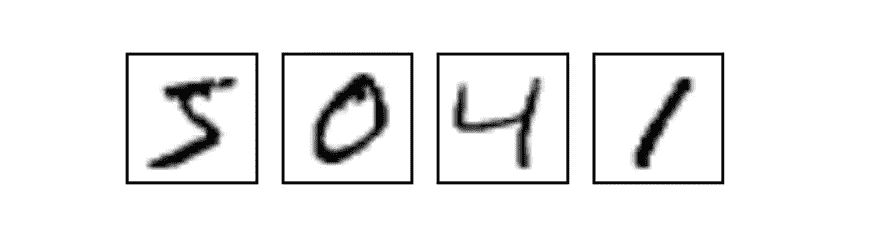
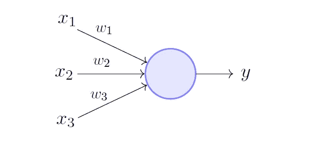
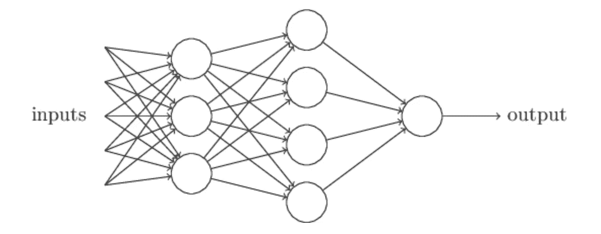
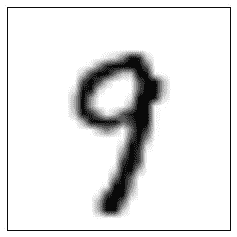
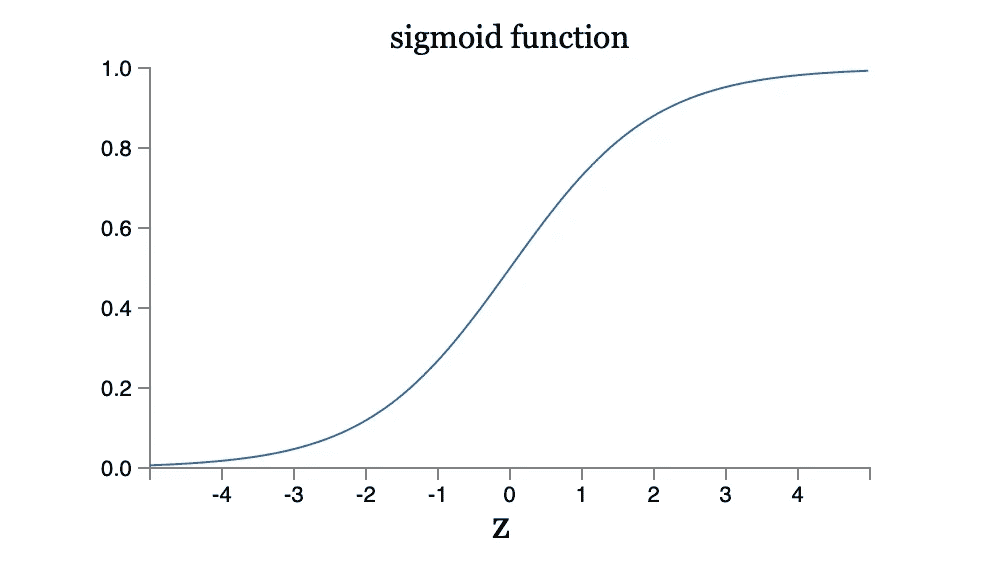

# 深度学习第 1 部分—人工神经元

> 原文：<https://medium.com/analytics-vidhya/deep-learning-part-1-artificial-neurons-e2a78cb27432?source=collection_archive---------31----------------------->

考虑以下数字序列:

我们大多数人都能认出他们是 5041。我想让你们花一点时间来欣赏我们的大脑是如何毫不费力地处理这些低分辨率、潦草书写的数字的。虽然看起来不像，但识别手写数字并不容易——我们真的很擅长。

如果我们试图编写一个计算机程序来识别上述数字，这项任务的难度就变得显而易见了。用算法来表达我们对数字分类的直觉——比如 8 的循环——并不那么简单。使这些规则精确，同时考虑所有的例外和变化的笔迹，是一个无望的原因。

如果我们试图模仿人脑会怎么样？毕竟，我们能够几乎下意识地识别这些数字。这就是**神经网络**背后的想法，它是**深度学习**的主力。

你可能在围绕人工智能的讨论中听到过这些词。但是它们到底是什么意思呢？

在这个系列中，我们将建立和训练一个神经网络来识别手写数字，并在这个过程中，了解深度学习到底是什么，而不仅仅是一个时髦词。

# 人工神经元

我们将从观察**人工神经元**开始，它是任何神经网络的基本构建模块。这些是组成网络的独立的、相互连接的节点，非常像人脑的神经元。

## 感知器

感知器是基本的人造中子。它接受几个二进制输入，并输出一个二进制值，我们称之为**激活值**。

为了计算输出，我们将每个输入与一个权重相关联，这个权重是一个实数，表示各个输入对输出的重要性。所以我们的感知机看起来像这样:

感知器的输出(0 或 1)取决于加权和(输入的和乘以各自的权重)是否小于或大于某个阈值。

这个阈值通常被表示为感知器的**偏差** *b* ，其中 *b* 是阈值的负值。所以我们感知机的输出现在变成了:

*(这里，我已经将权重和输入分别放入向量 w 和 x，并将总和表示为它们的点积)*

你可以把偏差看作是让感知器输出 1，或者用生物学术语来说，激发的难易程度的一种衡量。换句话说，感知器的偏差越大，它就越有可能激发。

这就是感知器工作的全部内容！

从概念上讲，将感知器视为决策模型是有帮助的。假设你正在决定是否应该去跑步。

你会考虑哪些因素？外面天气好吗？你有心情跑步吗？这些是你的输入 *x* 。对于积极的陈述(例如，天气*很好*，输入的值为 1。

接下来，您将每个输入与一个权重相关联。问问自己每个因素对你有多重要。对于那些很重要的事情(例如，你讨厌在坏天气下跑步)，你会给那个输入分配一个更大的权重。

最后，你分配感知器的偏差，这决定了它触发的可能性。例如，如果你真的重视身体健康，那么你会赋予它更大的偏见。通过实现感知器的决策模型，我们的感知器会告诉你是否应该去跑步！

这当然是一个非常简单的例子，但它说明了感知器权衡不同输入以产生输出的想法。如果我们不是只有一个感知器，而是有一个复杂的网络呢？

我们可以认为第一层是通过权衡初始输入做出非常简单的决策。然后，下一层通过权衡第一层的结果做出决策，以此类推。以这种方式，每个后续层都在更抽象的层次上有效地做出更复杂的决策。我们有理由期待这样一个网络能够做出相当微妙和复杂的决定。

## 乙状结肠神经元

让我们再来看看手写数字识别。想象一下，我们有一个神经网络错误地识别了数字 9 的图像:

作为一个 8。我们可以想出如何在权重或偏差上做一点小小的改变来修正这个错误。

但在现实中，一个小的变化可能会完全翻转感知机的输出，比如从 0 到 1。这种翻转可能会反过来导致其他感知器的输出翻转，以此类推，彻底改变网络其余部分的行为。因此，虽然我们的网络现在可以正确识别 9，但它在所有其他图像上的行为将以一种不可预测的方式发生变化。

基本上，我们意识到实际上很难*逐渐*调整权重和偏差。为了克服感知机的缺点，我们将引入另一种类型的人工神经元: **sigmoid 神经元。**

sigmoid 神经元的输出不是 0 或 1，而是由σ( *wx* + *b* )给出，其中σ是 sigmoid 函数。

我们称这样的功能为神经元的**激活功能**。还有其他类型的神经元使用不同的激活函数，如整流线性激活函数，但我们现在将坚持使用 sigmoid 函数。

通过应用 sigmoid 函数，我们的神经元的输入和输出现在可以取 0 和 1 之间的任何值。因此，*权重和偏差的微小变化只会导致其输出的微小变化，*而不是像感知器那样在 0 和 1 之间剧烈翻转。这是 sigmoid 神经元和感知器之间的关键区别，将允许我们的网络进行学习。

> 对于乙状结肠神经元，权重和偏差的微小变化只会导致其输出的微小变化。

为了说明这种差异，我们可以看看两个神经元的输出图。

本质上，我们看到的是，乙状结肠神经元是感知器的平滑版本。因此，改变我们网络的权重和偏差不再会不可预测地改变其输出。

# 概述

这就把我们带到了第 1 部分的结尾！让我们总结一下我们所学到的一切:

*   人工神经元(例如感知器和乙状结肠神经元)是组成神经网络的单个节点。它们的特征在于一组输入和相应的权重，以及一个偏差。
*   感知器是人工神经元的基本类型。其输出 0 或 1 由加权和*wx+b*是否大于或小于 0 决定。
*   sigmoid 神经元将 sigmoid 激活函数应用于加权和。这种变化有两个重要的后果。首先，乙状结肠神经元可以取 0 到 1 之间的任何值。第二，权重和偏差的微小变化只会导致输出的微小变化，这是网络学习的关键。

在下一篇文章中，我们将构建实际的神经网络来分类手写数字，并看看我们如何通过**梯度下降**来训练它。敬请期待！