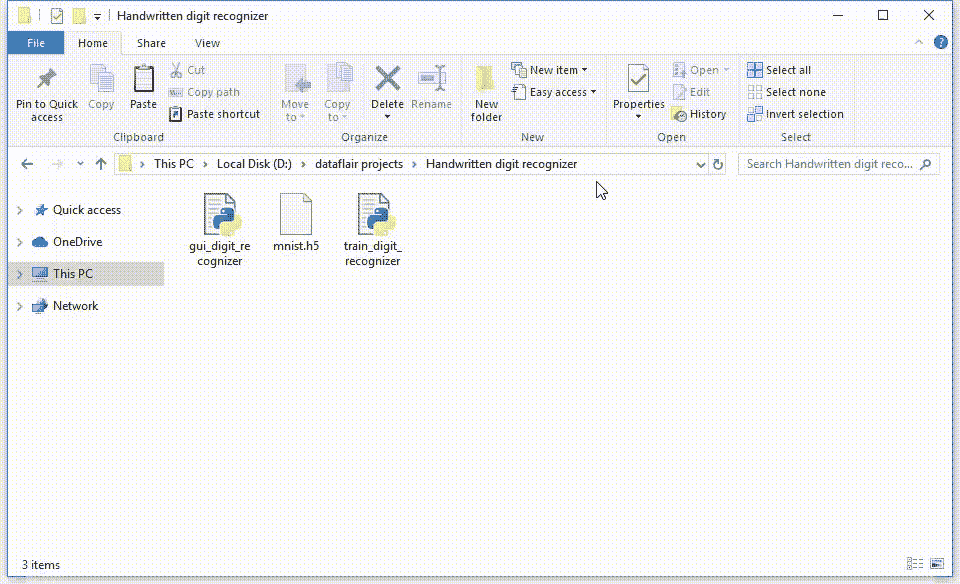
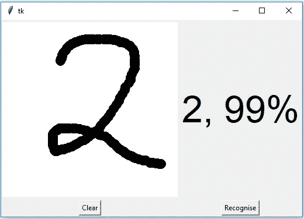
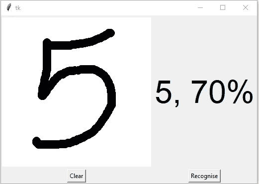
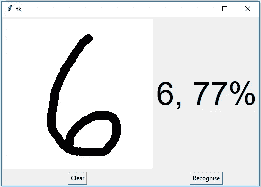

# 深度学习项目——使用 Python 进行手写数字识别

> 原文：<https://medium.com/analytics-vidhya/deep-learning-project-handwritten-digit-recognition-using-python-14a55901eec9?source=collection_archive---------8----------------------->

# Python 深度学习项目

为了让机器更加智能，开发人员正在钻研机器学习和深度学习技术。人类通过一次又一次的练习和重复来学习完成一项任务，这样它就记住了如何完成任务。然后他大脑中的神经元自动触发，他们可以快速执行他们所学的任务。深度学习也和这个很像。它针对不同类型的问题使用不同类型的神经网络架构。例如，对象识别、图像和声音分类、对象检测、图像分割等。

# 什么是手写数字识别？

手写数字识别是计算机识别人类手写数字的能力。这对机器来说是一项艰巨的任务，因为手写数字并不完美，可以有许多不同的风格。手写数字识别是这个问题的解决方案，它使用数字的图像并识别图像中存在的数字。

# 关于 Python 深度学习项目



在本文中，我们将使用 MNIST 数据集实现一个手写数字识别应用程序。我们将使用一种特殊类型的深度神经网络，即 ***卷积神经网络*** 。最后，我们将构建一个 GUI，您可以在其中绘制数字并立即识别它。

# 先决条件

有趣的 Python 项目要求你具备 Python 编程的基础知识，深度学习 Keras 库，以及构建 GUI 的 Tkinter 库。

使用以下命令为此项目安装必要的库:

pip 安装 NumPy，TensorFlow，Keras，pillow，

# MNIST 数据集

这可能是机器学习和深度学习爱好者中最受欢迎的数据集之一。MNIST 数据集包含 6 万张从 0 到 9 的手写数字的训练图像和 1 万张用于测试的图像。因此，MNIST 数据集有 10 个不同的类。手写数字图像被表示为 28×28 的矩阵，其中每个单元包含一个灰度像素值。

# 基于手写数字识别构建 Python 深度学习项目

下面是实现手写数字识别项目的步骤:

# 1.导入库并加载数据集

首先，我们将导入训练模型所需的所有模块。Keras 图书馆已经包含了一些数据集，MNIST 就是其中之一。因此，我们可以轻松地导入数据集并开始使用它。mnist.load_data()方法返回训练数据及其标签，以及测试数据及其标签。

```
import kerasfrom keras.datasets import mnistfrom keras.models import Sequentialfrom keras.layers import Dense, Dropout, Flattenfrom keras.layers import Conv2D, MaxPooling2Dfrom keras import backend as K# the data, split between train and test sets(x_train, y_train), (x_test, y_test) = mnist.load_data()print(x_train.shape, y_train.shape)
```

# 2.预处理数据

图像数据不能直接输入到模型中，因此我们需要执行一些操作并处理数据，以便为我们的神经网络做好准备。训练数据的维数为(60000，28，28)。CNN 模型将需要多一个维度，因此我们将矩阵整形为(60000，28，28，1)。

```
x_train = x_train.reshape(x_train.shape[0], 28, 28, 1)x_test = x_test.reshape(x_test.shape[0], 28, 28, 1)input_shape = (28, 28, 1)# convert class vectors to binary class matricesy_train = keras.utils.to_categorical(y_train, num_classes)y_test = keras.utils.to_categorical(y_test, num_classes)x_train = x_train.astype(‘float32’)x_test = x_test.astype(‘float32’)x_train /= 255x_test /= 255print(‘x_train shape:’, x_train.shape)print(x_train.shape[0], ‘train samples’)print(x_test.shape[0], ‘test samples’)
```

# 3.创建模型

现在我们将在 Python 数据科学项目中创建我们的 CNN 模型。CNN 模型通常由卷积层和池层组成。它对以网格结构表示的数据更有效，这就是为什么 CNN 对图像分类问题有效的原因。丢弃层用于停用一些神经元，并且在训练时，它降低模型的拟合度。然后，我们将使用 Adadelta 优化器编译该模型。

```
batch_size = 128num_classes = 10epochs = 10model = Sequential()model.add(Conv2D(32, kernel_size=(3, 3),activation=’relu’,input_shape=input_shape))model.add(Conv2D(64, (3, 3), activation=’relu’))model.add(MaxPooling2D(pool_size=(2, 2)))model.add(Dropout(0.25))model.add(Flatten())model.add(Dense(256, activation=’relu’))model.add(Dropout(0.5))model.add(Dense(num_classes, activation=’softmax’))model.compile(loss=keras.losses.categorical_crossentropy,optimizer=keras.optimizers.Adadelta(),metrics=[‘accuracy’])
```

# 4.训练模型

Keras 的 model.fit()函数将开始模型的训练。它需要训练数据、验证数据、时期和批量大小。

训练模型需要一些时间。训练后，我们将权重和模型定义保存在“mnist.h5”文件中。

```
hist = model.fit(x_train, y_train,batch_size=batch_size,epochs=epochs,verbose=1,validation_data=(x_test, y_test))print(“The model has successfully trained”)model.save(‘mnist.h5’)print(“Saving the model as mnist.h5”)
```

# 5.评估模型

我们的数据集中有 10，000 张图片，这些图片将用于评估我们的模型的效果。测试数据没有包含在数据的训练中，因此，它是我们模型的新数据。MNIST 数据集非常均衡，因此我们可以获得大约 99%的准确率。

```
score = model.evaluate(x_test, y_test, verbose=0)print(‘Test loss:’, score[0])print(‘Test accuracy:’, score[1])
```

# 6.创建 GUI 来预测数字

现在对于 GUI，我们已经创建了一个新文件，在其中我们构建了一个交互式窗口来在画布上绘制数字，通过一个按钮，我们可以识别数字。Tkinter 库来自 Python 标准库。我们创建了一个函数 predict_digit()，它将图像作为输入，然后使用训练好的模型来预测数字。

然后我们创建 App 类，它负责为我们的应用程序构建 GUI。我们创建一个画布，我们可以通过捕获鼠标事件来绘制画布，并使用一个按钮来触发 predict_digit()函数并显示结果。

以下是我们的 gui_digit_recognizer.py 文件的完整代码:

```
from keras.models import load_modelfrom tkinter import *import tkinter as tkimport win32guifrom PIL import ImageGrab, Imageimport numpy as npmodel = load_model(‘mnist.h5’)**def** predict_digit(img):#resize image to 28x28 pixelsimg = img.resize((28,28))#convert rgb to grayscaleimg = img.convert(‘L’)img = np.array(img)#reshaping to support our model input and normalizingimg = img.reshape(1,28,28,1)img = img/255.0#predicting the classres = model.predict([img])[0]**return** np.argmax(res), max(res)**class** App(tk.Tk):**def** __init__(self):tk.Tk.__init__(self)self.x = self.y = 0# Creating elementsself.canvas = tk.Canvas(self, width=300, height=300, bg = “white”, cursor=”cross”)self.label = tk.Label(self, text=”Thinking..”, font=(“Helvetica”, 48))self.classify_btn = tk.Button(self, text = “Recognise”, command = self.classify_handwriting)self.button_clear = tk.Button(self, text = “Clear”, command = self.clear_all)# Grid structureself.canvas.grid(row=0, column=0, pady=2, sticky=W, )self.label.grid(row=0, column=1,pady=2, padx=2)self.classify_btn.grid(row=1, column=1, pady=2, padx=2)self.button_clear.grid(row=1, column=0, pady=2)#self.canvas.bind(“<Motion>”, self.start_pos)self.canvas.bind(“<B1-Motion>”, self.draw_lines)**def** clear_all(self):self.canvas.delete(“all”)**def** classify_handwriting(self):HWND = self.canvas.winfo_id() # get the handle of the canvasrect = win32gui.GetWindowRect(HWND) # get the coordinate of the canvasim = ImageGrab.grab(rect)digit, acc = predict_digit(im)self.label.configure(text= str(digit)+’, ‘+ str(int(acc*100))+’%’)**def** draw_lines(self, event):self.x = event.xself.y = event.yr=8self.canvas.create_oval(self.x-r, self.y-r, self.x + r, self.y + r, fill=’black’)app = App()mainloop()
```

截图:



# 摘要

在这篇文章中，我们成功地在手写数字识别 app 上构建了一个 Python 深度学习项目。我们已经建立并训练了卷积神经网络，它对于图像分类非常有效。稍后，我们构建 GUI，在画布上绘制一个数字，然后对数字进行分类并显示结果。