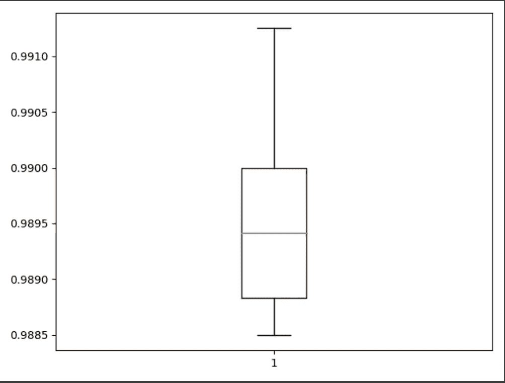

# 深度学习——使用 Python 和 MNIST 进行手写数字识别

> 原文：<https://medium.com/analytics-vidhya/deep-learning-project-handwritten-digit-recognition-using-python-26da7ed11d1c?source=collection_archive---------2----------------------->


图片由 [**星线**](https://www.freepik.com/starline)

**Python** 深度学习项目利用 MNIST 数据集、卷积神经网络(CNN)和…

# 什么是深度学习？

D[**eep learning**](https://en.wikipedia.org/wiki/Deep_learning)是一种让计算机通过例子进行学习的机器学习技术。有没有想过亚马逊知道你下一步想买什么，而那些建议正是你所需要的，只是以前从来不知道而已？你猜对了。这是深度学习算法在起作用。无论是 Alexa、Siri 还是 Cortana，深度学习都有助于他们理解语音和语言。

深度学习使用不同类型的神经网络架构，如对象识别、图像和声音分类以及针对不同类型问题的对象检测。深度学习算法训练的数据越多，它就越准确。

# MNIST 数据集

MNIST(修改后的[国家标准与技术研究所](https://en.wikipedia.org/wiki/National_Institute_of_Standards_and_Technology)数据库)可能是机器学习和深度学习爱好者中最受欢迎的数据集之一。 [MNIST 数据集](http://yann.lecun.com/exdb/mnist/)包含 6 万张手写数字 0 到 9 的小正方形 28×28 像素灰度训练图像和 1 万张测试图像。因此，MNIST 数据集有 10 个不同的类。

# 步伐

1.  **导入库并加载数据集:**导入必要的库、包和 MNIST 数据集
2.  **数据预处理**
3.  **创建模型**
4.  **训练和评估模型**
5.  **保存模型**
6.  **做出预测**

# **1。导入库并加载数据集**

在开始任何操作之前，确保你的电脑上安装了 Tensorflow、Keras、numpy 和 pillow。我们需要导入训练模型所需的所有模块。Keras 库已经包含了一些数据集，MNIST 就是其中之一。所以我们可以很容易地通过 keras 导入数据集。mnist.load_data()方法返回训练数据、其标签以及测试数据及其标签。

```
import keras
from keras.datasets import mnist
from keras.models import Sequential
from keras.layers import Dense, Dropout, Flatten
from keras.layers import Conv2D, MaxPooling2D
from keras import backend as K# the data, split between train and test sets
from keras.utils import np_utils
from sklearn.model_selection import KFold
from tensorflow.python.keras import Sequential
from tensorflow.python.keras.optimizers import SGD# the MNIST data is split between train and test sets
(X_train, y_train), (X_test, y_test) = mnist.load_data()
```

# **2。数据预处理**

训练数据的维数是(60000，28，28)。CNN 接受四维。因此，我们需要重塑图像的尺寸(样本*宽度*高度*像素)

```
# Reshape to be samples*pixels*width*height
X_train = X_train.reshape(X_train.shape[0], 28, 28, 1).astype('float32')
X_test = X_test.reshape(X_test.shape[0], 28, 28, 1).astype('float32')
```

许多机器学习算法不能直接对标签数据进行操作。它们要求所有输入变量和输出变量都是数字。实现这一点的技术被称为一键代码。

```
# One hot Code
y_train = np_utils.to_categorical(y_train)
y_test = np_utils.to_categorical(y_test)
```

我们需要将输入从 0–255 规范化为 0–1，以便将数据集中的数值列的值更改为一个通用的范围，而不会扭曲值范围的差异。这包括首先将数据类型从无符号整数转换为浮点数，然后将像素值除以最大值。

```
# convert from integers to floats
X_train = X_train.astype('float32')
X_test = X_test.astype('float32')# normalize to range [0,1]
X_train = X_train / 255.0
X_test = X_test / 255.0
```

# 3.创建模型

接下来，我们需要定义一个基线卷积神经网络(CNN)模型。

**什么是 CNN？**更简单地说，CNN 是一个人工神经网络，专门挑选或检测模式并理解它们。因此， [**CNN**](https://www.youtube.com/watch?v=YRhxdVk_sIs) 对图像分类最有用**。**CNN 型号有不同大小和数量的各种类型的过滤器。这些过滤器本质上是帮助我们检测模式的东西。

**卷积层:**有多种方法可以建立卷积模型。我尝试和测试了很多，发现下面的工作是最好的。

```
# Create model
# Building CNN
model = Sequential()
model.add(Conv2D(32, (3, 3), activation='relu', kernel_initializer='he_uniform', input_shape=(28, 28, 1)))
model.add(MaxPooling2D((2, 2)))
model.add(Conv2D(64, (3, 3), activation='relu', kernel_initializer='he_uniform'))
model.add(Conv2D(64, (3, 3), activation='relu', kernel_initializer='he_uniform'))
model.add(MaxPooling2D((2, 2)))
model.add(Flatten())
model.add(Dense(100, activation='relu', kernel_initializer='he_uniform'))
model.add(Dense(10, activation='softmax'))
```


模型摘要

# 4.训练和评估模型

模型定义好之后，我们需要对它进行评估。我们将使用[五重交叉验证](https://machinelearningmastery.com/k-fold-cross-validation/)来评估模型。

在我们继续之前，让我们了解什么是交叉验证。假设你有 n 张钢笔和铅笔的图片。你想训练一个深度学习算法，让它能够区分这两者。训练和测试任何数据模型背后的想法是实现最大的学习速度和最大的验证。通过分别增加训练和测试数据，可以实现更好的学习率和更好的验证。因为我们的数据是有限的，所以有一个最佳的学习率和验证点。为了找到最佳点，我们使用**交叉验证**，它将数据集分成 *k 个*子集，并寻找最佳的测试与训练数据比率。

在我们的例子中， *k 的值是 5* 。因此，每个测试集将占训练数据集的 20%，即大约 12，000 个示例。

```
def evaluate_model(X_train, y_Train, n_folds=5): accuracy, data = list(), list()
    # prepare 5-cross validation
    kfold = KFold(n_folds, shuffle=True, random_state=1)

    for x_train, x_test in kfold.split(X_train):
        # create model
        model = create_model() # select rows for train and test
        trainX, trainY, testX, testY = X_train[x_train], y_Train[x_train], X_train[x_test], y_Train[x_test] # fit model
        data_fit = model.fit(trainX, trainY, validation_data=(testX, testY), epochs=10, batch_size=32) # evaluate model
        _, acc = model.evaluate(testX, testY, verbose=0) # stores Accuracy 
        accuracy.append(acc)
        data.append(data_fit)
    return accuracy, data
```

您可以对我们的模型进行修改，直到您对它的评估感到满意为止。在[](https://matplotlib.org/api/pyplot_api.html)****的帮助下，您可以看到评估过程中实现的精确度的直观表示。****

****

**准确(性)**

```
# summarize model performance
def summarize_performance(acc):
    # print summary
    print('Accuracy: mean=%.3f std=%.3f, n=%d' % (numpy.mean(acc) * 100, numpy.std(acc) * 100, len(acc)))

    # box and whisker plots of results
    pyplot.boxplot(acc)
    pyplot.show()
```

****

**使用数据集图像进行预测**

****

**准确度图**

> ****注意:**您可以在步骤 4 的帮助下迭代训练和评估您的模型，或者直接使用该步骤。Keras 的 model.fit()函数训练以训练数据、验证数据、时期和批量大小作为参数的模型。在这种情况下，时期大小为 10，而批量大小为 200。我们将使用 [**Adam**](https://towardsdatascience.com/adam-latest-trends-in-deep-learning-optimization-6be9a291375c) (一种自适应学习率优化算法)来编译我们的模型**

```
# compile model
model.compile(loss='categorical_crossentropy', optimizer='adam', metrics=['accuracy'])
model.fit(X_train, y_train, validation_data=(X_test, y_test), epochs=10, batch_size=200)
```

****

# **5.保存模型**

**如果您对您的模型满意，您可以使用 *model.save("model_name.h5 ")保存它。*神经网络的准确率为 **99.73%** 。**

```
# serialize model to JSON and save the model
model_json = model.to_json()
with open("model.json", "w") as json_file:
    json_file.write(model_json)

model.save_weights("final_model.h5")
```

# **6.做预测**

**我们需要调整图片的大小和形状到 **(1，28，28，1)** 。(**注意:**图像必须为灰度。)我们需要使用 [**load_model**](https://writingcooperative.com/so-youre-new-to-medium-7f8a6ccc2399) 加载保存的模型。**

```
def predict(img):
    image = img.copy()
    image = cv2.cvtColor(image**,** cv2.COLOR_BGR2GRAY)
    # image = cv2.threshold(image, 140, 255, cv2.THRESH_BINARY)[1]
    image = cv2.resize(image**,** (**28, 28**))
    # display_image(image)
    image = image.astype('float32')
    image = image.reshape(**1, 28, 28, 1**)
    image /= **255** # plt.imshow(image.reshape(28, 28), cmap='Greys')
    # plt.show()
    model = load_model('cnn.hdf5')
    pred = model.predict(image.reshape(**1, 28, 28, 1**)**,** batch_size=**1**)

    print("Predicted Number: "**,** pred.argmax())

    # return pred.argmax()
```

****

**测试图像**

**使用测试图像，我们将预测数字。**

****

**预测的结果。**

# **谢谢你**

**感谢阅读我的文章。在[深度学习 MNIST 手写数字识别](https://github.com/Joy2469/Deep-Learning-MNIST---Handwritten-Digit-Recognition)查看完整代码**

**[](https://github.com/Joy2469/Deep-Learning-MNIST---Handwritten-Digit-Recognition) [## joy 2469/深度学习 MNIST 手写数字识别

### 使用 keras 的多层神经网络的实现，精度:mean=98.960 std=0.097，n=5 使用…

github.com](https://github.com/Joy2469/Deep-Learning-MNIST---Handwritten-Digit-Recognition)** 

# **资源:**

**[**深度学习简介**](https://www.forbes.com/sites/bernardmarr/2018/10/01/what-is-deep-learning-ai-a-simple-guide-with-8-practical-examples/#5a233f778d4b)
[**安装 tensor flow**](/@cran2367/install-and-setup-tensorflow-2-0-2c4914b9a265)
[**为什么数据规格化**](/@urvashilluniya/why-data-normalization-is-necessary-for-machine-learning-models-681b65a05029)
[**一键通代码**](https://machinelearningmastery.com/why-one-hot-encode-data-in-machine-learning/)
[**对卷积神经网络(CNN)的理解**](https://medium.com/@RaghavPrabhu/understanding-of-convolutional-neural-network-cnn-deep-learning-99760835f148 https://www.youtube.com/watch?v=YRhxdVk_sIs)[**CNN 层**](https://www.tensorflow.org/api_docs/python/tf/keras/layers/Layer) [](https://www.youtube.com/watch?v=TIgfjmp-4BA)**