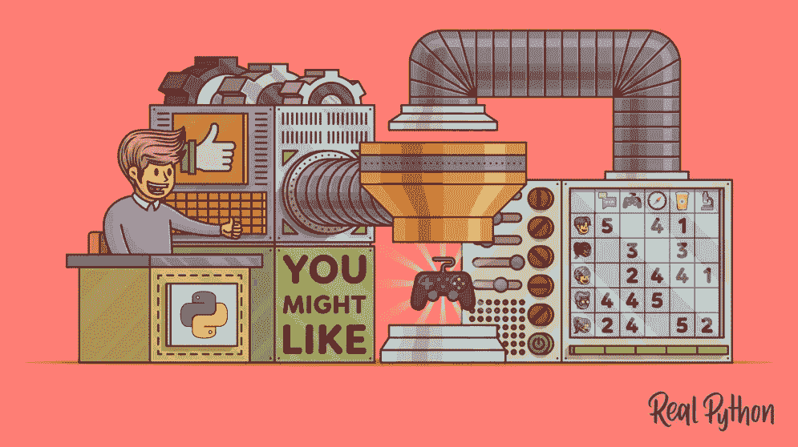
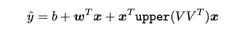
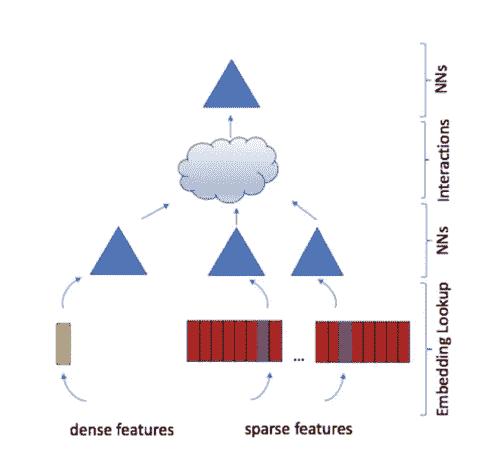
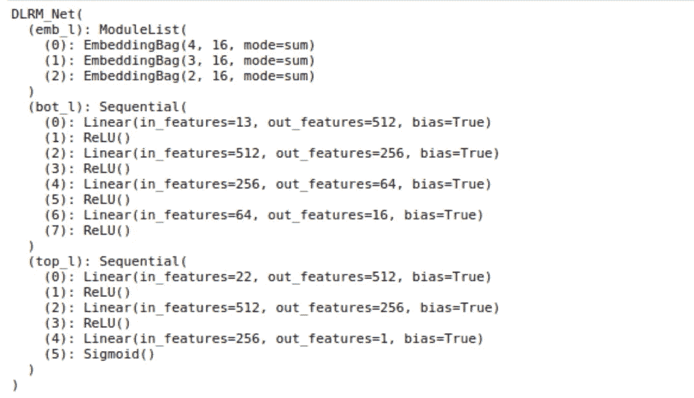
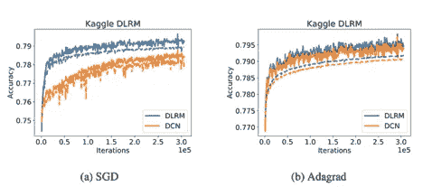
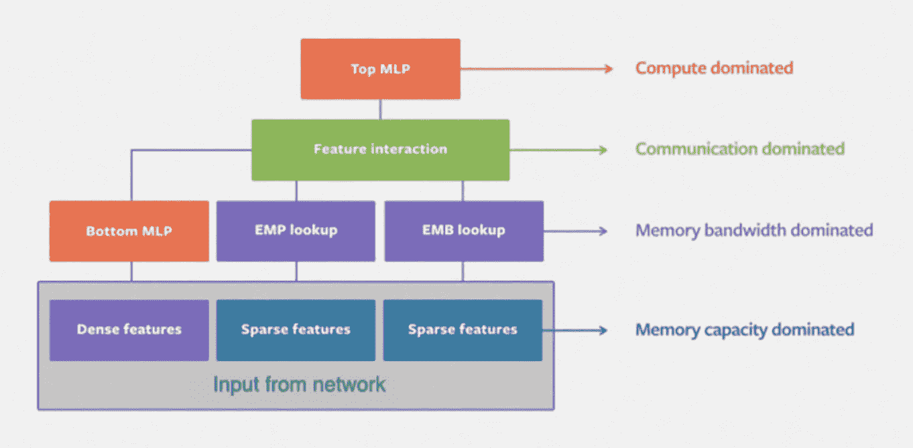

# 深度学习推荐机器——DLRM

> 原文：<https://medium.com/analytics-vidhya/deep-learning-recommendation-machines-dlrm-4fec2a5e7ef8?source=collection_archive---------0----------------------->

## 深入了解脸书最先进的推荐网络

图片来源:[https://realpython.com/](https://realpython.com/)

# 介绍

2019 年 3 月 31 日，一群来自脸书的人发布了一篇[论文](https://arxiv.org/abs/1906.00091)，谈论一个最先进的[深度学习推荐和个性化模型(DLRM)](https://ai.facebook.com/blog/dlrm-an-advanced-open-source-deep-learning-recommendation-model/) 。他们在论文中提到，针对此类任务的深度学习与其他深度学习网络明显不同，因为它们需要处理分类特征，并且它们没有得到很好的研究或理解。

这篇文章深入探讨了这个 DLRM 是如何工作的，它背后的机构，架构，它的优势以及 DLRM 的一个单独的 [jupyter 笔记本](https://github.com/gotorehanahmad/Recommendation-Systems/blob/master/dlrm/dlrm_main.ipynb)实现。

在深入了解其背后的直觉之前，让我们先来谈谈目前部署个性化和推荐的几个地方。脸书使用[推荐引擎](https://code.fb.com/core-data/recommending-items-to-more-than-a-billion-people/)来推荐你可能喜欢的网页或者你应该加入的团体。网飞用一个推荐引擎向你建议，接下来看什么。亚马逊用它来建议还应该往购物车里添加什么。

有很多互联网公司使用个性化和推荐系统来预测点击率。它基本上意味着预测用户是否会点击广告。因为点击广告意味着创收，所以对公司来说，选择最有可能和最相关的广告向用户展示以最大化收入是至关重要的。

在论文中，他们选择了这个 CTR 预测用例来测试他们的结果。他们挑选的数据集来自一个名为 Criteo 的展示广告挑战的 Kaggle 挑战。本次挑战的目标是为 CTR 估算测试最精确的 ML 算法。

Criteo AI Labs Ad Kaggle 和 Terabyte 数据集是开源数据集，由用于广告点击率预测的点击日志组成。每个数据集包含 13 个连续特征和 26 个分类特征。Criteo Ad Kaggle 数据集包含 7 天内约 4500 万个样本。

在实验中，通常第 7 天分为验证集和测试集，而前 6 天用作训练集。在 24 天内对 Criteo Ad 数据集进行采样，其中第 24 天分为验证和测试集，前 23 天用作训练集。

# 直觉

个性化和推荐系统在行业中并不新鲜。他们有很长的历史。但是直到最近他们才开始拥抱神经网络。该论文的作者认为，有两个主要的观点促成了这种体系结构的变化:

1.  第一个来自推荐系统的观点。这些系统最初采用的内容过滤是一组专家将产品分类，而用户选择他们喜欢的类别，并根据他们的偏好进行匹配。该领域随后发展到使用协同过滤，其中推荐基于过去的用户行为，例如之前对产品的评级。通过将用户和产品分组来提供推荐的邻域方法和通过矩阵分解技术用某些隐含因素来表征用户和产品的潜在因素方法后来被成功部署。
2.  第二种观点来自预测分析，它依赖于统计模型，根据给定的数据对事件的概率进行分类或预测。预测模型从使用简单模型(如线性和逻辑回归)转变为包含深层网络的模型。为了处理分类数据，这些模型采用了嵌入的使用，这将一个和多个热点向量转换成抽象空间中的密集表示。这个抽象空间可以解释为推荐系统发现的潜在因素的空间。

在论文中，作者声称他们在 DLRM 模型中成功地统一了上述两种观点。该模型使用嵌入来处理代表分类数据的稀疏特征，使用多层感知器(MLP)来处理密集特征，然后使用中提出的统计技术显式地交互这些特征。最后，它通过后处理与另一个 MLP 的交互来发现事件概率。

如果你是一个新手，你可能想知道为什么所有这些处理分类和数字特征的失败。答案是双重的:(1)嵌入是比典型的热点向量和多热点向量更丰富的数据表示，可以产生更好的结果;( 2)简单地通过采用一组数字和分类特征来拟合曲线不会给你带来准确性。出现这种情况的主要原因是功能之间缺少交互。

交互是功能与其他功能的交互方式。一个例子是喜欢喜剧和恐怖电影的用户喜欢恐怖喜剧电影的可能性有多大。这种交互在推荐引擎的工作中起着重要的作用。因此，简单的线性或逻辑回归不能用于推荐系统。多项式回归将有这种相互作用的成分，但它不能预测看不见的相互作用。因式分解机(FM)通过定义以下形式的模型，将二阶相互作用合并到具有分类数据的线性模型中

FMs 明显不同于具有多项式核的支持向量机(SVM ),因为它们像矩阵分解一样将二阶交互矩阵分解为其潜在因子(或嵌入向量),这更有效地处理稀疏数据。这通过仅捕获不同嵌入向量对之间的相互作用显著降低了二阶相互作用的复杂性，产生了线性计算复杂性。这些相互作用然后被输入到另一个多层感知器，以获得点击概率。

# DLRM 网络

这部分解释了 DLRM 建筑的高层次观点。为了更容易理解，让我们来看看 DLRM 涉及的四种主要技术，不需要太多的数学知识:

1.  **嵌入:**嵌入是离散-分类-变量到连续数字向量的映射。[在神经网络的背景下，嵌入](https://www.tensorflow.org/guide/embedding?source=post_page---------------------------)是离散变量的低维、学习的连续向量表示。神经网络嵌入是有用的，因为它们可以减少分类变量的维度，并在转换的空间中有意义地表示类别。
2.  **矩阵分解**:矩阵分解是[推荐系统](https://en.wikipedia.org/wiki/Recommender_systems)中使用的一类[协同过滤](https://en.wikipedia.org/wiki/Collaborative_filtering)算法。矩阵分解算法通过将用户-项目交互矩阵分解成两个低维度矩形矩阵的乘积来工作。
3.  **因式分解机**:因式分解机是一种通用的监督学习算法，可以用于分类和回归任务。它是线性模型的扩展，旨在经济地捕捉高维稀疏数据集中要素之间的交互。例如，在点击预测系统中，因子分解机器模型可以捕捉当来自某个广告类别的广告被放置在来自某个页面类别的页面上时观察到的点击率模式。因子分解机器对于处理高维稀疏数据集的任务是一个很好的选择，比如点击预测和商品推荐。
4.  **多层感知器:**多层感知器(MLP)是一类前馈人工神经网络。MLP 至少由三层节点组成:输入层、隐藏层和输出层。除了输入节点之外，每个节点都是使用非线性激活函数的神经元。MLP 利用一种称为反向传播的监督学习技术进行训练。它的多层和非线性激活将 MLP 与线性感知器区分开来。它可以区分不可线性分离的数据。

现在结合上述技术，我们可以很容易地理解 DLRM 建筑。

让用户和产品被许多连续的和分类的特征所描述。为了处理分类特征，每个分类特征将由相同维数的嵌入向量表示，推广了矩阵分解中使用的潜在因子的概念。为了处理连续特征，连续特征将通过 MLP(我们称之为底部或密集 MLP)进行变换，这将产生与嵌入向量相同长度的密集表示。

深度学习推荐机

不同特征的二阶相互作用的计算是显式完成的，遵循 FMs 中提供的处理稀疏数据的直觉，可选地通过 MLPs 传递它们。这是通过取所有嵌入向量对和处理过的密集特征之间的点积来完成的。这些点积与原始处理的密集要素连接在一起，并使用另一个 MLP(顶部或输出 MLP)进行后处理，然后输入到 sigmoid 函数中以给出概率。

DLRM 摘要

# 基准

作者在 Criteo Ad Kaggle 数据集上评估了该模型的准确性，并将 DLRM 的性能与未经广泛调整的深度交叉网络(DCN)进行了比较。请注意，在这种情况下，模型的大小可以容纳数据集中的要素数量。

*   特别地，DLRM 包括用于处理密集特征的底部 MLP 和顶部 MLP，底部由分别具有 512、256 和 64 个节点的三个隐藏层组成，顶部由具有 512 和 256 个节点的两个隐藏层组成。
*   另一方面，DCN 由六个交叉层和一个具有 512 和 256 个节点的深度网络组成。使用 16 的嵌入维数。请注意，这会产生一个 DLRM 和 DCN，两者都有大约 540 米的参数。

对于使用 SGD 和 Adagrad 优化器的两个模型，训练(实线)和验证(虚线)精度都是在完整的单个训练时期内绘制的。没有使用正则化。在这个实验中，DLRM 获得了略高的训练和验证精度。

# 先决条件和代码指南

**软件需求**:

*pytorch-nightly(2019 年 6 月 10 日)*

*onnx(可选)*

*torchviz(可选)*

**Dataset** : Dataset 可以在底部提供的 GitHub repo 中找到。也可以选择从[https://labs . criteo . com/2014/09/ka ggle-contest-dataset-now-available-academic-use/](https://labs.criteo.com/2014/09/kaggle-contest-dataset-now-available-academic-use/)获取

**硬件要求** : DLRM 是内存密集型和计算密集型。

本[开放计算项目峰会主题演讲](https://www.youtube.com/watch?v=DFrCEvPgEcQ)中详细讨论了该模型的示意图

Criteo 数据集的首选硬件是:

> CPU —超过 8 个内核
> 
> GPU —推荐
> 
> Ram — 64GB(小于 64GB 对 criteo 数据集无效)

如果您有硬件限制，作者可选地创建了两种运行训练的其他方法，一种使用随机生成的数据，另一种使用具有隐含趋势的合成数据。您可以选择类型作为代码中的参数。使用**data _ generation:" random "/" synthetic "**生成更小的数据集，并运行训练循环进行实验。

在 Criteo 数据集上运行需要大量的时间，我建议清理任何正在运行的任务，让它通宵训练。如果您是第一次运行，请将 train.txt 文件路径指定给" **raw_data_file** "变量，它将运行一系列预处理任务并生成表示第 1 天到第 7 天的文件，最后一步，它将所有单个预处理文件整理成一个大型最终预处理文件。从下一次开始，您可以在**“processed _ data _ file”**变量中给出这个大型文件的路径，以跳过预处理步骤进行任何进一步的实验。

# 笔记

**注 1** :我建议你写一些效用函数，把分类变量转换成带有索引和偏移量表示的稀疏特征。这对于您自己的数据集来说很方便，因为 DLRM 只接受稀疏表示作为分类变量的输入。

**注 2** :这是一个复杂的实现，并且不是很直观。因此，我建议您在动手之前仔细阅读几次代码。按照算法，通过一个数据点的玩具例子。相信我，这很有帮助。

**注 3** :由于 DLRM 是计算密集型的，本文还讨论了并行处理模型训练的并行性。但是这超出了本文的范围，也没有讨论。

**Github Repo**:[https://Github . com/gotorehanahmad/Recommendation-Systems/tree/master/dlrm](https://github.com/gotorehanahmad/Recommendation-Systems/tree/master/dlrm)

# 参考

1.[https://ai . Facebook . com/blog/dlrm-an-advanced-开源-深度学习-推荐-模型/](https://ai.facebook.com/blog/dlrm-an-advanced-open-source-deep-learning-recommendation-model/)

2.[https://medium . com/humansforai/recommendation-engines-e 431 b 6 b 6 b 446](/humansforai/recommendation-engines-e431b6b6b446)

3.[https://code . FB . com/core-data/向超过 10 亿人推荐商品/](https://code.fb.com/core-data/recommending-items-to-more-than-a-billion-people/)

4.[https://www . analyticsvidhya . com/blog/2018/01/factorization-machines/](https://www.analyticsvidhya.com/blog/2018/01/factorization-machines/)

5.[https://CSE web . ucsd . edu/classes/fa17/CSE 291-b/reading/rendle 2010fm . pdf](https://cseweb.ucsd.edu/classes/fa17/cse291-b/reading/Rendle2010FM.pdf)

> *关于我*

我是 [Wavelabs.ai](https://wavelabs.ai/?source=post_page---------------------------) 的资深机器学习专家。我们 Wavelabs 帮助您利用人工智能(AI)来彻底改变用户体验并降低成本。我们使用人工智能独特地增强您的产品，以达到您的全部市场潜力。我们试图将尖端研究引入您的应用中。看看我们。

嗯，这些都在这个博客里。感谢阅读:)

保持好奇！

你可以通过 [LinkedIn](https://www.linkedin.com/in/rehan-a-18675296?source=post_page---------------------------) 联系我。