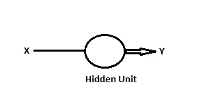
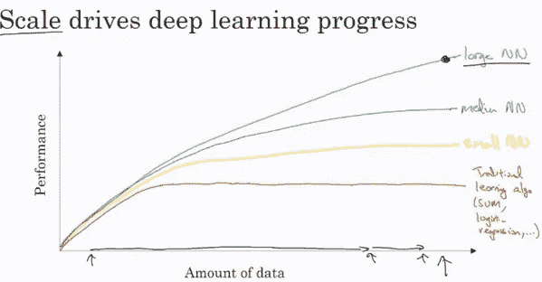

# 深度学习专业化

> 原文：<https://medium.com/analytics-vidhya/deep-learning-specialization-353c997af655?source=collection_archive---------17----------------------->

## 人工智能著名课程讲义

当我第一次在 Coursera 上通过吴恩达的[机器学习课程](https://www.coursera.org/learn/machine-learning)时，我对人工智能的好奇心增长了。我被人工智能的能力和它影响人类生活的方式迷住了。人工智能有意无意地触及了我们今天工作的几个领域，尤其是深度学习。它改变了传统的网络搜索，并在计算机视觉、农业、医疗保健、个性化教育、自动驾驶等多个领域产生了更大的影响。

从那时起，我决定深入这个领域，这使我参加了 Coursera 的 5 门课程[深度学习专业](https://www.coursera.org/specializations/deep-learning)。在学习的时候，我想到了做笔记，和大家分享。我希望我的笔记能帮助你对这个领域产生兴趣。所以不要再拖延了，让我们开始吧。

第一门课程是关于深度学习和神经网络的基础，我们将学习建立一个包括深度神经网络在内的神经网络，并对数据进行训练。我将从第一周的笔记开始。

## **第一周**

## **什么是神经网络？**

接受一些输入并预测一些输出的函数称为神经网络。该函数可以是线性回归或 relu(校正线性单位)。下面是基本的单单元神经网络。给定特征或输入 x，神经元或隐藏单元负责预测输出 Y。

图片来源:本人

神经网络已经被非常有效地应用的一些例子是:

*   **网络广告:**给定展示给用户的广告和用户的一些信息，神经网络会预测特定用户是否会点击广告的几率。
*   **照片标记:**由于深度学习，计算机视觉已经取得了巨大的进步，在深度学习中，给定图像的输入，神经网络将尝试识别特定的图像。对于这类应用，使用卷积神经网络。
*   **语音识别或机器翻译:**在这些类型的应用中，输入是音频剪辑，输出是文本或一种语言作为输入，输出是另一种所需的语言。这种应用使用递归神经网络。
*   **自动驾驶:**自动驾驶汽车通过识别方向来预测附近的车辆或行人，这是神经网络的复杂应用，需要混合神经网络架构。

## **数据类型**

可以将结构化和非结构化数据用作神经网络的输入。结构化数据是更系统和定义明确的特征，如卧室数量、房屋大小、阳台数量，这些都有定义明确的含义，而非结构化数据主要是音频剪辑、原始音频或图像，我们可能想要定义图像或文本中的确切内容。如果一台计算机获得了一种非结构化数据的感觉，这被认为是非常酷的，因为那时它们被认为是与人脑相比较的。由于深度学习，与几年前相比，计算机现在在解释非结构化数据方面也更好了。

## **深度学习为什么会腾飞？**

有人可能会奇怪，神经网络和深度学习背后的基本思想已经存在了大约 70 年，那么为什么现在深度学习已经起飞了呢？
如下图所示，随着数据量的增加，性能会提高，但使用传统算法，如 SVM 或逻辑回归，即使我们不断增加数据量，性能也会达到平稳状态。对于神经网络，数据和性能之间的关系几乎是线性的，其中随着数据量的增加，算法的性能不断变好。

图片来源:吴恩达

此外，随着大规模的数据，算法创新也促进了深度学习领域的增长。一个具体的例子是，sigmoid 函数变为 relu 函数使得梯度下降运行得更快，从而减少了训练时间。这是一个小小的转变，在人工智能领域产生了更大的影响。

其次，高速计算的可用性减少了迭代过程的时间。训练数据的过程是迭代的，首先想到神经网络架构的想法，实现代码，并验证该架构是否产生了预期的结果。这将是一个不断重复的过程。如果整个过程需要更长的时间，反馈循环将变得更长，导致时间、资源和成本的增加。

请看[这篇](https://madhurijain27.medium.com/deep-learning-specialization-df3938c3234c)文章，作为下周的笔记！！