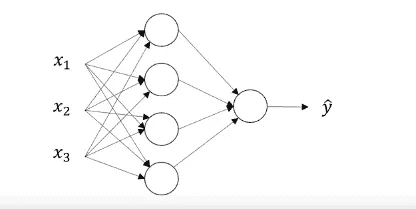

# 深度学习专业化

> 原文：<https://medium.com/analytics-vidhya/deep-learning-specialization-d517a9d8db56?source=collection_archive---------15----------------------->

## 神经网络和深度学习(第 3 周和第 4 周笔记)

本周，我们将学习神经网络。如果您没有浏览前一周的笔记，请参考[第 1 周](https://madhurijain27.medium.com/deep-learning-specialization-353c997af655)和[第 2 周](https://madhurijain27.medium.com/deep-learning-specialization-df3938c3234c)的笔记。

## **神经网络表示法**

我们将从具有单个隐藏层的神经网络开始。

X1、X2 和 X3 是垂直堆叠的输入要素，称为输入图层。带有 4 个圆圈的中间层称为隐藏层。之所以命名为隐藏，是因为在这一层执行的操作没有被观察到。最后一个圆圈称为输出层。每一层都用一个字母和一个上标数字来标识。

输入层= a^[0] = X

隐藏层= a^[1]

输出图层= a^[2] = Y 形帽

计算特定网络的层数时，不考虑输入图层。完整的网络和注释可以在下面看到。

## **神经网络如何计算输出？**

如上图所示，类似于逻辑回归 z 和 sigmoid z 是针对隐藏层和输出层中的每个圆。在隐藏层中，w^[1 的维数为(4，3)，b^[1 的维数为(4，1)。在输出层，w^[2]的维数是(1，4)，b^[2]是一个实数。上图是一个训练示例。我们可以使用矢量化类似地计算多个训练示例的输出值。

## **激活功能的选择**

到目前为止，我们已经使用了 sigmoid 函数，但还有其他选项可以被证明是更好的选择。让我们从 tan-h 函数开始。它可以按如下方式绘制，其值介于-1 和+1 之间。tan-h 函数的公式可以写成:

除了在二元分类的情况下，tan-h 函数优于 sigmoid 函数。对于不同的层，激活函数可以不同。因此，在上述两层神经网络中，tan-h 函数可用于隐藏层，sigmoid 函数可用于输出层。

这两个函数的缺点是，当 z 非常小或非常大时，这些函数的斜率/导数变得最小，接近于零，这减缓了梯度下降。因此，另一种流行的选择是整流线性函数(relu)。它的公式是 a = max(0，z)。

relu 函数的一个缺点是，当 z 为负时，它的导数为零。实际上，这种激活功能运行良好，但是存在另一种版本的 relu，称为 leaky relu。它的公式可以写成 a = max(0.01z，z)

漏 relu 在实际中用的不多。relu 或 leaky relu 的优点是，对于 z 的大量空间，函数的斜率与 0 非常不同，因此神经网络将比 sigmoid 或 tan-h 函数学习得更快。

## **激活函数的导数**

当我们实现神经网络的反向传播时，我们需要计算激活函数的斜率或导数。

如果 sigmoid 函数是 g(z ),那么函数的斜率，

如果 g(z) = a，则斜率可以简化为 a *(1–a)。

对于 tan-h 函数，斜率为 1-a:

Relu 和泄漏 relu:

## **随机初始化**

在训练神经网络时，随机初始化权重是很重要的。对于逻辑回归，将 w 和 b 初始化为零是可以的，但是对于神经网络，将权重初始化为零是不行的。可以通过归纳构造一个证明，当权重被初始化为零时，所有的隐藏单元将计算相同的函数。因此，保持更多的隐藏单元将不会在神经网络中保持任何值，并且建议随机初始化权重并将它们乘以小的数，例如 0.01。为乘法保留一个小数字的目的是权重的值最终会更小，导致 z 的最小值。

## **深层 L 层神经网络**

L =网络的层数，在上图中，层数为 4。计算图层时不考虑输入图层。

n^[l]= l 层中的单元数量。因此，不同层中的单元数量如下。n^[1] = 5，n^[2] = 5，n^[3] = 3，n^[4] = 1。

a^[l] =层 1 中的激活

w^[l] =层 l 中的重量

b^[l] =层 l 中的偏置参数

## **深度网络中的前向传播**

**单个训练示例的通用方程**

**使用矢量化的 m 个训练示例的通用方程。**

## 深度神经网络为什么会起作用？

我们都不断听说深度神经网络对几组问题非常有效，但其背后的原因是什么？首先，我们来了解一下什么是深度计算？如果我们正在构建一个人脸检测算法，那么第一层可能会进行特征或边缘检测。下一层可以检测一起形成面部部分的边缘组。最后，通过将面部的各个部分放在一起，它可以尝试识别不同类型的面部。这种从简单到复杂的分层表示或组合表示适用于除图像和人脸识别之外的其他类型的数据。

## 参数和超参数

在神经网络中，W 和 B 被认为是参数，但是我们需要告诉我们的学习算法其他东西，例如学习速率α、迭代次数、隐藏单元数、隐藏层数、激活函数类型等。这些参数最终控制 W 和 b 的值，因此它们被称为超参数。在深度学习中，决定超参数的值是一个经验过程，我们尝试几个值并观察损失函数。

有了这篇文章，我已经完成了深度学习专业化的第一门课程。敬请关注下一节课的笔记！！