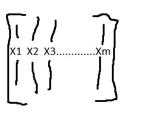
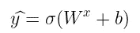
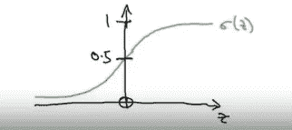
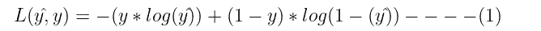
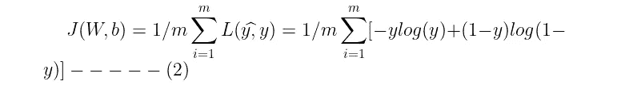
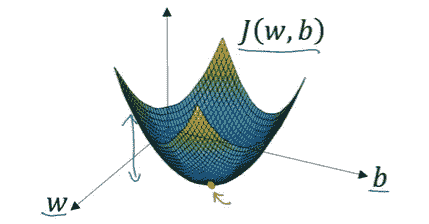
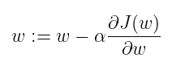
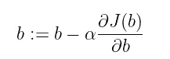
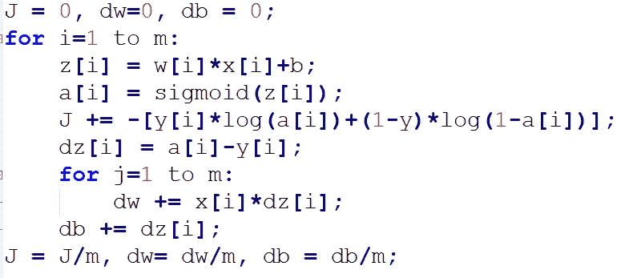
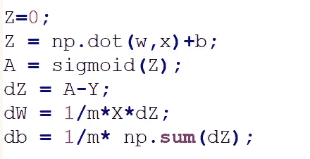

# 深度学习专业化

> 原文：<https://medium.com/analytics-vidhya/deep-learning-specialization-df3938c3234c?source=collection_archive---------16----------------------->

## 神经网络和深度学习课程笔记

我开始写这门课的笔记，这篇文章包含了第二周的笔记。如果你没有提到第一周的笔记，请查看这篇文章。

## 第二周

**二元分类**

逻辑回归是一种二元分类算法。让我们用一些输入图像来解决识别猫的问题。这里，X 是一组图像，y 是一个标记为 0 或 1 的输出。更进一步，让我们看看图像在计算机上是如何表现的。它们被存储为红色、蓝色和绿色的三个独立通道。因此，如果图像是 64 X 64 像素，那么我们将有三个 64 X 64 矩阵，对应于图像的红色、绿色和蓝色像素强度值。为了将这些像素强度值转换为特征向量，我们将这些像素值展开到输入特征向量 x 中。为了展开这些值，我们将首先将红色通道的所有像素值放入向量中，然后是蓝色和绿色通道的值。因此，如果图像是 64 X 64 像素，那么 X 输入向量的总尺寸将是 64 X 64 X 3 = 12，288。

**符号**

*   单个训练示例由对(x，y)表示，其中 x= N 维特征向量，y 是输出{0，1}
*   m 是一些训练的例子。{(x，y)，(x，y )…(xᵐ，yᵐ)}
*   为了在一个符号中组合所有的训练示例，我们将使用 X，其中我们在列中定义所有的输入特征，如下所示。因此，X 是{Nx，m}维度量。

图片来源:本人

*   y 将等于[ y，y，y，y⁴……yᵐ],因此是{1，m}维度量。

**逻辑回归**

逻辑回归是我们在输出 y 为 0 或 1 时使用的学习算法。给定输入要素 x，我们希望预测 y^ (Y hat)等于 y 的概率

给定参数 w 和 b，我们可以使用 sigmoid 函数重写线性回归公式，如下所示:

在上面的公式中，Wˣ+b 由 z 表示。如果在水平轴上绘制 z，则 z 的函数 sigmoid 如下图所示。它平滑地从 0 到 1，并以 0.5 穿过垂直轴。

图片来源:Andrew -Ng

z 的 Sigmoid 由 1/1+e-ᶻ表示，因此如果 z 的值非常大，e-ᶻ变得非常小，从而导致整体值为 1。如果 z 是一个最小的负值，那么 e-ᶻ就变成一个巨大的数字，导致总值为零。因此，在实施逻辑回归时，我们的工作是尝试学习参数 w 和 b，以便 y-hat 成为 y 等于 1 的概率的良好估计。

**逻辑回归成本函数**

为了训练逻辑回归模型的参数 w 和 b，我们需要定义一个成本函数。它也被称为损失函数，我们将需要它来衡量当真正的标签是 y 时 y-hat 有多好。

我们希望该函数尽可能小，从而确保逻辑回归正确预测了 y-hat。为了理解这个损失函数的意义，我们来看两个场景。

1.  当 y=1 时，替换上式中 y 的值得到 L(y^,y) = -log(y^).所以，如果我们说 y=1，我们必须确保 y-hat 尽可能大。在逻辑回归中，我们使用 sigmoid 函数，因此 y-hat 的值不能超过 1，因此它必须接近 1。
2.  当 y=0 时，替换第一个等式中的 y 值得到 L(y^，y) = -log(1-(y^).因此，如果我们说 y=0，考虑到负号，我们必须确保 log(1-y)尽可能大，因此 y-hat 应该尽可能小。

等式 1 是针对单个训练示例的，对于整个训练集，损失函数可以写成如下。

**梯度下降**

图片来源:Andrew-Ng

在图示的图中，水平轴表示 w 和 b 参数，这些水平轴上方的轴表示成本函数。我们的目标是找到 w 和 b 的值，使得成本函数值最小。

这里使用的成本函数 J(w，b)是凸函数。因此，梯度下降看起来像一个大碗，而不是几个小的局部最小值。

此外，为了获得参数的最佳值，我们必须将它们初始化为一些初始值。通常，使用逻辑回归，这些值被初始化为零。梯度下降将从一个初始点开始，并尽可能快地向最陡下降的方向下降，以达到图中用红点表示的全局最小值。它将获取 w 和 b 的值，并按如下方式更新它。

其中α是学习率。与学习速率一起，w 和 b 的偏导数将有助于分别更新 w 和 b 的值。

**Python 和矢量化**

当计算 m 个训练示例的损失和梯度时，必须通过 for 循环迭代每个示例，并且在代码中具有显式 for 循环使得算法运行效率较低。在深度学习算法的情况下，我们将转向越来越大的数据集。因此，在没有显式 for 循环的情况下运行算法变得极其重要，这将有助于扩展到更大的数据集。因此，一项非常重要的技术就是矢量化。

**逻辑回归在 python 中的非矢量化实现:**

**逻辑回归在 python 中的矢量化实现:**

第 3 周和第 4 周的笔记请[点击此处](https://madhurijain27.medium.com/deep-learning-specialization-d517a9d8db56)。