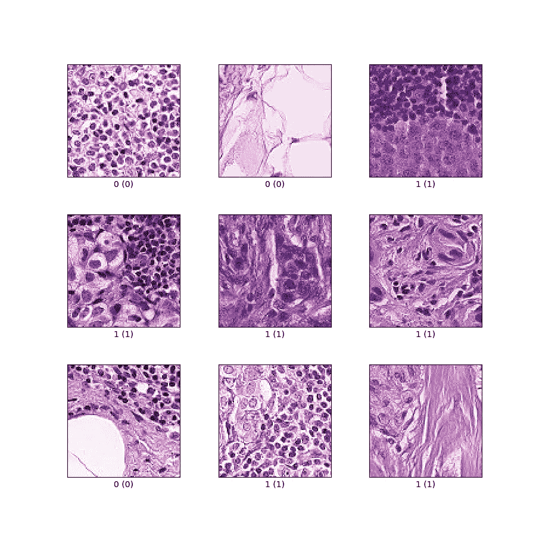
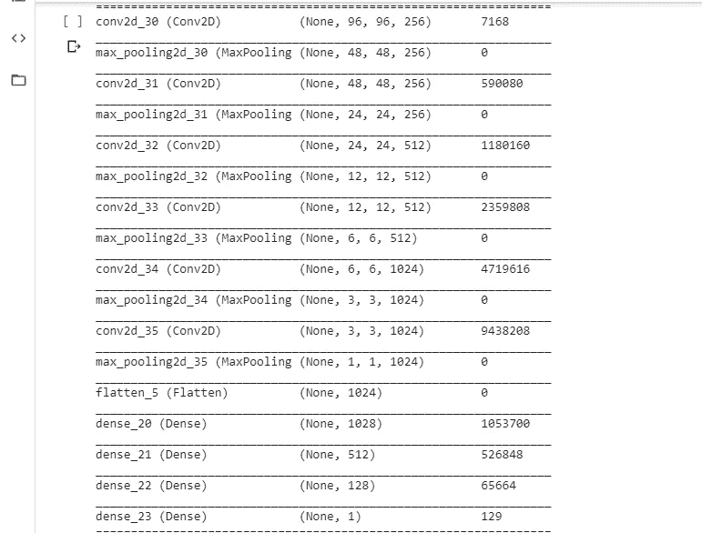
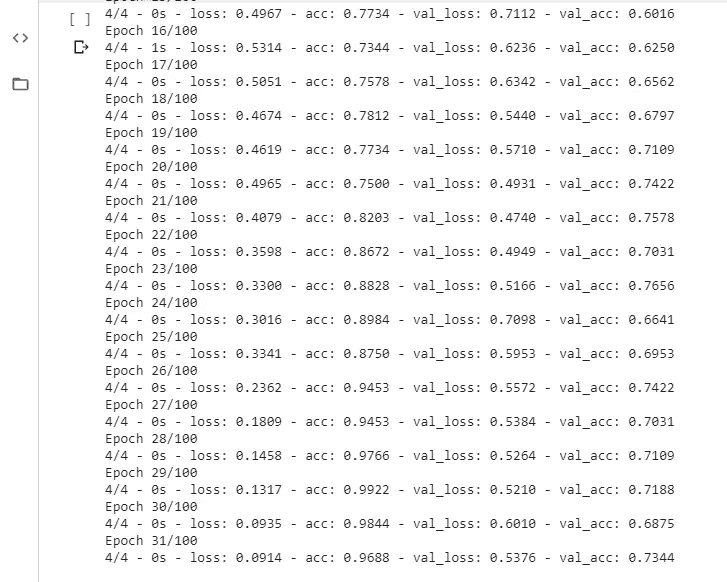

# 深度学习教程-(补丁 _ 卡梅里昂数据集)

> 原文：<https://medium.com/analytics-vidhya/deep-learning-tutorial-patch-camelyon-data-set-d0da9034550e?source=collection_archive---------6----------------------->

在这篇文章中，我们将在 patch _ camelyon 数据集(医学图像)上使用卷积神经网络(CNN ),该数据集来自 tensor flow 官方网站。我们将建立一个能够对图像进行分类的 convnet 模型。

如果您尚未安装此模块，请使用 pip 安装 tensorflow-datasets

## 了解数据集

在我们开始创建我们的模型之前，让我们试着理解我们将要处理的数据。

它由从淋巴结切片的组织病理学扫描中提取的 327，680 幅彩色图像(96 x 96px)组成。

每幅图像都标注了一个二元标记，表明存在转移组织。

每个图像的大小为[96，96，3](彩色图像)，二进制标签为 0 或 1。数据集正在进行训练、验证和测试拆分。最后一件事是…

是的，你猜对了，这是医学图像。现在我们已经了解了我们将要处理的内容，让我们加载数据

注意:

*   在 google colab 上尝试这将是最好的选择，数据集相当大！
*   加载数据需要一段时间，原因同上
*   不要害怕下载的大小，它实际上只需要不到 50MB，而在谷歌 colab 加载它，所以给它一个尝试！

我们开始吧

## 加载数据集

为了加载数据集，我们需要做的第一件事是导入必要的库。然后，我们将使用 tfds.load()加载(下载，然后第一次加载)我们的数据集，同时将 with _info 和 as_supervised 设置为 True。

让我们试着检查一些可能不清楚的代码部分

*   在第 9 行使用 tfds.load()时，设置 with_info = True 将返回关于我们的数据集的信息，然后将这些信息存储在我们声明的变量中(即 info)。
*   as_supervised = True 将我们的数据集加载为(图像，标签)元组结构。

如前所述，我们的数据集由训练、验证和测试分割组成。第 12、13、14 行在它们各自的变量中分配每个单独的分割

## 预处理数据

在把我们的数据输入 CNN 之前，它必须经过某种形式的预处理。

我们的数据集中图像的每个像素范围从 0 到 255，我们将缩放到 0 到 1 之间。

然后，我们批处理和预取训练、验证和测试数据。

*   创建了一个函数来缩放图像的像素
*   tf.cast 确保我们的图像是 float32 类型
*   潜水 255。以浮点格式将我们的像素缩放到 0 到 1 之间
*   对每个数据使用 map()方法会将我们的预处理函数应用于每个数据
*   使用大小为 1000 的缓冲区来混洗训练数据。确保缓冲区大小足够大，以使洗牌有效，但尽量不要超过 RAM 的容量。
*   每个数据以 batch_size 为 128 进行批处理，通过使用 prefetch(1 ),我们的数据集将始终领先一个批次

## 格式化

在我们准备好之前，只剩下一点格式化了。

*   iter()遍历数据来分离图像和标签，记住我们设置为 _supervise = True
*   next()移动到下一批
*   然后我们检查给出(128，1)的标签的形状，注意第一项是我们的 batch_size，而不是我们数据集中标签的总数
*   train_images.shape 返回 TensorShape([128，96，96，3])。第一项也是我们的 batch_size，而我们数据集中图像的形状是[96，96，3]，即我们的 input_shape

## 模型

在预处理和格式化之后，我们现在终于准备好构建我们的模型了。在构建我们的 CNN 之前，我们肯定会从导入一些必要的库开始

记住我们的 input_shape = [96，96，3]

*   我们的第一层由 256 个大小为 3(即 3 x 3)的过滤器组成，我们的 input_shape 变量也位于第一层
*   下一层由最大池组成，池大小为 2
*   随着过滤器 256、512、1024 的数量增加，重复相同的过程
*   对于具有(填充=相同)的层，每个图像将被填充
*   Kernel_initializer 用于训练开始时的随机性加权
*   使用的激活函数是“relu”
*   展平层在传递到致密层之前展平我们图像的形状
*   我们有三个密集隐藏层，隐藏单元为 1024、512、128
*   我们希望我们的模型返回一个单一的输出，即 0 或 1，所以我们的输出层只包含 1 个隐藏单元，具有“sigmoid”激活函数

上面的代码将返回我们的模型的总结，我们可以看到可训练和不可训练的层和总参数

然后，我们需要编译我们的模型并使之适合。

*   Adam optimizer 的学习率为 0.0001
*   由于我们的标签已经被编码为 0 和 1，我们将使用“二进制交叉熵”作为损失函数
*   还实现了早期停止回调来监控我们的 val_loss，并且如果 val_loss 在 10 个时期内没有增加，则停止模型
*   model.fit()将开始我们模型的训练

在训练之后，验证准确度应该是大约 73%

让我们用下面的代码绘制精度和损耗曲线

当训练精度曲线继续增加时，在它停止之前，得到的曲线应该是验证精度的稳定增加

然后，您可以继续在 test_data 上测试它

结论

我们能够获得 75%的模型准确性，这仍然可以通过数据扩充和迁移学习来提高(这将需要大量的计算能力和资源)，但总的来说，这仍然是一个好模型