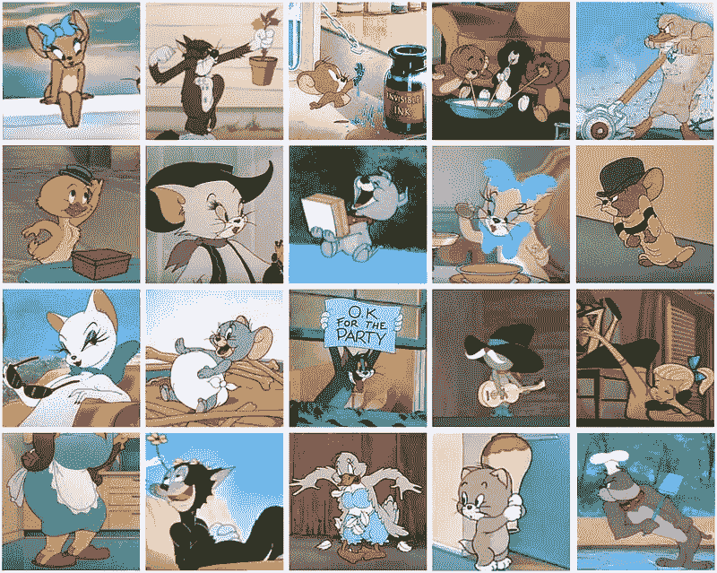
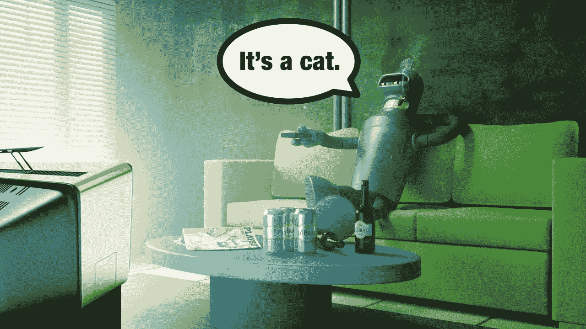
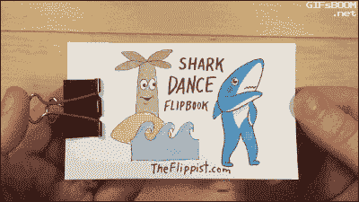
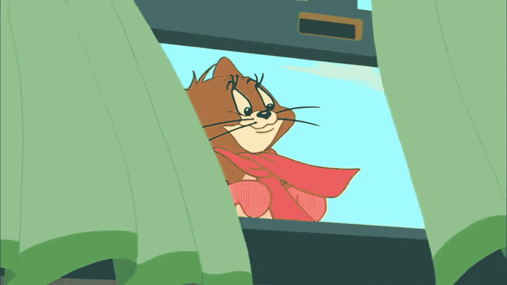
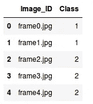
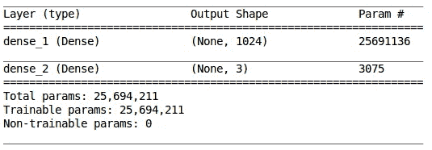
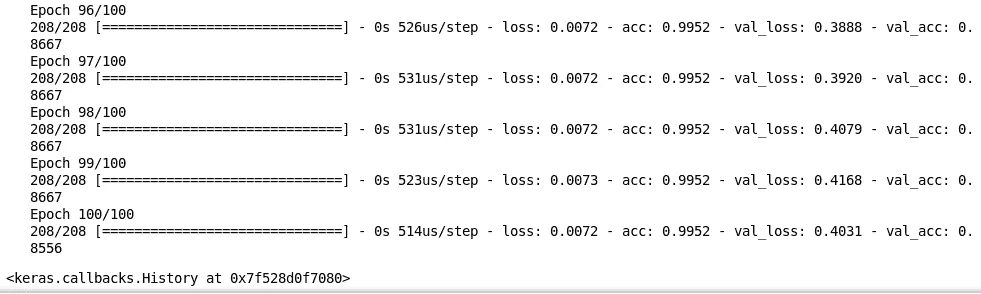
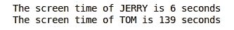
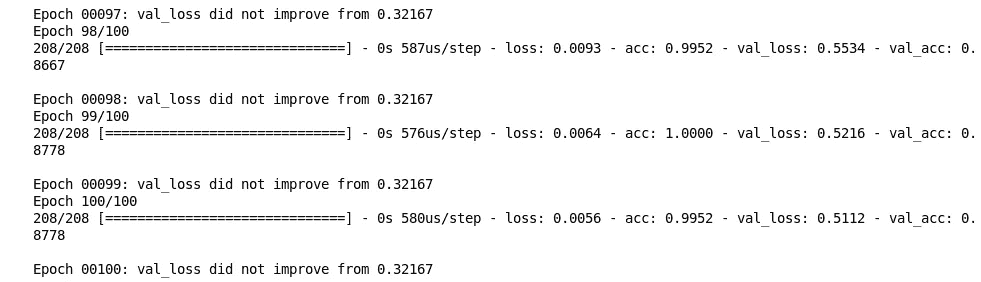
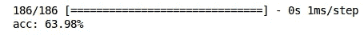

# 深度学习教程计算任意视频中演员的屏幕时间(附 Python 代码)

> 原文：<https://medium.com/analytics-vidhya/deep-learning-tutorial-to-calculate-the-screen-time-of-actors-in-any-video-with-python-codes-a26e12daba0c?source=collection_archive---------2----------------------->



资料来源:sporcle.com

当我开始我的深度学习之旅时，我学到的第一件事就是图像分类。这是计算机视觉界如此迷人的一部分，我完全沉浸其中！但我有一个好奇的想法，一旦我掌握了图像分类，我想知道我是否可以将这种学习转移到视频中。

有没有办法建立一个模型，在特定的时间间隔自动识别特定视频中的特定人物？事实证明，是有的，我很高兴能与你分享我的方法！



来源:海岸线自动化

现在给你一些关于我们将要解决的问题的背景，记住屏幕时间对一个演员来说是非常重要的。和他/她拿到的钱直接相关。为了让你对这个佣金有个概念，你知道吗，小罗伯特·唐尼·唐尼在《蜘蛛侠归来》中仅仅 15 分钟的出镜时间就赚了 1000 万美元？难以置信。

如果我们可以拍摄任何视频，并计算其中任何演员的屏幕时间，这将有多酷？

在本文中，我将帮助您了解如何在视频数据上使用深度学习。为了做到这一点，我们将使用广受欢迎的汤姆和杰瑞卡通系列的视频。目的是计算任何给定视频中汤姆和杰里的屏幕时间。

听起来很有趣？接着读下去！

*注意:本文假设你对使用深度学习的图像分类有先验知识。如果没有，我推荐你浏览一下* [***这篇文章***](https://www.analyticsvidhya.com/blog/2016/10/tutorial-optimizing-neural-networks-using-keras-with-image-recognition-case-study/) *，它将帮助你掌握深度学习和图像分类的基础知识。*

# 目录

1.  读取视频并提取帧
2.  如何在 Python 中处理视频文件
3.  计算屏幕时间—一个简单的解决方案
4.  我的经验——哪些有效，哪些无效

# 读取视频并提取帧

听说过翻页书吗？如果你没有，你就错过了！看看下面这个:



*资料来源:giphy.com*

我们在书的每一页上都有不同的图像，当我们翻动这些页面时，我们得到一个鲨鱼跳舞的动画。你甚至可以称之为一种视频。我们翻页越快，视觉效果就越好。换句话说，这种视觉是以特定顺序排列的不同图像的集合。

同样，视频也不过是一组图像的集合。这些图像被称为帧，可以组合起来获得原始视频。因此，与视频数据相关的问题与图像分类或对象检测问题没有太大不同。从视频中提取帧只需要一个额外的步骤。

记住，我们这里的挑战是从给定的视频中计算汤姆和杰瑞的屏幕时间。让我首先总结一下我们在本文中将遵循的解决这个问题的步骤:

1.  导入和阅读视频，从中提取帧，并将其存储为图像
2.  标注几张图片用于训练模型(别担心，我已经帮你做好了)
3.  根据训练数据建立我们的模型
4.  对剩余的图像进行预测
5.  计算汤姆和杰瑞的屏幕时间

相信我，只要遵循这些步骤，就能帮助你解决深度学习中的许多此类视频相关问题。现在是时候戴上我们的 Python 帽子，开始这项挑战了。

# 如何在 Python 中处理视频文件

让我们从导入所有必需的库开始。如果您还没有安装下面的库，请继续安装:

*   [Numpy](https://scipy.org/install.html)
*   [熊猫](https://scipy.org/install.html)
*   [Matplotlib](https://scipy.org/install.html)
*   [Keras](https://keras.io/#installation)
*   [克扣](http://scikit-image.org/docs/dev/install.html)
*   [OpenCV](https://pypi.org/project/opencv-python/)

```
import cv2     # for capturing videos
import math   # for mathematical operations
import matplotlib.pyplot as plt    # for plotting the images
%matplotlib inline
import pandas as pd
from keras.preprocessing import image   # for preprocessing the images
import numpy as np    # for mathematical operations
from keras.utils import np_utils
from skimage.transform import resize   # for resizing images
```

# 第一步:阅读视频，从中提取帧并保存为图像

现在我们将加载视频并将其转换为帧。**你可以从** [**这个链接**](https://drive.google.com/file/d/1_DcwBhYo15j7AU-v2gN61qGGd1ZablGK/view?usp=sharing) 下载用于这个例子的视频。我们将首先使用 *VideoCapture()* 函数从给定的目录中捕获视频，然后我们将使用 *imwrite()* 函数从视频中提取帧并将它们保存为图像。我们来编码一下:

```
count = 0
videoFile = "Tom and jerry.mp4"
cap = cv2.VideoCapture(videoFile)   # capturing the video from the given path
frameRate = cap.get(5) #frame rate
x=1
while(cap.isOpened()):
    frameId = cap.get(1) #current frame number
    ret, frame = cap.read()
    if (ret != True):
        break
    if (frameId % math.floor(frameRate) == 0):
        filename ="frame%d.jpg" % count;count+=1
        cv2.imwrite(filename, frame)
cap.release()
print ("Done!")
```

搞定了。

一旦这个过程完成，“完成！”将打印在屏幕上，作为已创建框架的确认。

让我们试着想象一幅图像(画面)。我们将首先使用 *matplotlib，*的 *imread()* 函数读取图像，然后使用 *imshow()* 函数绘制图像。

```
img = plt.imread('frame0.jpg')   # reading image using its name
plt.imshow(img)
```



开始兴奋了吗？

这是视频的第一帧。我们已经从视频的整个持续时间中提取了每秒一帧。由于视频的持续时间是 4 分 58 秒(298 秒)，我们现在总共有 298 张图像。

我们的任务是识别哪个图像有汤姆，哪个图像有杰里。如果我们提取的图像与流行的 Imagenet 数据集中存在的图像相似，这个挑战可能是轻而易举的。怎么会？我们可以简单地使用根据 Imagenet 数据预先训练的模型，并获得高准确度分数！但是那有什么意思呢？

我们有卡通图像，所以任何预先训练的模型都很难(如果不是不可能的话)在给定的视频中识别出汤姆和杰里。

# 步骤 2:标记一些图像来训练模型

那么，我们如何着手处理这件事呢？一种可能的解决方案是手动给一些图像添加标签，并在这些图像上训练模型。一旦模型学习了这些模式，我们就可以用它来对一组以前看不到的图像进行预测。

请记住，可能会出现汤姆和杰瑞都不在场的情况。所以，我们将把它作为一个多类分类问题来处理。我定义的类有:

*   杰瑞和汤姆都不是
*   1:给杰瑞
*   2:给汤姆的

不要担心，我已经标记了所有的图片，所以你不必！继续下载 [**mapping.csv**](https://drive.google.com/file/d/1NbU8Sdj_YNF5Dl_zbdeBcnqEyU3Xw9TU/view?usp=sharing) 文件，其中包含每个图像名称及其对应的类(0 或 1 或 2)。

```
data = pd.read_csv('mapping.csv')     # reading the csv file
data.head()      # printing first five rows of the file
```



映射文件包含两列:

*   ***Image _ ID:****C*包含每个图像的名称
*   **类*类*。*Image _ ID:****C*包含每个图像对应的类

我们的下一步是读取图像，我们将基于它们的名称，也就是 *Image_ID* 列。

```
X = [ ]     # creating an empty array
for img_name in data.Image_ID:
    img = plt.imread('' + img_name)
    X.append(img)  # storing each image in array X
X = np.array(X)    # converting list to array
```

Tada！我们现在有图像了。记住，我们需要两样东西来训练我们的模型:

*   训练图像，以及
*   他们对应的类

因为有三个类，我们将使用 *keras.utils* 的*to _ categorial()*函数对它们进行编码。

```
y = data.Class
dummy_y = np_utils.to_categorical(y)    # one hot encoding Classes
```

我们将使用 VGG16 预训练模型，该模型采用形状(224 X 224 X 3)的输入图像。由于我们的图像大小不同，我们需要对它们进行整形。我们将使用 *skimage.transform* 的 *resize()* 函数来实现这一点。

```
image = []
for i in range(0,X.shape[0]):
    a = resize(X[i], preserve_range=True, output_shape=(224,224)).astype(int)      # reshaping to 224*224*3
    image.append(a)
X = np.array(image)
```

所有的图像都被调整为 224 X 224 X 3。但是在向模型传递任何输入之前，我们必须按照模型的要求对其进行预处理。否则，模型的性能将不够好。使用*keras . applications . vgg 16*的 *preprocess_input()* 函数来执行此步骤。

```
from keras.applications.vgg16 import preprocess_input
X = preprocess_input(X, mode='tf')      # preprocessing the input data
```

我们还需要一个验证集来检查模型在看不见的图像上的性能。我们将利用*sk learn . model _ selection*模块的 *train_test_split()* 函数将图像随机分为训练集和验证集。

```
from sklearn.model_selection import train_test_split
X_train, X_valid, y_train, y_valid = train_test_split(X, dummy_y, test_size=0.3, random_state=42)    # preparing the validation set
```

# 步骤 3:构建模型

下一步是构建我们的模型。如上所述，我们将使用 VGG16 预训练模型来完成这项任务。让我们首先导入构建模型所需的库:

```
from keras.models import Sequential
from keras.applications.vgg16 import VGG16
from keras.layers import Dense, InputLayer, Dropout
```

我们现在将加载 VGG16 预训练模型，并将其存储为 *base_model* :

```
base_model = VGG16(weights='imagenet', include_top=False, input_shape=(224, 224, 3))    # include_top=False to remove the top layer
```

我们将使用该模型对 *X_train* 和 *X_valid* 进行预测，获得特征，然后使用这些特征重新训练该模型。

```
X_train = base_model.predict(X_train)
X_valid = base_model.predict(X_valid)
X_train.shape, X_valid.shape
```

*X_train* 和 *X_valid* 的形状分别为(208，7，7，512)，(90，7，7，512)。为了将它传递给我们的神经网络，我们必须将其重塑为一维。

```
X_train = X_train.reshape(208, 7*7*512)      # converting to 1-D
X_valid = X_valid.reshape(90, 7*7*512)
```

我们现在将预处理图像，并使它们以零为中心，这有助于模型更快地收敛。

```
train = X_train/X_train.max()      # centering the data
X_valid = X_valid/X_train.max()
```

最后，我们将构建我们的模型。该步骤可分为 3 个子步骤:

1.  构建模型
2.  编译模型
3.  训练模型

```
# i. Building the model
model = Sequential()
model.add(InputLayer((7*7*512,)))    # input layer
model.add(Dense(units=1024, activation='sigmoid')) # hidden layer
model.add(Dense(3, activation='sigmoid'))    # output layer
```

让我们使用 *summary()* 函数来检查模型的摘要:

```
model.summary()
```



我们有一个具有 1，024 个神经元的隐藏层和一个具有 3 个神经元的输出层(因为我们有 3 个类要预测)。现在我们将编译我们的模型:

```
# ii. Compiling the model
model.compile(loss='categorical_crossentropy', optimizer='adam', metrics=['accuracy'])
```

在最后一步中，我们将拟合模型，同时还将检查它在看不见的图像(即验证图像)上的性能:

```
# iii. Training the model
model.fit(train, y_train, epochs=100, validation_data=(X_valid, y_valid))
```



我们可以看到它在训练和验证图像上表现得非常好。**我们对看不见的图像有大约 85%的准确率**。这就是我们如何在视频数据上训练一个模型来得到每一帧的预测。

在下一节中，我们将尝试计算汤姆和杰瑞在新视频中的屏幕时间。

# 计算屏幕时间—一个简单的解决方案

首先，从这里 下载我们将在本节 [**中使用的视频。一旦完成，继续加载视频并从中提取帧。我们将遵循与上面相同的步骤:**](https://drive.google.com/file/d/1MQHRosZmeYpK2onCWr_A9p5SI93pEDw0/view?usp=sharing)

```
count = 0
videoFile = "Tom and Jerry 3.mp4"
cap = cv2.VideoCapture(videoFile)
frameRate = cap.get(5) #frame rate
x=1
while(cap.isOpened()):
    frameId = cap.get(1) #current frame number
    ret, frame = cap.read()
    if (ret != True):
        break
    if (frameId % math.floor(frameRate) == 0):
        filename ="test%d.jpg" % count;count+=1
        cv2.imwrite(filename, frame)
cap.release()
print ("Done!")
```

搞定了。

从新视频中提取帧后，我们现在将加载 test.csv 文件，该文件包含每个提取帧的名称。**下载**[**test . CSV**](https://drive.google.com/open?id=1uIAXp_2WHwb_SLZF3fwpW9lbo9eRaTtp)**文件**并加载:

```
test = pd.read_csv('test.csv')
```

接下来，我们将导入图像进行测试，然后根据前面提到的预训练模型的要求对它们进行整形:

```
test_image = []
for img_name in test.Image_ID:
    img = plt.imread('' + img_name)
    test_image.append(img)
test_img = np.array(test_image)test_image = []
for i in range(0,test_img.shape[0]):
    a = resize(test_img[i], preserve_range=True, output_shape=(224,224)).astype(int)
    test_image.append(a)
test_image = np.array(test_image)
```

我们需要对这些图像进行类似于我们对训练图像所做的更改。我们将对图像进行预处理，使用 *base_model.predict()* 函数使用 VGG16 预训练模型从这些图像中提取特征，将这些图像整形为一维形式，并使它们以零为中心:

```
# preprocessing the images
test_image = preprocess_input(test_image, mode='tf')

# extracting features from the images using pretrained model
test_image = base_model.predict(test_image)

# converting the images to 1-D form
test_image = test_image.reshape(186, 7*7*512)

# zero centered images
test_image = test_image/test_image.max()
```

由于我们之前已经训练了该模型，所以我们将利用该模型来对这些图像进行预测。

# 步骤 4:对剩余的图像进行预测

```
predictions = model.predict_classes(test_image)
```

# 第五步:计算汤姆和杰瑞的屏幕时间

回想一下，类“1”表示 JERRY 的存在，而类“2”表示 TOM 的存在。我们将利用上述预测来计算这两个传奇人物的出场时间:

```
print("The screen time of JERRY is", predictions[predictions==1].shape[0], "seconds")
print("The screen time of TOM is", predictions[predictions==2].shape[0], "seconds")
```



这就对了。我们有给定视频中汤姆和杰里的总屏幕时间。

# 我的经验——哪些有效，哪些无效

为了这个挑战，我尝试和测试了许多东西——有些非常有效，而有些则以失败告终。在这一部分，我将详细阐述我所面临的一些困难，以及我是如何解决这些困难的。之后，我提供了最终模型的全部代码，这给了我最好的准确性。

首先，我尝试在不移除顶层的情况下使用预训练模型。结果并不令人满意。可能的原因是这些是卡通图像，我们的预训练模型是在实际图像上训练的，因此它不能对这些卡通图像进行分类。为了解决这个问题，我使用少量标记图像重新训练预训练模型，结果比以前的结果更好。

即使在对标记图像进行训练之后，准确度也不令人满意。该模型不能在训练图像本身上很好地执行。所以，我试着增加层数。增加层数被证明是提高训练精度的好方法，但是在训练和验证精度之间没有同步。该模型过拟合，其对未知数据的表现不令人满意。因此，我在每个密集层后添加了一个下降层，这样训练和验证准确性之间就有了很好的同步。

我注意到班级不平衡。汤姆有更多的屏幕时间，所以预测受其支配，大多数帧被预测为汤姆。为了克服这个问题并使类平衡，我使用了 sklearn.utils.class_weight 模块的 compute_class_weight()函数。与具有较高值计数的类相比，它将较高的权重分配给具有较低值计数的类。

我还使用模型检查点来保存最佳模型，即产生最低验证损失的模型，然后使用该模型进行最终预测。我将总结上述所有步骤，并给出最终代码。测试图像的实际类可以在 [testing.csv](https://drive.google.com/file/d/1blewkgF0M6SlJp4x47MVqQEbu4NZmGuF/view?usp=sharing) 文件中找到。

```
import cv2
import math
import matplotlib.pyplot as plt
import pandas as pd
%matplotlib inline
from keras.preprocessing import image
import numpy as np
from skimage.transform import resizecount = 0
videoFile = "Tom and jerry.mp4"
cap = cv2.VideoCapture(videoFile)
frameRate = cap.get(5) #frame rate
x=1
while(cap.isOpened()):
    frameId = cap.get(1) #current frame number
    ret, frame = cap.read()
    if (ret != True):
        break
    if (frameId % math.floor(frameRate) == 0):
        filename ="frame%d.jpg" % count;count+=1
        cv2.imwrite(filename, frame)
cap.release()
print ("Done!")
```

搞定了。

```
count = 0
videoFile = "Tom and Jerry 3.mp4"
cap = cv2.VideoCapture(videoFile)
frameRate = cap.get(5) #frame rate
x=1
while(cap.isOpened()):
    frameId = cap.get(1) #current frame number
    ret, frame = cap.read()
    if (ret != True):
        break
    if (frameId % math.floor(frameRate) == 0):
        filename ="test%d.jpg" % count;count+=1
        cv2.imwrite(filename, frame)
cap.release()
print ("Done!")
```

搞定了。

```
data = pd.read_csv('mapping.csv')
test = pd.read_csv('testing.csv')X = []
for img_name in data.Image_ID:
    img = plt.imread('' + img_name)
    X.append(img)
X = np.array(X)test_image = []
for img_name in test.Image_ID:
    img = plt.imread('' + img_name)
    test_image.append(img)
test_img = np.array(test_image)from keras.utils import np_utils
train_y = np_utils.to_categorical(data.Class)
test_y = np_utils.to_categorical(test.Class)image = []
for i in range(0,X.shape[0]):
    a = resize(X[i], preserve_range=True, output_shape=(224,224,3)).astype(int)
    image.append(a)
X = np.array(image)test_image = []
for i in range(0,test_img.shape[0]):
    a = resize(test_img[i], preserve_range=True, output_shape=(224,224)).astype(int)
    test_image.append(a)
test_image = np.array(test_image)from keras.applications.vgg16 import preprocess_input
X = preprocess_input(X, mode='tf')
test_image = preprocess_input(test_image, mode='tf')from sklearn.model_selection import train_test_split
X_train, X_valid, y_train, y_valid = train_test_split(X, train_y, test_size=0.3, random_state=42)from keras.models import Sequential
from keras.applications.vgg16 import VGG16
from keras.layers import Dense, InputLayer, Dropoutbase_model = VGG16(weights='imagenet', include_top=False, input_shape=(224, 224, 3))X_train = base_model.predict(X_train)
X_valid = base_model.predict(X_valid)
test_image = base_model.predict(test_image)X_train = X_train.reshape(208, 7*7*512)
X_valid = X_valid.reshape(90, 7*7*512)
test_image = test_image.reshape(186, 7*7*512)train = X_train/X_train.max()
X_valid = X_valid/X_train.max()
test_image = test_image/test_image.max()model = Sequential()
model.add(InputLayer((7*7*512,)))    # input layer
model.add(Dense(units=1024, activation='sigmoid'))   # hidden layer
model.add(Dropout(0.5))      # adding dropout
model.add(Dense(units=512, activation='sigmoid'))    # hidden layer
model.add(Dropout(0.5))      # adding dropout
model.add(Dense(units=256, activation='sigmoid'))    # hidden layer
model.add(Dropout(0.5))      # adding dropout
model.add(Dense(3, activation='sigmoid'))            # output layermodel.compile(loss='categorical_crossentropy', optimizer='adam', metrics=['accuracy'])from sklearn.utils.class_weight import compute_class_weight, compute_sample_weight
class_weights = compute_class_weight('balanced',np.unique(data.Class), data.Class)  # computing weights of different classesfrom keras.callbacks import ModelCheckpoint
filepath="weights.best.hdf5"
checkpoint = ModelCheckpoint(filepath, monitor='val_loss', verbose=1, save_best_only=True, mode='min')
callbacks_list = [checkpoint]      # model check pointing based on validation lossmodel.fit(train, y_train, epochs=100, validation_data=(X_valid, y_valid), class_weight=class_weights, callbacks=callbacks_list)
```



```
model.load_weights("weights.best.hdf5")model.compile(loss='categorical_crossentropy', optimizer='adam', metrics=['accuracy'])scores = model.evaluate(test_image, test_y)
print("%s: %.2f%%" % (model.metrics_names[1], scores[1]*100))
```



# 结论

使用该模型，我们在验证数据和测试数据上分别获得了大约 88%和 64%的准确率。

测试数据准确性低的一个可能原因是缺少训练数据。由于模型没有很多像汤姆和杰里的卡通形象的知识，我们必须在训练过程中给它更多的图像。我的建议是从不同的《猫和老鼠》视频中提取更多的帧，相应地标记它们，并用它们来训练模型。一旦模型看到了这两个角色的大量图像，它很有可能会导致更好的分类结果。

这样的模型可以在各个领域帮助我们:

*   我们可以计算电影中特定演员的屏幕时间
*   计算你喜欢的超级英雄的屏幕时间等。

这些只是可以使用这种技术的几个例子。你可以自己想出更多这样的应用程序！

*原载于 2018 年 9 月 11 日*[*【www.analyticsvidhya.com】*](https://www.analyticsvidhya.com/blog/2018/09/deep-learning-video-classification-python/)*。*