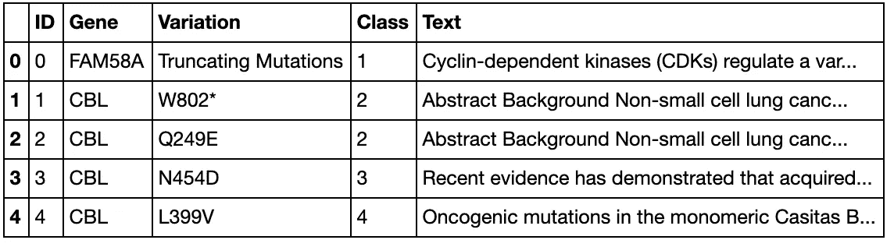
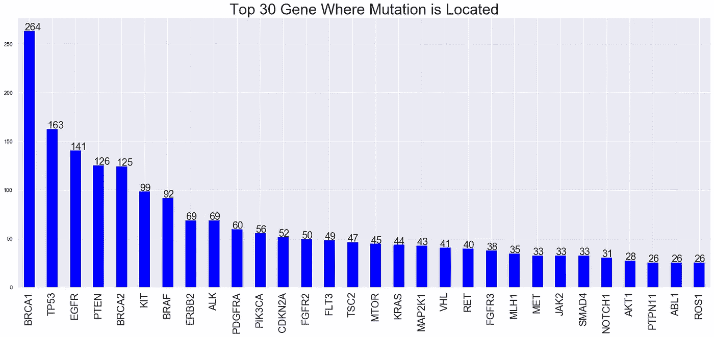
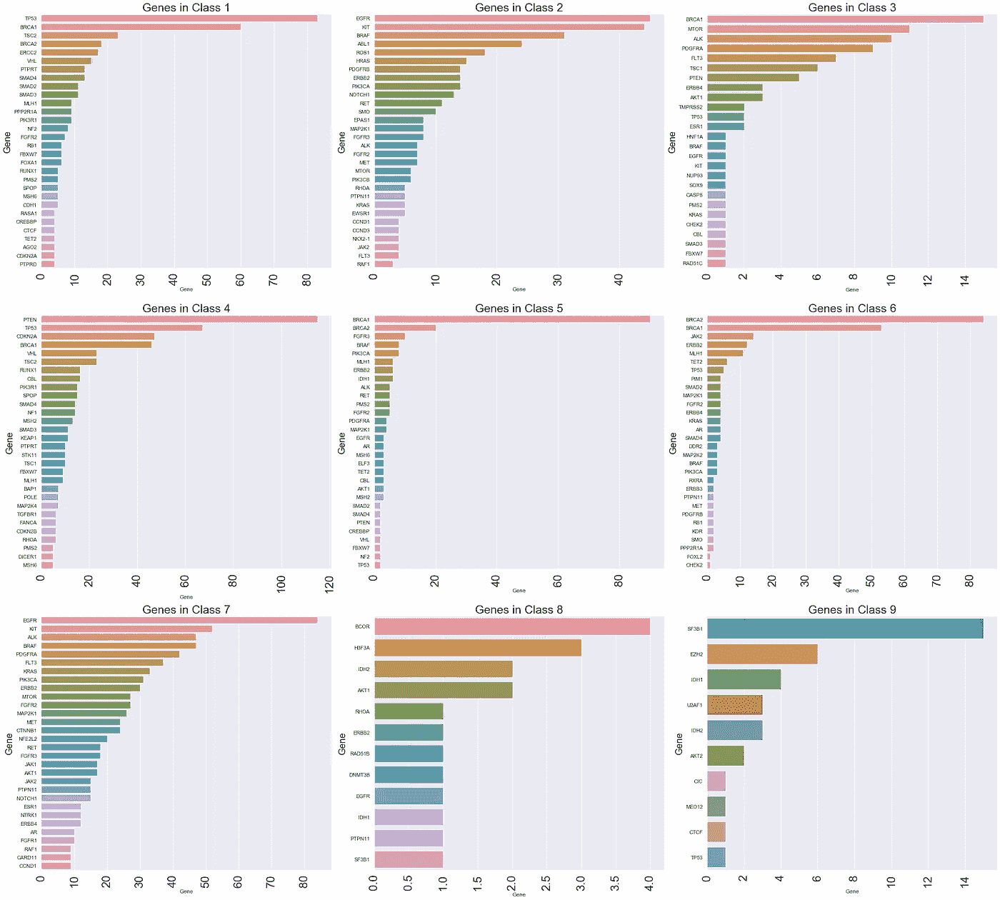
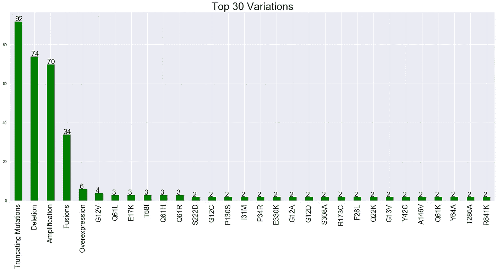
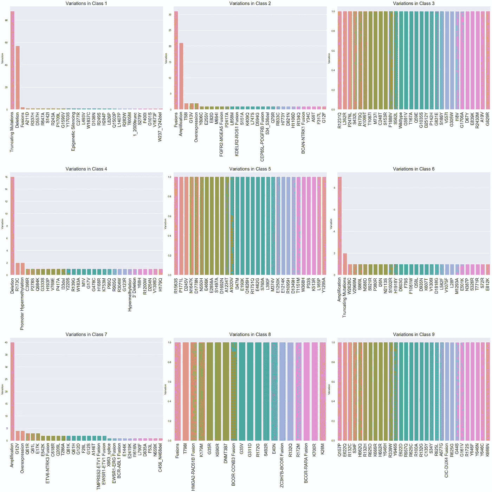
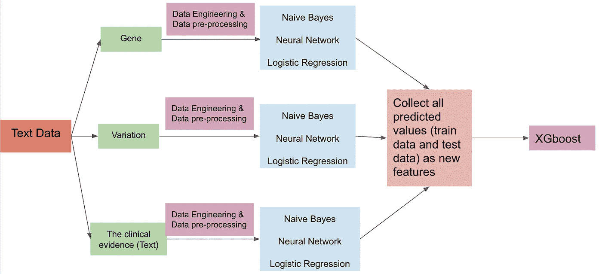
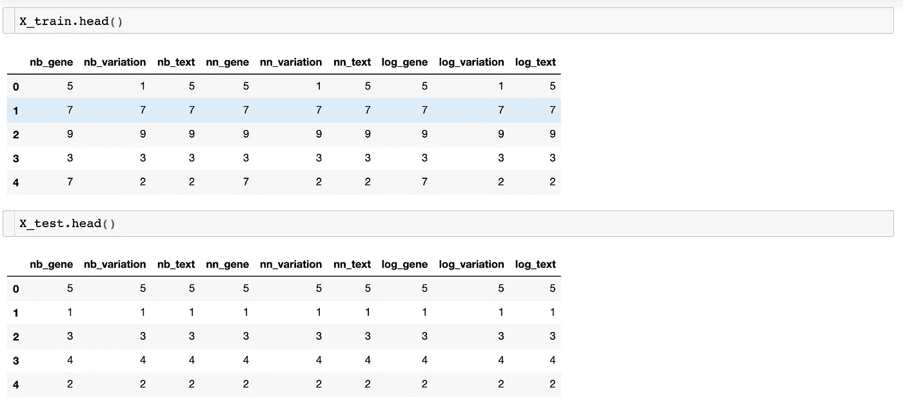
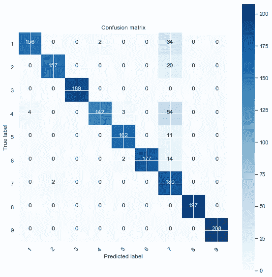

# 深度学习——使用基于文本的临床文献的证据对🧬Genetic 变异进行分类

> 原文：<https://medium.com/analytics-vidhya/deep-learning-using-evidence-from-text-based-clinical-literature-to-classify-genetic-variations-c3031aa5d240?source=collection_archive---------19----------------------->

全球每年有 700 万患者罹患癌症，500 万人死于癌症。60%的患者确诊后只能存活 5 年左右。但无论是哪种癌症，就肿瘤的具体类型(分型)或发展的不同阶段而言，基因组都有特定的变化。

基因组改变(引起)细胞分化、异常发育和生长传递，这可能是由基因突变或遗传引起的。为了避免研究者大量的手工工作，机器学习&深度学习在这个领域扮演着非常重要的角色。例如，癌症肿瘤在 DNA 序列中可能有数千个基因突变，挑战在于将导致肿瘤生长的突变与中性突变区分开来。如今，许多研究人员仍在研究基因检测如何帮助我们找到治疗这些癌症的方法。

本博客将介绍一些使用基因组学知识自动分类遗传变异的机器学习算法。数据来自 [Kaggle](https://www.kaggle.com/c/msk-redefining-cancer-treatment/overview) ，属性信息包括 *ID* 和这个基因突变所在的*基因*；*变异—* 突变的氨基酸变化；*正文* —用于对基因突变进行分类的临床证据；C *类*列包含已被分类的基因突变。

我们可以看到除了*类的*列外其他列都是文本数据。我以前的博客谈到了逐步数据工程和自然语言处理(NLP)的数据预处理。如果你有兴趣，你可以访问我的博客。

在数据清理和数据工程(标记化、摊销和词干化)之后，我们需要做的第一件事是找到更多的见解——数据探索性分析(EDA)。

# 电子设计自动化(Electronic Design Automation)

## 基恩

条形图显示了突变所在的前 30 个基因。第一个地方是 BRCA1，你可以看到第五个地方有一个叫 BRCA2 的基因。它们是什么？“BRCA”这个名字是“乳腺癌基因”的缩写 BRCA1 和 BRCA2 是两种不同的基因，它们被发现会影响一个人患乳腺癌的几率。此外，[TP53 基因的改变会大大增加患乳腺癌、膀胱癌、肺癌等疾病的风险。](https://ghr.nlm.nih.gov/gene/TP53#conditions) [此外，EGFR*基因中大约有八种突变与肺癌有关。*](https://ghr.nlm.nih.gov/gene/EGFR#conditions)

**

*了解了这些基因及其突变的潜在风险后，让我们来看看每一类的柱状图。显然，一个基因可以分为不同的类别。例如，BRCA1 基因几乎存在于所有类别中，这意味着一种类型的基因可能有不止一个突变。像“PTEN”这样的基因主要出现在一个类中。另一方面，第 8 类和第 9 类中有少数基因。*

**

## *变化*

*在我们的数据集中，总共有 2993 个不同的变异，每个变异匹配一个或多个基因。并非所有的变异都会导致癌症，但它们可能会影响患癌风险。*

**

*从上面的条形图中，我们可以看到前 5 位的变异是“截短突变”、“缺失”、“扩增”、“融合”和“过表达”。其他变种的数量都在 2 左右。在类 1 中，出现频率最高的是截断突变，在类 6 中排在第二位。融合、缺失、扩增分别在第 2、4、6 和 7 类中出现频率较高。另一方面，在类别 3、5、8 和 9 中，每个变化的频率的数量是一(1)。*

**

# ***机器学习应用和模型堆叠***

*在数据工程、数据预处理和数据矢量化之后，我们可以开始进入建模部分。下图是建模部分的流程。在第一阶段，我使用不同的模型(朴素贝叶斯、神经网络和逻辑回归)分别分析了每一列。在第二阶段，所有这些输出都被收集起来作为下一阶段建模部分的新特性— XGboost。*

**

*让我们看看新的列车和新的测试数据。每列包含三个模型的预测值。*

**

*应用模型叠加后，我们可能会获得更高的精度和 f1 值，但是很难对结果进行解释和说明。在模型叠加之前，最高精度来自神经网络模型，预测值是变化。准确率和 f1 值分别为 89.61%和 90.29%。模型堆叠后，准确率和 f1 值分别为 91.48%和 92.04%。显然，我们得到了更好的结果，准确率和 f1 分数提高了约 2%。根据下面的混淆矩阵，大多数类别都预测得很好，但我们的模型对类别 7 的预测不太好。*

**

# *摘要*

*如果我们能够得到一个大的数据集，准确性和 f1 分数肯定会增加。此外，我们的数据集越大，神经网络生成的结果就越好。*

*如果你对我的项目感兴趣，请访问我的 [GitHub](https://github.com/melanieshi0120/DNA_project) 。*

* [## 个性化医疗:重新定义癌症治疗

### 预测基因变异的影响，实现个性化医疗

www.kaggle.com](https://www.kaggle.com/c/msk-redefining-cancer-treatment/overview)  [## 亚马逊评论数据的自然语言处理(NLP)分析(第一部分:数据工程)

### 在人工智能领域，有很多科学家仍然在研究和专注于创造和改进机器…

medium.com](/swlh/natural-language-processing-nlp-analysis-with-amazon-review-data-part-i-data-engineering-6573b782e4dc)  [## 自然语言处理(NLP) -亚马逊评论数据(第二部分:EDA，数据预处理和模型…

### 我以前的博客谈到了文本数据工程的所有必要步骤，这个博客将提出 EDA 和数据…

medium.com](/@melaniesoek0120/natural-language-processing-nlp-amazon-review-data-part-ii-eda-data-preprocessing-and-model-3866dcbdbb77)  [## BRCA:乳腺癌基因-国家乳腺癌基金会

### 什么是 BRCA(“乳腺癌基因”)，它如何影响你患乳腺癌的风险？

www.nationalbreastcancer.org](https://www.nationalbreastcancer.org/what-is-brca#:~:text=The%20name%20%E2%80%9CBRCA%E2%80%9D%20is%20an,the%20BRCA1%20and%20BRCA2%20genes.)  [## a 基因

### 探索人类基因的正常功能和基因变化对健康的影响。

ghr.nlm.nih.gov](https://ghr.nlm.nih.gov/gene)  [## 个性化药物- EDA with tidy R

### 使用 Kaggle 笔记本探索和运行机器学习代码|使用来自个性化医疗的数据:重新定义癌症…

www.kaggle.com](https://www.kaggle.com/headsortails/personalised-medicine-eda-with-tidy-r)  [## 遗传变异

### 人类基因组的变异有几种形式。简单的单核苷酸多态性，或 SNPs，是一种形式。但是…

www.genome.gov](https://www.genome.gov/genetics-glossary/Genetic-Variation#:~:text=%3D-,En%20Espa%C3%B1ol,contribute%20to%20it%20as%20well.)*