# 卷积神经网络深度学习

> 原文：<https://medium.com/analytics-vidhya/deep-learning-with-convolutional-neural-networks-c313789ce412?source=collection_archive---------18----------------------->

在本帖中，我们将讨论*卷积神经网络*。卷积神经网络，也称为 *CNN* 或 *ConvNet* ，是一种人工神经网络，迄今为止最常用于分析计算机视觉任务的图像。

尽管图像分析是 CNN 最广泛的应用，但是它们也可以用于其他数据分析或分类。我们开始吧！

# 什么是 CNN？

最普遍的是，我们可以把 CNN 想象成一个[人工神经网络](https://en.wikipedia.org/wiki/Artificial_neural_network)，它有某种类型的特殊化，能够挑选或检测模式。这种模式检测使得 CNN 对图像分析如此有用。

如果 CNN 只是一个人工神经网络，那么它与标准的多层感知器或 MLP 有什么区别呢？

CNN 有被称为*卷积*层的隐藏层，这些层构成了 CNN，嗯…CNN！

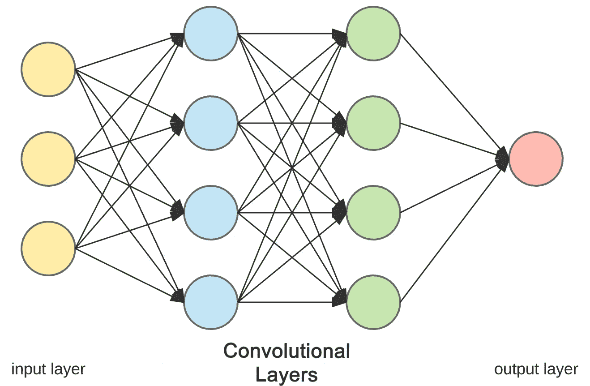

卷积层架构

CNN 也可以有其他非卷积层，但 CNN 的基础是卷积层。

好吧，那么这些卷积层有什么作用呢？

## 卷积层

就像任何其他层一样，卷积层接收输入，以某种方式转换输入，然后将转换后的输入输出到下一层。卷积层的输入称为输入信道，输出称为输出信道。

对于卷积层，发生的变换被称为*卷积运算*。这是深度学习社区使用的术语。数学上，卷积层执行的卷积运算实际上称为[互相关](https://en.wikipedia.org/wiki/Cross-correlation)。

我们一会儿将回到这个操作。现在，让我们看看卷积层在做什么的高级概念。

# 滤波器和卷积运算

如前所述，卷积神经网络能够检测图像中的模式。

对于每个卷积层，我们需要指定该层应该具有的*滤波器*的数量。这些过滤器实际上是用来检测模式的。

## 模式

让我们详细解释一下，当我们说过滤器能够*检测模式*时，我们指的是什么。想想在任何一张图片中可能会发生多少事情。多个边缘、形状、纹理、对象等。这些就是我们所说的*模式*。

*   优势
*   形状
*   口感
*   曲线
*   目标
*   颜色；色彩；色调

过滤器可以检测图像中的一种模式是边缘，因此这种过滤器被称为*边缘检测器*。

除了边缘，一些过滤器可以检测角落。有些人可能会发现圆圈。其他，正方形。这些简单的几何滤波器，就是我们在卷积神经网络开始时看到的。

网络越深入，过滤器变得越复杂。在后面的图层中，我们的过滤器可能能够检测特定的对象，如眼睛、耳朵、头发或皮毛、羽毛、鳞片和喙，而不是边缘和简单的形状。

在更深的层中，过滤器能够检测更复杂的物体，如完整的狗、猫、蜥蜴和鸟。

为了理解这些卷积层及其各自的滤波器究竟发生了什么，我们来看一个例子。

## 过滤器(模式检测器)

假设我们有一个卷积神经网络，它正在接受手写数字的图像(就像来自 MNIST 数据集)，我们的网络正在将它们分类为各自的类别，即图像是否属于`1`、`2`、`3`等。

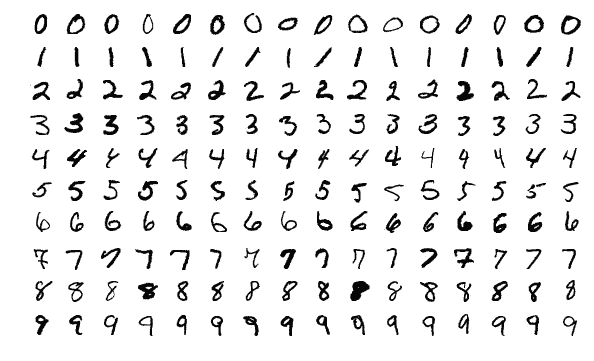

现在让我们假设模型中的第一个隐藏层是卷积层。如前所述，在向模型添加卷积层时，我们还必须指定我们希望该层有多少个滤波器。

从技术上讲，过滤器可以被看作一个相对较小的矩阵([张量](https://en.wikipedia.org/wiki/Tensor))，我们决定这个矩阵的行数和列数，矩阵中的值用随机数初始化。

对于我们的第一个卷积层，我们将指定该层包含一个大小为`3 x 3`的过滤器

## 卷积层

让我们来看一个卷积运算的动画示例:

这个动画展示了没有数字的卷积过程。底部有一个蓝色的输入通道。底部阴影所示的卷积滤波器滑过输入通道，绿色输出通道:

*   蓝色(底部)—输入通道
*   阴影(蓝色之上)——`3 x 3`卷积滤波器
*   绿色(顶部)—输出通道

对于蓝色输入通道上的每个位置，`3 x 3`滤镜会进行计算，将蓝色输入通道的阴影部分映射到绿色输出通道的相应阴影部分。

这个卷积层接收一个输入通道，过滤器将滑过输入本身的每个`3 x 3`像素集，直到它滑过整个图像的每个`3 x 3`像素块。

## 卷积运算

这种滑动被称为*卷积*，所以实际上，我们应该说该滤波器将对来自输入的每个`3 x 3`像素块进行*卷积*。

蓝色输入通道是来自 MNIST 数据集的影像的矩阵表示。该矩阵中的值是图像中的单个像素。这些图像是灰度图像，因此我们只有一个输入通道。

*   灰度图像只有一个颜色通道
*   RGB 图像有三个颜色通道

该输入将被传递到卷积层。

正如刚才所讨论的，我们已经指定第一个卷积层只有一个滤波器，这个滤波器将对来自输入的每个`3 x 3`像素块进行卷积。当过滤器到达其第一个`3 x 3`像素块时，过滤器本身与来自输入的`3 x 3`像素块的点积将被计算并存储。这将发生在滤波器卷积的每个`3 x 3`像素块上。

例如，我们将滤镜与第一个`3 x 3`像素块进行点积，然后将结果存储在输出通道中。然后，滤波器滑动到下一个`3 x 3`块，计算点积，并将值存储为输出通道中的下一个像素。

在该滤波器对整个输入进行卷积后，我们将得到输入的新表示，它现在存储在输出通道中。这个输出通道被称为[特征图](https://computersciencewiki.org/index.php/Feature_maps_(Activation_maps))。

这个绿色输出通道成为下一层的输入通道，然后我们刚刚经历的滤波器处理过程将发生在下一层滤波器的新输出通道上。

这只是一个非常简单的例子，但是如前所述，我们可以把这些过滤器想象成模式检测器。

# 输入和输出通道

假设来自 MNIST 数据集的 7 的灰度图像(单色通道)是我们的输入:

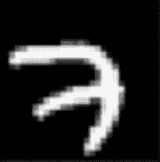

让我们假设我们的第一个卷积层有四个`3 x 3`滤波器，这些滤波器填充了您在下面看到的值。这些值可以通过让`-1` s 对应黑色、`1` s 对应白色、`0` s 对应灰色来直观地表示。

具有 4 个滤波器的卷积层

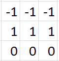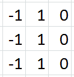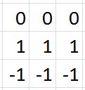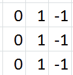

如果我们分别用这四个滤波器卷积我们的原始图像 7，每个滤波器的输出如下:

卷积层的输出信道

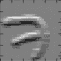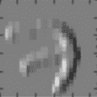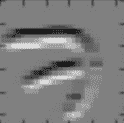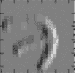

我们可以看到，所有四个滤波器都在检测边缘。在输出通道中，最亮的像素可以解释为滤波器检测到的像素。在第一幅图中，我们可以看到检测到七个像素的顶部水平边缘，这由最亮的像素(白色)表示。

第二个检测左侧垂直边缘，同样以最亮的像素显示。第三个检测底部水平边缘，第四个检测右侧垂直边缘。

这些过滤器，正如我们之前提到的，实际上是基本的，只是检测边缘。这些是我们可能在卷积神经网络的开端看到的过滤器。更复杂的过滤器将位于网络的更深处，并逐渐能够检测更复杂的模式，如下图所示:

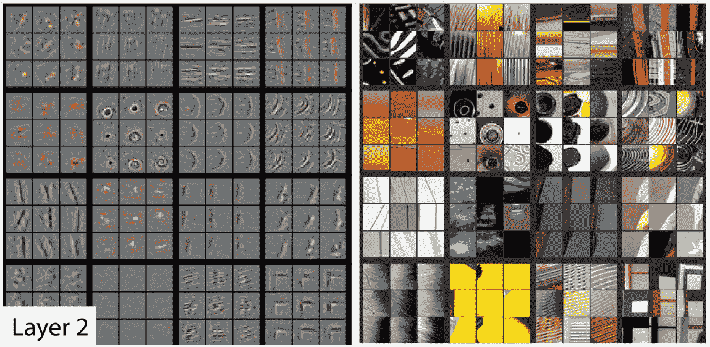

我们可以看到左边的过滤器从右边的图像中检测到的形状。我们可以看到圆形、曲线和拐角。随着我们进一步深入我们的图层，过滤器能够检测更复杂的模式，如狗脸或鸟腿，如下所示:

令人惊奇的是，模式检测器是由网络自动导出的。过滤器值以随机值开始，并且随着网络在训练期间的学习而改变。过滤器的模式检测能力自动显现。

过去，计算机视觉专家会手动开发过滤器(模式检测器)。一个例子是边缘检测器 [Sobel 滤波器](https://en.wikipedia.org/wiki/Sobel_operator)。但是，通过深度学习，我们可以使用神经网络自动学习这些过滤器！

# 包扎

我们现在应该对卷积神经网络有一个基本的了解，这些网络是如何由本身包含滤波器的卷积层组成的。

***感谢您的配合🙌，请随意在下面写下任何建议…如果你觉得你获得了一些知识，别忘了鼓掌👏***