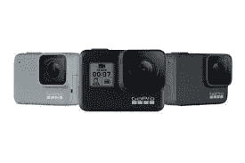

# 具有位置分析的深度学习

> 原文：<https://medium.com/analytics-vidhya/deep-learning-with-location-analysis-99a450dc1bb5?source=collection_archive---------14----------------------->

印度尼西亚 Puncak

> 从影像中提取道路要素

在印度尼西亚茂物附近的高原地区 Puncak，公路事故是常有的事。死亡和受伤的受害者有时无法避免，但数量可以减少。Puncak 的交通事故有几个原因:困倦的司机、车辆、道路和环境因素。作为回应，政府采取了一些行动，在发生交通事故的记录区域，即所谓的黑点区域，建立道路特征:街道标志、交通和路灯。

街道标志、交通灯和路灯图形

通过把上述项目放在上面，相信会减少交通事故的数量。因此，维护道路特征对防止其他交通事故或在新的交通黑点地区安装新的道路特征至关重要。过去，数据收集是通过从移动地图系统(MMS)捕获地理参考照片和视频，并逐个标记道路特征来完成的。当然，手动完成这个过程需要很多时间。

手动标记道路要素

创建能够检测新对象的模型的能力是深度学习的基础之一。这种自动化过程将为政府或地方实体面临的许多用例提供低成本的解决方案，因为手动执行将消耗大量时间和高成本。在本文中，我将展示 Puncak 中的一个用例，介绍如何通过深度学习自动化标记道路要素的过程，并通过地理空间仪表板获得洞察力。

用于检测道路特征的深度学习

**概要:
1 .数据采集
2。数据建模
3。模型测试
4。地理空间仪表板
5。结论**

***数据采集*** 我在开车去 Puncak 的路上，通过将 GoPro 7 放在汽车仪表盘上，用 go pro 7 拍摄地理参考视频。GoPro7 最酷的一点是能够在录制视频的同时提取遥测数据(陀螺仪和 GPS)以供进一步分析。如果你想知道如何提取遥测数据，你可以阅读我以前的文章:[提取 GoPro GPS 和其他遥测数据](/@lucaselbert/extracting-gopro-gps-and-other-telemetry-data-fadf97ed1834)。

GoPro 7

相机仪表板

***数据建模*** 在我之前的一篇文章:[道路裂缝检测—通用工作流程](/@lucaselbert/road-crack-detection-general-workflow-4a31d7fde0e7)中，我写了如何建立深度学习模型检测道路孔洞的通用流程。要了解更多细节，你可以阅读这篇文章。在这种情况下，我们为列车&测试数据将检测到的对象转换为道路特征，并将其分为三项:路标、交通灯和路灯。

测试数据

训练数据

***模型测试*** 测试从上一步得到的模型到测试数据集。模型的结果如下图所示。

测试模型后，保存所有检测到的图像，精度大于 0.5 加上适当的 CSV 文件。这个 CSV 文件将用于获取地理参考图像，因为当我们将视频分割为图像时，地理参考信息将会消失。

> **第一列**:索引
> **第二列**:图像名称
> **第三列**:时间(秒)
> **第四列**:检测对象(1 =路灯，2 =路牌，3 =红绿灯)

1 =路灯，2 =街道标志，3 =交通灯(第 4 列)

检测到的图像

***地理空间仪表板*** 在我们获得地理参考图像后，我们会将位置及其图像绘制到地理空间仪表板。你可以通过这个:[演示](https://tiger.maps.arcgis.com/apps/opsdashboard/index.html#/35ffb44eb73f4d319ed1ca31460c6244)进入仪表盘。

黑点区域的概率显示为蓝色的热图。如果概率较高，颜色会变红。

黑点地区的热图

检测到的对象被可视化为三个项目，其中红色大头针描述路灯，蓝色大头针定义街道标志，黄色大头针表示交通灯。通过应用深度学习来捕捉位置。可以通过单击大头针来访问带有对象检测的图像。

为了进一步分析，从 GoPro 7 遥测数据中提取陀螺仪和速度数据。我们可以在录制视频时看到汽车速度剖面。为了分析路况，我们可以使用陀螺仪数据，其中红色图表在 y 轴上显示速度，黑色图表在 x 轴上表示速度。

陀螺仪和速度数据

接下来，我们将连接同一层上的所有数据。令人惊讶的是，道路特征是否会减少交通事故的假设似乎是正确的。在道路事故概率较高的蜿蜒区域，车速相对较高，没有减速路牌，也没有红绿灯。因此，应该考虑在那里放置更多的街道标志和交通灯，以提高驾驶员的意识。此外，我们需要检查道路状况，因为陀螺仪显示在该地区有一个尖峰。

***结论*** 通过应用深度学习和 GIS 技术，我们可以进行位置分析，同时通过自动化道路特征的数据收集和提取遥测数据来节省时间和金钱。

该解决方案作为 Esri 印度尼西亚 Geo-AI 团队的解决方案库发布。