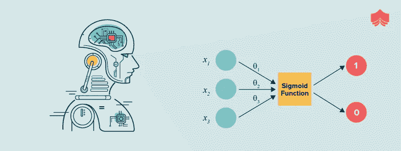

# 使用 Python 进行深度学习

> 原文：<https://medium.com/analytics-vidhya/deep-learning-with-python-f7b1898d16e0?source=collection_archive---------8----------------------->


*   介绍
*   导入库
*   探索数据集
*   处理数据集
*   逻辑回归
*   无 sklearn 的逻辑回归
*   使用 sklearn 的逻辑回归
*   层神经网络

# 介绍

*   机器学习是指机器学习使用大数据集，而不是硬编码的规则。
*   机器学习允许计算机自己学习。这种类型的学习利用了现代计算机的计算能力，可以轻松处理大型数据集。

## 监督和非监督学习

*   监督学习包括使用带有输入和预期输出的标记数据集。
    当你使用监督学习训练一个人工智能时，你给它一个输入，并说出预期输出。如果人工智能产生的输出是错误的，它会调整自己的计算。这个过程在数据集上重复进行，直到最小化人工智能的错误率。监督学习的一个例子是决定天气的人工智能。学习使用历史数据预测天气。这些训练数据包括输入(压力、湿度、风速)和输出(温度)。
*   **无监督学习是使用没有特定结构的数据集进行机器学习的任务。**
    如果你使用无监督学习训练一个 AI，你就允许人工智能对数据进行逻辑分类。无监督学习的一个例子是为电子商务网站进行预测的人工智能的例子。因为在这里，它不是使用带标签的输入和输出数据集学习的。相反，它将使用输入数据创建自己的分类。它会告诉你哪些类型的用户可以购买更多不同的产品。

## 什么是深度学习，它是如何工作的？

*   **深度学习:**
    深度学习是基于具有表示学习的人工神经网络的更广泛的机器学习方法家族的一部分。学习可以是有监督的、半监督的或无监督的。
*   **为什么深度学习:**
    当数据量增加时，机器学习技术在性能方面是不够的，深度学习给出了更好的性能，如准确性。


*   深度学习是一种机器学习方法。它允许我们训练人工智能用给定的数据集预测输出。监督学习和非监督学习都可以用来训练人工智能。

我将尝试用深度学习的机票价格预测的例子来解释工作的逻辑。在这个例子中，我们将使用监督学习。在估算机票价格时，假设我们想要使用以下条目(现在我们考虑单程航班):

*   出发机场
*   到达机场
*   启程日期
*   公司

## 神经网络

人工神经网络是由神经元组成的，就像人脑一样。所有神经元都是相互连接的，并影响输出。


神经元分为三个不同的层:

*   入口层
*   隐藏层
*   输出层

**输入层**接收输入数据。在我们的例子中，入口层有四个神经元:出发机场、到达机场、出发日期和公司。输入层将条目发送到第一个隐藏层。

**隐藏层**在我们的输入中执行数学计算。创建人工神经网络的挑战之一是决定隐藏层的数量以及每层的神经元数量。

深度学习中的“深”是指有不止一个隐藏层。

**输出层**返回输出数据。在我们的例子中，它给出了一个价格估计。

**那么价格预测是怎么做的呢？** 这就是深度学习开始的地方。
神经元之间的每一个链接都与一个“权重”相关联。这个权重决定了输入值的重要性。第一个权重是随机设置的。估算机票价格时，最重要的(权重)因素之一是出发日期。因此，出发日期的神经元连接会有很大的权重。


每个神经元都有激活功能。激活函数的目标之一是“标准化”神经元的输出。

数据集通过神经网络的所有层后，将作为输出层的结果返回。

# 导入库

我们需要做的第一件事是导入库。

# 探索数据集


# 处理数据集

现在我们需要修改图像。数据集包含不同大小的 RGB 彩色图像。首先，我们应该调整所有图像的大小，其次将图像转换为灰度。根据不同的目的，你可以选择 RGB 图像。但是灰度只有一个维度，而 RGB 图像有 3 个维度，帮助你避免错误的分类和复杂性。

```
humans: (527, 50, 50) horses: (500, 50, 50)
train_dataset: (1027, 50, 50) train_values: (1027, 1)
```

缩小列车组图像，我们有:

(527，50，50)大小的人和马数组— -> total train_set (1027，50，50)相应标签值的标签数组，标签 1 表示人，标签 0 表示马— -> total train_set_label (1027，1)

```
humans: (128, 50, 50) horses: (128, 50, 50)
test_dataset: (256, 50, 50) test_values: (256, 1)
```

缩小列车组图像，我们有:

(128，50，50)大小的人和马数组— -> total train_set (256，50，50)相应标签值的标签数组，标签 1 表示人，标签 0 表示马— -> total train_set_label (256，1)

我们组合图像字符串和标签，并展平“x”:

```
images: (1283, 2500) labels: (1283, 1)
```

下一步，我们需要确定训练和测试的数据量。您可以修改 test_size，看看它如何影响准确性。我们分开吧！

```
Train Number:  1090
Test Number:  193
```

然后我们需要对所有矩阵进行转置。这里引用的[的目的是:“在 python 中，通常情况下，转置将使您能够以给定的形式获得数据，这可能会使使用任何框架或算法变得更容易”](https://www.quora.com/Why-do-we-transpose-matrices-in-machine-learning)

```
x train:  (2500, 1090)
x test:  (2500, 193)
y train:  (1, 1090)
y test:  (1, 193)
```

# 无 sklearn 的逻辑回归



“逻辑回归”使用以下函数:

*   initialize_weights_and_bias:具有权重和偏差的初始值，这些值将在以后更新
*   sigmoid:将输出限制在 0 和 1 之间的激活功能
*   forward_backward propagation:用于计算成本函数(误差)和梯度下降(学习使误差最小化的适当权重和偏差值)
*   更新:更新学习参数“w”和“b ”,以找到它们的最佳值，从而进行更好的训练
*   预测:使用 x_test 作为正向传播的输入


整体情况:

```
Cost after iteration 0: 6.768180
Cost after iteration 50: 0.671340
Cost after iteration 100: 0.639800
Cost after iteration 150: 0.614246
Cost after iteration 200: 0.593256
Cost after iteration 250: 0.575786
Cost after iteration 300: 0.561055
Cost after iteration 350: 0.548477
Cost after iteration 400: 0.537610
Cost after iteration 450: 0.528121
Cost after iteration 500: 0.519752
Cost after iteration 550: 0.512306
Cost after iteration 600: 0.505626
Cost after iteration 650: 0.499588
Cost after iteration 700: 0.494095
Cost after iteration 750: 0.489066
Cost after iteration 800: 0.484436
Cost after iteration 850: 0.480152
Cost after iteration 900: 0.476169
Cost after iteration 950: 0.472450
Cost after iteration 1000: 0.468965
Cost after iteration 1050: 0.465686
Cost after iteration 1100: 0.462591
Cost after iteration 1150: 0.459662
Cost after iteration 1200: 0.456880
Cost after iteration 1250: 0.454232
Cost after iteration 1300: 0.451705
Cost after iteration 1350: 0.449289
Cost after iteration 1400: 0.446974
Cost after iteration 1450: 0.444750
Cost after iteration 1500: 0.442612
Cost after iteration 1550: 0.440551
Cost after iteration 1600: 0.438563
Cost after iteration 1650: 0.436641
Cost after iteration 1700: 0.434782
Cost after iteration 1750: 0.432980
Cost after iteration 1800: 0.431232
Cost after iteration 1850: 0.429535
Cost after iteration 1900: 0.427885
Cost after iteration 1950: 0.426279
```


```
train accuracy: % 81.56
test accuracy: % 79.79
```

# 使用 sklearn 的逻辑回归

我们将使用 sklearn 获得逻辑回归的精度值。另外，我会用 LR w/o sklearn 比较两种不同线性模型的精度:

*   逻辑回归
*   感知器

```
Fitting 10 folds for each of 40 candidates, totalling 400 fits[Parallel(n_jobs=-1)]: Using backend LokyBackend with 4 concurrent workers.
[Parallel(n_jobs=-1)]: Done  34 tasks      | elapsed:    1.8s
[Parallel(n_jobs=-1)]: Done 276 tasks      | elapsed:   18.5saccuracy:  0.8972477064220185[Parallel(n_jobs=-1)]: Done 400 out of 400 | elapsed:   29.9s finished
```


# 层神经网络

```
2500
```

## 正向传播

*   正向传播几乎与逻辑回归相同。
*   唯一的区别是我们使用了双曲正切函数，所有的过程都做了两次。
*   还有，NumPy 有 tanh 功能。所以我们不需要实现它。


## 损失函数和成本函数

*   损失和成本函数与逻辑回归相同
*   交叉熵函数

## 反向传播

*   如你所知，反向传播意味着导数。

## 更新参数

## 利用学习参数权重和偏差进行预测

## 创建模型

```
Cost after iteration 0: 0.335414
Cost after iteration 100: 0.255368
Cost after iteration 200: 0.209950
Cost after iteration 300: 0.143634
Cost after iteration 400: 0.093869
Cost after iteration 500: 0.121465
Cost after iteration 600: 0.063286
Cost after iteration 700: 0.285031
Cost after iteration 800: 0.207963
Cost after iteration 900: 0.121714
Cost after iteration 1000: 0.181648
Cost after iteration 1100: 0.272117
Cost after iteration 1200: 0.036312
Cost after iteration 1300: 0.114032
Cost after iteration 1400: 0.126075
Cost after iteration 1500: 0.115258
Cost after iteration 1600: 0.082057
Cost after iteration 1700: 0.238091
Cost after iteration 1800: 0.082687
Cost after iteration 1900: 0.050634
Cost after iteration 2000: 0.031490
Cost after iteration 2100: 0.248394
Cost after iteration 2200: 0.053589
Cost after iteration 2300: 0.104359
Cost after iteration 2400: 0.045909
```


```
train accuracy: 85.59633027522936 %
test accuracy: 79.27461139896373 %
```

## l 层神经网络


```
Using TensorFlow backend.
```

```
Epoch 1/100
872/872 [==============================] - 0s 379us/step - loss: 0.6913 - accuracy: 0.5161
Epoch 2/100
872/872 [==============================] - 0s 57us/step - loss: 0.6836 - accuracy: 0.5149
...
...
...
Epoch 98/100
872/872 [==============================] - 0s 56us/step - loss: 0.0448 - accuracy: 0.9920
Epoch 99/100
872/872 [==============================] - 0s 57us/step - loss: 0.0430 - accuracy: 0.9931
Epoch 100/100
872/872 [==============================] - 0s 56us/step - loss: 0.0547 - accuracy: 0.9839
218/218 [==============================] - 0s 127us/step
```

```
Accuracies:  [0.87155962 0.90366971 0.90825689 0.8440367  0.84862387]
```

```
Accuracy mean:  0.8752293586730957
```

这是一篇又长又详细的文章。我希望你已经理解了以上所有的主题。你可以按底部的双手按钮激励我，也可以在评论里说我哪里缺失，帮助我以后写出更好的文章。
我的 Kaggle 工作的链接，从那里我得到了这篇文章:[我的 Kaggle 笔记本](https://www.kaggle.com/codeblogger/deep-learning-with-python)