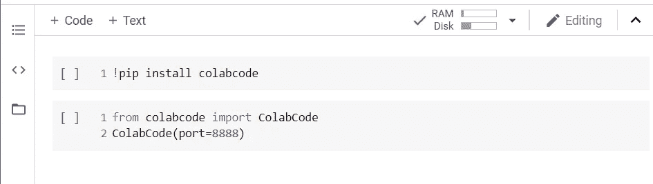
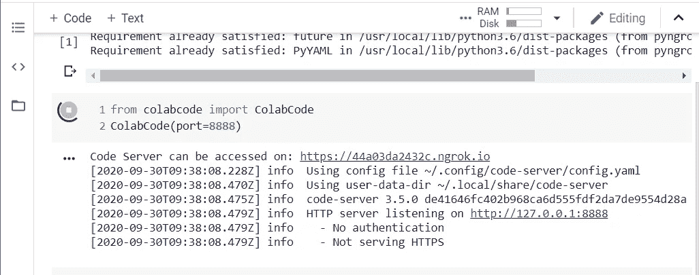
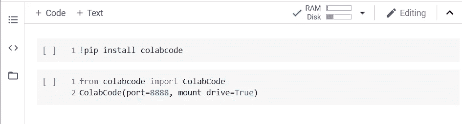
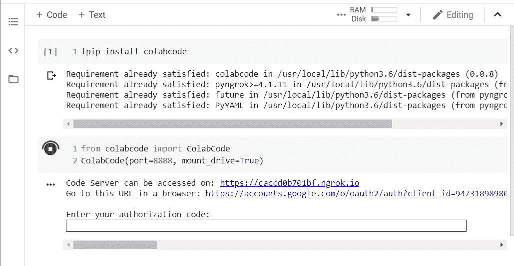
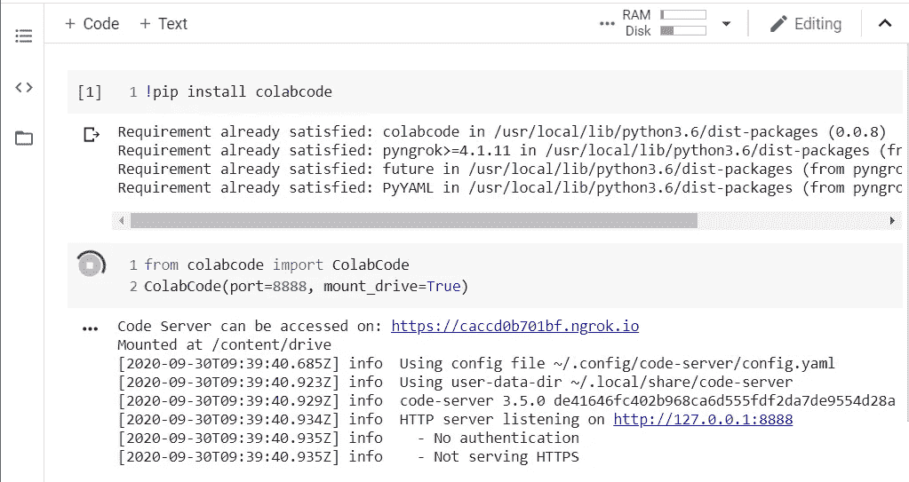
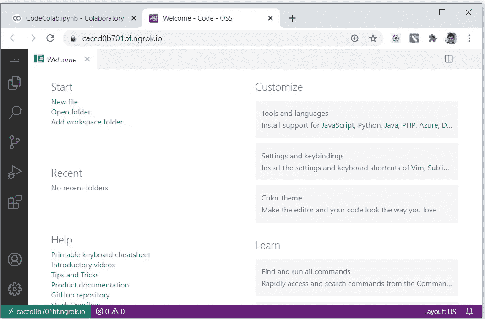

# 没有昂贵硬件的深度学习使用 Google Colab 并将其与 GitHub 连接

> 原文：<https://medium.com/analytics-vidhya/deep-learning-without-expensive-hardware-using-google-colab-and-connecting-it-with-github-73bb866b65d7?source=collection_archive---------16----------------------->

为深度学习组装依赖关系就像排列拼图一样

说到深度学习，我们首先想到的是昂贵的 GPU。但是，在我们刚刚开始学习的时候，买得起一台昂贵的机器对我们大多数人来说是不可行的。深度学习确实需要大量的计算能力，以便创建甚至是基本的分类模型。我们可以选择购买一台配有合适 GPU 的游戏笔记本电脑来学习和构建我们的模型，但即使在购买了 GPU 之后，为任何深度学习任务设置我们的环境也是一件麻烦的事情。虽然这不是火箭科学，但它确实很耗时，并且如果依赖性没有很好地记录，需要大量的点击和尝试方法。这一时间非常宝贵，我们不能浪费它来为我们的机器设置所有独立的依赖项，只是为了构建一个简单的解决方案。那么，为了在本地获得像样的机器并训练我们所有的模型，而没有安排这些零碎的依赖关系的麻烦，我们能做些什么呢？

Kaggle 和 Colab 为我们提供了高于平均水平的硬件，我们可以用它们在有限的时间内训练我们的模型。唯一的缺点是只能访问 Jupyter 笔记本或者一个脚本。但是当我们构建一个完整的解决方案或一些 API 时，问题就出现了。所以最近我遇到了一个 GitHub repo，它可以帮助我们解决这个问题，并为我们提供一个基于这些平台构建的完整的 [IDE](https://en.wikipedia.org/wiki/Integrated_development_environment) 。这个项目叫做[**colabc code**](https://github.com/abhishekkrthakur/colabcode)，它可以帮助我们解决许多问题。让我们来看看如何实现这一目标:

# 安装和运行 ColabCode

使用 pip 安装软件相当容易。 *pip 安装代码*。如果您仍然在寻找安装最新版本的代码，您可以使用下面这段代码直接从 GitHub repo 进行安装:*pip install git+*[*https://github.com/abhishekkrthakur/colabcode.git*](https://github.com/abhishekkrthakur/colabcode.git)*。*

一旦你安装了 *Colabcode* ，你可以很容易地在一行中调用它并如图 1.0 所示运行。

1.0:安装和启动 vs 代码服务器

在 *ColabCode* 类中，port 参数表示用于后端服务的机器端口。请注意，某些端口号被保留给机器使用，如端口 80 或 8080，所以请确保您不要使用一些冲突的端口号，否则它们将导致 *vs 代码*服务器的不可预测的行为。

一旦你运行这个单元，它将以*https://<random-token>. ngrok . io*的形式返回一个服务器访问代码，这个代码可以用来获得一个完整的文本服务器，这个文本服务器可以作为一个 IDE 使用，如图 2.3 所示。

1.1:服务器启动并返回服务器链接

# 连接 Google Drive

现在，如果你已经关注 Google colab 一段时间了，你可能会知道我们可以灵活地在后端附加我们的 google drive，以便重用生成的文件。将 Colabcode 附加到 drive 也完全类似。我们所要做的就是将 *mount_drive* 参数作为 *True* 传递，然后您只需要授权 *Colabcode* 。

2.0:用 vs 代码服务器安装驱动器

2.1:授权 Google drive

2.2:授权 vs 代码服务器上线运行。

一旦授权完成并且连接了后端，它将再次生成 *ngrok* URL，如图 2.2 所示。您可以使用生成的链接来使用完全成熟的 *vs 代码*服务器。

2.3 vs 代码在生成的地址上运行

# 将 vs 代码连接到 GitHub

既然我们已经设置了训练代码的所有基础，我们能做的就是简单地使用 *vs code* 的内置功能来连接。连接相当简单，但是如果您能熟练地从终端使用 Github，那么我建议您使用内置功能，而不是使用终端。虽然终端是一个非常可行的选择，但是它很快就会变得令人沮丧，因为您可能会面临终端响应的延迟。如果您仍然想使用终端，您可以使用键盘上的 ctrl+`按钮调用终端。`是键盘上 escape 键下面的小键。这是一个有点慢的连接，但请有耐心，直到你得到那里的迷你终端。这似乎是一个恼人的问题，但看看我们得到的最终产品，它很容易被忽略。我准备了一个小的分步 gif(如图 3.0 所示)来指导你完成大部分过程。但是如果你仍然面临任何问题，请考虑在评论区评论和分享你的问题。

3.0:用 GitHub 开发 Vs 代码

今天就开始在你常用的 Jupyter 笔记本上使用 *vs code* ,然后感谢我更快的工作流程😉。你可以查看[这个 colab 笔记本](https://colab.research.google.com/drive/1JGDddTCYvDDcO1-np__Nc6TbYpIBNtxx?usp=sharing)的代码。