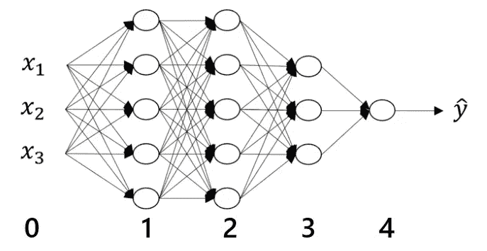
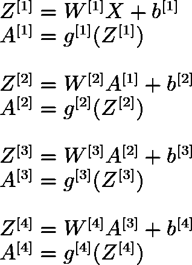
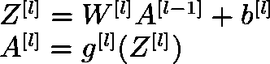
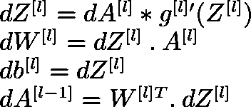
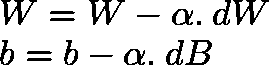
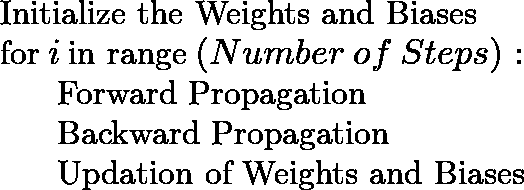

# 深度神经网络

> 原文：<https://medium.com/analytics-vidhya/deep-neural-networks-d14051d7c4f3?source=collection_archive---------1----------------------->

深度神经网络是具有许多隐藏层的神经网络。这种网络中隐藏层的数量可以从 3 层到几百层不等。我们脑海中出现的第一个问题是， ***为什么我们需要这么多隐藏层？*** 这个问题的答案是，我们希望神经网络学习复杂的功能。深度网络的前几层学习简单的特征，随着我们深入，网络学习各种复杂的特征，这些特征通常是人类无法理解的。在这篇文章中，让我们来理解深度神经网络在数学环境中的工作。下面给出的是一个四层深度神经网络，我会考虑进一步的解释。

# 表现

层数 **L = 4** 。它是隐藏层和输出层的总和。这里我们有三个隐藏层和一个输出层。

一层 ***l*** 中神经元的数量用**n[*l****表示。*我们这里有，

*   **n[0] = 3** 即训练数据集中的特征数量
*   **n[1] = 4**
*   **n[2] = 4**
*   **n[3] = 3**
*   **n[4] = 1** 即输出类的数量。

在一个特定的网络中，没有选择层数和神经元数的通用规则。这是经验性的。如果你是自己建立一个网络，那么你应该从选择一个单独的层开始，然后不断增加。您可以评估测试数据集的结果，并根据您的用例选择最佳配置。

与层 ***l*** 相关联的权重和偏差可以分别由矩阵 **W[ *l* ]** 和 **b[ *l* ]** 来表示。矩阵尺寸**W[*l*]=****(n[*l*)，n[*l*-1】)**。这是因为特定神经元的所有传入权重都排列在一行中，并且该层中存在的每个神经元都有一行。由于每个神经元都有与之相关联的偏差，矩阵**b[*l*]=(n[*l*]，1)** 的维数。因此我们有，

*   **W[1] = (4，3)** 矩阵和 **b[1] = (4，1)** 矩阵
*   **W[2] = (4，4)** 矩阵和 **b[2] = (4，1)** 矩阵
*   **W[3] = (3，4)** 矩阵和 **b[3] = (3，1)** 矩阵
*   **W[4] = (1，3)** 矩阵和 **b[4] = (1，1)** 矩阵

层*的激活由矩阵 **A[ *l* ]** 表示。神经元的激活可以被认为是该神经元的输出。因此，形状取决于我们提供给神经元的数据。一般来说，矩阵**A[*l*]=(n[*l*]，m)** 的维数，其中 m 是训练样本的个数。*

*有人可能会问， ***为什么不用几层，放很多神经元进去呢？*** 这个问题的答案在于电路理论。电路理论指出，我们需要在浅网络中有指数数量的神经元，以达到与深网络相似的精度。因此，为了避免指数因素并允许网络学习复杂的函数，我们更喜欢由许多隐藏层组成的深层网络。*

# *方法学*

*神经网络的权重和偏差是随机初始化的，它们输出随机噪声。为了使网络能够输出正确的值，我们*训练*网络。训练网络无非是使 ***损失*** *(预测值之间的差异，即网络的输出和原始输出)*最小化，使得预测值与原始值相似。整个训练过程有三个步骤，我在下面讨论过。*

# *正向传播*

*我们根据输入计算输出的步骤称为前向传播。它使用输入矩阵 **X** ，权重矩阵 **W[1]** ， **W[2]** ， **…** ， **W[L]** ，偏差矩阵 **b[1]** ， **b[2]** ， **…** ，**b[L】**。数学上，我们使用以下公式计算输出:*

**

*在上面的等式中，函数***【g(x)】***代表激活函数。每一层可以使用不同的激活函数，因此，它们由 ***g[i](x)*** 表示。如果你观察，上面的等式遵循一个趋势，可以用下面的等式来概括:*

**

# *反向传播*

*我们更新网络的权重和偏差的方式被称为反向传播。在这个阶段，神经网络“**借助梯度下降学习“**”。梯度下降在前向传播中利用计算的导数来最小化损失，然后更新网络的权重和偏差。反向传播的每一步都可以用下面的等式来概括:*

**

*在上面的等式中， **"*"** 表示逐元素乘法，而"."表示矩阵乘法。上述方程的推导需要对微积分有详细的理解，不在本帖讨论范围之内。你可以参考我以前的帖子来清楚地了解它们是如何得出的。此外，我建议懂微积分的读者自己推导方程，以便更好地理解这个主题。*

* [## 浅层神经网络

### 在这篇文章中，我解释了什么是数学背景下的浅层神经网络。

towardsdatascience.com](https://towardsdatascience.com/shallow-neural-networks-23594aa97a5) 

# 权重和偏差的更新

现在我们有了权重和偏差的导数，我们使用以下等式更新它们:

在上面的等式中，***α***被称为学习率。这是决定权重更新多少的因素。高学习率表示在单个训练步骤中权重和偏差值的变化太大，反之亦然。找到理想的学习速率是至关重要的，以便有效地训练网络。

> 我敦促读者自己一次算出矩阵的维数。它将发展对各种矩阵如何用数学表示以及数据如何从输入流向输出的具体理解。

# 总结一下

你可能听说过训练一个神经网络需要大量的时间和资源。我上面解释的部分都是在一个步骤中完成的。此外，我只考虑了三个输入特性。在现实生活中，会有数百个功能和许多隐藏层，并且需要成百上千个步骤才能实现出色的性能。所有这些都在很大程度上增加了所需的计算资源和时间。整个过程可以用下面的内容来描述:

*

# *参考*

1.  *[维基百科—学习率](https://en.wikipedia.org/wiki/Learning_rate)*
2.  *[Coursera —深度学习课程 1](https://www.coursera.org/learn/neural-networks-deep-learning?specialization=deep-learning)*

**我要感谢阅读这个故事的读者。如果你有任何问题或疑问，请在下面的评论区提问。我将非常乐意回答这些问题并帮助你。如果你喜欢这个故事，请关注我，以便在我发布新故事时获得定期更新。我欢迎任何能改进我的故事的建议。**