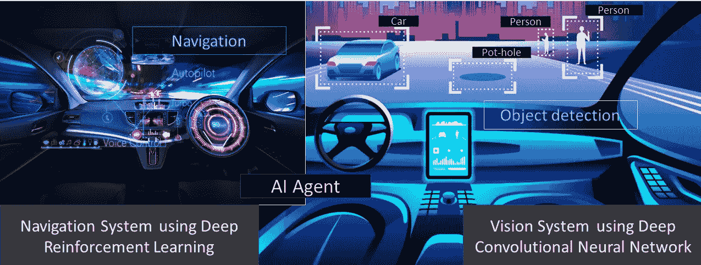

# 人工智能主体的深度强化学习和目标检测

> 原文：<https://medium.com/analytics-vidhya/deep-reinforcement-learning-and-object-detection-for-artificial-intelligent-agent-c68dd14618a0?source=collection_archive---------3----------------------->

在这篇文章中，我们将简要地看看深度强化学习和计算机视觉如何使一个 AI 智能体变得智能。研究人员可以赋予 AI 像我们一样思考、决策、预测和采取行动的能力。问题是，我们可以做些什么来将人类的基本知识带给人工智能代理或机器人？