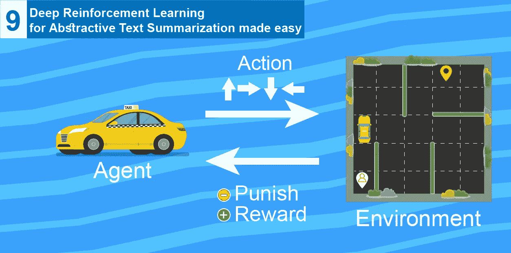
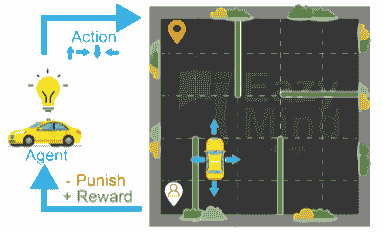
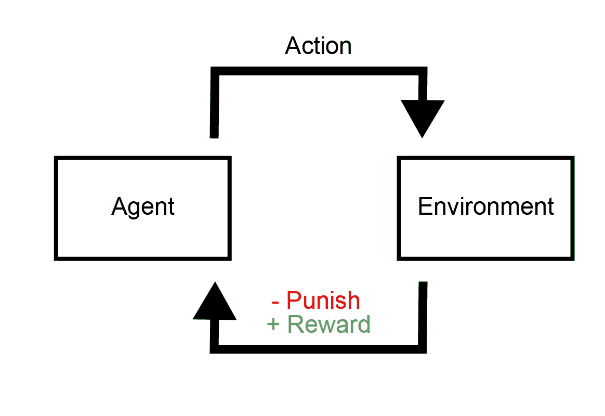

# 简化抽象文本摘要的深度强化学习(DeepRL )(教程 9)

> 原文：<https://medium.com/analytics-vidhya/deep-reinforcement-learning-deeprl-for-abstractive-text-summarization-made-easy-tutorial-9-c6914999c76c?source=collection_archive---------5----------------------->

本教程是**使抽象文本摘要变得简单的教程系列**的第 9 部分，在这个系列中，我们将介绍使用深度学习解决抽象文本摘要任务的最新方法，这个系列的所有代码都可以在这里找到[，这些代码是用 tensorflow 编写的，可以在 google colab 上无缝运行，数据可以在 google drive 上找到，所以不需要在本地下载数据，也不需要在本地运行代码，因为所有这些都可以在 google colab](https://github.com/theamrzaki/text_summurization_abstractive_methods) 上免费完成[。](https://hackernoon.com/begin-your-deep-learning-project-for-free-free-gpu-processing-free-storage-free-easy-upload-b4dba18abebc)

今天，我们讨论一种研究人员最近达成的新方法，它结合了**强化学习**和**深度学习**的能力来处理多项任务，就像我们的 NLP 抽象文本**摘要**任务，所以今天我们将讨论

1.  什么是**强化学习** & **什么时候用？**
2.  为什么要和**深度学习一起用？**

> 本教程基于[萨特维克·坎萨尔](https://www.learndatasci.com/tutorials/reinforcement-q-learning-scratch-python-openai-gym/)和[布伦丹·马丁](https://www.learndatasci.com/tutorials/reinforcement-q-learning-scratch-python-openai-gym/#)的博客，其中详细介绍了强化学习以及如何实施。
> 
> 我们还使用了这个[惊人的回购](https://github.com/yaserkl/RLSeq2Seq)和[他们的论文](https://arxiv.org/abs/1805.09461)作者 [yaserkl](https://github.com/yaserkl) 使用 tensorflow 构建了一个库来实现深度 RL 的多种方法，我们还需要感谢 [Paulus 等人](https://arxiv.org/abs/1705.04304)对深度 RL 技术的清晰解释。
> 
> 我要感谢他们所有人的出色工作。

# 0.关于系列

这是一系列的教程，将帮助你建立一个抽象的文本摘要模型，在多种方法中使用张量流，我们称之为抽象，因为我们教神经网络生成单词，而不仅仅是复制单词

到目前为止我们已经讨论过了(这个系列的代码可以在[这里](https://github.com/theamrzaki/text_summurization_abstractive_methods)找到)

0.[深度学习免费生态系统概述](https://hackernoon.com/begin-your-deep-learning-project-for-free-free-gpu-processing-free-storage-free-easy-upload-b4dba18abebc)(如何使用 google colab 和 google drive)

1.  [文本摘要任务的概述以及用于该任务的不同技术](https://hackernoon.com/text-summarizer-using-deep-learning-made-easy-490880df6cd)
2.  [我们的任务](https://hackernoon.com/abstractive-text-summarization-tutorial-2-text-representation-made-very-easy-ef4511a1a46)(本教程的先决条件)所使用的数据及其表示方式
3.  [什么是 seq2seq 文本摘要，为什么](https://hackernoon.com/tutorial-3-what-is-seq2seq-for-text-summarization-and-why-68ebaa644db0)
4.  [多层双向 LSTM/GRU](/@theamrzaki/multilayer-bidirectional-lstm-gru-for-text-summarization-made-easy-tutorial-4-a63db108b44f)
5.  [光束搜索&注意文本摘要](/@theamrzaki/beam-search-attention-for-text-summarization-made-easy-tutorial-5-3b7186df7086)
6.  [建立 seq2seq 模型关注&波束搜索](https://hackernoon.com/build-an-abstractive-text-summarizer-in-94-lines-of-tensorflow-tutorial-6-f0e1b4d88b55)
7.  [用于文本摘要的抽象&提取方法的组合](http://bit.ly/2EhcRIZ)
8.  [使用深度课程学习来教导 seq2seq 模型从它们的错误中学习](http://bit.ly/2My51kX)

用于文本摘要的免费人工智能即服务

实际上，你可以通过 [eazymind](http://bit.ly/2VxhPqU) 尝试使用这些系列的输出生成你自己的摘要，看看你最终能够构建什么。您还可以通过简单的 API 调用和一个 [python 包](http://bit.ly/2Ef5XnS)来调用它，这样就可以轻松地将文本摘要集成到您的应用程序中，而无需设置 tensorflow 环境。你可以[免费注册](http://bit.ly/2VxhPqU)，免费享受使用这个 API 的乐趣。

我们开始吧！

# 1.什么是**强化学习** & **什么时候用？**

强化学习是机器学习的一个分支，能够学习无法用方程表达的复杂任务，这意味着你通过与学习环境互动来学习。

想想一辆**自动驾驶**汽车，任务(**环境)**不能容易地用一个等式来表达，以容易地集成到机器学习算法中，然而强化学习算法将能够与环境交互，以便它能够从中学习。

强化学习建立在

*   尝试多种**行动**以解决问题的想法
*   以及学习当某些**动作**有助于解决问题时(*算法会因为这个动作*而收到一个 ***奖励*** *)而当它们没有帮助时(*算法会因为这个动作*而收到一个* ***惩罚***

> *因此，我们可以说，为了让**强化学习**学会解决任务(**环境**)，它必须积极地参与到任务(**环境**)中，尝试不同的**动作**，看看它是得到奖励还是得到*惩罚，记住这些动作，并在此基础上继续努力，直到达到最终目标**

*在这个动画中，我们看到了一个简单的例子，它是在[Satwik Kansal](https://www.learndatasci.com/tutorials/reinforcement-q-learning-scratch-python-openai-gym/#)[blog](https://www.learndatasci.com/tutorials/reinforcement-q-learning-scratch-python-openai-gym/)的例子基础上构建的，它显示了一辆汽车试图将一个人送到目的地。*

**

*动画概念来自 [Satwik Kansal](https://www.learndatasci.com/tutorials/reinforcement-q-learning-scratch-python-openai-gym/#) [博客](https://www.learndatasci.com/tutorials/reinforcement-q-learning-scratch-python-openai-gym/)，图形来自 [freepik](https://freepik.com) ，动画由 [eazymind](http://bit.ly/2VxhPqU) 团队制作*

*正如我们所看到的，汽车在每次迭代中尝试不同的路径，接受奖励或惩罚，存储这些结果，并在此基础上继续发展，直到最终达到最终目标。*

*强化学习中有一些术语会很有帮助，所以我们称之为*

*   *汽车:**代理***
*   *车库:**环境***
*   *决定走(左、右、上、下):**动作***

*所以上面的动画可以简化为*

**

*通过关注 [Satwik Kansal](https://www.learndatasci.com/tutorials/reinforcement-q-learning-scratch-python-openai-gym/#) [博客](https://www.learndatasci.com/tutorials/reinforcement-q-learning-scratch-python-openai-gym/)，你可以深入了解如何使用 python 构建自己的强化学习算法。*

# *2-为什么要和**深度学习一起用？***

*最近出现了一种将强化学习方法与深度学习相结合的方法，称为 DeepRL，这实际上是非常有益和成功的，特别是在 **NLP** 领域。*

*这是因为深度网络尝试和优化 NLP 任务的方式实际上不同于我们倾向于测量输出准确性的方式(正如 yaserkl 在他们的论文中提到的)*

*他们已经指出*

*   *我们倾向于使用最大似然估计( **MLE** )度量来优化我们深度架构中的损失函数，就像我们需要使用深度学习来解决的任何其他任务一样。*
*   *然而，我们倾向于使用其他指标，特别是针对 **NLP** 的指标，如 **BLEU** 和 **ROUGE** 指标来评估输出*

> ***BLEU 和 ROUGE** 指标在 **NLP** 任务中用于测量参考和输出单词之间的重叠度(即:在测试参考和输出句子中都出现的单词数)，随着重叠度的增加，分数也会增加。*

*因此，我们实际上是在尝试优化一些不同于我们倾向于用来评估输出的东西，这造成了培训和测试指标之间的不一致性。*

*然而，深度学习方法无法优化 **BLEU** 和 **ROUGE** 指标的真正原因直接归结于这样一个事实，即 ***深度架构只能优化可微分的指标，而 BLEU 和 ROUGE 是不可微分的指标*** ，它们不能简单地用一个等式来表示以集成到深度架构中。*

*强化学习的使用来了，使用它的能力来优化不可微的指标，一个深度架构可以使用它来优化 BLEU 和 ROUGE 算法。*

*在下一个教程中，如果上帝愿意，我们将详细介绍一种用于解决抽象文本摘要任务的强化学习算法，它被称为**策略梯度**，这种实现的代码可以在[这里](https://github.com/theamrzaki/text_summurization_abstractive_methods)找到。*

> *我真心希望这篇教程能让你对深度学习和强化学习有所了解，并希望在接下来的教程中见到你。*