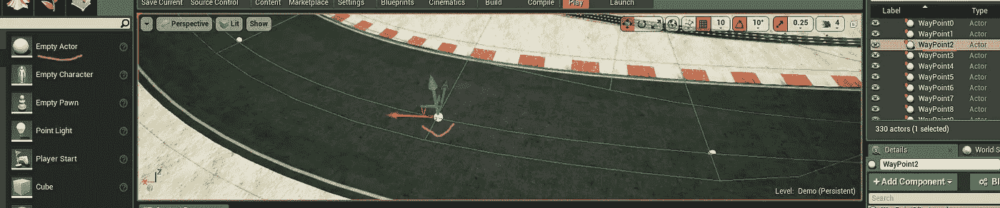

# 在 AirSim 模拟器中使用 OpenAI Gym、Keras-RL 进行自动驾驶车辆的深度强化学习

> 原文：<https://medium.com/analytics-vidhya/deep-reinforcement-learning-for-autonomous-vehicles-with-openai-gym-keras-rl-in-airsim-simulator-196b51f148e4?source=collection_archive---------9----------------------->

如今自动驾驶汽车变得流行，深度强化学习也是如此。这篇文章可以为你提供一个想法，为你开始学习和试验自动驾驶汽车的深度强化学习建立环境。此外，我将在模拟器中分享我用 [Deep-Q-Network](https://arxiv.org/pdf/1312.5602.pdf) 为自动驾驶汽车在赛道上做的第一次实验。

首先，我会给你看一个我实验的简短演示。的。gif 图片突出显示了训练一辆汽车在右转时自动驾驶大约 12 小时的步骤。在这个实验中，用于训练导航模型的输入是从安装在汽车头部前方的摄像机记录的图像帧。右下角的窗口显示了该摄像机的实时记录。


8 倍的快动作剪辑突出了 12 个小时的训练 DQN 模型的汽车在右转。观察值是来自汽车前视摄像头的 RGB 帧。

有 3 个主要组件用于进行此实验。那些是 AirSim(运行在虚幻引擎上)，Open AI Gym，和 Keras-RL。如果你还不熟悉的话，我在这里简单介绍一下这些主要组件。

*   [AirSim](https://github.com/microsoft/AirSim/) 是在游戏引擎上运行的附加软件，比如[虚幻引擎](http://www.unrealengine.com) (UE)或 Unity。AirSim 是作为人工智能研究的平台开发的，用于试验深度学习、计算机视觉和自动驾驶汽车的强化学习算法。
*   [OpenAI Gym](https://gym.openai.com/) 提供了一系列游戏环境来玩和评估强化学习算法。
*   [Keras-RL](https://github.com/keras-rl/keras-rl) 是基于 [Keras](https://keras.io/) 实现不同深度强化学习算法的 python 库。Keras-RL 与 OpenAI 健身房合作。这意味着评估和试验不同的算法很容易。


系统图显示了组件及其连接。

对于我的环境设置，我使用虚幻引擎作为游戏引擎，地图[赛道](https://www.unrealengine.com/marketplace/en-US/product/race-course-pack)提供了几条赛道。同时，AirSim 提供汽车和控制汽车的 API(例如:转向、加速)，以及记录图像的 API。所以我可以说我已经有了一个可以玩的汽车驾驶游戏。

下一步是将这个驾驶游戏连接到深度强化学习工具 Keras-RL 和 OpenAI Gym。为此，首先创建了一个定制的 OpenAI 健身房环境，这个定制的健身房环境调用必要的 AirSim APIs，如控制汽车或捕捉图像。由于 Keras-RL 与健身房环境一起工作，这意味着现在 Keras-RL 算法可以通过定制的健身房环境与游戏进行交互。

将上述组件结合在一起后，我已经有了一个框架来实验自动驾驶汽车的深度强化学习。在运行第一个实验之前，我需要做的一件额外的事情是在地图中定位赛道，因为在训练和评估期间将需要赛道的位置来确定赛车的奖励，但这种信息在地图中还不可用。为了确定赛道的位置，我手动在道路中心放置了一些路点，并测量了道路的宽度。有了路点列表，我就能大致找到路线。请注意，一旦游戏开始，这些路点将不可见。



路点放在赛道的中央。计算奖励需要汽车的位置和 2 个最近的路点。

关于设置环境的更多细节，您可以查看我的 Github [库](https://github.com/hoangtranngoc/AirSim-RL)。

将系统的所有部分连接在一起后，我做了一个快速实验，以确保系统正常工作。在这个实验中，我使用了一个简单的动作空间和一个简单的奖励函数。调整 DQN 的超参数还不是重点，因为我们总是可以在以后改进训练。我想看看汽车代理商如何学习右转，所以我选择了你在视频中看到的那段赛道。

现在来说一下对于汽车代理商的学习过程。我把观察、行动和奖励的一般思想放到下图的强化学习的一般学习过程中。想象一下，DQN 模型是汽车的大脑。从目前的观察来看，对于每一步，DQN 模型都会告诉汽车应该采取哪种转向动作(这可以称为“策略”)。然后计算该行为的回报。此时，在汽车代理再次观察之前，DQN 用当前{观察、动作、奖励}更新知识。循环(一集)运行，直到汽车脱离轨道或到达目的地。在这篇文章的最后，我将重点介绍定制健身房环境的 step()函数的实现，您可以在代码中看到这个学习过程。


实验的强化学习过程。注意，在我们的例子中，状态是局部的，因为没有观察到整个环境。在每个时间步 t，对于当前观察(St)，汽车代理采取 DQN 模型推荐的行动(At)。然后对该行为的奖励(Rt)进行评估。如果插曲还没有完成，DQN 用{St，At，和 Rt}更新知识。然后观察到新的状态，依此类推。

在我的实验中，我选择了简单的标准来奖励每一步中的汽车代理，这鼓励汽车代理靠近赛道的中心行驶。当汽车代理商靠近中心时，奖励更多的分数，当远离中心时，奖励更少的分数。对于汽车代理的动作空间，基于 0.3 的最大转向值使用 7 个离散动作。这意味着在每一步中，汽车代理可以选择这些值中的一个从左向右驾驶{-0.3，-0.2，-0.1，0.0，0.1，0.2，0.3}。采取更好的行动(或改进政策)是汽车代理商在培训期间学到的，以最大化长期回报。

接下来，我将展示在培训 DQN 期间记录的 2 个常用指标(每集平均奖励和每集平均行动值(Q))。和往常一样，每集平均奖励比较嘈杂，而每集平均 Q 值比较稳定。


左边的图显示每集的平均奖励，而右边的图显示平均行动值(Q)。这两个指标的长期趋势都在增长。

如果你想了解更多细节，请查看我的 GitHub 回购。我会在未来添加更多的东西。[https://github.com/hoangtranngoc/AirSim-RL](https://github.com/hoangtranngoc/AirSim-RL)

我希望你了解我如何设置环境/框架来做自动驾驶汽车深度强化学习的第一个实验的基本想法。那么你开始你的第一个实验就没那么复杂了。随着游戏引擎，像虚幻引擎(这个[博客](https://www.unrealengine.com/en-US/blog/a-first-look-at-unreal-engine-5))，使游戏中的场景更接近现实，模拟器中的实验和现实生活之间的差距将会缩短。

我在这里发布了一个视频，总结了培训过程，并添加了一些信息。(提示:观看时启用声音；))

动作由离散转向值区分，从-0.3(左)到 0.3(右)(最大范围为[-1，1])。汽车的油门固定在 0.75(最大是 1)。奖励是根据到赛道中心的距离给出的。

如果你正在这个领域寻找挑战，看看 [AWS Deep Racer](https://aws.amazon.com/deepracer/) 。

感谢您的阅读！

(如果您想深入了解代码，这里是附录)

我只是强调定制的 OpenAI Gym 环境是如何用 __init()__ 和 step()函数实现的。如前所述，您可以将 step()函数中的 what 映射到上述学习过程中。

```
class AirSimCarEnv(gym.Env):
  def __init__(self):
    ..
    # ***image_shape*** is (height, width, channels).
    self.observation_space = 
      spaces.Box(low=0, high=255, shape=**image_shape**, dtype=np.uint8)
    #I wrote a ***CarAgent*** classto control car with AirSim APIs
    self.**car_agent** = ***CarAgent***() def step(self, action):
    # ***action*** *is produced by DQN*, action is discrete
    self.**car_agent**.move(***action***)
    # compute ***reward*** based on state(position) of the car
    car_state= self.**car_agent**.getCarState()
    **reward** = self._compute_reward(car_state)
    # check if the episode is done
    car_controls = self.**car_agent**.getCarControls()
    **done** = self._isDone(car_state, car_controls, reward)
    # log info
    info = {}
    # ***observation*** is RGB image from car's camera
    **observation** = self.**car_agent**.observe() return **observation, reward, done, info** ...
```