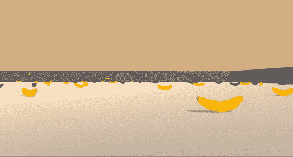

# 基于 DQN 的导航深度强化学习

> 原文：<https://medium.com/analytics-vidhya/deep-reinforcement-learning-for-navigation-c120113f7b89?source=collection_archive---------8----------------------->

在本帖中，我们将训练一个代理使用[深度 Q 网络](https://storage.googleapis.com/deepmind-media/dqn/DQNNaturePaper.pdf)在一个正方形区域中导航以收集物体

代理人通过避开蓝色香蕉来收集黄色香蕉。

要实现这个算法，你需要对深度强化学习有很好的了解。你可以…