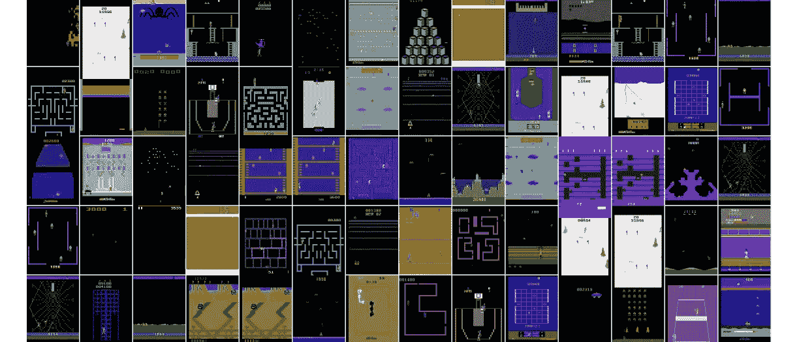
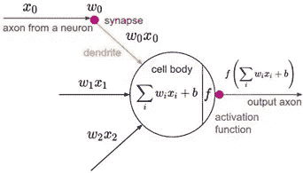
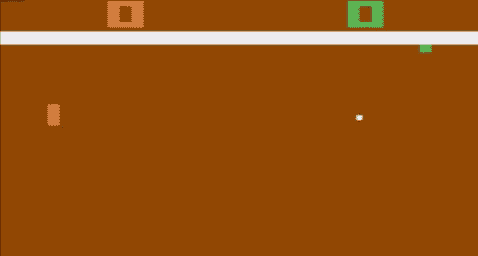
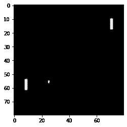
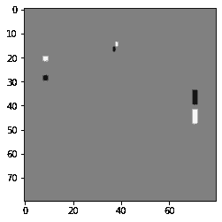
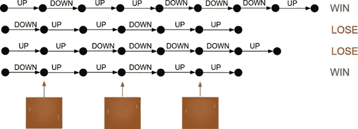
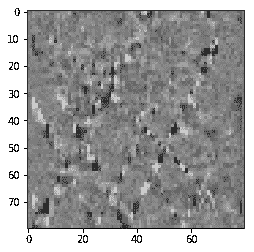
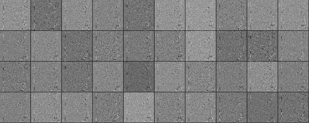

# 乒乓球深度强化学习

> 原文：<https://medium.com/analytics-vidhya/deep-reinforcement-learning-for-ping-pong-e11106465443?source=collection_archive---------10----------------------->

⭐️In 在这篇文章中，你将实现一个人工智能程序(或者代理，如果你想更花哨的话！😆)可以从任何环境(在我们的例子中是游戏)中学习，根据它的行为分别给予奖励或惩罚。如果你是强化学习的初学者，这篇文章非常适合你，因为它试图涵盖强化学习的本质。代码和一个挑战链接已被附在下面，所以跟随直到结束..！

对于我们的例子，我们使用一个游戏，它是(你猜对了！)**乒乓**，作为我们的环境，由 [OpenAI 的](https://gym.openai.com/envs/Pong-v0/)库提供，供我们 AI 使用。人工智能只能控制其中一个滑块(在我们的例子中是绿色滑块)。所有的程序都是用 Python 做的。

⭐️By 结束这篇文章，你就会明白:

1.  理论上是神经网络。
2.  强化学习算法之一**策略梯度**。
3.  为 Pong 构建一个可以打败所谓“计算机”的 AI(硬编码跟随球，速度限制为滑块的最大速度)。

代码和思想都深受安德烈·卡帕西(伟大的家伙！)博客帖子，我已经添加了一些我的部分，使它更具视觉效果

# 先决条件和背景阅读

要继续学习，您需要了解以下内容:

👉基本 Python(用于实现)

👉反向传播的工作原理(虽然不是强制的，但更可取)

太好了！让我们开始吧。

# 首先，什么是神经网络？

简而言之，神经网络是通用函数逼近器，可以逼近任何函数，这意味着如果我们知道很少的输入及其相应的输出，我们可以将输入(比如 X)映射到输出 Y，并近似地找到函数是什么(即对于给定的 X，给出 Y 的最接近的函数是什么)。因此，如果给神经网络任何新的输入 X，它可以使用这个近似函数预测新的输出 Y。对于我们的例子，我们必须找到一个函数，它接受图像的输入，即像素强度值的 2D 阵列，并输出滑块向上移动的正确概率。

> 你可能会想为什么呢？为什么不下来？按照惯例，我们将输出视为滑块上升的概率，如果您希望输出为滑块下降的概率，您可以这样训练它，即(如果滑块需要下降，则给出输出的高概率值，如果滑块需要上升，则给出低概率值)，您可以通过更改相应的奖励函数来实现这一点。

数学上，

单个神经元(变量)执行一个简单的任务:接收来自先前神经元的输入，评估它们的加权和，并对和应用 sigmoid 函数。一层是这些神经元的组合，这些神经元从上一层获取输入，并将输出传递给下一层。知道了正确的权重(为了找到加权平均值),这些神经元就能以惊人的精度逼近任何函数。

神经网络的正确权重可以通过下式确定:

1)梯度下降

2)遗传算法

> 这只是对神经网络如何工作的一个非常简短和高层次的回顾，你可以查看下面参考资料中的链接，以获得更有趣和更深入的视频解释。

今天最常用的算法是梯度下降法，它还有很多类型，你可以在网上找到很多关于它的内容。但是重点是我们将使用梯度下降。

# 我们神经网络的结构:

我们训练的神经网络包含三层输入层、一个隐藏层和一个输出层。

> 我们将使用一个简单的神经网络，它有一个输入层、一个隐藏层和一个输出层。它将输入作为当前状态的图像，并输出向上或向下移动滑块的概率，并根据最高概率做出决定。这就是所谓的政策网络，在我们的案例中证明了它的强大。

# 训练时间！！！

首先让我们来看看我们正在试图解决的游戏。OpenAI 的健身房库所做的是让游戏准备好，并在当前状态下捕捉游戏的截图，然后等待我们的调用以从该状态恢复游戏。

橙色滑块(左)是由我们控制的，绿色滑块(右)是我们的老敌人的电脑(只是跟踪球，有速度限制)

最初，随机权重被分配给网络(即，它是一个随机函数)。这个游戏在当前状态下的截图将被作为输入给我们的神经网络。(PS:截图/图像数组尺寸为 210 x 160 x 3)。该输入图像首先被预处理为灰度图像(这将我们的操作减少了 1/3)，滑块和球的颜色变为白色，背景变为黑色，然后将其裁剪为 80 x 80 大小的中间部分。

这是预处理 80x80 黑白图像后的效果

但是正如你可能已经注意到的，一个单独的帧并没有显示很多关于球和滑块运动的信息，正如在上面的图像中，你不能实际上说出球或滑块在下一帧会去哪里。为了解决这个问题，我们将两个连续帧的差异传递给模型，如下所示:

黑色部分显示球/滑块从移动到**的位置，白色部分显示球/滑块从**到**的位置**

该阵列是扁平的(即，阵列的行一个接一个地堆叠以形成向量)，因此我们从大小为 28×28 的输入阵列获得 784 维的输入向量，并形成网络的输入层。隐藏层我们将保持为 200 个神经元，最终输出层由一个神经元组成，这给出了向上移动滑块的概率。

最初，权重将是随机的，因此模型将输出随机概率，在该游戏中，将传递给它的所有帧都向上移动，假设它给出 70%的帧向上移动的概率。

因此，我们向上移动。现在的问题是，我们不知道在那个时候提升是不是正确的选择。对于所有即将到来的下一帧，我们假设模型给出的概率是正确的，直到它最终失去或获得一个分数(当一个玩家比其他玩家早得 20 分时，他赢得了一场比赛)。如果最后，它在游戏中得分，我们可以说它从开始以来采取的所有行动都是正确的，我们鼓励它在未来采取这样的行动，给予它积极的奖励，并根据梯度下降积极地更新权重。如果它输了一场比赛，我们可以说它在这种情况下做的大多数移动都是错误的，我们通过给它一个负奖励并通过梯度下降负更新权重来阻止未来的这种移动。

我们对成千上万个游戏反复应用上述过程，探索不同的可能场景，直到最终，模型学习要使用的正确权重，以便每次最大化奖励，从而在每个游戏之后改进模型，并更接近给定游戏的理想权重(或达到如上所述的理想函数)。

> 我们刚刚使用的算法被称为*。它是强化学习的重要算法之一。*

*而现在你玩 AI 机器人的 pong 准备接管世界了。！*

***注意:**在这里，我们只考虑一个输出(即，向上滑动的概率和向下滑动的概率),这是效率较低的，因为在任何时刻，神经网络要么向上，要么向下，但它不会停留在一个地方，即使它是正确的事情*

# *让我们收集一些见解…*

*我们将面临的第一个问题是确定超参数，如学习率、衰减率、隐含层的神经元数目等。我们没有足够的计算能力来尝试和运行(试错)不同超参数值的模型。我们当前的模型使用了与 Andrej 的博客相似的值。*

# *所以最后…*

*在近 10，000 场比赛后，我们的神经网络/人工智能代理/游戏机器人显示出相当好的结果，几乎每场比赛都击败了硬编码的人工智能(红色)。*

*如果我们想知道模型实际上在学习什么，我们可以看看第一层中机器人的最终权重，将其展平并可视化。*

****

*这实际上是我们的网络了解到的*

*黑白轨迹是由于球的运动造成的，因为我们在两个连续的帧之间取了一个差值。正如我们所看到的，模型学习了游戏的一些常见状态，并相应地做出反应，以在每场游戏中最大化奖励。*

*但是等等，这还没有结束，看看下面的挑战，让事情变得更🔥。上述实现的代码可从以下网址获得:*

* [## mstale 007/Pong _ Reinforcememnt _ Learning _ Policy _ Gradients

### 我试图解释最简单的强化学习算法策略梯度来制作一个游戏机器人…

github.com](https://github.com/mstale007/Pong_Reinforcememnt_Learning_Policy_Gradients)* 

# *有用的链接:*

1.  *神经网络如何工作(英尺。3 蓝色 1 棕色)*

*2.Andrej Karpathy 关于强化学习的博文:*

* [## 深度强化学习:来自像素的 Pong

### 这是一篇姗姗来迟的关于强化学习(RL)的博文。RL 很辣！你可能已经注意到计算机现在可以…

karpathy.github.io](http://karpathy.github.io/2016/05/31/rl/)* 

# *下一个挑战:*

*试着做一个乒乓球游戏，游戏中的两个玩家都由你的机器人控制，这样你的机器人会互相竞争，并试图比对方更好。如果提供足够的资源，这种具有更复杂神经网络的机器人如果应用于其他游戏，可以在任何游戏中击败任何人。*

***注意:** Gym 不提供两个玩家控制，因此您可以从这里获取游戏代码:*

* [## llSourcell/pong _ 神经网络 _ 直播

### 概述这是@Sirajology 的 Youtube 直播会话的代码。在这个现场会议中，我建立了乒乓游戏…

github.com](https://github.com/llSourcell/pong_neural_network_live) 

你需要自定义你自己的游戏，使它可以被两个玩家控制。

**挑战赛**参考代码:

 [## mstale 007/Two _ Playered _ Pong _ Using _ Policy _ Gradients

### 我做了一个双人乒乓游戏，游戏中的两个玩家都是独立的神经网络，他们不断地尝试…

github.com](https://github.com/mstale007/Two_Playered_Pong_Using_Policy_Gradients) 

查看我的 GitHub 库，找到很多这样的 ML 代码:

 [## mstale007 -概述

### 受到启发，用数学和物理的美来揭示现实的本质🌌有抱负的科技企业家* ML…

github.com](https://github.com/mstale007?tab=repositories) 

黑客快乐！！！*