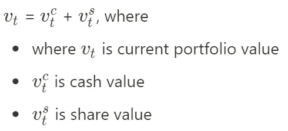

# 算法交易中的深度强化学习(下)

> 原文：<https://medium.com/analytics-vidhya/deep-reinforcement-learning-in-algorithmic-trading-part-ii-b78db754961c?source=collection_archive---------3----------------------->

所以现在我们将讨论[论文](https://arxiv.org/pdf/2004.06627.pdf)，**深度强化学习在算法交易中的应用。**

首先，在交易活动中会发生什么？

*   我们所有的交易活动都汇集在一个投资组合中，在任何时间 t，我们的投资组合都有一些现金和股票。买卖操作简单来说就是现金和股票的交换。所以主要的…