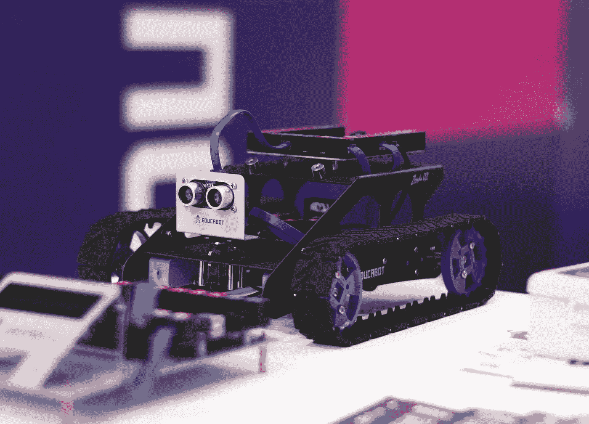

# 使用 OpenAIGym 的深度强化学习

> 原文：<https://medium.com/analytics-vidhya/deep-reinforcement-learning-using-openaigym-10d1a66c3e2?source=collection_archive---------31----------------------->



玛丽亚·卡斯泰利在 [Unsplash](https://unsplash.com?utm_source=medium&utm_medium=referral) 上的照片

## 简介:

深度强化学习是当今深度学习的另一个热门话题，在机器人、自动驾驶汽车、游戏等领域都有有趣的用例。它涉及用强化学习架构封装深度神经网络，使软件定义的代理能够在虚拟环境中学习可能的最佳动作，以达到他们的目标。在本文中，我们将用简单的语言来介绍关于强化学习的一般信息，并通过由[openaigam](https://gym.openai.com/docs/)提供的用例使用深度学习机制来实现它们。那么，让我们开始吧…

## 强化学习:

[强化学习](https://en.wikipedia.org/wiki/Reinforcement_learning)与其他学习问题不同，它与状态-行动对一起工作，这意味着在环境中的每个状态下采取行动，目标是获得最大回报。


图 1:学习问题的分类

可以使用代理、环境、状态、行动和奖励的概念来进一步理解，所有这些我们将在下面看到。

代理人:采取行动的人。例如:对于自动驾驶汽车，汽车是代理

**环境:**这是一个代理存在和操作的世界

**动作:**是代理可以做出的所有可能动作的集合。一个**动作**几乎是不言自明的，但是应该注意的是，代理通常从一个离散的、可能的动作列表中进行选择。

**状态:**当一个指定的动作被触发时，环境发回的一个观察。因此它被代理相应地感知。

奖励:它是一种反馈措施，根据状态期间采取的行动来表示其成功或失败。


图 2:强化学习的关键概念

上图显示了它是如何循环工作的，当代理采取行动时，它会从环境中获得奖励和新的状态。**举个例子:**在一辆**自动驾驶汽车中**当智能体左转时，如果没有左转可用，那么环境向我们提供了一个观察(状态)显示它以负奖励崩溃，反之亦然。

在训练中，我们运行它的多个插曲，并收集所有的奖励，直到它完成，在我们的 ex 中，直到汽车被撞毁或停在目的地。我们对收到的奖励进行汇总，并通过在每个时间步采取最佳行动来尝试最大化奖励。


图 3:总报酬

**贴现因子:****贴现因子**乘以代理人发现的未来奖励，以抑制这些奖励对代理人行动选择的影响。换句话说，我们对最新的奖励感兴趣。这由希腊字母γ*γ表示。*

现在我们的奖励函数变成了，


图 4:最终奖励函数

我们已经看到了所有必要的术语，一般程序，现在让我们把重点放在算法上。

**Q-Function:** 指在当前状态下采取行动的代理人的长期收益。


图 5: Q 函数

它捕捉了处于状态 s 的代理通过采取行动 a 可以获得的预期总未来报酬。因此，Q 值较高意味着我们正在采取最佳行动，并且我们倾向于在这个过程中最大化 Q 值，这被称为**策略**。


图 6:政策

这是一种策略，它通过取 Q 值的最大值来帮助我们找到最佳行动。采用这种策略，我们在每个状态下以期望的 Q 值采取正确的行动。该方法也被称为**值学习方法。但是这种方法也有一些缺点，**

**缺点:**

1.  只能为动作空间离散且较小的场景建模
2.  不能用于连续动作空间
3.  策略是确定性的，因为它是通过最大化 Q 函数来实现的，并且不能处理随机策略。

为了克服这些缺点，我们有了这个**策略学习方法**

**政策学习方法:**

这种方法针对当前状态下可以采取的每个动作建立概率分布。我们可以从分布中抽取一个对应于某个动作的值。


图 7:政策梯度

如上图所示，我们可以训练一个神经网络将动作空间输出到一个概率分布中。通过这样做，我们不仅可以将该模型用于分类动作，还可以用于连续动作空间。例如，在自动驾驶汽车中，不仅仅是左转或右转，我们还可以根据我们在前视图中看到的物体来模拟我们应该移动的速度。


图 8:连续动作空间

因此，在这种情况下，我们已经参数化了高斯的均值和方差，从中可以对动作进行采样。现在，它不再是绝对的，就像从左到右，而是一个连续的框架，它应该向右或向左移动多少。

**训练方法:**

1.  设置代理
2.  在模拟中将策略作为情节运行多次，直到终止
3.  记录情节中的所有状态、提供的动作和奖励
4.  降低获得低回报的行动的概率
5.  增加导致高回报的行动的可能性。

我们将看到一个由 OpenAIGym 提供的游戏模拟的示例实现，名为 [Space Invaders。](https://gym.openai.com/envs/SpaceInvaders-ram-v0/)

首先，我们必须调用 OpenAIGym 提供的模拟环境。在我们的例子中是太空入侵者游戏。

```
env = gym.make("SpaceInvaders-v0")
env.seed(1)
```

创建一个 ConvNet 模型，以捕捉游戏模拟环境在每个状态期间的变化，这些变化可以与收到的行动和奖励相关联。

```
Conv2D=functools.partial(tf.keras.layers.Conv2D,padding="same",activation="relu")
Flatten=tf.keras.layers.Flatten
Dense=tf.keras.layers.Densedef create_spaceInvaders_model():
model = tf.keras.models.Sequential([Conv2D(filters=16,kernel_size=7,strides=4),Conv2D(filters=32,kernel_size=5,strides=2),Conv2D(filters=48,kernel_size=3,strides=2),
Flatten(),
Dense(units=64,activation="relu"),
Dense(n_actions,activation=None)])
return model
SpaceInvadersModel=create_spaceInvaders_model()
```

一旦我们准备好模型，我们必须运行剧集，记录状态、行动和奖励，并每次都用这些数据更新模型。因此，在所有连续的情节中，模型根据收到的奖励更新在该州采取行动的概率。通过这种方式，模型得到训练，并最终开始做得更好。

下面的代码显示了根据提供的观察在每一步采取的操作。这是一个随机选择的概率测量。

```
def choose_action(model, observation):observation = np.expand_dims(observation, axis=0)logits = model.predict(observation)prob_weights = tf.nn.softmax(logits).numpy()action = np.random.choice(n_actions, size=1, p=prob_weights.flatten())[0] return action
```

为了表示的目的，我们已经用很少的迭代训练了模型，我们还可以根据我们的 GPU 设置训练多达 10，000 次或更多的迭代，以获得更好的结果。


图 9:运行统计

**输出:**

我们可以看到代理现在正在环境中运行，我们可以调整我们的训练参数和迭代次数以获得更多分数。获得完整的代码[在这里。](https://github.com/SeshadriSenthamaraikannan/ReinforcementLearning/blob/master/RL_OpenAIGym.ipynb)


图 10:输出

**参考:**

麻省理工学院深度强化学习文档