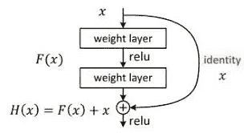

# 用于图像识别的深度残差学习

> 原文：<https://medium.com/analytics-vidhya/deep-residual-learning-for-image-recognition-resnet-94a9c71334c9?source=collection_archive---------3----------------------->

在本节中，我们将尝试了解与 ResNet 体系结构相关的一些基本概念，为什么它比 VGG 网络更好，它的工作原理及其优点。

在试图理解什么是 ResNet 之前，首先让我们简单地理解什么是 T2 VGG 网以及为什么 ResNet 比 VGG 网好。

# 了解 VGG 网(VGG 16):

VGG 代表牛津大学的**视觉几何小组**。它是由 Simonyan 和 Zisserman 为 **ILSVRC (Image Net 大规模视觉识别挑战赛)** 2014 比赛开发的。它由 16 个权重层(13 个卷积层和 3 个全连接层)组成，仅具有 3×3 特征检测器或滤波器。这种架构的误差百分比约为 7%。

VGG 网络背后的概念类似于 Alexnet，这意味着，随着网络深度的增加，我们将增加特征图或卷积的数量。简而言之，随着我们深入网络，特征地图的数量增加，因此网络变得更广。总共有**1.38 亿个**参数。

VGG 16 网络架构如下所示:

VGG-16 网络架构

来源:[https://www . researchgate . net/Fig/Fig-A1-The-standard-VGG-16-network-architecture-as-proposed-in-32-Note-The-only _ Fig 3 _ 322512435](https://www.researchgate.net/figure/Fig-A1-The-standard-VGG-16-network-architecture-as-proposed-in-32-Note-that-only_fig3_322512435)

# VGG 网络的问题以及我们为什么需要该网络:

但是这个架构有一个问题。该架构中有许多层，因此有大量的参数。这增加了模型的复杂性。此外，随着神经网络深度的增加，精确度会达到饱和，然后在某个点之后开始快速下降。出乎意料的是，这种退化不是由过度拟合引起的。向这些深度模型添加越来越多的层会导致更高的训练误差，正如论文[中提到的用于图像识别的深度残差学习](https://arxiv.org/pdf/1512.03385.pdf)中的实验所测试的。

因此，简而言之，随着我们向深层神经网络添加更多层，训练误差会增加。使用下图可以理解这一点:

堕落

另一个问题是**消失梯度。**

那么，什么是**消失渐变呢？**嗯，随着我们继续使用一些激活函数向我们的神经网络添加更多层，损失函数的梯度趋于零，这有效地防止了权重改变其值，从而使网络难以训练。在**反向传播**阶段，计算误差并确定梯度值。渐变被发送回隐藏层，并且权重被相应地更新。这个过程一直持续到到达输入层。当到达输入层时，梯度变得越来越小。因此，初始层的权重要么更新非常慢，要么保持不变。换句话说，网络的初始层不会有效地学习。因此，深度神经网络将发现难以收敛，这将妨碍模型的准确性，因此训练误差增加。这个问题在很大程度上通过标准化初始化来解决，即标准化网络的初始权重和**批量标准化**。

# 批量标准化:

这是一种用于训练非常深的神经网络的技术，该网络对每个小批量的层的输入进行标准化。这具有稳定学习过程和显著减少训练深度网络所需的训练时期的效果。这种方法允许我们不必太在意初始化。

批量标准化

## 还没明白吗？让我们试着用不同的方式来理解它…

它也可以定义为一种标准化网络输入的技术，应用于前一层的激活或直接输入。在这种方法中，我们确保每一层的预激活都是单位高斯分布。也就是说，我们通过减去平均值并除以标准差来标准化输入，从而使平均值和单位方差为零。因此，我们将在网络的每一层都有这种分布。因此，现在每批数据都来自相同的分布，即使它来自不同的远距离分布。那么我们如何计算这个均值和方差呢？答案就在题目本身'**批量标准化**，即我们取当前批量的均值和方差，进行标准化。

通过批量标准化，我们可以确信我们的激活在隐藏层上的分布是相当相似的。如果这是真的，那么我们知道梯度应该有更宽的分布，而不是几乎全为零。

但是我们仍然有退化的问题。我们需要克服这一点，对不对？是的，当然！这就是我们使用**深度剩余学习**框架的原因。

# 重量初始化:

训练深度神经网络是复杂的，因为在训练期间，随着前几层的参数改变，每层输入的分布也改变。由于需要较低的学习率和仔细的参数初始化，这减慢了训练，并且使得训练具有饱和非线性的模型变得非常困难。

在训练深度神经网络时，我们在开始时初始化的权重在训练网络的效率和准确性方面起着重要作用。权重不应被初始化为零，因为如果神经元的权重被初始化为相同，则神经元之间不存在不对称性。这是不可接受的。那么我们就来看看两个最流行的**权重初始化(Xavier 和何等人)**技术:

1.  **泽维尔/格拉罗初始化:**

Xavier 初始化通过从具有零均值和特定方差的分布中提取权重来初始化网络中的权重。它通常与 tanh 激活一起使用。

其中，fan_in 为输入数量。

**2。何初始化:**

这类似于 Xavier 初始化，其系数乘以 2。为了更快更有效地获得代价函数的全局最小值，在初始化权重时要记住前一层的大小。这导致受控的初始化，结果是更快和更有效的梯度下降。

现在，我们已经对什么是 VGG 网络及其面临的问题有了一个简要的概述，我们将进一步了解什么是 ResNet 以及它是如何工作的。

# 剩余网络(ResNet):

*图 1:残差块*

残差网络或 ResNet 与传统的深度神经网络相同，具有诸如卷积、激活函数或 ReLU、池和全连接网络的层。但是这里唯一的区别是我们在层之间添加了一个**身份连接**或**身份映射**。

但是等等！什么是**身份映射**？你可能知道一个单位矩阵，I，它只包含从左上角开始的对角线位置上的 1 和所有其他位置上的 0。这个矩阵与任何其他矩阵相乘，假设 A，将得到相同的矩阵，使得 AI = A。这里也发生了同样的情况，对输入应用恒等映射将得到与输入相同的输出。

但是这种身份映射有什么用呢？它使反向传播信号能够从输出(最后)层到达输入(第一)层。与传统的卷积神经网络相比，这是残差神经网络的整个工作发生的地方。

如图 1 所示， **F(x)** 是两个卷积(权重)层之间的**残差函数**或**残差映射**，可以说是残差块的输入(x)和输出(H(x))之差，如图 1 所示。所以，剩余函数 F(x)可以写成:

*剩余功能*

因此，引入该函数的主要目的是，不是期望堆叠层学习函数 **H(x)** 的近似值，这是我们在普通堆叠卷积神经网络中所做的，而是让层去逼近残差函数 **F(x)** 。这意味着，在训练深度残差网络时，我们的主要目标是学习残差函数 **F(x)** ，这将增加网络的整体精度。

# 残差函数如何帮助提高网络的精度？

我们知道，在正常堆叠深度神经网络的反向传播过程中，当我们进入输入层时，梯度往往会变为零，因此权重不会更新，因此网络不会学习权重。我们知道这种情况叫什么，对吧？是的，**消失渐变**问题。

但是当我们使用残差函数时，即使梯度趋向于变为零，即，即使 **H(x)** 变为零，网络也将至少学习 **x** (因为 **F(x) = H(x) — x** )，即，它避免梯度消失。因此，梯度到达输入层，权重被更新，这有助于网络更好地学习，从而提高网络的精度。有趣…不是吗？

# ResNet 架构

现在，让我们看看 ResNet-34 架构:

> *VGG-19、34 层平面神经网络与 34 层深度残差神经网络对比*
> 
> *虚线表示从一个残差块到另一个残差块的图像大小的变化，并且是可以通过使用 1x1 核来实现的线性投影。*

*各种深度剩余网络架构*

# 剩余网络的优势:

在 ImageNet 和 CIFAR-10 数据集上进行了实验。

1.  易于优化
2.  训练误差不会随着神经网络深度的增加而增加，这与简单神经网络的情况不同，在简单神经网络中，我们只是不断地堆叠层。
3.  添加身份映射不会引入任何额外的参数。因此，计算复杂度不会增加。
4.  随着深度的增加，精度增益更高，从而产生比诸如 VGG 网络的其它先前网络好得多的结果。

为了更清楚地了解 ResNet 的实现及其实际工作方式，您可以访问我的 [github](https://github.com/vighneshutamse/DL-ResNet-Deploy) 个人资料，我在其中部署了 ResNet-18 模型，该模型是在 CIFAR-10 数据集上训练的。

# 参考资料:

[https://www . quora . com/什么是消失渐变问题](https://www.quora.com/What-is-the-vanishing-gradient-problem)

【https://arxiv.org/pdf/1512.03385.pdf 

[https://cv-tricks.com/keras/understand-implement-resnets/](https://cv-tricks.com/keras/understand-implement-resnets/)