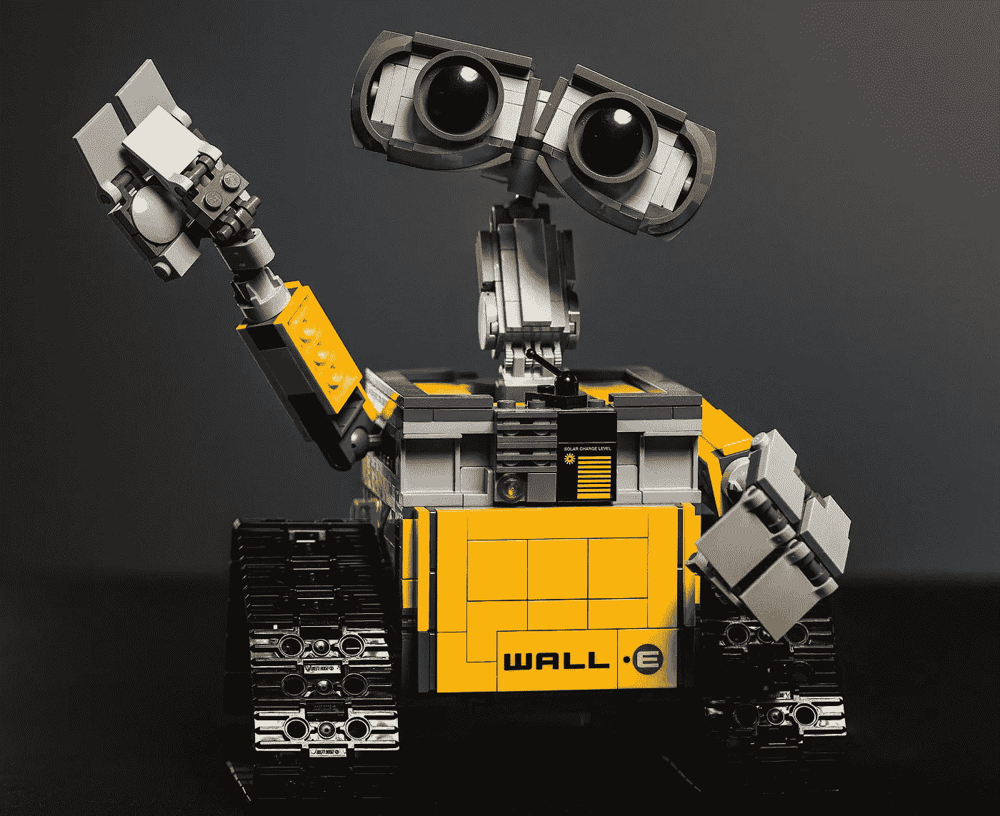

# 深度 RL:基于模型的方法(第 1 部分)

> 原文：<https://medium.com/analytics-vidhya/deep-rl-a-model-based-approach-part-1-drl-doesnt-really-work-yet-9971c5ccb4d6?source=collection_archive---------21----------------------->

## 不要猜测你的下一步行动。计划一下！

深度强化学习并没有真正起作用…目前还没有

图片来自:[梁朝伟](https://unsplash.com/@ninjason)——[Unsplash](https://unsplash.com/)

使用**深度强化学习(RL)** ，我们可以训练一个代理来解决一个任务，而无需显式编程。这种方法非常普遍，原则上，我们可以将其应用于任何顺序决策。例如，在 2015 年，一个研究团队开发了一种叫做 **DQN** 的 **DRL** 算法来玩雅达利游戏。他们在 57 个不同的游戏中使用相同的方法，每个游戏都有特定的目标要实现，有特殊的敌人，和不同的特工行动。他们的代理学习解决许多游戏。在某些情况下，它甚至达到了更好的人类水平的性能。

一些 DQN 代理商玩的雅达利游戏的例子。来源:[同步](https://syncedreview.com/) — [SLM 实验室:新 RL 研究基准&软件框架](https://syncedreview.com/2020/01/08/slm-lab-new-rl-research-benchmark-software-framework/)

DRL 社区最近取得了令人难以置信的成绩。比如 2016 年， **Deepmind** 成功训练一名 DRL 特工击败围棋世界冠军。

2019 年 **Open AI** 发布 **OpenAI Five** :第一个能够在名为 Dota 2 的电子竞技游戏中击败世界冠军的 AI。同年，Open AI 还训练了一只真实世界的机器人手来解决一个魔方。

来源:Youtube — [用机械手解魔方:未切割](https://youtu.be/kVmp0uGtShk)

然而，DRL 也显示出严重的局限性。其中之一是，在学习一个好的策略之前，算法需要太多的交互。这个问题叫做**样本低效**。为了更好地理解这个问题，我们来看一个实际的例子。

> 但是首先，**试着猜一猜:**一个 DQN 特工需要多少经验才能达到雅达利游戏中人类的表现？(对于“体验”这个词，我们指的是游戏中执行的每一个动作。由于代理为每一帧选择一个新的动作，我们将其经验计算为接收帧的数量。)

让我们看下面的情节来得到一些提示:

来源:Rainbow: [结合深度强化学习的改进](https://arxiv.org/pdf/1710.02298.pdf)，arXiv

在上面的图中，我们可以看到原始 DQN 架构获得的结果，用灰色线表示(暂时忽略所有其他算法)。在 x 轴上，我们有所需的帧(注意，它们是数亿帧)。在 y 轴上，我们有“人类标准化得分中值”，这是从相应的 Atari 游戏中获得的所有 57 个得分的平均值，以 100%匹配人类得分的方式标准化。Deepmind 为每个呈现的算法重复这个过程。

> **答案:**从这个图我们可以看出，原来的 DQN 算法需要上亿帧。这也表明，即使它在一些游戏中超越了人类的表现，但在一般情况下并不如此。

自 2015 年以来，研究人员提出了许多改进措施。它们中的一些在前面的图中是可见的，每一个都有不同的颜色。2017 年，来自 Deepmind 的一些研究人员向*展示了如何将它们结合起来以达到最佳效果。DQN 的这个新版本叫做* [***彩虹***](https://arxiv.org/pdf/1710.02298.pdf) : *它在 700 万帧后就克服了原版，* ***在 1800 万帧后就达到了一般人类的性能*** *，在 4400 万帧后克服了其他所有基线。*

所有游戏每秒提供 60 帧，因此 1800 万帧对应于大约 83 小时的游戏体验。*注意，83 小时只是玩的时间的近似值；完整的训练需要更多的东西！*

> 考虑到大多数人只需要几分钟就能获得雅达利游戏的自信，83 个小时是一段很长的时间。

有了更复杂的游戏，情况就更糟了:[*“open ai Five 每天和自己对抗 180 年的游戏，通过自我游戏学习。”*](https://openai.com/blog/openai-five/)

出于这个原因，DRL 最近的成功故事大多与视频游戏有关:研究人员使用虚拟环境来加快甚至瘫痪训练时间。

> 在合理的时间内，在没有硬件磨损的情况下，用真实世界的机器人进行数百万次实验是不现实的。

研究人员甚至为解决魔方的真实世界机器人使用模拟器。在这种情况下，他们使用模拟器预先训练代理。这种方法可能是一种可能的解决方案，但理解如何将学到的策略可靠地转移到现实世界仍然是一个开放的研究问题。此外，每次我们需要为一项任务训练一个智能体时都构建一个模拟器是不可行的。

> 这就是为什么没有办法训练一个真实世界的智能体在合理的时间内解决重要的问题。

来源:YouTube — [通过无监督的非策略强化学习，涌现出真实世界的机器人技能](https://youtu.be/b7oJSxujWIM)

在下一篇文章中， [**深度 RL:基于模型的方法(第二部分)**](/@enrico-busto/deep-rl-a-model-based-approach-part-2-drl-explained-837591ffadaa) ，我们将看到强化学习是如何工作的，我们将介绍基于模型的方法，以展示它如何提高 DRL 样本效率。

* *本文是与[卢卡·索伦蒂诺](https://medium.com/u/4bd9c016c60?source=post_page-----9971c5ccb4d6--------------------------------)合作撰写的