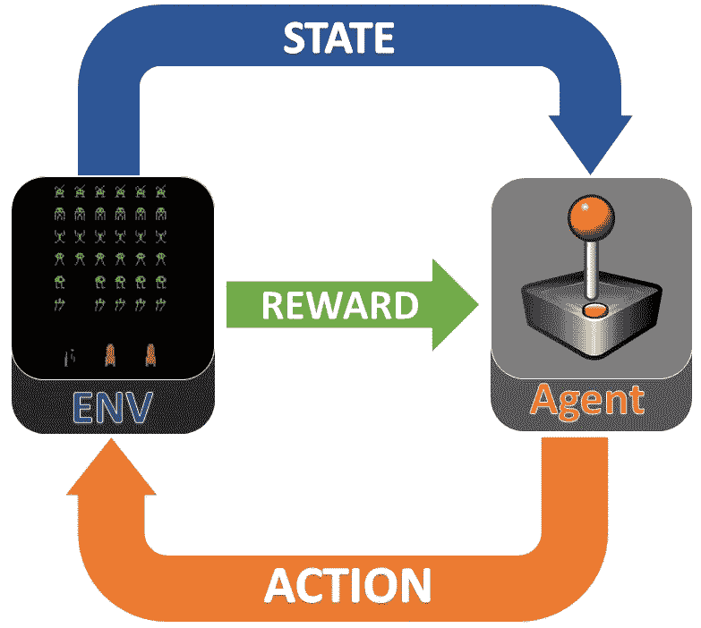
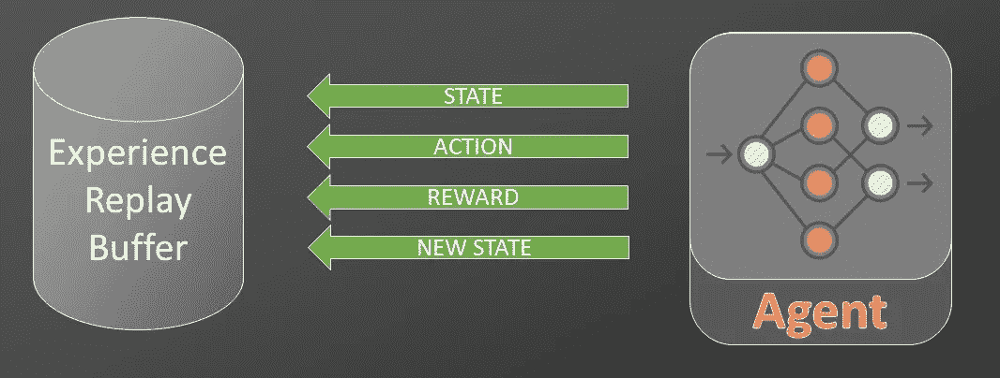
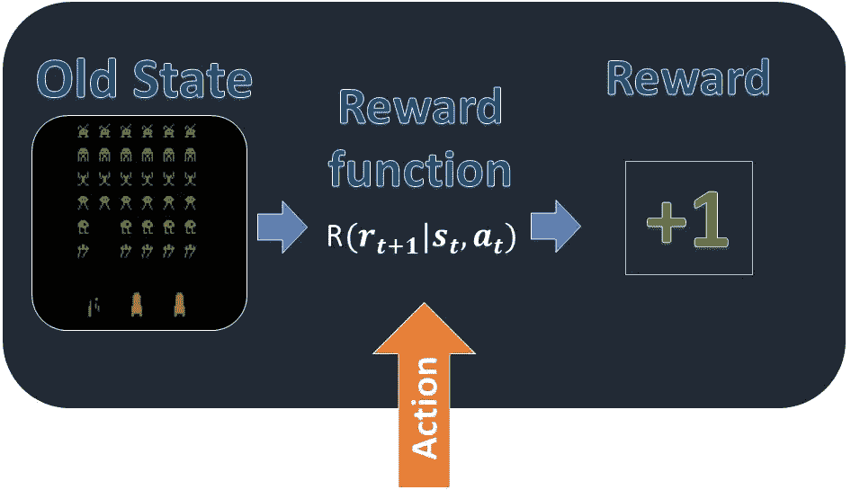
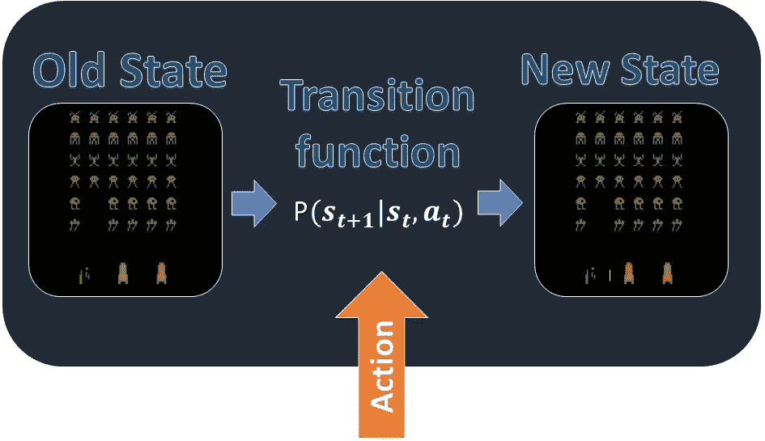
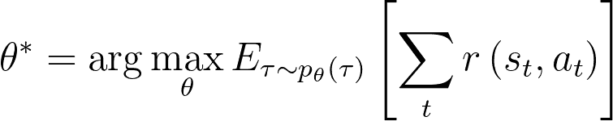
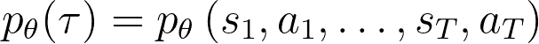
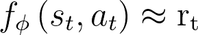
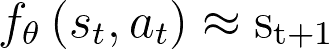
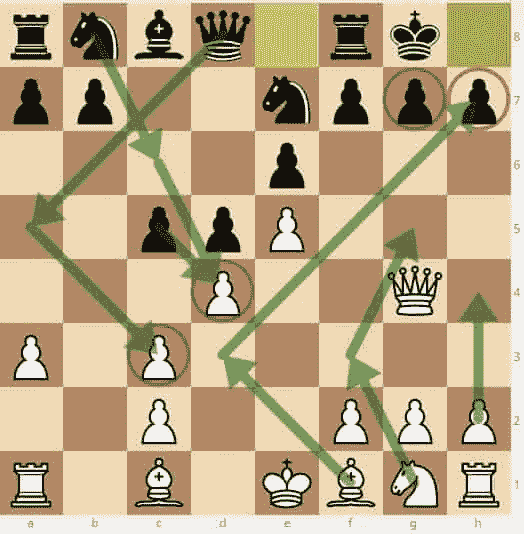

# 深度 RL:基于模型的方法(第 2 部分)

> 原文：<https://medium.com/analytics-vidhya/deep-rl-a-model-based-approach-part-2-drl-explained-837591ffadaa?source=collection_archive---------26----------------------->

## 不要猜测你的下一步行动。计划一下！

解释了基于模型的深度强化学习

图片来自:[梁朝伟](https://unsplash.com/@ninjason)——[Unsplash](https://unsplash.com/)

在之前的文章 [**深度强化学习:基于模型的方法(第一部分)**](/@enrico-busto/deep-rl-a-model-based-approach-part-1-drl-doesnt-really-work-yet-9971c5ccb4d6) 中，我们看到了深度强化学习(DRL)是如何非常有效和非常低效的。现在我们来看看它是如何工作的，以及为什么一个基于模型的方法可以极大地提高采样效率。

# 强化学习

*在强化学习中，智能体在未知的环境中行动，以达到未知的目标。*

时间被离散成时间步长，对于每个时间步长，代理接收关于环境的信息并采取行动。然后它接收到一个叫做奖励的反馈信号。当行动使代理人更接近他的目标时，这种奖励是积极的，反之则是消极的。代理是为了最大化积极回报而构建的。因此，学习过程是基于这样一种想法，即代理人将惩罚它收到负面奖励的情况(在特定状态下计算的行为)。这将使相反的情况更有可能发生。*更正式的说法，我们可以说:*

> **报酬假设:**所有目标都可以用期望累积报酬最大化来描述。

# 太空入侵者

强化学习模式

*   在每个时间步，游戏计算其当前状态并将其发送给代理。这个状态可以是一个向量，包含所有主要信息，如敌人数量、速度、玩家位置等。如果我们不能直接访问所有这些信息，我们可以给代理部分信息，就像一个游戏框架。
*   代理接收该信息，并使用它来选择要采取的操作。每个代理都有一个内部策略函数，将任何状态映射到最大化期望累积奖励(游戏期间所有奖励的期望总和)的动作。在这种情况下，策略可以选择一组可能的操作:向左移动、向右移动、发射。在其他情况下，动作空间是连续的，这意味着实数向量描述了动作。
*   环境接收代理的动作，并将其发送到其内部模型，以产生奖励信号并计算新的状态。
*   可选地，代理可以将所有交互保存在体验重放缓冲区中。

体验回放缓冲区，来自[勒克司博士的实验室](https://drlux.github.io/planpix.html)

# 模型

环境模型由**奖励函数**和**转移函数**组成。

**奖励函数**是代理拥有的唯一监督形式，并且依赖于状态和动作。

转移函数可以被视为“游戏规则”,因为它稳定了环境如何因代理的动作而改变。*由于强化学习用于随机环境，相同的一对“状态”和“动作”并不总是产生相同的“下一状态”转移函数产生一个分布，表示所有可能的新状态的概率。*

# 无模型与基于模型

**无模型算法**没有环境模型的显式表示。他们将政策表达为一个深度神经网络，其参数θ被训练来预测每个州的最佳行动。

**基于模型的算法**使用深度神经网络来逼近奖励函数和转移分布。然后他们可以在许多方面使用学到的模型。两种主要方法是:将策略表达为计划者或使用模型产生合成转换以丰富经验重放缓冲区。

# 基于模型如何提高样本效率

想象你第一次开始下棋。你不知道什么是棋子，如何移动，游戏的目标和主要策略。轮到你的时候，你知道什么是合法的行动，对于每一个行动，你都会得到有回报的反馈。

来源:[俱乐部玩家最佳国际象棋策略提示](https://www.ichess.net/blog/chess-strategy-tips/)

使用无模型的方法，你可以从单个游戏中获得的信息量是很少的，为了获得一个很好的近似的移动的真实评估，你需要玩大量的时间。

相反，理解游戏规则是一项更简单的任务。此外，一旦你知道游戏是如何运作的，你就可以模拟游戏中与你的行动相关的所有可能的演变。所以你可以通过模拟游戏来加快收集数据的过程。

在某些情况下，使用基于模型的方法，一旦你学会了模型，你甚至可以停止训练，直接从计划者那里建立一个策略。换句话说，在每一步，你使用模拟作为计划者来选择要采取的最佳行动。

# 结论

在这篇文章中， [**深度 RL:基于模型的方法(第三部分)**](/@enrico-busto/deep-rl-a-model-based-approach-part-3-planet-6427b76a21) ，我们看到了无模型和基于模型方法之间的理论差异。在下一篇文章中，我们将分析一个名为**行星**的基于模型的实用算法。

* *本文是与[卢卡·索伦蒂诺](https://medium.com/u/4bd9c016c60?source=post_page-----837591ffadaa--------------------------------)合作撰写的