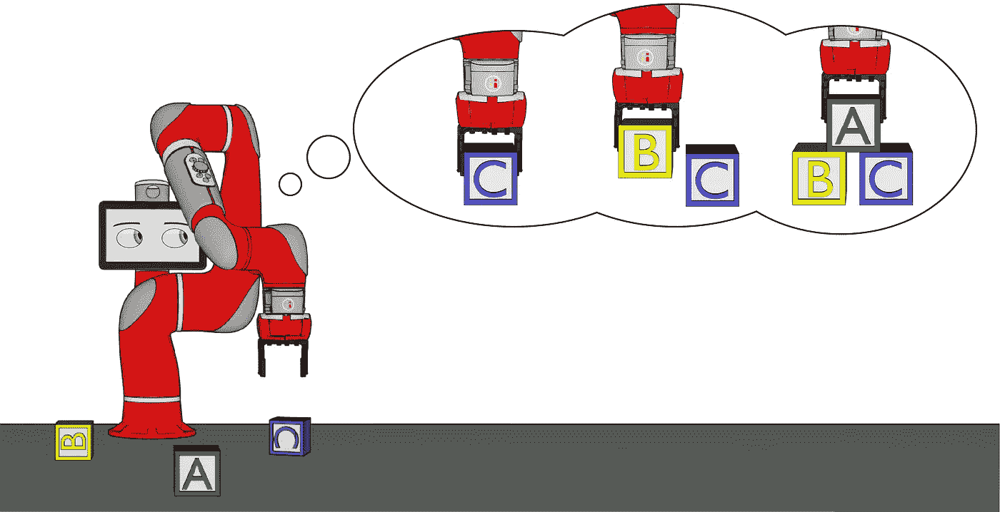
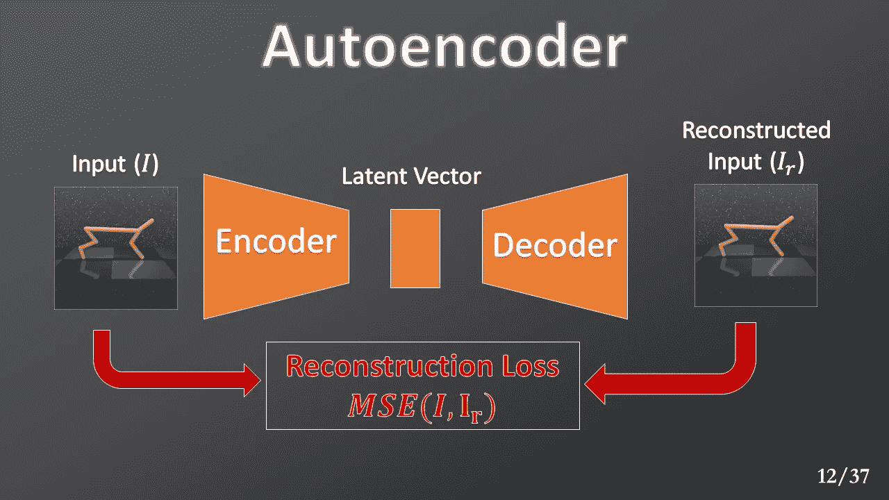
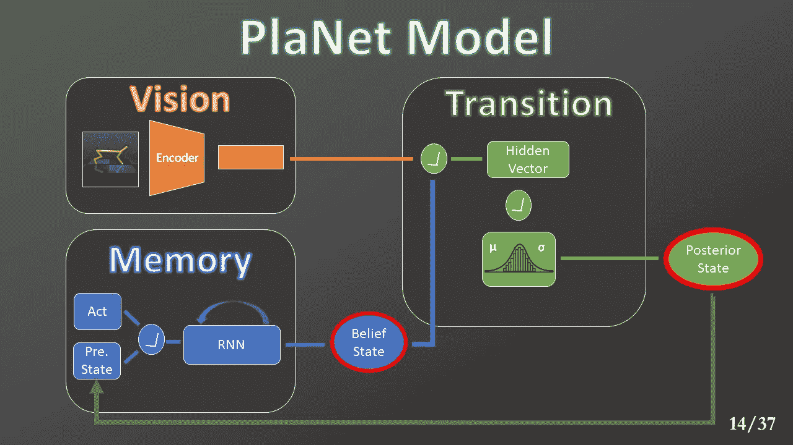
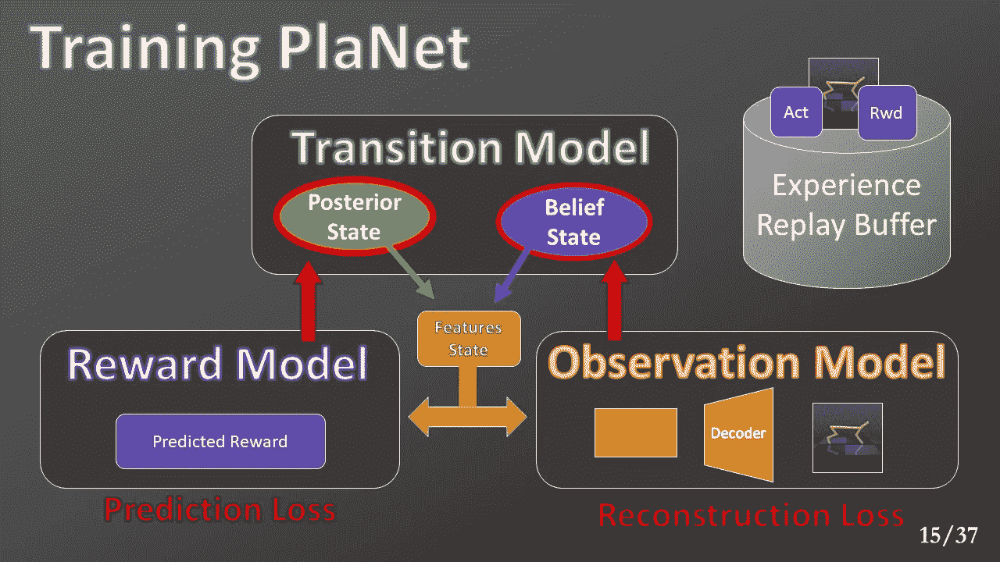
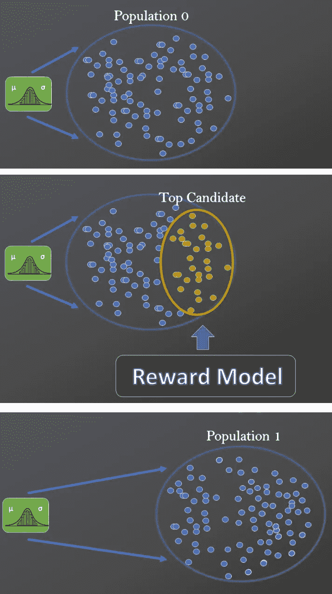

# 深度 RL:基于模型的方法(第 3 部分)

> 原文：<https://medium.com/analytics-vidhya/deep-rl-a-model-based-approach-part-3-planet-6427b76a21?source=collection_archive---------24----------------------->

## 不要猜测你的下一步行动。计划一下！

深度计划网络(星球)

图片来自:[梁朝伟](https://unsplash.com/@ninjason)——[Unsplash](https://unsplash.com/)

在之前的文章 [**深度 RL:基于模型的方法(第二部分)**](/@enrico-busto/deep-rl-a-model-based-approach-part-2-drl-explained-837591ffadaa) 中，我们看到了深度强化学习(DRL)是如何工作的，以及基于模型的方法如何提高样本效率。在本文中，我们提出了一种基于特定算法模型的算法，称为 **PlaNet** 。

学习模型可以让机器人在行动前进行规划。来源: [BAIR](https://bair.berkeley.edu/blog/2019/12/12/mbpo/)

# 从观察中学习

在绝大多数情况下，我们使用模拟器来创建用于训练具有强化学习的代理的环境。在每个时间步，模拟器收集所有必要的信息来产生一个新的状态，并将其发送给代理。

在现实世界中，所有这些信息并不总是可用的。在更现实的场景中，机器人没有它们。例如，移动茶杯的机器人没有相对于桌子的精确坐标。通常，它只能使用相机来捕捉图像。出于这个原因，我们必须开发一种算法，允许代理解决问题，并教会它建立其内部表示。换句话说，代理将自动识别、收集和维护所有必要的信息。这使得训练问题变得更加复杂。

# 星球:一个深度规划网络

2019 年，Danijar 等人发布了**深度规划网络(PlaNet)** ，这是一种基于模型的算法，能够仅从图像输入中直接学习环境模型，并将其用于规划。让我们简单解释一下它是如何工作的。

*注意:为了更好地理解这种方法，你应该知道自动编码器和门控循环单元(GRU)网络是如何工作的。*

自动编码器将输入限制在一个潜在向量中，然后重建它。它被训练以最小化原始输入和重构输入之间的均方误差(MSE)。这样，我们确保潜在向量将保持重建所需的所有主要输入信息。

Autoencoder 将输入压缩成一个潜在向量，这是 Lux 博士的实验室提供的。

相反，GRU 网络检查潜在向量的序列和执行动作的列表。通过这种方式，它可以提取物体的速度和方向等时间信息。

该代理将所有视觉和时间信息编码在一个紧凑的潜在向量序列中，并构建自己的抽象表示。它不是直接预测下一幅图像，而是学习预测下一个潜在向量并重建相应的观察。PlaNet 也可以学习奖励功能。

行星建筑概述。来源:[勒克斯博士实验室](https://drlux.github.io/planpix.html)。

报酬与观察模型。最后一个从状态重构观察。来源:[勒克斯博士实验室](https://drlux.github.io/planpix.html)。

使用潜在向量也可以使规划过程更快。该规划器基于一种称为交叉熵方法(CEM)的遗传算法。对于每一代，我们使用多元高斯分布来生成一个动作序列群体。

然后，我们使用所学的奖励模型来计算，对于每个行动列表，我们通过执行它们可以获得的奖励金额。评估完所有的动作序列后，我们会从中挑选一个分组(最佳候选)。

CEM 算法的可视化表示。来源:[勒克斯博士实验室](https://drlux.github.io/planpix.html)。

我们使用这个子组来更新高斯参数并生成下一个种群。

在下一篇文章中，我们将介绍一些使用 PlaNet 进行的实验，在这些实验中，我们分析了有效的预测能力，并将获得的结果与无模型基线进行了比较。

* *本文是与[卢卡·索伦蒂诺](https://medium.com/u/4bd9c016c60?source=post_page-----6427b76a21--------------------------------)合作撰写的