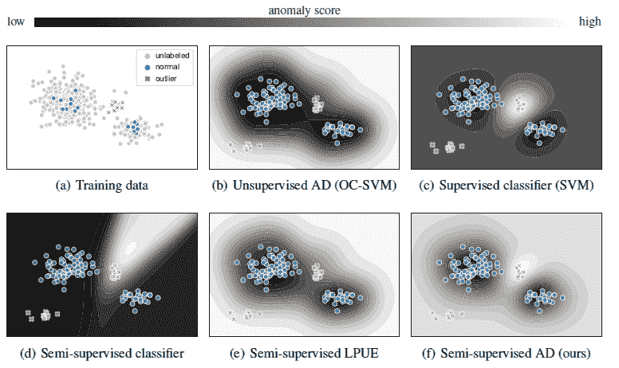
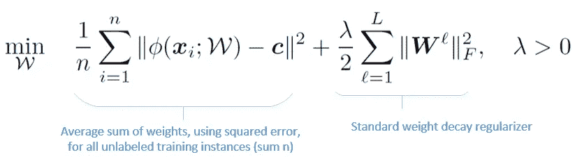
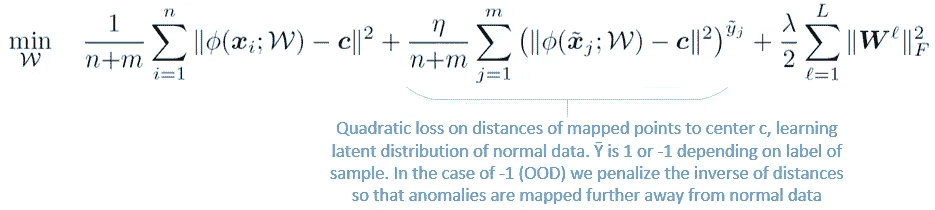
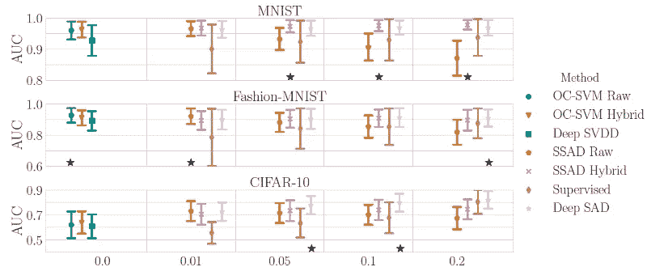
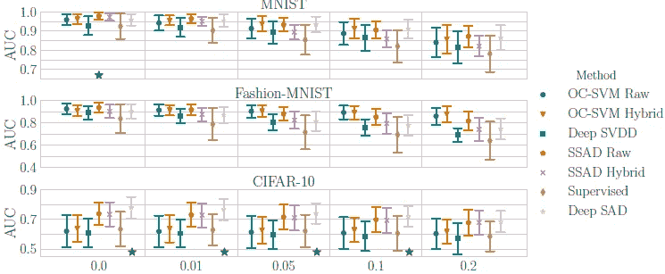
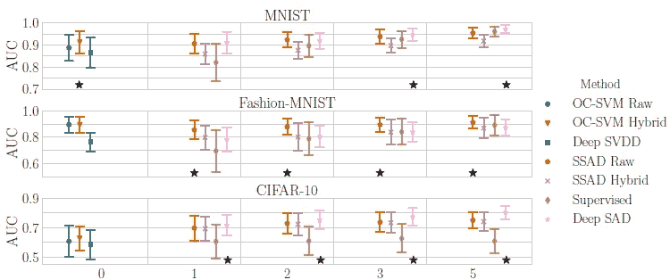

# 深度半监督异常检测

> 原文：<https://medium.com/analytics-vidhya/deep-semi-supervised-anomaly-detection-ab1db59d7820?source=collection_archive---------9----------------------->

异常检测(AD)是识别给定数据集中异常值的任务。存在现有的浅层监督以及深层非监督技术，这些技术在可扩展性或使用标记异常数据的能力方面受到限制。

在本文中，我们将讨论 Ruff 等人最初发表的深度半监督异常检测(Deep SAD)[1]。

# 深深悲伤背后的动机

图一。(a)显示了训练数据的分布，以及标签，(b-e)显示了 4 种现有技术及其模型学习到的等高线图。(f)显示深度半监督异常检测

在高层次上，我们可以将现有技术的性能与深度 SAD 进行比较，并查看每个模型学习到的表示。训练数据呈现为 I)标记的正常数据 ii)标记的异常数据 iii)未标记的数据。

无监督 AD (b)仅学习正态表示的分布。这导致正常数据和异常数据之间的界限模糊。这种不足的结果是异常检测的低置信度。

监督分类器(SVM) (c)成功地创建了正常和异常边界之间的最大分离超平面，但是在异常超出分布(OOD)的情况下将无法检测到异常。

半监督分类器(d)仅学习异常类，并且很可能无法检测到它没有被预先训练来检测的任何异常分布。

半监督 LPUE(从正样本和未标记样本中学习)(e)是一种现有的方法，它不考虑用于训练的标记异常数据。在标记的异常数据(训练集的一部分)和正常数据的两种分布之间缺乏明确的分离，这种不足是明显的。

# 深 SVDD

名为深度支持向量数据描述(SVDD)的现有无监督技术被用作深度 SAD 的动机。该技术的目标是训练神经网络(*φ*)学习一种变换，该变换最小化以预定点 *c* 为中心的数据包围超球的体积。

等式 1:代表基于 OOD 样本的无监督 AD 框架的深度 SVDD 等式

惩罚均方值迫使网络提取数据变化的公共因子，这些因子在数据集中是最稳定的。因此，正常数据点被绘制在超球中心附近，而异常点被绘制在更远的地方。

深 SVDD 方程等价于最小化经验方差，从而最小化潜在高斯熵的上界。简单来说，这种技术使点 *c* 周围和任意超球面内的熵最小化。

# **深深的悲伤**

方程 2:具有监督学习表达式的深度 SAD 方程第二项。第二项基于标签优化权重

除了第二个表达式之外，这个等式与深度 SVDD 相同。

在第二个表达式中，η (eta)是超参数，控制对标记数据和未标记数据的强调程度。

参数 m 代表标记样本，y 条代表-1 或 1 的值，分别取决于它是属于异常分布还是正态分布。

我们可以将深层 SAD 目标概括为模拟正态数据的潜在分布，使其具有低熵，模拟异常数据的潜在分布，使其具有高熵。如前一节所述，深度 SAD 增加了权重的亲和力，使其更接近正态分布的 *c* ，并进一步远离异常。

# 实验

在 3 个数据集上执行异常检测任务:MNIST、时尚-MNIST 和 CIFAR-10。

对于多类数据集，选择一个类作为正态分布，而其他类被视为异常分布。

我们在下面讨论了三种不同的场景来比较不同技术之间的性能。

## 场景 1:添加标记异常

在这种情况下，检查了各种技术上标记异常的比率的影响。标记的异常是从九个异常类别之一中采样的。这意味着在这十个类别中，一个被标记为正态分布，一个被标记为异常。对于训练集的未标记部分，仅提供正常类样本(场景 1 与场景 2 之间的关键区别)。虽然在标记的数据中只表示了一个类别，但是所有 9 个异常类别都用于测试。如图 2 的 x 轴所示，一个标记的异常类别的比率增加到 20%。

图二。训练集中标记异常的比率(x 轴)

**结果**:该测试证明了 Deep SAD(粉色)作为 AD 半监督技术的优势，尤其是在更复杂的 CIFAR-10 数据集上，Deep SAD 表现最佳。总的来说，深度 SAD 概括得更好，因为更多标记的异常被呈现用于训练。

## 场景 2:被污染的训练数据

在这种情况下，不同方法对训练集中增加的未标记异常的鲁棒性被检查。为此，与场景 1 相比，训练数据中未标记异常的数量增加。带标签的训练样本固定在总训练数据的 5%。由于训练数据中的噪声，这种情况预计比监督学习更有利于无监督学习。

图 3。未标记训练数据与标记训练数据的比率(x 轴)

图 2 显示了未标记训练数据中不同污染比率(异常值类型)的结果

**结果**:随着数据污染的增加，所有方法的性能都下降。在半监督 AD 方法中从标记的异常中学习减轻了污染对检测性能的负面影响。这是因为在训练阶段可能已经遇到了未标记数据中的类似未知异常。事实证明，深深的悲伤是最坚强的。

## 场景 3:已知异常类的数量

在这种情况下，在不同数量的已知异常类别下比较不同算法之间的性能。在场景 1 和 2 中，我们只提供了 9 个标记异常类中的一个，作为训练数据的一部分。在这里，我们检查增加这个数字对各种方法的影响。

图 4。已知异常类别的数量

**结果:**随着异常类数量的增加，深度 SAD 总体表现优于其他技术。训练集中标记的异常越多样化，检测性能就变得越好。

# 结论和未来工作

深度 SAD 是无监督深度 SVDD 方法的推广。深度 SAD 的目标是将深度 SVDD 方法扩展到用标记异常进行训练。这样做，它能够更有效地预测可能从各种分布中抽样的异常。

实验部分讨论的结果表明，当关于异常分布的一些标记信息可用时，一般半监督异常检测应该是优选的。

例如，潜在的未来工作可以包括更严格的分析和研究速率失真曲线下的深层异常检测。

## 参考

[1] Lukas Ruff 等人，“深度半监督异常检测”学习表征国际会议。

[2] Lukas Ruff、Robert A Vandermeulen、Nico Gö rnitz、Lucas Deecke、Shoaib A Siddiqui、Alexander Binder、Emmanuel Müller 和 Marius Kloft。深度一类分类。《在 ICML》，第 80 卷，第 4390–4399 页，2018 年。

参考论文:【https://arxiv.org/abs/1906.02694 

实验段代码:【https://github.com/lukasruff/Deep-SAD-PyTorch 