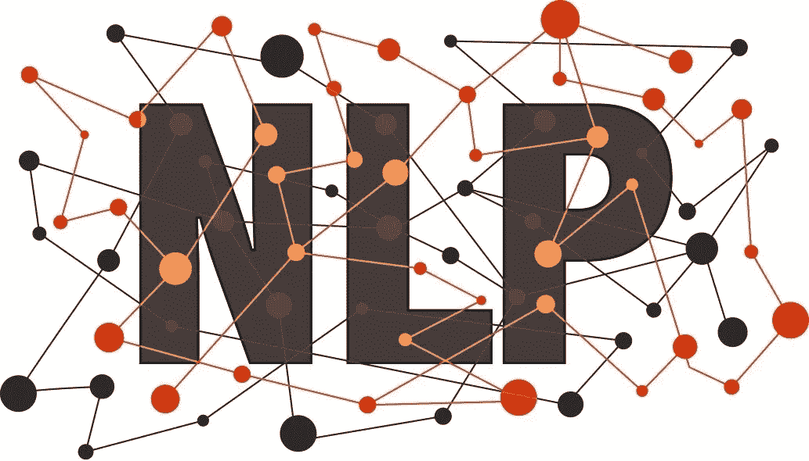

# 深度演讲:用迁移学习训练母语第 0b01 部分

> 原文：<https://medium.com/analytics-vidhya/deep-speech-train-native-languages-with-transfer-learning-part-0b01-13d24f1337c7?source=collection_archive---------4----------------------->

# 介绍

Deep Speech 是一个开源的语音转文本引擎。Project Deep Speech 使用 TensorFlow 来简化实现。

深度语音由两个主要子系统组成:

1.  **声学模型**:深度神经网络，接收音频特征作为输入，并输出字符概率。
2.  **解码器**:使用波束搜索算法将字符概率转换成文本副本，然后由系统返回。

迁移学习是在新问题上重新使用预先训练好的模型。它目前在深度学习中非常流行，因为它可以用相对较少的数据训练深度神经网络。这在数据科学领域非常有用，因为大多数现实世界的问题通常没有数百万个带标签的数据点来训练如此复杂的模型。

相对而言，大多数母语缺乏从头开始训练神经网络的资源。这种方法将有助于使用少量的语音转文本语料库创建您自己的模型。

# 基准

英语和普通话(还有一些欧洲语言)是深度语音 ASR 模型的超级例子。这说明完全不同的语言特征是可以通过同一个网络学习的。它可以很容易地适应不同的语言。有一些语言正在开发中。

# 步伐

1.  克隆来自 https://github.com/mozilla/DeepSpeech[的深度语音库](https://github.com/mozilla/DeepSpeech)
2.  准备演讲和文字记录文集表格[https://commonvoice.mozilla.org/en/datasets](https://commonvoice.mozilla.org/en/datasets)
3.  使用 KenLM 构建语言模型
4.  在这里获得相关的预培训英语模型[https://github.com/mozilla/DeepSpeech/releases](https://github.com/mozilla/DeepSpeech/releases)

5.在预训练模型中冻结层时进行训练

*注意:语言模型是这种方法中耗时的部分。根据反馈，将使其成为一篇关于构建语言模型的新文章，以一种定制的方式训练深度语音。

## 在 Colab 中准备工作区

*   文件->新笔记本
*   *！git 克隆*[*https://github.com/Loghijiaha/DeepSpeech.git*](https://github.com/Loghijiaha/DeepSpeech.git)
*   安装所需的 python 依赖项

## 下载并准备常用语音数据

*   使用 wget 命令获取压缩文件并将其解压缩。

*！wget*[*https://voice-prod-bundler-ee 1969 a6ce 8178826482 b 88 e 843 c 335139 BD 3 FB 4 . S3 . Amazon AWS . com/cv-corpus-4-2019-12-10/ta . tar . gz*](https://voice-prod-bundler-ee1969a6ce8178826482b88e843c335139bd3fb4.s3.amazonaws.com/cv-corpus-4-2019-12-10/ta.tar.gz)

*   提取和准备语音数据

*！python 3/content/deep speech/bin/import _ cv2 . py/content/deep speech/data/ta*

## 安装 KenLM 模型

*   构建 KenLM 二进制文件

*！git 克隆*[*https://github.com/kpu/kenlm.git*](https://github.com/kpu/kenlm.git)
*！mkdir -p 版本
！cmake kenlm
！make -j 4*

*   准备你的文本语料库
*   建立你的语言模型

*！python 3/content/deep speech/data/lm/generate _ local _ lm . py*

*   从语言模型生成您的评分器

*！python 3/content/deep speech/data/lm/generate _ package . py—lm/content/deep speech/data/lm/lm . binary—vocab/content/deep speech/data/alphabet . txt—default _ alpha 0.75—default _ beta 1.85—package/content/deep speech/data/lm/kenlm _ Tamil . scorer*

## 下载预先翻译的英语模型

*   获取预训练模型

*！curl-LO*[*https://github . com/Mozilla/deep speech/releases/download/v 0 . 8 . 0/deep speech-0 . 8 . 0-check point . tar . gz*](https://github.com/mozilla/DeepSpeech/releases/download/v0.8.0/deepspeech-0.8.0-checkpoint.tar.gz)

*   拉开拉链

*！焦油 xvf deepspeech-0.8.0-checkpoint.tar.gz*

## 训练你的模型

*   冷冻 2 层并培养

*！python 3/content/deep speech/deep speech . py—drop _ source _ layers 2—train _ cud nn 1 load _ check point _ dir/content/20 epochs—epochs 10—alphabet _ config _ path =/content/deep speech/data/alphabet . txt—scorer/content/deep speech/data/lm/ken lm _ Tamil . scorer—export _ dir/content/deep speech/model—utf8 1—export _ dir/content/deep speech/model—train _ files/content/deep speech/data*

# 结论

简而言之，我们可以使用少量数据使用迁移学习来训练我们自己的模型。这将在行业中比无监督学习技术更成功。

对于进一步的澄清和笔记，请随时提出问题或要求。

✌️和平！