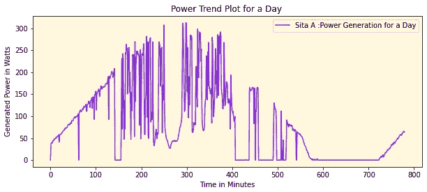
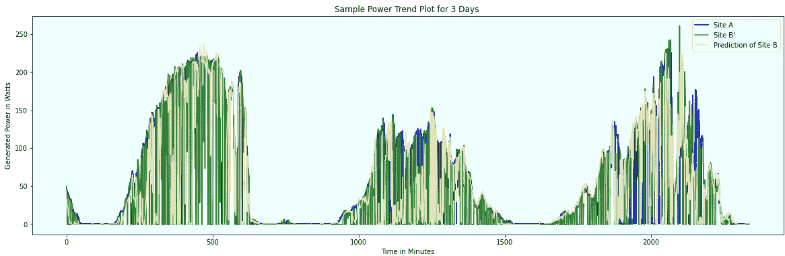
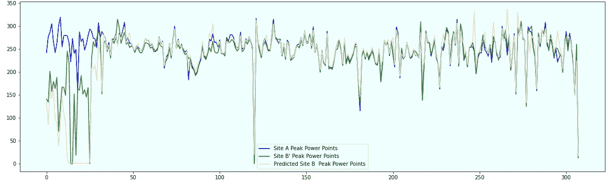
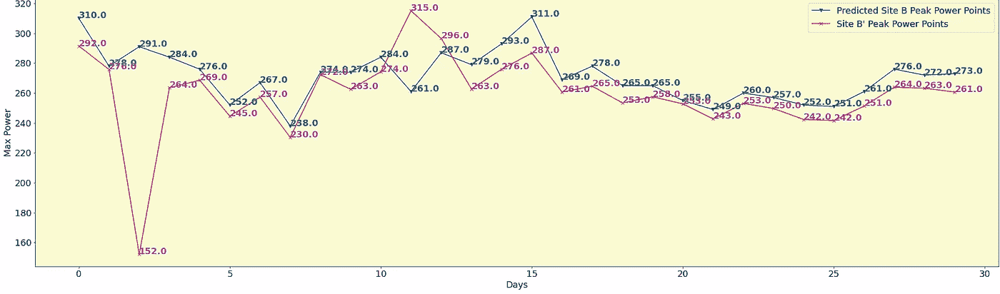

# 能源领域的深度无监督学习——自动编码器的应用

> 原文：<https://medium.com/analytics-vidhya/deep-unsupervised-learning-in-energy-sector-autoencoders-in-action-70e0c1fe8f12?source=collection_archive---------18----------------------->

在这篇短文中，我将谈论无监督学习，尤其是在能源领域。该博客将主要关注深度学习的实时应用，而不是强调底层概念。但首先，让我们看看无监督的机器学习意味着什么？它是机器学习的一个分支，处理从数据集中识别隐藏模式，并且不依赖于要标记的数据中目标变量的必要性。因此，这里使用算法来发现数据的底层结构，如数据簇的存在、奇数数据检测等。

当所研究的期望变量的目标值未知时，无监督形式的深度学习技术被用于找到目标(期望变量)和数据中的其他变量之间的关系，以得出结果(即目标的可能值)。

# 商业问题

如上所述，商业案例将来自能源部门，特别是可再生形式的(太阳能电池板)能源。太阳能电池板利用光伏和硅太阳能电池将辐射转化为电能，已经在世界各地非常流行。日益成为未来必不可少的能源选择。考虑这样一个场景，我在一个特定的地点安装太阳能电池板已经有一段时间了，并从电力局的计量电力中获得了良好的收益。

现在，我想在我的另一个站点 B 安装类似的面板，该站点位于不同的地理位置/区域。但是，在进行另一项投资之前，我能否根据我在站点 A 安装的面板获得的电力，了解我在站点 B 可以获得多少电力？这将有助于我对该地区的投资和电力需求做出正确的决定。现在让我们看看问题陈述

# 问题陈述

基于过去 M 个月在地点 A、B’安装的太阳能电池板产生的电力，预测在任何未来的日期，在 B and B’附近的另一个未知地点 B 安装的电池板能够产生的电力，该地点处于相同的地理位置。

**太阳数据集:** (239538，10)

数据来自 2019 年 12 月至 2020 年 10 月期间的特定站点，具有 10 个要素和 23 万行。在转换为 NumPy 数组后，它将具有以下结构

*阵(
【2019。, 12., 4., …, 6., 0., 0.]，
【2019。, 12., 4., …, 6., 1., 0.]，
【2019。, 12., 4., …, 6., 2., 0.]，
…，
【2020。, 10., 4., …, 17., 57., 0.]，
【2020。, 10., 4., …, 17., 58., 0.]，
【2020。, 10., 4., …, 17., 59., 0.]])*

太阳能电池板的主要电源是阳光，因此为了适应季节性和其他因素，数据集包括像*‘年’，‘月’，‘季’，‘日周’，‘日月’，‘日年’，‘年周’，‘小时’，‘分’*等作为关键预测因子，发电量作为因变量。一天的典型发电量看起来很像高斯曲线



我们可以看到，发电时间是从早上 6:00 到晚上 18:00(日照时间)，用分钟表示。功率最初较小，然后逐渐增加，并在中午左右达到峰值，然后在一天结束时缓慢降低，似乎继承了钟形曲线的特性。由此我们可以直观地推断出，所有的太阳能电池板都将具有这种模式，无论它位于地理的哪个部分，唯一的区别将是在特定地点产生的电量，这反过来可能取决于许多因素，如季节性、天气和其他类似的因素，如可用的阳光。

# 自动编码器(AE)的强大和美丽

自动编码器是一种无监督学习技术，用于压缩原始数据集，然后从压缩数据中重建它。这里有一个编码器和解码器组件来完成这些功能。这里，神经网络的主要思想是将输入转换成失真很小的输出。也就是说，自动编码器将在输出与输入非常相似的情况下工作得很好，如图像去噪。

自动编码器也用于特征提取，尤其是在数据增长到高维的情况下。传统上，自动编码器通常用于图像数据集中，但这里我将在一个数字数据集上演示它。概念保持不变。在我的例子中，我将利用 AE 的这一特性，因为在我的情况下，我在另一个站点获得的功率输出将与上面解释的当前站点非常相似。我将展示 AE 的两种变体，一种是基于 LSTM 的 AE，另一种是 Keras 的传统 AE。

# 案例 1:基于 LSTM 的自动编码器

我有从 2019 年 12 月到 2020 年 10 月的两个站点 A 和 B '的历史数据。站点 B 与站点 B '在相同的地理边界内。我希望根据 Sita A，B '的历史数据找到站点 B 产生的电力。我没有关于目标站点 b 的任何信息。

X1s 和 X3s 是站点 A 的标准化数据，X3s 和 X4s 是站点 B’的标准化数据。该数据集有 10 个非常相似的特征，在 X2s[:，9]和 X4s[:，9]中略有不同，这些特征在各自的站点上具有功效值。我们将尝试使用简单的 LSTM 自动编码器将 X1s 转换为 X2s。我在这里使用了*平均绝对误差*作为损耗和*‘线性’*激活，因为我需要让预测的功率值非常接近实际值(在这种情况下是 B 站点)。

这只是一个示例代码，给出了如何建立基于 LSTM 的 AE 和超参数的想法，需要用不同的优化器/多层/时期进行调整，以获得一个非常好的近似。参考下面的代码

```
from keras.models import Sequential 
from keras.layers import LSTM 
from keras.layers import Dense,Dropout 
from keras.layers import RepeatVector 
from keras.layers import TimeDistributed 
from keras.callbacks import EarlyStopping,M odelCheckpoint
from keras.regularizers import l1 
from keras import regularizers 
# define model
model = Sequential()
model.add(LSTM(256, activation='linear', input_shape=(X1801861s.shape[1],1),activity_regularizer=regularizers.l1(10e-,return_sequences=False))
model.add(RepeatVector(X1s.shape[1])) model.add(LSTM(256, activation='linear', return_sequences=True)) model.add(TimeDistributed(Dense(1, activation='linear'))) adam = keras.optimizers.Adam(lr=0.001) model.compile(optimizer=adam, loss='MAE')
model.summary()
earlyStopping = EarlyStopping(monitor='val_loss', patience=30, verbose=0, mode='min') 
mcp_save = ModelCheckpoint('sola-001.mdl_wts.hdf5', save_best_only=True, monitor='val_loss', mode='min')
history = model.fit(X1s, X2s, epochs=500, batch_size=1024,callbacks=[earlyStopping, mcp_save], validation_data = (X3s,X4s)_________________________________________________________________ Layer (type) Output Shape Param # ================================================================= lstm_8 (LSTM) (None, 256) 264192 _________________________________________________________________ repeat_vector_4 (RepeatVecto (None, 10, 256) 0 _________________________________________________________________ lstm_9 (LSTM) (None, 10, 256) 525312 _________________________________________________________________ time_distributed_4 (TimeDist (None, 10, 1) 257 ================================================================= Total params: 789,761 Trainable params: 789,761 Non-trainable params: 0
```

下图给出了关于 A & B 的 B 站点预测。期望它应该非常接近 B’。这里，我们使用站点 A、B '的数据来得出未知站点 B 的预测。下图是这些站点随机选取的 3 天趋势



此图表显示了所有 3 个站点 A、B '和目标站点 B 在 300 天内的峰值功率



# **情况 2:传统自动编码器模型**

```
input_dim = X1s.shape[1] 
encoding_dim = 10 input_layer = Input(shape=(input_dim, )) 
encoder = Dense(encoding_dim, activation="linear",activity_regularizer=regularizers.l1(10e-5))(input_layer)
decoder = Dense(input_dim, activation='linear')(encoder) 
encoder = Model(input_layer,encoder)
autoencoder = Model(inputs=input_layer, outputs=decoder)
adam = keras.optimizers.Adam(lr=0.001) 
earlyStopping = EarlyStopping(monitor='val_loss', patience=30, verbose=0, mode='min') 
mcp_save = ModelCheckpoint('sola-002.mdl_wts.hdf5', save_best_only=True, monitor='loss', mode='min') autoencoder.compile(optimizer=adam,loss='MAE')
autoencoder.summary() 
Model: "functional_3" ________________________________________________________________ Layer (type) Output Shape Param #================================================================= input_1 (InputLayer) [(None, 10)] 0 _________________________________________________________________ dense (Dense) (None, 10) 110 _________________________________________________________________ dense_1 (Dense) (None, 10) 110 ================================================================= Total params: 220 Trainable params: 220 Non-trainable params: 0
```

**对 LSTM /常规 AE 模型训练后的模型进行评估:**

```
from sklearn.metrics import mean_absolute_error,mean_squared_error,mean_squared_log_error 
import math mean_absolute_error(a,pd),math.sqrt(mean_squared_error(a,pd)),
mean_absolute_error(act,p),math.sqrt(mean_squared_error(act,p))***Model : LSTM AutoEncoder*** *MAE – Peak Power     16.425307183116885
MSE -Peak Power      36.75704731479356
MAE -Instant Power   1.8404600416117294
MSE -Instant Power   12.231826378081937* ***Model : Regular AutoEncoder*** *MAE – Peak Power     16.415917917337666
MSE -Peak Power      38.456323346248176
MAE -Instant Power   2.859275677961502
MSE -Instant Power   17.71553061457107*
```

> *p——一天的瞬间力量；pd —当日峰值功率
> act —当日实际瞬时功率；a —当天的实际峰值功率*

最后，我们随机绘制 30 天内站点 B’和新的期望站点 B 的峰值功率



从上面我们可以清楚地看到，该模型预测的峰值与在许多天的相应时间在 B '站点发现的实际值接近，并且在其他一些天几乎没有大的变化。嗯，在这篇博客中，我只强调了自动编码器的力量，以及它如何帮助检测未知。相当令人惊奇不是吗？在该领域，我们需要包括一些特定于领域的变量，并在超过 100 万个数据点上训练模型，以获得更好的结果。

谢谢

您也可以在我们的移动应用程序上阅读这篇文章


相关文章

*原载于 2020 年 11 月 12 日 https://www.analyticsvidhya.com**[*。*](https://www.analyticsvidhya.com/blog/2020/11/deep-unsupervised-learning-in-energy-sector-autoencoders-in-action/)*