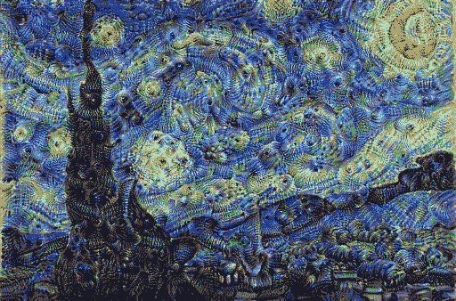
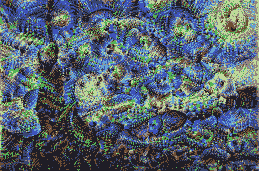
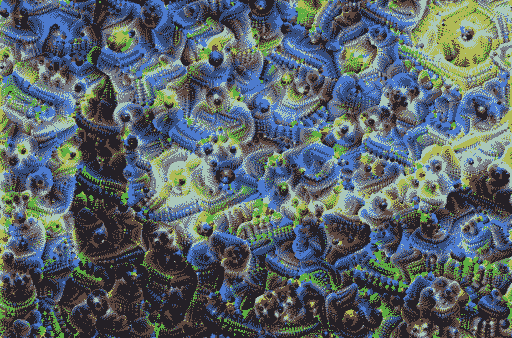

# 使用 Tensorflow 的 DeepDream 生成式深度学习简介

> 原文：<https://medium.com/analytics-vidhya/deepdream-using-tensorflow-an-introduction-to-generative-deep-learning-15e8b1f03c7e?source=collection_archive---------10----------------------->

Deepdream 是图像修改算法，是生成式深度学习的一个例子，它使用卷积神经网络学习的表示来修改图像。它是由谷歌在 2015 年发布的。deepdream 的流行是由于它蹩脚的图像，从眼睛到羽毛到狗脸。它最初是为了帮助科学家和工程师了解深度神经网络在给定输入时看到了什么。

Deepdream 基于一种可视化网络学习的技术。使用该技术，我们可以可视化激活卷积神经网络给定层的模式或卷积层中每个滤波器响应的视觉模式。这是通过在输入空间应用梯度上升来实现的，这样可以最大限度地提高 convnets 中特定滤波器的响应。

# 梯度上升

梯度上升与梯度下降相反。两者都是优化算法。梯度下降找出函数的最小值，梯度上升找出函数的最大值。梯度上升的过程与梯度下降的过程相同，我们首先找出函数相对于训练参数的梯度(导数),然后通过在梯度下降的相反方向上移动它来改变训练参数，以便最大化而不是最小化。

为了可视化由 convnets 学习的模式，我们必须最大化特定滤波器的响应。简而言之，我们有卷积层中特定滤波器的响应(激活),我们改变输入空间，以便通过使用梯度上升来最大化滤波器的响应。

# 创建 Deepdream 的步骤

*   我们从一幅图像开始，并将其传递给一个预先训练好的卷积神经网络，如 inception 或 vgg
*   我们试图最大化整个层的激活，而不是特定的过滤器。为此，我们定义了一个简单的损失函数，它将在最大化损失函数时最大化层的激活。所以我们使用层激活的平均值作为损失函数。
*   最后，我们将改变我们的输入空间(图像)的应用梯度图像，最终将最大化我们的损失函数。
*   需要像平铺和八度音阶这样的附加步骤来处理大图像，以便它可以有效地适应 RAM 并提供更好的结果。

实现 deepdream 教会了很多深度学习的其他概念。它打破了传统的*模型的规则，在每一个深度学习问题上都适合*。玩结果也很有趣，所以准备好做深度梦吧。

```
input_img_path="starry.jpg"
```

从我们的输入图像开始，deepdream 模式将显示为输出。首先，我们将定义输入图像的路径。

```
import numpy as np
import tensorflow as tf
from tensorflow.keras.applications import inception_v3
from tensorflow.keras.models import load_model,Model
from PIL import Image
import IPython.display as display
import time
```

接下来，我们将导入创建 deepdream 所需的所有依赖项。

*   **numpy :** 用于数组操作
*   **tensorflow :** 用于张量运算
*   **tensor flow . keras:**tensor flow 的高级神经网络库，用于创建神经网络
*   **pillow :** 用于将图像转换为 numpy 数组，将 numpy 数组转换为图像，保存输出图像。
*   **Ipython.display :** 用于显示笔记本中的图像
*   **时间:**用于计算每次迭代的时间

我们为此使用了盗梦空间预训练模型，因为它产生了更好的深梦输出，而且最初的实现也使用了盗梦空间模型。

> 《盗梦空间》电影中的梦。😁😁

```
def load_image(image_path,max_dim=512):
    img=Image.open(image_path)
    img=img.convert("RGB")
    img.thumbnail([max_dim,max_dim])
    img=np.array(img,dtype=np.uint8)
    img=np.expand_dims(img,axis=0)
    return img
```

上述功能

*   从路径加载图像
*   将其转换为 RGB 格式
*   在保持纵横比的同时，使用指定的最大尺寸调整其大小
*   将图像转换为 numpy 数组并创建一批单个图像，因为神经网络期望输入是成批的。

```
def deprocess_inception_image(img):
    img = 255*(img+1.0)/2.0
    return np.array(img, np.uint8)
```

上面的函数抵消了 inception 的 preprocess_input 函数所应用的预处理的效果。用于初始模型的预处理输入函数将图像的像素缩小到-1 到 1 的范围内，因此该函数将像素缩小到 0 到 255 的范围内

```
def array_to_img(array,deprocessing=False):
    if deprocessing:
        array=deprocess_inception_image(array)
    if np.ndim(array)>3:
        assert array.shape[0]==1
        array=array[0]
    return Image.fromarray(array)
```

上面的函数将把数组转换成图像。如果取消处理为真，它将首先取消处理初始预处理，然后将数组转换为图像

```
def show_image(img):
    image=array_to_img(img)
    display.display(image)
```

上述函数将通过首先将数组转换为图像来显示笔记本中的图像

```
input_image=load_image(input_img_path,max_dim=512)
print(input_image.shape)
show_image(input_image)(1, 338, 512, 3)
```


现在让我们加载输入图像并显示它。

```
preprocessed_image=inception_v3.preprocess_input(input_image)
show_image(deprocess_inception_image(preprocessed_image))
```


还要检查我们的 deprocess_image 函数是否按预期工作

```
def deep_dream_model(model,layer_names):
    model.trainable=False
    outputs=[model.get_layer(name).output for name in layer_names]
    new_model=Model(inputs=model.input,outputs=outputs)
    return new_model
```

上面的函数创建了一个 deepdream 模型。因为我们没有训练我们的模型，所以设置可训练为假。我们的 deepdream 模型将输入作为图像，并输出层的激活，我们将使用这些层将学到的模式嵌入到我们的输入图像中

```
inception=inception_v3.InceptionV3(weights="imagenet",include_top=False)
inception.summary()Model: "inception_v3"
__________________________________________________________________________________________________
Layer (type)                    Output Shape         Param #     Connected to                     
==================================================================================================
input_1 (InputLayer)            [(None, None, None,  0                                            
__________________________________________________________________________________________________
conv2d (Conv2D)                 (None, None, None, 3 864         input_1[0][0]                    
__________________________________________________________________________________________________
batch_normalization (BatchNorma (None, None, None, 3 96          conv2d[0][0]                     
__________________________________________________________________________________________________
activation (Activation)         (None, None, None, 3 0           batch_normalization[0][0]        
__________________________________________________________________________________________________
conv2d_1 (Conv2D)               (None, None, None, 3 9216        activation[0][0]                 
__________________________________________________________________________________________________
batch_normalization_1 (BatchNor (None, None, None, 3 96          conv2d_1[0][0]                   
__________________________________________________________________________________________________
activation_1 (Activation)       (None, None, None, 3 0           batch_normalization_1[0][0]      
__________________________________________________________________________________________________
conv2d_2 (Conv2D)               (None, None, None, 6 18432       activation_1[0][0]               
__________________________________________________________________________________________________
batch_normalization_2 (BatchNor (None, None, None, 6 192         conv2d_2[0][0]                   
__________________________________________________________________________________________________
activation_2 (Activation)       (None, None, None, 6 0           batch_normalization_2[0][0]      
__________________________________________________________________________________________________
max_pooling2d (MaxPooling2D)    (None, None, None, 6 0           activation_2[0][0]               
__________________________________________________________________________________________________
conv2d_3 (Conv2D)               (None, None, None, 8 5120        max_pooling2d[0][0]              
__________________________________________________________________________________________________
batch_normalization_3 (BatchNor (None, None, None, 8 240         conv2d_3[0][0]                   
__________________________________________________________________________________________________
activation_3 (Activation)       (None, None, None, 8 0           batch_normalization_3[0][0]      
__________________________________________________________________________________________________
conv2d_4 (Conv2D)               (None, None, None, 1 138240      activation_3[0][0]               
__________________________________________________________________________________________________
batch_normalization_4 (BatchNor (None, None, None, 1 576         conv2d_4[0][0]                   
__________________________________________________________________________________________________
activation_4 (Activation)       (None, None, None, 1 0           batch_normalization_4[0][0]      
__________________________________________________________________________________________________
max_pooling2d_1 (MaxPooling2D)  (None, None, None, 1 0           activation_4[0][0]               
__________________________________________________________________________________________________
conv2d_8 (Conv2D)               (None, None, None, 6 12288       max_pooling2d_1[0][0]            
__________________________________________________________________________________________________
batch_normalization_8 (BatchNor (None, None, None, 6 192         conv2d_8[0][0]                   
__________________________________________________________________________________________________
activation_8 (Activation)       (None, None, None, 6 0           batch_normalization_8[0][0]      
__________________________________________________________________________________________________
conv2d_6 (Conv2D)               (None, None, None, 4 9216        max_pooling2d_1[0][0]            
__________________________________________________________________________________________________
conv2d_9 (Conv2D)               (None, None, None, 9 55296       activation_8[0][0]               
__________________________________________________________________________________________________
batch_normalization_6 (BatchNor (None, None, None, 4 144         conv2d_6[0][0]                   
__________________________________________________________________________________________________
batch_normalization_9 (BatchNor (None, None, None, 9 288         conv2d_9[0][0]                   
__________________________________________________________________________________________________
activation_6 (Activation)       (None, None, None, 4 0           batch_normalization_6[0][0]      
__________________________________________________________________________________________________
activation_9 (Activation)       (None, None, None, 9 0           batch_normalization_9[0][0]      
__________________________________________________________________________________________________
average_pooling2d (AveragePooli (None, None, None, 1 0           max_pooling2d_1[0][0]            
__________________________________________________________________________________________________
conv2d_5 (Conv2D)               (None, None, None, 6 12288       max_pooling2d_1[0][0]            
__________________________________________________________________________________________________
conv2d_7 (Conv2D)               (None, None, None, 6 76800       activation_6[0][0]               
__________________________________________________________________________________________________
conv2d_10 (Conv2D)              (None, None, None, 9 82944       activation_9[0][0]               
__________________________________________________________________________________________________
conv2d_11 (Conv2D)              (None, None, None, 3 6144        average_pooling2d[0][0]          
__________________________________________________________________________________________________
batch_normalization_5 (BatchNor (None, None, None, 6 192         conv2d_5[0][0]                   
__________________________________________________________________________________________________
batch_normalization_7 (BatchNor (None, None, None, 6 192         conv2d_7[0][0]                   
__________________________________________________________________________________________________
batch_normalization_10 (BatchNo (None, None, None, 9 288         conv2d_10[0][0]                  
__________________________________________________________________________________________________
batch_normalization_11 (BatchNo (None, None, None, 3 96          conv2d_11[0][0]                  
__________________________________________________________________________________________________
activation_5 (Activation)       (None, None, None, 6 0           batch_normalization_5[0][0]      
__________________________________________________________________________________________________
activation_7 (Activation)       (None, None, None, 6 0           batch_normalization_7[0][0]      
__________________________________________________________________________________________________
activation_10 (Activation)      (None, None, None, 9 0           batch_normalization_10[0][0]     
__________________________________________________________________________________________________
activation_11 (Activation)      (None, None, None, 3 0           batch_normalization_11[0][0]     
__________________________________________________________________________________________________
mixed0 (Concatenate)            (None, None, None, 2 0           activation_5[0][0]               
                                                                 activation_7[0][0]               
                                                                 activation_10[0][0]              
                                                                 activation_11[0][0]              
__________________________________________________________________________________________________
conv2d_15 (Conv2D)              (None, None, None, 6 16384       mixed0[0][0]                     
__________________________________________________________________________________________________
batch_normalization_15 (BatchNo (None, None, None, 6 192         conv2d_15[0][0]                  
__________________________________________________________________________________________________
activation_15 (Activation)      (None, None, None, 6 0           batch_normalization_15[0][0]     
__________________________________________________________________________________________________
conv2d_13 (Conv2D)              (None, None, None, 4 12288       mixed0[0][0]                     
__________________________________________________________________________________________________
conv2d_16 (Conv2D)              (None, None, None, 9 55296       activation_15[0][0]              
__________________________________________________________________________________________________
batch_normalization_13 (BatchNo (None, None, None, 4 144         conv2d_13[0][0]                  
__________________________________________________________________________________________________
batch_normalization_16 (BatchNo (None, None, None, 9 288         conv2d_16[0][0]                  
__________________________________________________________________________________________________
activation_13 (Activation)      (None, None, None, 4 0           batch_normalization_13[0][0]     
__________________________________________________________________________________________________
activation_16 (Activation)      (None, None, None, 9 0           batch_normalization_16[0][0]     
__________________________________________________________________________________________________
average_pooling2d_1 (AveragePoo (None, None, None, 2 0           mixed0[0][0]                     
__________________________________________________________________________________________________
conv2d_12 (Conv2D)              (None, None, None, 6 16384       mixed0[0][0]                     
__________________________________________________________________________________________________
conv2d_14 (Conv2D)              (None, None, None, 6 76800       activation_13[0][0]              
__________________________________________________________________________________________________
conv2d_17 (Conv2D)              (None, None, None, 9 82944       activation_16[0][0]              
__________________________________________________________________________________________________
conv2d_18 (Conv2D)              (None, None, None, 6 16384       average_pooling2d_1[0][0]        
__________________________________________________________________________________________________
batch_normalization_12 (BatchNo (None, None, None, 6 192         conv2d_12[0][0]                  
__________________________________________________________________________________________________
batch_normalization_14 (BatchNo (None, None, None, 6 192         conv2d_14[0][0]                  
__________________________________________________________________________________________________
batch_normalization_17 (BatchNo (None, None, None, 9 288         conv2d_17[0][0]                  
__________________________________________________________________________________________________
batch_normalization_18 (BatchNo (None, None, None, 6 192         conv2d_18[0][0]                  
__________________________________________________________________________________________________
activation_12 (Activation)      (None, None, None, 6 0           batch_normalization_12[0][0]     
__________________________________________________________________________________________________
activation_14 (Activation)      (None, None, None, 6 0           batch_normalization_14[0][0]     
__________________________________________________________________________________________________
activation_17 (Activation)      (None, None, None, 9 0           batch_normalization_17[0][0]     
__________________________________________________________________________________________________
activation_18 (Activation)      (None, None, None, 6 0           batch_normalization_18[0][0]     
__________________________________________________________________________________________________
mixed1 (Concatenate)            (None, None, None, 2 0           activation_12[0][0]              
                                                                 activation_14[0][0]              
                                                                 activation_17[0][0]              
                                                                 activation_18[0][0]              
__________________________________________________________________________________________________
conv2d_22 (Conv2D)              (None, None, None, 6 18432       mixed1[0][0]                     
__________________________________________________________________________________________________
batch_normalization_22 (BatchNo (None, None, None, 6 192         conv2d_22[0][0]                  
__________________________________________________________________________________________________
activation_22 (Activation)      (None, None, None, 6 0           batch_normalization_22[0][0]     
__________________________________________________________________________________________________
conv2d_20 (Conv2D)              (None, None, None, 4 13824       mixed1[0][0]                     
__________________________________________________________________________________________________
conv2d_23 (Conv2D)              (None, None, None, 9 55296       activation_22[0][0]              
__________________________________________________________________________________________________
batch_normalization_20 (BatchNo (None, None, None, 4 144         conv2d_20[0][0]                  
__________________________________________________________________________________________________
batch_normalization_23 (BatchNo (None, None, None, 9 288         conv2d_23[0][0]                  
__________________________________________________________________________________________________
activation_20 (Activation)      (None, None, None, 4 0           batch_normalization_20[0][0]     
__________________________________________________________________________________________________
activation_23 (Activation)      (None, None, None, 9 0           batch_normalization_23[0][0]     
__________________________________________________________________________________________________
average_pooling2d_2 (AveragePoo (None, None, None, 2 0           mixed1[0][0]                     
__________________________________________________________________________________________________
conv2d_19 (Conv2D)              (None, None, None, 6 18432       mixed1[0][0]                     
__________________________________________________________________________________________________
conv2d_21 (Conv2D)              (None, None, None, 6 76800       activation_20[0][0]              
__________________________________________________________________________________________________
conv2d_24 (Conv2D)              (None, None, None, 9 82944       activation_23[0][0]              
__________________________________________________________________________________________________
conv2d_25 (Conv2D)              (None, None, None, 6 18432       average_pooling2d_2[0][0]        
__________________________________________________________________________________________________
batch_normalization_19 (BatchNo (None, None, None, 6 192         conv2d_19[0][0]                  
__________________________________________________________________________________________________
batch_normalization_21 (BatchNo (None, None, None, 6 192         conv2d_21[0][0]                  
__________________________________________________________________________________________________
batch_normalization_24 (BatchNo (None, None, None, 9 288         conv2d_24[0][0]                  
__________________________________________________________________________________________________
batch_normalization_25 (BatchNo (None, None, None, 6 192         conv2d_25[0][0]                  
__________________________________________________________________________________________________
activation_19 (Activation)      (None, None, None, 6 0           batch_normalization_19[0][0]     
__________________________________________________________________________________________________
activation_21 (Activation)      (None, None, None, 6 0           batch_normalization_21[0][0]     
__________________________________________________________________________________________________
activation_24 (Activation)      (None, None, None, 9 0           batch_normalization_24[0][0]     
__________________________________________________________________________________________________
activation_25 (Activation)      (None, None, None, 6 0           batch_normalization_25[0][0]     
__________________________________________________________________________________________________
mixed2 (Concatenate)            (None, None, None, 2 0           activation_19[0][0]              
                                                                 activation_21[0][0]              
                                                                 activation_24[0][0]              
                                                                 activation_25[0][0]              
__________________________________________________________________________________________________
conv2d_27 (Conv2D)              (None, None, None, 6 18432       mixed2[0][0]                     
__________________________________________________________________________________________________
batch_normalization_27 (BatchNo (None, None, None, 6 192         conv2d_27[0][0]                  
__________________________________________________________________________________________________
activation_27 (Activation)      (None, None, None, 6 0           batch_normalization_27[0][0]     
__________________________________________________________________________________________________
conv2d_28 (Conv2D)              (None, None, None, 9 55296       activation_27[0][0]              
__________________________________________________________________________________________________
batch_normalization_28 (BatchNo (None, None, None, 9 288         conv2d_28[0][0]                  
__________________________________________________________________________________________________
activation_28 (Activation)      (None, None, None, 9 0           batch_normalization_28[0][0]     
__________________________________________________________________________________________________
conv2d_26 (Conv2D)              (None, None, None, 3 995328      mixed2[0][0]                     
__________________________________________________________________________________________________
conv2d_29 (Conv2D)              (None, None, None, 9 82944       activation_28[0][0]              
__________________________________________________________________________________________________
batch_normalization_26 (BatchNo (None, None, None, 3 1152        conv2d_26[0][0]                  
__________________________________________________________________________________________________
batch_normalization_29 (BatchNo (None, None, None, 9 288         conv2d_29[0][0]                  
__________________________________________________________________________________________________
activation_26 (Activation)      (None, None, None, 3 0           batch_normalization_26[0][0]     
__________________________________________________________________________________________________
activation_29 (Activation)      (None, None, None, 9 0           batch_normalization_29[0][0]     
__________________________________________________________________________________________________
max_pooling2d_2 (MaxPooling2D)  (None, None, None, 2 0           mixed2[0][0]                     
__________________________________________________________________________________________________
mixed3 (Concatenate)            (None, None, None, 7 0           activation_26[0][0]              
                                                                 activation_29[0][0]              
                                                                 max_pooling2d_2[0][0]            
__________________________________________________________________________________________________
conv2d_34 (Conv2D)              (None, None, None, 1 98304       mixed3[0][0]                     
__________________________________________________________________________________________________
batch_normalization_34 (BatchNo (None, None, None, 1 384         conv2d_34[0][0]                  
__________________________________________________________________________________________________
activation_34 (Activation)      (None, None, None, 1 0           batch_normalization_34[0][0]     
__________________________________________________________________________________________________
conv2d_35 (Conv2D)              (None, None, None, 1 114688      activation_34[0][0]              
__________________________________________________________________________________________________
batch_normalization_35 (BatchNo (None, None, None, 1 384         conv2d_35[0][0]                  
__________________________________________________________________________________________________
activation_35 (Activation)      (None, None, None, 1 0           batch_normalization_35[0][0]     
__________________________________________________________________________________________________
conv2d_31 (Conv2D)              (None, None, None, 1 98304       mixed3[0][0]                     
__________________________________________________________________________________________________
conv2d_36 (Conv2D)              (None, None, None, 1 114688      activation_35[0][0]              
__________________________________________________________________________________________________
batch_normalization_31 (BatchNo (None, None, None, 1 384         conv2d_31[0][0]                  
__________________________________________________________________________________________________
batch_normalization_36 (BatchNo (None, None, None, 1 384         conv2d_36[0][0]                  
__________________________________________________________________________________________________
activation_31 (Activation)      (None, None, None, 1 0           batch_normalization_31[0][0]     
__________________________________________________________________________________________________
activation_36 (Activation)      (None, None, None, 1 0           batch_normalization_36[0][0]     
__________________________________________________________________________________________________
conv2d_32 (Conv2D)              (None, None, None, 1 114688      activation_31[0][0]              
__________________________________________________________________________________________________
conv2d_37 (Conv2D)              (None, None, None, 1 114688      activation_36[0][0]              
__________________________________________________________________________________________________
batch_normalization_32 (BatchNo (None, None, None, 1 384         conv2d_32[0][0]                  
__________________________________________________________________________________________________
batch_normalization_37 (BatchNo (None, None, None, 1 384         conv2d_37[0][0]                  
__________________________________________________________________________________________________
activation_32 (Activation)      (None, None, None, 1 0           batch_normalization_32[0][0]     
__________________________________________________________________________________________________
activation_37 (Activation)      (None, None, None, 1 0           batch_normalization_37[0][0]     
__________________________________________________________________________________________________
average_pooling2d_3 (AveragePoo (None, None, None, 7 0           mixed3[0][0]                     
__________________________________________________________________________________________________
conv2d_30 (Conv2D)              (None, None, None, 1 147456      mixed3[0][0]                     
__________________________________________________________________________________________________
conv2d_33 (Conv2D)              (None, None, None, 1 172032      activation_32[0][0]              
__________________________________________________________________________________________________
conv2d_38 (Conv2D)              (None, None, None, 1 172032      activation_37[0][0]              
__________________________________________________________________________________________________
conv2d_39 (Conv2D)              (None, None, None, 1 147456      average_pooling2d_3[0][0]        
__________________________________________________________________________________________________
batch_normalization_30 (BatchNo (None, None, None, 1 576         conv2d_30[0][0]                  
__________________________________________________________________________________________________
batch_normalization_33 (BatchNo (None, None, None, 1 576         conv2d_33[0][0]                  
__________________________________________________________________________________________________
batch_normalization_38 (BatchNo (None, None, None, 1 576         conv2d_38[0][0]                  
__________________________________________________________________________________________________
batch_normalization_39 (BatchNo (None, None, None, 1 576         conv2d_39[0][0]                  
__________________________________________________________________________________________________
activation_30 (Activation)      (None, None, None, 1 0           batch_normalization_30[0][0]     
__________________________________________________________________________________________________
activation_33 (Activation)      (None, None, None, 1 0           batch_normalization_33[0][0]     
__________________________________________________________________________________________________
activation_38 (Activation)      (None, None, None, 1 0           batch_normalization_38[0][0]     
__________________________________________________________________________________________________
activation_39 (Activation)      (None, None, None, 1 0           batch_normalization_39[0][0]     
__________________________________________________________________________________________________
mixed4 (Concatenate)            (None, None, None, 7 0           activation_30[0][0]              
                                                                 activation_33[0][0]              
                                                                 activation_38[0][0]              
                                                                 activation_39[0][0]              
__________________________________________________________________________________________________
conv2d_44 (Conv2D)              (None, None, None, 1 122880      mixed4[0][0]                     
__________________________________________________________________________________________________
batch_normalization_44 (BatchNo (None, None, None, 1 480         conv2d_44[0][0]                  
__________________________________________________________________________________________________
activation_44 (Activation)      (None, None, None, 1 0           batch_normalization_44[0][0]     
__________________________________________________________________________________________________
conv2d_45 (Conv2D)              (None, None, None, 1 179200      activation_44[0][0]              
__________________________________________________________________________________________________
batch_normalization_45 (BatchNo (None, None, None, 1 480         conv2d_45[0][0]                  
__________________________________________________________________________________________________
activation_45 (Activation)      (None, None, None, 1 0           batch_normalization_45[0][0]     
__________________________________________________________________________________________________
conv2d_41 (Conv2D)              (None, None, None, 1 122880      mixed4[0][0]                     
__________________________________________________________________________________________________
conv2d_46 (Conv2D)              (None, None, None, 1 179200      activation_45[0][0]              
__________________________________________________________________________________________________
batch_normalization_41 (BatchNo (None, None, None, 1 480         conv2d_41[0][0]                  
__________________________________________________________________________________________________
batch_normalization_46 (BatchNo (None, None, None, 1 480         conv2d_46[0][0]                  
__________________________________________________________________________________________________
activation_41 (Activation)      (None, None, None, 1 0           batch_normalization_41[0][0]     
__________________________________________________________________________________________________
activation_46 (Activation)      (None, None, None, 1 0           batch_normalization_46[0][0]     
__________________________________________________________________________________________________
conv2d_42 (Conv2D)              (None, None, None, 1 179200      activation_41[0][0]              
__________________________________________________________________________________________________
conv2d_47 (Conv2D)              (None, None, None, 1 179200      activation_46[0][0]              
__________________________________________________________________________________________________
batch_normalization_42 (BatchNo (None, None, None, 1 480         conv2d_42[0][0]                  
__________________________________________________________________________________________________
batch_normalization_47 (BatchNo (None, None, None, 1 480         conv2d_47[0][0]                  
__________________________________________________________________________________________________
activation_42 (Activation)      (None, None, None, 1 0           batch_normalization_42[0][0]     
__________________________________________________________________________________________________
activation_47 (Activation)      (None, None, None, 1 0           batch_normalization_47[0][0]     
__________________________________________________________________________________________________
average_pooling2d_4 (AveragePoo (None, None, None, 7 0           mixed4[0][0]                     
__________________________________________________________________________________________________
conv2d_40 (Conv2D)              (None, None, None, 1 147456      mixed4[0][0]                     
__________________________________________________________________________________________________
conv2d_43 (Conv2D)              (None, None, None, 1 215040      activation_42[0][0]              
__________________________________________________________________________________________________
conv2d_48 (Conv2D)              (None, None, None, 1 215040      activation_47[0][0]              
__________________________________________________________________________________________________
conv2d_49 (Conv2D)              (None, None, None, 1 147456      average_pooling2d_4[0][0]        
__________________________________________________________________________________________________
batch_normalization_40 (BatchNo (None, None, None, 1 576         conv2d_40[0][0]                  
__________________________________________________________________________________________________
batch_normalization_43 (BatchNo (None, None, None, 1 576         conv2d_43[0][0]                  
__________________________________________________________________________________________________
batch_normalization_48 (BatchNo (None, None, None, 1 576         conv2d_48[0][0]                  
__________________________________________________________________________________________________
batch_normalization_49 (BatchNo (None, None, None, 1 576         conv2d_49[0][0]                  
__________________________________________________________________________________________________
activation_40 (Activation)      (None, None, None, 1 0           batch_normalization_40[0][0]     
__________________________________________________________________________________________________
activation_43 (Activation)      (None, None, None, 1 0           batch_normalization_43[0][0]     
__________________________________________________________________________________________________
activation_48 (Activation)      (None, None, None, 1 0           batch_normalization_48[0][0]     
__________________________________________________________________________________________________
activation_49 (Activation)      (None, None, None, 1 0           batch_normalization_49[0][0]     
__________________________________________________________________________________________________
mixed5 (Concatenate)            (None, None, None, 7 0           activation_40[0][0]              
                                                                 activation_43[0][0]              
                                                                 activation_48[0][0]              
                                                                 activation_49[0][0]              
__________________________________________________________________________________________________
conv2d_54 (Conv2D)              (None, None, None, 1 122880      mixed5[0][0]                     
__________________________________________________________________________________________________
batch_normalization_54 (BatchNo (None, None, None, 1 480         conv2d_54[0][0]                  
__________________________________________________________________________________________________
activation_54 (Activation)      (None, None, None, 1 0           batch_normalization_54[0][0]     
__________________________________________________________________________________________________
conv2d_55 (Conv2D)              (None, None, None, 1 179200      activation_54[0][0]              
__________________________________________________________________________________________________
batch_normalization_55 (BatchNo (None, None, None, 1 480         conv2d_55[0][0]                  
__________________________________________________________________________________________________
activation_55 (Activation)      (None, None, None, 1 0           batch_normalization_55[0][0]     
__________________________________________________________________________________________________
conv2d_51 (Conv2D)              (None, None, None, 1 122880      mixed5[0][0]                     
__________________________________________________________________________________________________
conv2d_56 (Conv2D)              (None, None, None, 1 179200      activation_55[0][0]              
__________________________________________________________________________________________________
batch_normalization_51 (BatchNo (None, None, None, 1 480         conv2d_51[0][0]                  
__________________________________________________________________________________________________
batch_normalization_56 (BatchNo (None, None, None, 1 480         conv2d_56[0][0]                  
__________________________________________________________________________________________________
activation_51 (Activation)      (None, None, None, 1 0           batch_normalization_51[0][0]     
__________________________________________________________________________________________________
activation_56 (Activation)      (None, None, None, 1 0           batch_normalization_56[0][0]     
__________________________________________________________________________________________________
conv2d_52 (Conv2D)              (None, None, None, 1 179200      activation_51[0][0]              
__________________________________________________________________________________________________
conv2d_57 (Conv2D)              (None, None, None, 1 179200      activation_56[0][0]              
__________________________________________________________________________________________________
batch_normalization_52 (BatchNo (None, None, None, 1 480         conv2d_52[0][0]                  
__________________________________________________________________________________________________
batch_normalization_57 (BatchNo (None, None, None, 1 480         conv2d_57[0][0]                  
__________________________________________________________________________________________________
activation_52 (Activation)      (None, None, None, 1 0           batch_normalization_52[0][0]     
__________________________________________________________________________________________________
activation_57 (Activation)      (None, None, None, 1 0           batch_normalization_57[0][0]     
__________________________________________________________________________________________________
average_pooling2d_5 (AveragePoo (None, None, None, 7 0           mixed5[0][0]                     
__________________________________________________________________________________________________
conv2d_50 (Conv2D)              (None, None, None, 1 147456      mixed5[0][0]                     
__________________________________________________________________________________________________
conv2d_53 (Conv2D)              (None, None, None, 1 215040      activation_52[0][0]              
__________________________________________________________________________________________________
conv2d_58 (Conv2D)              (None, None, None, 1 215040      activation_57[0][0]              
__________________________________________________________________________________________________
conv2d_59 (Conv2D)              (None, None, None, 1 147456      average_pooling2d_5[0][0]        
__________________________________________________________________________________________________
batch_normalization_50 (BatchNo (None, None, None, 1 576         conv2d_50[0][0]                  
__________________________________________________________________________________________________
batch_normalization_53 (BatchNo (None, None, None, 1 576         conv2d_53[0][0]                  
__________________________________________________________________________________________________
batch_normalization_58 (BatchNo (None, None, None, 1 576         conv2d_58[0][0]                  
__________________________________________________________________________________________________
batch_normalization_59 (BatchNo (None, None, None, 1 576         conv2d_59[0][0]                  
__________________________________________________________________________________________________
activation_50 (Activation)      (None, None, None, 1 0           batch_normalization_50[0][0]     
__________________________________________________________________________________________________
activation_53 (Activation)      (None, None, None, 1 0           batch_normalization_53[0][0]     
__________________________________________________________________________________________________
activation_58 (Activation)      (None, None, None, 1 0           batch_normalization_58[0][0]     
__________________________________________________________________________________________________
activation_59 (Activation)      (None, None, None, 1 0           batch_normalization_59[0][0]     
__________________________________________________________________________________________________
mixed6 (Concatenate)            (None, None, None, 7 0           activation_50[0][0]              
                                                                 activation_53[0][0]              
                                                                 activation_58[0][0]              
                                                                 activation_59[0][0]              
__________________________________________________________________________________________________
conv2d_64 (Conv2D)              (None, None, None, 1 147456      mixed6[0][0]                     
__________________________________________________________________________________________________
batch_normalization_64 (BatchNo (None, None, None, 1 576         conv2d_64[0][0]                  
__________________________________________________________________________________________________
activation_64 (Activation)      (None, None, None, 1 0           batch_normalization_64[0][0]     
__________________________________________________________________________________________________
conv2d_65 (Conv2D)              (None, None, None, 1 258048      activation_64[0][0]              
__________________________________________________________________________________________________
batch_normalization_65 (BatchNo (None, None, None, 1 576         conv2d_65[0][0]                  
__________________________________________________________________________________________________
activation_65 (Activation)      (None, None, None, 1 0           batch_normalization_65[0][0]     
__________________________________________________________________________________________________
conv2d_61 (Conv2D)              (None, None, None, 1 147456      mixed6[0][0]                     
__________________________________________________________________________________________________
conv2d_66 (Conv2D)              (None, None, None, 1 258048      activation_65[0][0]              
__________________________________________________________________________________________________
batch_normalization_61 (BatchNo (None, None, None, 1 576         conv2d_61[0][0]                  
__________________________________________________________________________________________________
batch_normalization_66 (BatchNo (None, None, None, 1 576         conv2d_66[0][0]                  
__________________________________________________________________________________________________
activation_61 (Activation)      (None, None, None, 1 0           batch_normalization_61[0][0]     
__________________________________________________________________________________________________
activation_66 (Activation)      (None, None, None, 1 0           batch_normalization_66[0][0]     
__________________________________________________________________________________________________
conv2d_62 (Conv2D)              (None, None, None, 1 258048      activation_61[0][0]              
__________________________________________________________________________________________________
conv2d_67 (Conv2D)              (None, None, None, 1 258048      activation_66[0][0]              
__________________________________________________________________________________________________
batch_normalization_62 (BatchNo (None, None, None, 1 576         conv2d_62[0][0]                  
__________________________________________________________________________________________________
batch_normalization_67 (BatchNo (None, None, None, 1 576         conv2d_67[0][0]                  
__________________________________________________________________________________________________
activation_62 (Activation)      (None, None, None, 1 0           batch_normalization_62[0][0]     
__________________________________________________________________________________________________
activation_67 (Activation)      (None, None, None, 1 0           batch_normalization_67[0][0]     
__________________________________________________________________________________________________
average_pooling2d_6 (AveragePoo (None, None, None, 7 0           mixed6[0][0]                     
__________________________________________________________________________________________________
conv2d_60 (Conv2D)              (None, None, None, 1 147456      mixed6[0][0]                     
__________________________________________________________________________________________________
conv2d_63 (Conv2D)              (None, None, None, 1 258048      activation_62[0][0]              
__________________________________________________________________________________________________
conv2d_68 (Conv2D)              (None, None, None, 1 258048      activation_67[0][0]              
__________________________________________________________________________________________________
conv2d_69 (Conv2D)              (None, None, None, 1 147456      average_pooling2d_6[0][0]        
__________________________________________________________________________________________________
batch_normalization_60 (BatchNo (None, None, None, 1 576         conv2d_60[0][0]                  
__________________________________________________________________________________________________
batch_normalization_63 (BatchNo (None, None, None, 1 576         conv2d_63[0][0]                  
__________________________________________________________________________________________________
batch_normalization_68 (BatchNo (None, None, None, 1 576         conv2d_68[0][0]                  
__________________________________________________________________________________________________
batch_normalization_69 (BatchNo (None, None, None, 1 576         conv2d_69[0][0]                  
__________________________________________________________________________________________________
activation_60 (Activation)      (None, None, None, 1 0           batch_normalization_60[0][0]     
__________________________________________________________________________________________________
activation_63 (Activation)      (None, None, None, 1 0           batch_normalization_63[0][0]     
__________________________________________________________________________________________________
activation_68 (Activation)      (None, None, None, 1 0           batch_normalization_68[0][0]     
__________________________________________________________________________________________________
activation_69 (Activation)      (None, None, None, 1 0           batch_normalization_69[0][0]     
__________________________________________________________________________________________________
mixed7 (Concatenate)            (None, None, None, 7 0           activation_60[0][0]              
                                                                 activation_63[0][0]              
                                                                 activation_68[0][0]              
                                                                 activation_69[0][0]              
__________________________________________________________________________________________________
conv2d_72 (Conv2D)              (None, None, None, 1 147456      mixed7[0][0]                     
__________________________________________________________________________________________________
batch_normalization_72 (BatchNo (None, None, None, 1 576         conv2d_72[0][0]                  
__________________________________________________________________________________________________
activation_72 (Activation)      (None, None, None, 1 0           batch_normalization_72[0][0]     
__________________________________________________________________________________________________
conv2d_73 (Conv2D)              (None, None, None, 1 258048      activation_72[0][0]              
__________________________________________________________________________________________________
batch_normalization_73 (BatchNo (None, None, None, 1 576         conv2d_73[0][0]                  
__________________________________________________________________________________________________
activation_73 (Activation)      (None, None, None, 1 0           batch_normalization_73[0][0]     
__________________________________________________________________________________________________
conv2d_70 (Conv2D)              (None, None, None, 1 147456      mixed7[0][0]                     
__________________________________________________________________________________________________
conv2d_74 (Conv2D)              (None, None, None, 1 258048      activation_73[0][0]              
__________________________________________________________________________________________________
batch_normalization_70 (BatchNo (None, None, None, 1 576         conv2d_70[0][0]                  
__________________________________________________________________________________________________
batch_normalization_74 (BatchNo (None, None, None, 1 576         conv2d_74[0][0]                  
__________________________________________________________________________________________________
activation_70 (Activation)      (None, None, None, 1 0           batch_normalization_70[0][0]     
__________________________________________________________________________________________________
activation_74 (Activation)      (None, None, None, 1 0           batch_normalization_74[0][0]     
__________________________________________________________________________________________________
conv2d_71 (Conv2D)              (None, None, None, 3 552960      activation_70[0][0]              
__________________________________________________________________________________________________
conv2d_75 (Conv2D)              (None, None, None, 1 331776      activation_74[0][0]              
__________________________________________________________________________________________________
batch_normalization_71 (BatchNo (None, None, None, 3 960         conv2d_71[0][0]                  
__________________________________________________________________________________________________
batch_normalization_75 (BatchNo (None, None, None, 1 576         conv2d_75[0][0]                  
__________________________________________________________________________________________________
activation_71 (Activation)      (None, None, None, 3 0           batch_normalization_71[0][0]     
__________________________________________________________________________________________________
activation_75 (Activation)      (None, None, None, 1 0           batch_normalization_75[0][0]     
__________________________________________________________________________________________________
max_pooling2d_3 (MaxPooling2D)  (None, None, None, 7 0           mixed7[0][0]                     
__________________________________________________________________________________________________
mixed8 (Concatenate)            (None, None, None, 1 0           activation_71[0][0]              
                                                                 activation_75[0][0]              
                                                                 max_pooling2d_3[0][0]            
__________________________________________________________________________________________________
conv2d_80 (Conv2D)              (None, None, None, 4 573440      mixed8[0][0]                     
__________________________________________________________________________________________________
batch_normalization_80 (BatchNo (None, None, None, 4 1344        conv2d_80[0][0]                  
__________________________________________________________________________________________________
activation_80 (Activation)      (None, None, None, 4 0           batch_normalization_80[0][0]     
__________________________________________________________________________________________________
conv2d_77 (Conv2D)              (None, None, None, 3 491520      mixed8[0][0]                     
__________________________________________________________________________________________________
conv2d_81 (Conv2D)              (None, None, None, 3 1548288     activation_80[0][0]              
__________________________________________________________________________________________________
batch_normalization_77 (BatchNo (None, None, None, 3 1152        conv2d_77[0][0]                  
__________________________________________________________________________________________________
batch_normalization_81 (BatchNo (None, None, None, 3 1152        conv2d_81[0][0]                  
__________________________________________________________________________________________________
activation_77 (Activation)      (None, None, None, 3 0           batch_normalization_77[0][0]     
__________________________________________________________________________________________________
activation_81 (Activation)      (None, None, None, 3 0           batch_normalization_81[0][0]     
__________________________________________________________________________________________________
conv2d_78 (Conv2D)              (None, None, None, 3 442368      activation_77[0][0]              
__________________________________________________________________________________________________
conv2d_79 (Conv2D)              (None, None, None, 3 442368      activation_77[0][0]              
__________________________________________________________________________________________________
conv2d_82 (Conv2D)              (None, None, None, 3 442368      activation_81[0][0]              
__________________________________________________________________________________________________
conv2d_83 (Conv2D)              (None, None, None, 3 442368      activation_81[0][0]              
__________________________________________________________________________________________________
average_pooling2d_7 (AveragePoo (None, None, None, 1 0           mixed8[0][0]                     
__________________________________________________________________________________________________
conv2d_76 (Conv2D)              (None, None, None, 3 409600      mixed8[0][0]                     
__________________________________________________________________________________________________
batch_normalization_78 (BatchNo (None, None, None, 3 1152        conv2d_78[0][0]                  
__________________________________________________________________________________________________
batch_normalization_79 (BatchNo (None, None, None, 3 1152        conv2d_79[0][0]                  
__________________________________________________________________________________________________
batch_normalization_82 (BatchNo (None, None, None, 3 1152        conv2d_82[0][0]                  
__________________________________________________________________________________________________
batch_normalization_83 (BatchNo (None, None, None, 3 1152        conv2d_83[0][0]                  
__________________________________________________________________________________________________
conv2d_84 (Conv2D)              (None, None, None, 1 245760      average_pooling2d_7[0][0]        
__________________________________________________________________________________________________
batch_normalization_76 (BatchNo (None, None, None, 3 960         conv2d_76[0][0]                  
__________________________________________________________________________________________________
activation_78 (Activation)      (None, None, None, 3 0           batch_normalization_78[0][0]     
__________________________________________________________________________________________________
activation_79 (Activation)      (None, None, None, 3 0           batch_normalization_79[0][0]     
__________________________________________________________________________________________________
activation_82 (Activation)      (None, None, None, 3 0           batch_normalization_82[0][0]     
__________________________________________________________________________________________________
activation_83 (Activation)      (None, None, None, 3 0           batch_normalization_83[0][0]     
__________________________________________________________________________________________________
batch_normalization_84 (BatchNo (None, None, None, 1 576         conv2d_84[0][0]                  
__________________________________________________________________________________________________
activation_76 (Activation)      (None, None, None, 3 0           batch_normalization_76[0][0]     
__________________________________________________________________________________________________
mixed9_0 (Concatenate)          (None, None, None, 7 0           activation_78[0][0]              
                                                                 activation_79[0][0]              
__________________________________________________________________________________________________
concatenate (Concatenate)       (None, None, None, 7 0           activation_82[0][0]              
                                                                 activation_83[0][0]              
__________________________________________________________________________________________________
activation_84 (Activation)      (None, None, None, 1 0           batch_normalization_84[0][0]     
__________________________________________________________________________________________________
mixed9 (Concatenate)            (None, None, None, 2 0           activation_76[0][0]              
                                                                 mixed9_0[0][0]                   
                                                                 concatenate[0][0]                
                                                                 activation_84[0][0]              
__________________________________________________________________________________________________
conv2d_89 (Conv2D)              (None, None, None, 4 917504      mixed9[0][0]                     
__________________________________________________________________________________________________
batch_normalization_89 (BatchNo (None, None, None, 4 1344        conv2d_89[0][0]                  
__________________________________________________________________________________________________
activation_89 (Activation)      (None, None, None, 4 0           batch_normalization_89[0][0]     
__________________________________________________________________________________________________
conv2d_86 (Conv2D)              (None, None, None, 3 786432      mixed9[0][0]                     
__________________________________________________________________________________________________
conv2d_90 (Conv2D)              (None, None, None, 3 1548288     activation_89[0][0]              
__________________________________________________________________________________________________
batch_normalization_86 (BatchNo (None, None, None, 3 1152        conv2d_86[0][0]                  
__________________________________________________________________________________________________
batch_normalization_90 (BatchNo (None, None, None, 3 1152        conv2d_90[0][0]                  
__________________________________________________________________________________________________
activation_86 (Activation)      (None, None, None, 3 0           batch_normalization_86[0][0]     
__________________________________________________________________________________________________
activation_90 (Activation)      (None, None, None, 3 0           batch_normalization_90[0][0]     
__________________________________________________________________________________________________
conv2d_87 (Conv2D)              (None, None, None, 3 442368      activation_86[0][0]              
__________________________________________________________________________________________________
conv2d_88 (Conv2D)              (None, None, None, 3 442368      activation_86[0][0]              
__________________________________________________________________________________________________
conv2d_91 (Conv2D)              (None, None, None, 3 442368      activation_90[0][0]              
__________________________________________________________________________________________________
conv2d_92 (Conv2D)              (None, None, None, 3 442368      activation_90[0][0]              
__________________________________________________________________________________________________
average_pooling2d_8 (AveragePoo (None, None, None, 2 0           mixed9[0][0]                     
__________________________________________________________________________________________________
conv2d_85 (Conv2D)              (None, None, None, 3 655360      mixed9[0][0]                     
__________________________________________________________________________________________________
batch_normalization_87 (BatchNo (None, None, None, 3 1152        conv2d_87[0][0]                  
__________________________________________________________________________________________________
batch_normalization_88 (BatchNo (None, None, None, 3 1152        conv2d_88[0][0]                  
__________________________________________________________________________________________________
batch_normalization_91 (BatchNo (None, None, None, 3 1152        conv2d_91[0][0]                  
__________________________________________________________________________________________________
batch_normalization_92 (BatchNo (None, None, None, 3 1152        conv2d_92[0][0]                  
__________________________________________________________________________________________________
conv2d_93 (Conv2D)              (None, None, None, 1 393216      average_pooling2d_8[0][0]        
__________________________________________________________________________________________________
batch_normalization_85 (BatchNo (None, None, None, 3 960         conv2d_85[0][0]                  
__________________________________________________________________________________________________
activation_87 (Activation)      (None, None, None, 3 0           batch_normalization_87[0][0]     
__________________________________________________________________________________________________
activation_88 (Activation)      (None, None, None, 3 0           batch_normalization_88[0][0]     
__________________________________________________________________________________________________
activation_91 (Activation)      (None, None, None, 3 0           batch_normalization_91[0][0]     
__________________________________________________________________________________________________
activation_92 (Activation)      (None, None, None, 3 0           batch_normalization_92[0][0]     
__________________________________________________________________________________________________
batch_normalization_93 (BatchNo (None, None, None, 1 576         conv2d_93[0][0]                  
__________________________________________________________________________________________________
activation_85 (Activation)      (None, None, None, 3 0           batch_normalization_85[0][0]     
__________________________________________________________________________________________________
mixed9_1 (Concatenate)          (None, None, None, 7 0           activation_87[0][0]              
                                                                 activation_88[0][0]              
__________________________________________________________________________________________________
concatenate_1 (Concatenate)     (None, None, None, 7 0           activation_91[0][0]              
                                                                 activation_92[0][0]              
__________________________________________________________________________________________________
activation_93 (Activation)      (None, None, None, 1 0           batch_normalization_93[0][0]     
__________________________________________________________________________________________________
mixed10 (Concatenate)           (None, None, None, 2 0           activation_85[0][0]              
                                                                 mixed9_1[0][0]                   
                                                                 concatenate_1[0][0]              
                                                                 activation_93[0][0]              
==================================================================================================
Total params: 21,802,784
Trainable params: 21,768,352
Non-trainable params: 34,432
__________________________________________________________________________________________________
```

现在，因为我们正在使用先启模型，所以让我们使用 keras 创建一个先启模型，并打印它的层

```
layers_contributions=['mixed3', 'mixed5']
```

让我们描述一下我们想要嵌入到输入图像中的图层。这里我们使用的是*混合 3* 和*混合 5* 层，它们是不同卷积层的串联。

```
dream_model=deep_dream_model(inception,layers_contributions)
```

现在，我们将使用之前定义的 *deep_dream_model* 函数来创建梦境模型

```
deep_outputs=dream_model(preprocessed_image)
for layer_name,outputs in zip(layers_contributions,deep_outputs):
    print(layer_name)
    print(outputs.shape)
    print(outputs.numpy().mean())mixed3
(1, 19, 30, 768)
0.44434533
mixed5
(1, 19, 30, 768)
0.16857202
```

让我们测试如何使用我们的深度梦模型提取和操作我们在 *layers_contributions* 中定义的层的激活

```
model_output= lambda model,inputs:model(inputs)
```

现在让我们定义一个助手函数，它将在提供输入时返回模型的输出。上面我们定义了一个 *lambda* 函数，它将模型和输入图像作为参数，并返回模型 *ie 的输出..*激活我们在*层 _ 贡献*中定义的层

```
def get_loss(activations):
    loss=[]
    for activation in activations:
        loss.append(tf.math.reduce_mean(activation))
    return tf.reduce_sum(loss)
```

上面的函数定义了我们的损失函数，我们将使用梯度上升使其最大化。它只是激活平均值之和

```
def get_loss_and_gradient(model,inputs,total_variation_weight=0):
    with tf.GradientTape() as tape:
        tape.watch(inputs)
        activations=model_output(model,inputs)
        loss=get_loss(activations)
        loss=loss+total_variation_weight*tf.image.total_variation(inputs)
    grads=tape.gradient(loss,inputs)
    grads /= tf.math.reduce_std(grads) + 1e-8 
    return loss,grads
```

上述函数返回损失函数相对于输入图像的梯度(导数)。我们使用 tensoflow *GradientTape* 来计算梯度。首先，我们必须观察我们的输入图像，因为它不是张量流变量，然后我们得到我们的模型输出，它们是 *layers_contributions* 中的层的激活，我们将使用这些激活来寻找损失，并最终使用 *tape.gradient* 方法找出梯度。我们还通过除以梯度的标准偏差来标准化我们的梯度。还增加了一个小数字 *1e-8* 以防止意外被 0 除。

还有 *total_variation_weight* 参数，该参数将用于向我们的损失函数中添加一定量的 *total_variation* 损失。

总变化损失是输入图像中相邻像素值的绝对差之和。这衡量图像中有多少噪声。

*总变化损失*对于深度梦输出不是必需的，但可用于平滑结果。使用 *total_variation_weight* 参数找到您喜欢的结果。

```
def run_gradient_ascent(model,inputs,epochs=1,steps_per_epoch=1,weight=0.01,total_variation_weight=0):
    img = tf.convert_to_tensor(inputs)
    start=time.time()
    for i in range(epochs):
        print(f"epoch: {i+1}",end=' ')
        for j in range(steps_per_epoch):
            loss,grads=get_loss_and_gradient(model,img,total_variation_weight)
            img = img + grads*weight
            img = tf.clip_by_value(img, -1.0, 1.0)
            print('=',end='')
        print("\n")
    end=time.time()
    print(f"Time elapsed: {end-start:1f}sec")
    return img.numpy()
```

现在我们有了关于输入图像的损失梯度，我们定义一个函数，通过改变输入图像的梯度方向来实现梯度上升。这将最大化输入空间，最终增加层的激活。
该函数也将*历元*作为参数，即我们要处理图像的迭代次数。*权重*参数是嵌入到图像中的图案的强度。方法还打印每个时期的统计数据

```
image_array=run_gradient_ascent(dream_model,preprocessed_image,epochs=2,steps_per_epoch=100,weight=0.01)epoch: 1 ====================================================================================================epoch: 2 ====================================================================================================Time elapsed: 62.779686sec
```

现在是创建深度梦境图像的时候了，我们对一些时期应用梯度上升，并将我们的图像保存到一个变量中，这是一个 numpy 数组

```
show_image(deprocess_inception_image(image_array))
resultant_image=array_to_img(image_array,True)
resultant_image.save("deep_dream_simple.jpg")
```



现在我们准备好看看我们的输入图像是什么样子了。我们首先去处理我们的 numpy 数组，然后将其转换为图像，最后将输出图像作为图像保存到硬盘。

# 使用八度音阶深度做梦

为了提高图像中模式的质量，我们可以使用八度技术。在这种技术中，以不同比例处理输入图像。每个不同尺寸图像是一个倍频程，这提高了图像上图案的质量。

# 步骤:

*   图像的第一个基本形状保存到一个变量中
*   然后将输入图像缩放到比基本形状小和大的不同尺寸
*   这些八度音阶(不同比例的图像)然后被传递到 *run_gradient_ascent* 函数，以将梯度上升应用到每个八度音阶。
*   最后，结果图像再次调整到基础形状

```
def run_gradient_ascent_with_octaves(model,inputs,epochs=1,steps_per_epoch=1,num_octaves=2,octave_size=1.3,weight=0.01,total_variation_weight=0):
    img=tf.convert_to_tensor(inputs)
    assert len(inputs.shape)<=4 or len(inputs.shape)>=3
    if len(inputs.shape)==3:
        base_shape=img.shape[:-1]
    base_shape=img.shape[1:-1]
    for n in range(-num_octaves,1):
        print(f'Processing Octave: {n*-1}')
        new_shape=tuple([int(dim * (octave_size**n)) for dim in base_shape])
        img=tf.image.resize(img,new_shape)
        img=run_gradient_ascent(model,img,epochs,steps_per_epoch,weight,total_variation_weight)
    return tf.image.resize(img,base_shape).numpy()
```

上面的函数使用八度音阶技术运行梯度上升。它采用 *num_octaves* 参数，即您想要处理的八度音程数。默认值为 2，这意味着它处理 2 个八度音阶和 1 个原始图像。

使用 tensorflow *image.resize* 函数调整图像大小。通过将图像的高度和宽度提高到八度音程数的幂来计算新的形状以进行处理。你可以注意到循环从 *-num_octaves 到 0(不包括 1)*。负功率将从基础形状缩小图像。我们也可以运行从*-num_octaves 到+num_octave* 的循环，但是随着图像大小的增加，它会消耗更多的 RAM。

*octave_size* 参数告诉我们要用什么因子来缩放图像

```
image_array=run_gradient_ascent_with_octaves(dream_model,preprocessed_image,epochs=1,steps_per_epoch=100,num_octaves=3,octave_size=1.3,weight=0.01)Processing Octave: 3
epoch: 1 ====================================================================================================Time elapsed: 25.796944sec
Processing Octave: 2
epoch: 1 ====================================================================================================Time elapsed: 27.048554sec
Processing Octave: 1
epoch: 1 ====================================================================================================Time elapsed: 27.536671sec
Processing Octave: 0
epoch: 1 ====================================================================================================Time elapsed: 31.441849sec
```

现在是创造深层梦境的时候了，创造深层梦境需要更多的时间，但这是值得的。

```
show_image(deprocess_inception_image(image_array))
image=array_to_img(image_array,True)
image.save("deep_dream_with_octave.jpg")
```



这次我们得到了一些令人兴奋的结果。

# 使用图像平铺进行深度做梦

当我们开始处理更大的图像时，我们需要更多的内存来存储它以计算梯度。此外，我们不能使用上述技术处理更多的八度音阶。

这个问题可以通过使用图像镶嵌来解决，在这种技术中，我们将图像分割成小块，并分别计算每个小块的梯度。

通过将图像分成小块并处理这些小块解决了这个问题，因为我们必须处理图像的小块而不是整个图像。

当平铺时，我们确保它是随机的，否则在处理后我们会在图像中得到接缝。

```
# Randomly rolls the image to avoid tiled boundaries.
def random_image_tiling(img, maxdim):
    shift = tf.random.uniform(shape=[2], minval=-maxdim, maxval=maxdim, dtype=tf.int32)
    shift_r,shift_d=shift
    img_rolled = tf.roll(img, shift=[shift_r,shift_d], axis=[1,0])
    return shift_r, shift_d, img_rolled
```

上述函数将图像作为输入，并随机滚动图像以避免平铺边界。它返回移动的图像和图像移动的位置。我们已经使用 TensorFlow *roll* 函数来移动图像。它从指定的移位位置沿不同的轴创建一个数组的滚动。

```
shift_r,shift_d,img_tiled=random_image_tiling(input_image[0], 512)
show_image(img_tiled.numpy())
```


让我们测试随机平铺图像功能如何转换我们的图像并随机滚动它，这样我们就不会在每次处理和缝合图像时都得到相同的平铺图像。

```
def get_loss_and_grads_with_tiling(model,inputs,tile_size=512,total_variation_weight=0.004):
    shift_r,shift_d,rolled_image=random_image_tiling(inputs[0],tile_size)
    grads=tf.zeros_like(rolled_image)
    # create a tensor from 0 to rolled_image width with step of tile size
    x_range = tf.range(0, rolled_image.shape[0], tile_size)[:-1]
    # check if x_range is not empty
    if not tf.cast(len(x_range), bool):
        x_range= tf.constant([0])
    # create a tensor from 0 to rolled_image height with step of tile size
    y_range = tf.range(0, rolled_image.shape[1], tile_size)[:-1] 
    # check if y_range is not empty
    if not tf.cast(len(y_range), bool):
        y_range=tf.constant([0])
    for x in x_range:
        for y in y_range:
            with tf.GradientTape() as tape:
                tape.watch(rolled_image)
                # here we create tile from rolled image of size=tile_size
                image_tile= tf.expand_dims(rolled_image[x:x+tile_size, y:y+tile_size],axis=0)
                activations=model_output(model,image_tile)
                loss=get_loss(activations)
                loss=loss+total_variation_weight*tf.image.total_variation(image_tile) 
            grads=grads+tape.gradient(loss,rolled_image)
    grads = tf.roll(grads, shift=[-shift_r,-shift_d], axis=[1,0]) #reverse shifting of rolled image
    grads /= tf.math.reduce_std(grads) + 1e-8
    return loss,grads
```

让我们定义一种从平铺图像中获取渐变的方法。在上面的函数中，我们首先使用 *random_image_tiling* 函数得到随机滚动的图像及其滚动位置。然后，我们有一些逻辑来从指定大小为 *tile_size* 的滚动图像中创建一个图块。然后，将该图块图像传递到模型，并计算损失。最后，计算该图块的梯度，并将其添加到*梯度*张量。我们处理滚动图像的小块，直到我们迭代了整个图像(滚动图像),并且将每个块的所有梯度加在一起。然后，我们将滚动的图像反转回原始图像，最后缩放并返回渐变。

```
def run_gradient_ascent_with_octave_tiling(model,inputs,steps_per_octave=100,num_octaves=2,octave_size=1.3,tile_size=512,weight=0.01,total_variation_weight=0.0004):
    img=tf.convert_to_tensor(inputs)
    weight=tf.convert_to_tensor(weight)
    assert len(inputs.shape)<=4 or len(inputs.shape)>=3
    if len(inputs.shape)==3:
        base_shape=img.shape[:-1]
    base_shape=img.shape[1:-1]
    start=time.time()
    for n in range(-num_octaves,num_octaves+1):
        print(f'Processing Octave: {n+num_octaves+1}')
        new_shape=tuple([int(dim*(octave_size**n)) for dim in base_shape])
        img=tf.image.resize(img,new_shape)
        for step in range(steps_per_octave):
            print('=',end='')
            loss,grads=get_loss_and_grads_with_tiling(model,img,tile_size,total_variation_weight)
            img = img + grads*weight
            img = tf.clip_by_value(img, -1.0, 1.0)
        print("\n")
    end=time.time()
    print(f"Time elapsed: {end-start:.1f} sec")
    return tf.image.resize(img, base_shape).numpy()
```

上面的函数与*run _ gradient _ ascent _ with _ octave*相同，但是这里我们没有使用 *get_loss_and_grads* 函数，而是使用*get _ loss _ and _ grads _ with _ tiling*使用平铺图像策略获得梯度。

```
image_array=run_gradient_ascent_with_octave_tiling(dream_model,preprocessed_image,steps_per_octave=100,num_octaves=3,octave_size=1.3,tile_size=512,weight=0.01,total_variation_weight=0)Processing Octave: 1
====================================================================================================Processing Octave: 2
====================================================================================================Processing Octave: 3
====================================================================================================Processing Octave: 4
====================================================================================================Processing Octave: 5
====================================================================================================Processing Octave: 6
====================================================================================================Processing Octave: 7
====================================================================================================Time elapsed: 270.3 sec
```

现在是时候创建深层梦境图像了。创造梦境的时间取决于输入图像的大小。它还使用八度技术，以前讨论过，以提高图像质量，但现在我们可以处理更多的八度。

```
show_image(deprocess_inception_image(image_array))
image=array_to_img(image_array,True)
image.save("deep_dream_with_octave_tiling.jpg")
```



这一次我们得到了一些更令人兴奋的结果，我们也可以创造一个更大的梦想。

因此，我们终于准备好看到神经网络的一些深层梦想。玩玩它，分享激动人心的成果。

谢谢你一直读到最后。✌✌✌

[IPython 笔记本链接](https://github.com/tarun-bisht/blogs-notebooks/tree/master/deepdream)

【在我的网站上阅读完整的博客(www.tarunbisht.com)

【我的网站(www.tarunbisht.com)上的其他博客(T4)

# 参考

[Tensorflow 教程](https://www.tensorflow.org/tutorials/generative/deepdream)
[Keras 书](https://livebook.manning.com/book/deep-learning-with-python/chapter-8/76)