# Deepfake AI:解释器和示例

> 原文：<https://medium.com/analytics-vidhya/deepfake-ai-explainer-and-examples-6d9e4bec55c0?source=collection_archive---------13----------------------->

人工智能第二篇:解释者和例子系列

Deepfakes 是指人工智能生成的对另一个人的音频或视觉模仿。臭名昭著的案例包括诈骗一位超过 20 万美元的首席执行官，模仿著名政治家的 T2 和制造惊人的名人换脸。

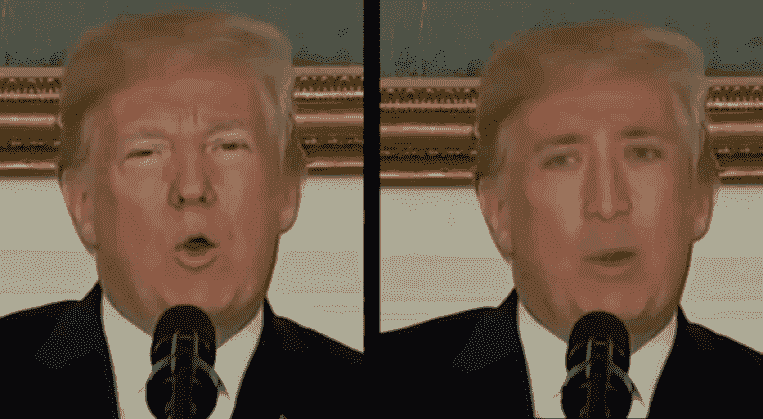

独立宣言？资料来源:奥尔巴尼大学

那么，一个人如何开始创造假图像呢？一种方法是使用 GAN，它是通用对抗网络的缩写，通常由两个卷积神经网络(CNN)组成。如果你想知道 CNN 以及它们是什么，请随意查看[的第一篇文章](/analytics-vidhya/computer-vision-ai-explainer-and-examples-1666b089263a)。

gan 最初是由蒙特利尔大学的 Ian Goodfellow 博士和他的团队在 2014 年引入的，后来使 Goodfellow 博士在人工智能社区中闻名。下面你可以看到 GANs 是如何在四年时间内快速发展的。

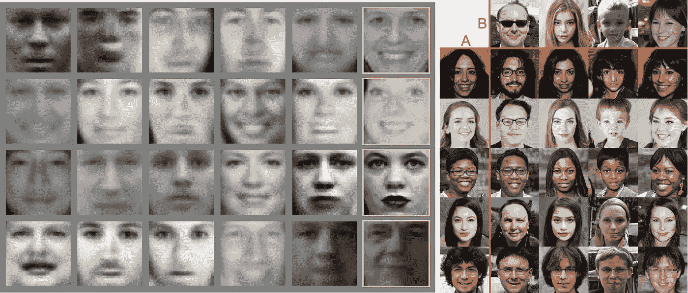

左图:GAN 生成的人脸( [Ian Goodfellow 等人 2014](https://arxiv.org/pdf/1406.2661.pdf) )。右图:GAN 从原始人脸 A 和 B 生成混合风格的人脸( [Nvidia 2018](https://arxiv.org/abs/1812.04948) )。

GANs 由两个主要组件组成，即生成器和鉴别器，我们将其缩写为 G & D。G 的作用是从随机输入中生成假图像来欺骗 D，D 的工作是确定哪些图像是真实的，哪些是 G 的假输出。

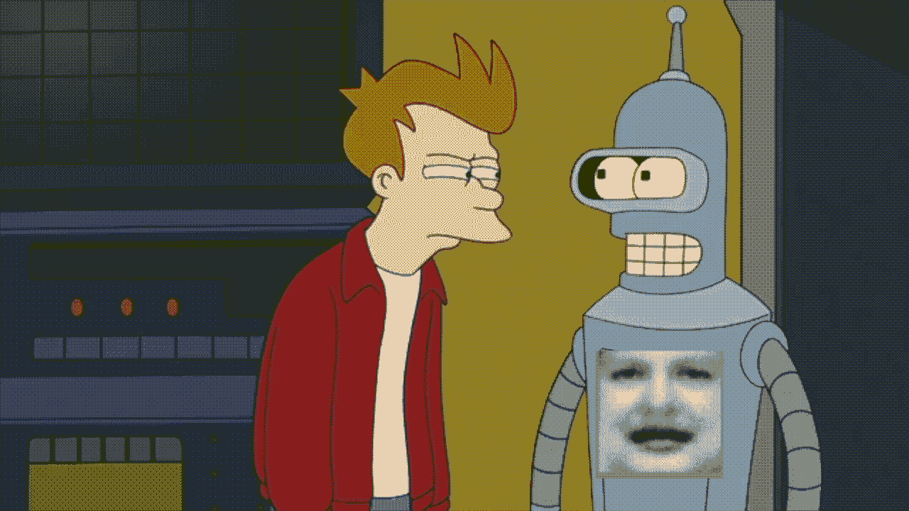

G & D 是在零和游戏中相互对抗的 CNN 类型，因此是“敌对的”。最终，我们的目标是达到一个均衡，在这个均衡中，D 总是不确定输入是真的还是假的，因为 G 已经变得足够擅长制造假图像，从而成功地愚弄了 D。

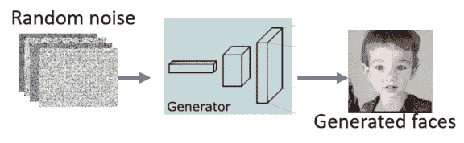

资料来源:[塔尔斯·席尔瓦](https://www.freecodecamp.org/news/an-intuitive-introduction-to-generative-adversarial-networks-gans-7a2264a81394/)

从随机输入开始，G 应用上采样层，上采样层是没有权重的简单层，使输入图像的维度加倍，并且需要从小得多的原始输入产生常规图像大小的输出。上采样层之后是传统的卷积层，它们学习解释加倍的输入并创建有意义的细节。总的来说，G 负责从潜在空间生成新的可信图像。

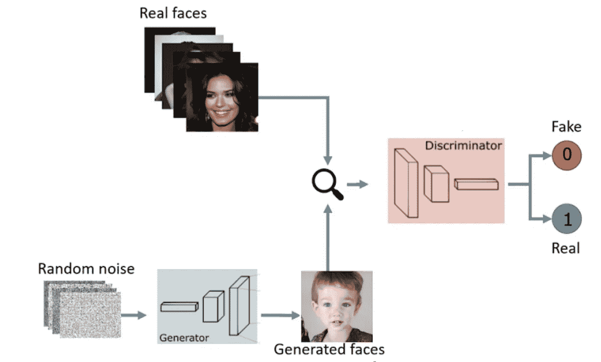

来源:[萨尔瓦夫·库尔帕蒂](/@sarvasvkulpati?source=post_page-----2620ee465c30----------------------)

来自 G 的假输出与真实图像一起被馈送到 D。d 的网络代表了一个更标准的 CNN，它的层数越来越小，输出的概率分数对于假图像更接近于 0，对于真实图像更接近于 1。所以对于 ***D(输入)= y _ 预测*** ，我们要 ***D(假像)= 0******D(实像)=1*** 。

为了实现这一点，D 试图最小化实际值和预测值之间的下列关系:

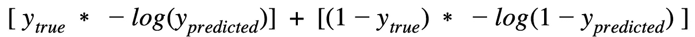

比如说:

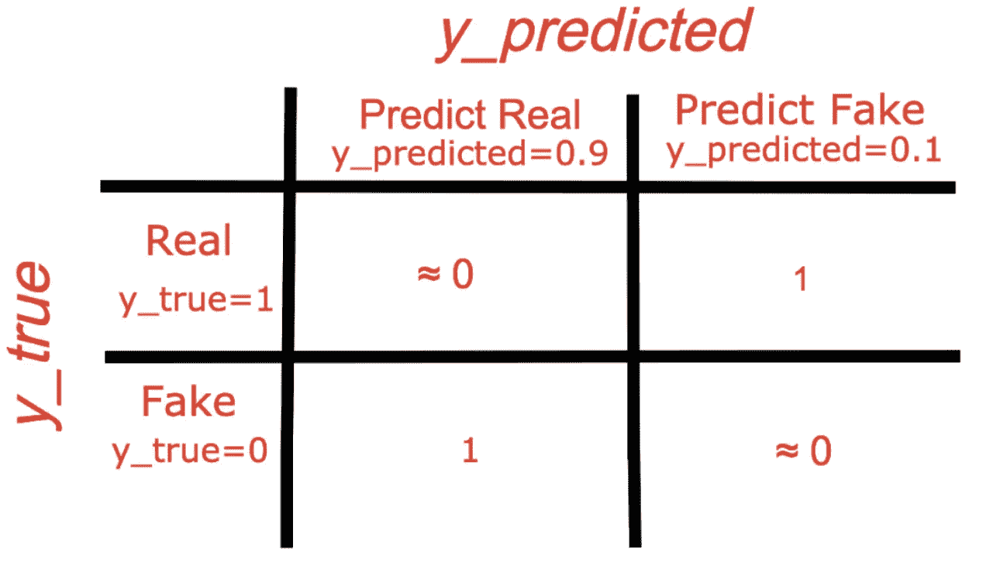

显示 D 是对错误预测值的惩罚。上面的等式被称为二进制交叉熵损失函数，并且其值被用于利用反向传播来更新先前的层参数。

另一方面，G 想要通过实现***【D(假图像)=1*** 来愚弄 D，因此寻求最小化:

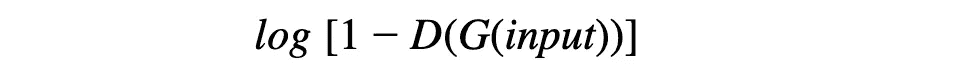

最终，这就有了 G 学习生成假概率低的图像的效果(从而滑了 D)。

D 和 G 之间的这种来回在训练中发生，直到达到一种平衡，在这种平衡中 D 不能“发现差异”。当这个完成后，我们就可以把 G 拿出来，用它来创造一些训练之外的新奇形象。例如:

用真人肖像捕捉更多的蒙娜丽莎的微笑，一个 GAN 被输入了人脸运动的视频(包括 7000 多名名人)，以再现适用于任何人脸的关键运动。

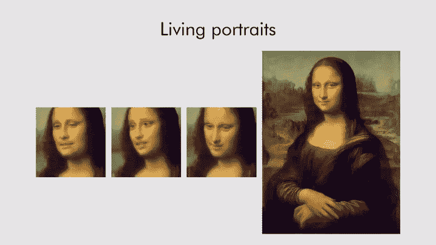

有了 [De-Rain](https://arxiv.org/abs/1701.05957) 这款图片编辑 GAN，可以去除图片中的雨雪。

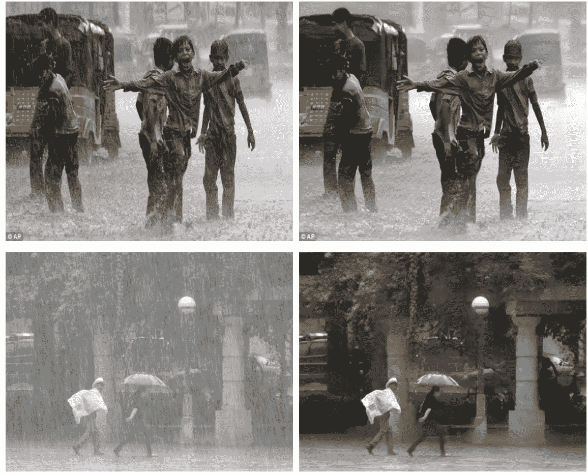

看下面，你觉得哪些图像是真的，哪些是假的？在最后回答

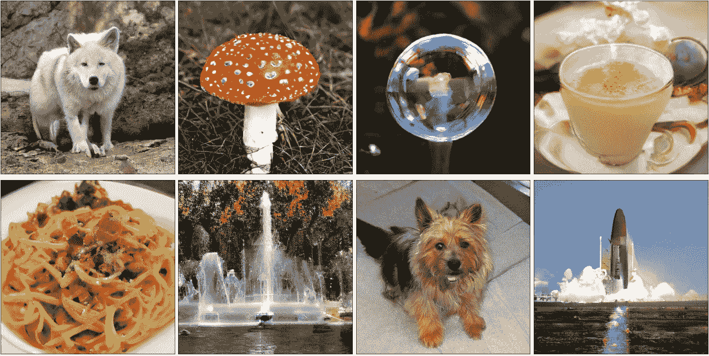

最后，你也可以自己试一试:

*   [甘风景网画家](http://gandissect.res.ibm.com/ganpaint.html?project=churchoutdoor&layer=layer4)
*   [创建自己的像素动画](https://pixel-me.tokyo/en/)

谢谢你坚持到最后，希望你学到了一些东西！也感谢 CT & VW 的编辑建议(他们很害羞，但我想表扬)。我在考虑下一个问题的反向传播，因为它被提到了很多，或者是递归神经网络。

数据科学家 Steven Vuong

欢迎评论、讨论和反馈:
[stevenvuong96@gmail.com](mailto:stevenvuong96@gmail.com)
[https://www.linkedin.com/in/steven-vuong/](https://www.linkedin.com/in/steven-vuong/)
[https://github.com/StevenVuong/](https://github.com/StevenVuong/)

对探险者来说:

*   https://machine learning mastery . com/impressive-applications-of-generative-adversarial-networks
*   [https://developers.google.com/machine-learning/gan](https://developers.google.com/machine-learning/gan)
*   [https://towards data science . com/understanding-generative-adversarial-networks-gans-cd6e 4651 a 29](https://towardsdatascience.com/understanding-generative-adversarial-networks-gans-cd6e4651a29)

回答:难猜？所有的图像都是高分辨率 [GAN 生成的图像。](https://arxiv.org/abs/1809.11096)