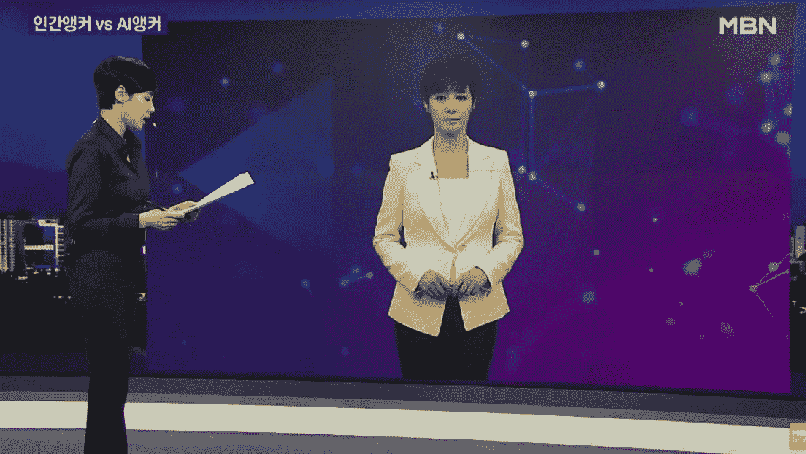
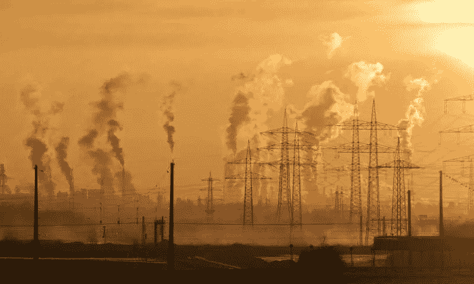
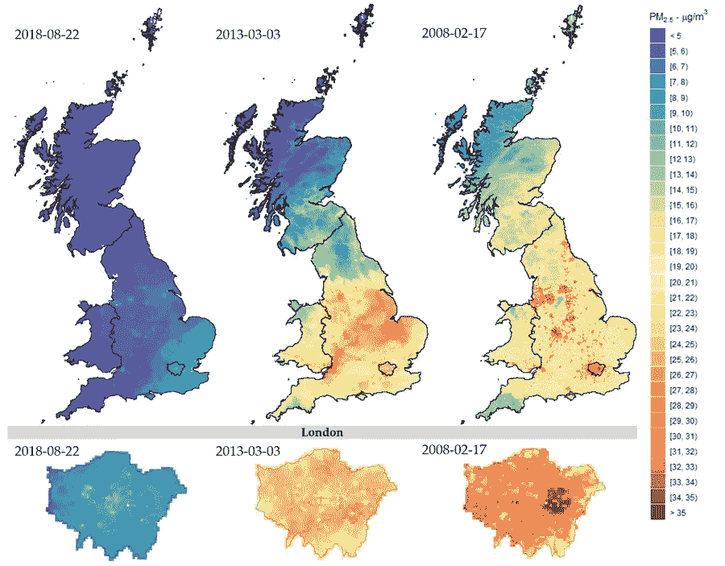

# 阿姆侮辱马克·扎克伯格的视频

> 原文：<https://medium.com/analytics-vidhya/deepfake-video-of-eminem-insulting-mark-zuckerberg-ad91f02237fa?source=collection_archive---------18----------------------->

*这是对一周内发生的一些人工智能新闻的回顾。*

通过使用产生模拟人类文字的文本的 GPT-3 技术，他们模仿了说唱歌手的声音。两个 YouTube 频道结合使用神经网络创造了一首阿姆风格的歌曲，在这首歌中，他似乎在责骂脸书的首席执行官。他们还得到了谷歌模拟阿姆声音的 Tacotron 2 系统的帮助。该视频看起来像是说唱歌手的一首真正的歌曲，尽管有些单词和短语不连贯。

## 韩国首次推出人工新闻主播

具有人工智能的虚拟主持人取自真实的记者，不仅模仿物理细节，还模仿她的声音、讲话、面部表情和动作。自 10 月份以来，虚拟主持人开始出现，观众的反应不一，有些人称赞他与原来的人很相似，有些人可能会害怕他。应该注意的是，这具有减少劳动力成本、在灾害情况下和其他紧急情况下的生产的优点。

## 他们用人工智能绘制了英国空气污染的详细地图

由于人工智能和卫星技术的结合，英国今天的空气污染的详细情况已经产生。这使得精确的空气污染浓度成为可能，在全英国 1 x 1 公里的范围内提供高度先进的每日更新细节。表明东南部是污染最严重的地区，并确定城市和工业区的热点。

## 深度学习有助于救火

快速准确的火灾探测对人类和环境都具有重要意义。使用人工视觉，具有类似于火灾特征的物体会给出错误的火灾探测。通过增加更深层次的视觉特征来更好地识别假阳性是一个挑战。科学家们提出了一个基于多尺度特征提取、隐式深度监督和通道注意机制的模型。这种新模型的结果表明，精度达到 95.3%，模型大小仅为 4.80 MB，便于在资源有限的设备中实现。

*感谢你的阅读，我希望你已经了解了一些新的东西。下一期再见。*