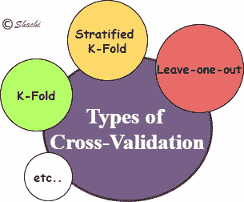
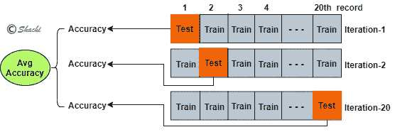
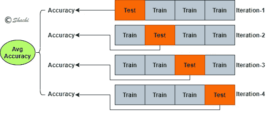

# 深入解释 ML/AI 中的交叉验证

> 原文：<https://medium.com/analytics-vidhya/deeply-explained-cross-validation-in-ml-ai-2e846a83f6ed?source=collection_archive---------4----------------------->

## **博客里程碑**

*   背景信息
*   为什么要交叉验证？
*   什么是交叉验证？
    -类型
    -应用
*   代码实现
    -手动
    -Scikit-学习库
*   建议和推论

呈现一个有趣的学习，关于如何处理 ML/AI 模型的训练和评估。博客将回答选择哪个模型，或者哪些是您的模型性能最佳的调整参数。*所以..
准备好！滚！就位。走吧。*

# 背景信息

在构建任何 ML 模型时，通常都要遵循某些步骤，如数据预处理、数据划分为训练/测试、训练和评估。从技术上讲，训练在训练集上进行，模型在验证集上调整，在测试集上评估。可以看出，来自相同整个数据集的不同数据集产生不同的度量分数，这造成了模型性能的不确定性。因此，交叉验证对于模型的精确估计是有意义的。

# 为什么要交叉验证？

为了创建模型，对训练数据执行训练，并对测试数据进行测试，这需要以以下不同方式划分整个数据。

1.  **使用全部数据作为训练/测试**
    模型使用全部数据进行训练和测试，有意义吗？得了吧，一点也不！让我们以这种方式，你为你的考试学习了 10 个问题，你的知识将在考试中根据同样的 10 个问题进行评估。Lol，你会得到 100 分。

**2。将数据分为训练和测试** 数据按比例分为训练和测试。这可以通过使用 sklearn 的 *train_test_split* 功能来实现。

每次运行代码时，使用 *random_state* 都会产生一组相同的随机数。因此，除非您更改 random_state 值，否则您的结果不会改变。如果不使用 random_state，每次运行代码都会得到不同的分数。所以，你不确定你的模型在看不见的数据上会有怎样的表现。
**这种不确定性在结果突起的交叉验证中变成了图画。**

**3。交叉验证** 数据虽然像 train_test_split 一样分为训练/测试，但事实上是在不同的数据集上重复训练和评估。这就像，你的数据被分成 5 次训练/测试，每次都被训练和评估。每次分割的方式都不同于之前的评估，并取所有 5 个评估结果的平均值。*仍未清除。不要担心，深入的解释仍在等待。*

我们多喝点。

# 什么是交叉验证？

交叉验证基本上是一种重采样技术，以确保我们的模型在未知数据上的效率和准确性。简而言之，模型验证技术，可用于其他应用。

**一组训练/测试分割——测试每个分割的精确度——对它们进行平均**

快速步骤为:
1:将数据分成 K 个分区。这些分区将具有相同的大小。
2:将 fold-1 视为测试 Fold，而将 K-1 视为训练 Fold。
3:计算测试分数。
4:对所有褶皱重复步骤 3，将另一个褶皱作为测试，同时保持为列。
5:取所有褶皱的平均值。

它将我们的数据划分为训练/测试，这样前一组数据就不会重复，并且对每一组数据只进行一次训练和测试。**每个分区** ( *又名折叠* ) **大小相等**。可以说，每一个数据点都是它人生旅途中的一次锻炼和考验。这是交叉验证的基本功能，在调整超参数或选择 ML 模型(如用于分类问题的逻辑或决策树)时非常有用。

它**通过选择 K **的最佳值来防止过配合和欠配合**。**同样，**比 train_test_split 方法更精确的模型估计**。

## 交叉验证的类型

图一

上面举例说明了常用的类型。让我们了解一下他们。

*   **留一交叉验证(LOOCV):** 这是一种非常古老的技术，已被 k 折叠和分层 k 折叠所取代，但在某些场景中仍然有用。**数据被分割成块，每块代表一个记录作为测试，而其余的作为序列**。每一条记录都被视为测试，并对每一条记录进行多次迭代评估。
    *我们来举个例子。*
    20 条记录的数据是指 20 个分区，每个分区有一条记录。这导致训练和评估的 20 次迭代。

图 2

在第一次迭代中，在第一个区块(褶皱)上测试模型，并在剩余的 19 个褶皱上测试模型，给出一个精确度。在下一次迭代中，将下一个记录作为测试集同时保持为训练集的另一个块给出了另一个精度。LOOCV 在 20 次迭代中对所有 20 条记录进行测试和训练，因此**计算能力昂贵**。然后计算所有组的平均值，并作为最终准确度(也称为 k 倍分数)抛出。

**优点:** ——当在看不见的数据上测试时，它给出了模型性能的确定性。

**限制:**
-与 train_test_split 相比，它需要更多的**计算能力**。
-由于一切都经过测试和训练，导致**方差**更高，测试 **生产**中看不见的数据**导致**结果不佳**。
结果可能导致**较高的变化**，如测试异常数据点时。**

*   **K 倍交叉验证:**

交叉验证的一种变体，其中**数据被划分为基于“K”**的训练/测试分区。这里，K 是指任何整数，而 fold 是指一个分区(或迭代)。模型在 K-1 个分区上执行训练，并在数据的第 K 个分区上执行测试。
***例为 4 重交叉验证，***
例为 20 条记录的数据，给出 4 重。数据分为 4 个分区。每个分区有(20/4=)5 条记录。

图 3

在第一次迭代中，模型在第一个区块进行了测试，并在剩余的 4 个区块进行了训练，结果是准确的。在下一次迭代中，另一个块作为测试集，同时保持为训练集，从而产生另一个精度。这一划分和评估过程针对所有 5 个折叠进行。计算所有集合的平均值，并将其作为最终精度，该精度被视为模型精度。

**优点:
-** 一定程度上克服了类似 LOO 中的计算能力问题。
-由于不是每个记录都像 LOOCV 一样被视为测试集，因此，如果数据中存在任何异常值，模型可能不会受到太大影响。克服了**可变性**的问题。

**限制:
-** 在任何迭代中，测试集都有可能只有一个类的记录。这将使数据**不平衡**并影响我们的模型。

*   **分层 K-Fold 交叉验证:** 这是 K-Fold 的**改进版本，其中现在每个 Fold 具有每个目标类的相同百分比的样本**。假设二进制分类的依赖类为 1/0。当只有类别 1 的记录落入测试集并且模型被训练和评估时，事情会出错，导致数据不平衡的情况。这样，分层就出现了。

## 交叉验证的应用

*   通过超参数调整改进模型
*   比较模型，帮助选择一个
*   为模型选择的最佳特性

有关实现，请参考此处的代码。

# 代码实现

交叉验证的关键基本上是评估作为测试集的每个折叠和它们的平均值。交叉验证的整个过程可以通过循环的**手动完成，也可以使用 sklearn 的库 **cross_val_score** 来完成。**

## 用手

根据下面的演示，
- KFold 类被实例化，folds 通过 *n_splits* 指定，因此是 5-fold CV。
-在每次迭代中循环迭代来自 KFold.split()
的训练/测试数据，
-数据被分割成一组训练/测试(就像 train_test_split 一样)
-对训练折叠进行逻辑回归训练
-计算测试折叠的准确度分数
附加每次迭代中测试折叠的分数，并取所有分数的平均值计算交叉验证分数。

## sci kit-学习库

Python 的 scikit-learn 库提供了交叉验证类来划分和计算平均分。
***cross _ val _ score***是 scikit-learn 库，它返回每个测试文件夹的分数，即每次迭代中的准确度分数列表。K-fold 是分数的平均值，通过取 cross_val_score 结果的平均值来推导。
***cross _ val _ predict***是另一个 scikit-learn 库，返回每个测试折叠的预测值。

默认情况下，整型 cv 参数假定为分层 K-Fold。如上所述，它是分层 5 倍。若要使用 K 折叠，请作为 cv=KFold(n_splits=5)传递。

# 建议和推论

*   当分类技术出现时，使用分层 K-Fold。
*   明智地选择 K 值，以保持任何模型更好地执行所需的偏差和方差的平衡。
    **较低的 k** 导致**更多偏差**，**更少方差**(欠拟合)
    **较高的 k** 导致**更少偏差**，**更多方差**(过拟合)
*   如果数据本身很小，k 倍就没有意义。在这种情况下，LOOCV 会被拖下水。

> **请找到我的** [**github 代码**](https://github.com/shachi01/machine-learning/blob/master/ml_cross_validation.ipynb) **来确认这篇博客中涉及的概念。**

# 参考

值得一看，以了解更多关于交叉验证。

借此机会访问这个[博客](https://www.analyticsvidhya.com/blog/2018/05/improve-model-performance-cross-validation-in-python-r/)，了解 CV 如何帮助改进模型。

如果你喜欢这个作者的博客，你可以自由关注他，因为他保证会回来分享更多有趣的人工智能技术。此外，如果有任何理解或概念上的错误，请随时告诉我。

谢谢，

快乐阅读！:)

***可以通过***[***LinkedIn***](https://www.linkedin.com/in/kaul-shachi)***取得联系。***