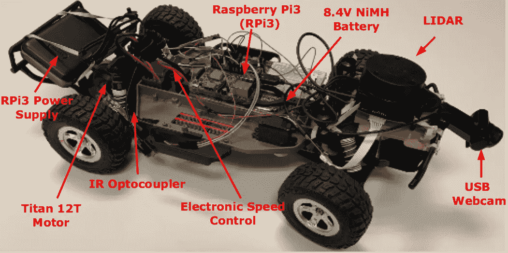
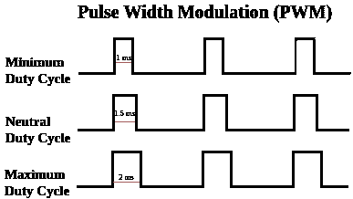
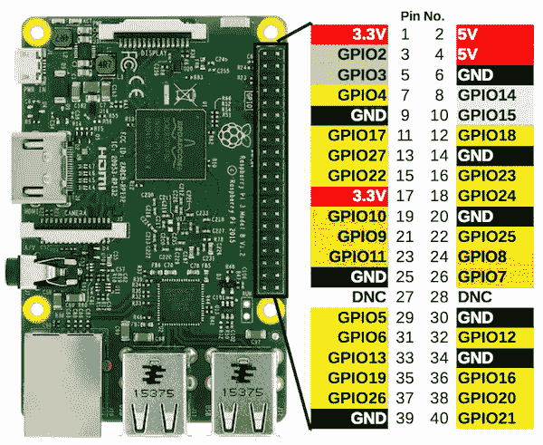
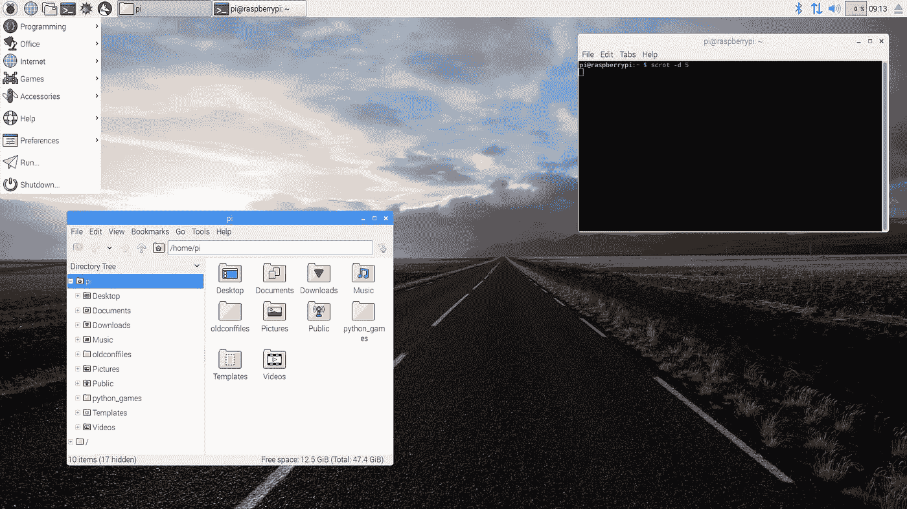
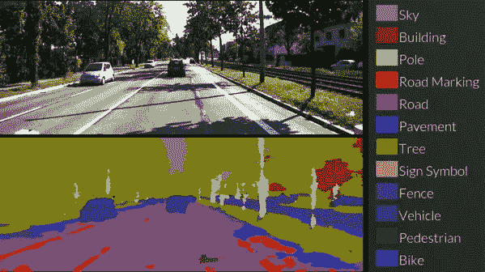
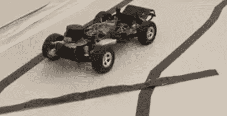

# DeepNNCar:自主算法的试验台

> 原文：<https://medium.com/analytics-vidhya/deepnncar-a-testbed-for-autonomous-algorithms-b0db1ec4770c?source=collection_archive---------28----------------------->

这是我在 Medium 上的第一篇博文！这篇文章的目标，也是这个博客的主题，是让技术变得容易理解和有趣。计算机科学在我们的生活中无处不在，但对许多人来说，它仍然遥不可及。然而，计算机科学的真正乐趣不是故意用术语和细节迷惑人们，而是给他们配备工具去*想象、探索并最终创造*。技术不能回答世界上的所有问题，但你不妨试一试。

和很多新事物一样，最难的往往是入门。所以在第一篇博文中，我要回到一个帮助我起步的项目: **DeepNNCar。**在这篇文章结束时，你应该对如何设计和驾驶你自己的自动驾驶汽车有了基本的了解，你可以在家里训练它！为了帮助解决这个问题，我们还将[作为我们的公共代码库](https://github.com/scope-lab-vu/deep-nn-car.git)。

这个项目得到了 DARPA 保证自治基金和美国国家科学基金会 REU 补充基金的支持。我还要特别感谢 Abhishek Dubey 博士、Shreyas Ramakrishna、Gabor Karsai、Ohad Beck 以及范德比尔特大学软件集成系统研究所 [SCOPE-lab](https://scope-lab.org/) 的其他同事，他们在以下出版物中使用了 DeepNNCar:

*   [支持学习的网络物理系统的动态加权单纯形策略](https://arxiv.org/abs/1902.02432)
*   [DeepNNCar:为自主机器人部署和测试中间件框架的测试平台](https://www.researchgate.net/publication/334417644_DeepNNCar_A_Testbed_for_Deploying_and_Testing_Middleware_Frameworks_for_Autonomous_Robots)

# 第一节。什么是 DeepNNCar？

DeepNNCar 是*深度神经网络汽车的组合词。*我在大二的时候在[范德比尔特的软件集成系统研究所](https://www.isis.vanderbilt.edu/)(是的 ISIS)设计了 DeepNNCar，作为一个研究项目的一部分。总的来说，DeepNNCar 只是一辆被黑出来探索不同自主算法的**遥控(RC)车**。



图一。DeepNNCar 组件

# 第二节。DeepNNCar:“硬”的东西

如果您对硬件不感兴趣，可以跳过这一部分。本节将快速概述 DeepNNCar 的硬件和一些必要的机械方面，以了解我们如何为自动驾驶提供转向和加速控制。

## 第一部分。硬件

DeepNNCar 是在 Traxxas Slash RC 车辆的框架上建造的，该车辆实际上可以超过 60 英里/小时。所以，快速声明一下，如果你在家尝试这个，你可能不想走那么快。然而，在现实中，任何遥控车将可能~工作~与这个系统，因为他们都有类似的控制。电压要求可能是您唯一的限制。因此，对于下面的零件列表，Traxxas 斜线 RC 是首选，但不是必需的。此外，如果你想交换电脑(我用的是 Raspberry Pi 3 ),请随意。

*   **遥控车:** Traxxas Slash 2WD 1/10 遥控车(ASIN b 07 GBR 4b 66)(230 美元)
*   **电脑:**树莓派 3 号(型号# 4328498196)(30 美元)
*   **摄像头:**通用 USB 网络摄像头(建议每秒 30 帧)(20 美元)
*   **电线:**跳线(零件号 b 0040 dei9m)(8-10 美元一包)
*   **电脑电源:**便携式充电器(20000 毫安时)(8-10 美元)
*   **存储:** 16 GB Micro SD 卡&u 盘(30 美元)
*   **(可选)速度传感器:** IR 槽式耦合器(零件号 723585712433) ($1)
*   **(可选)激光雷达:**任何合适的 USB 激光雷达(ASIN B07L89TT6F) ($150 或以上)

将 Traxxas Slash 车辆替换为更小的 RC 车辆可以轻松地为这个项目带来大约 100 美元。

## 第二部分。机械控制

DeepNNCar 和很多遥控车一样，有两个电机。第一个马达(伺服马达)控制转向，第二个马达控制加速。两个电机都使用**脉宽调制(PWM)进行控制。**为了分解 PWM，对电子马达的一些基本了解是有用的，但不是必需的。你总是可以跳到最后的代码。

**脉宽调制(PWM)和占空比**

最简单的形式是，想象一个由电灯开关控制的马达。当我们打开开关时，电机被提供总功率，当我们关闭开关时，电机不被提供功率。但是如果我们快速打开和关闭开关会发生什么呢？在特定的时间段内，我们可以通过开关来控制输送给电机的平均功率。做这个，维奥拉！我们有能力控制电动马达的输出。



脉宽调制(PWM)用于通过调节提供给马达的平均功率来控制深潜车的马达。

使用 PWM 的概念和上面的图 1，让我们解释加速电机是如何控制的。对于每 10 毫秒的间隔，传递给马达的平均功率决定了马达的功率，或者在本例中决定了 DeepNNCar 的速度。接通时间通常表示为间隔时间的百分比，称为**占空比**。为了安全起见，我们只允许每 10 毫秒间隔 20%或 2 毫秒的占空比，这样我们就不会在一个小实验室里达到 60 英里/小时。

下面的列表大致总结了哪些占空比对应于 DeepNNCar 和大多数 RC 汽车的控制。如果有疑问，如果你不使用 Traxxas Slash 汽车，你可以随时拿出一个[示波器](https://en.wikipedia.org/wiki/Oscilloscope)来精确测量你的 RC 汽车的电压尖峰。

**转向伺服系统(间隔= 10ms)**

*   10% (1 毫秒):左转
*   15% (1.5 毫秒):直线
*   20% (2 毫秒):右转

**加速电机(间隔= 10ms)**

*   14.5 (1.45 毫秒):每秒向后约 0.5 米(合理)
*   15% (1.5 毫秒):无运动
*   15.7% (1.57 毫秒):每秒向前约 1-2 米
*   20% (2 ms):玩得开心！(非常快，如果没有更快的计算，自主算法可能会失败)

## 第三部分。树莓 Pi 3

既然已经介绍了机械控制的基础知识，您可能想知道如何创建这些信号并将其发送到转向和加速电机！为此，我们使用了 [Raspberry Pi 3](https://en.wikipedia.org/wiki/Raspberry_Pi) 和一点连线魔法。

Raspberry Pi 3 (RPI3)是一台和你正在阅读这篇文章的电脑一样的电脑，但是有一些其他有趣的功能，计算能力可能更差(但是它只有 30 美元！).它可以运行操作系统(像 Windows，但它使用基于 linux 的免费 Raspbian stretch)，无线连接到互联网，并具有通用输入输出(GPIO)引脚，可以控制像电机这样的外围设备。相信我，这些东西不难用。如果您真的需要舒适的桌面体验，您可以将键盘和鼠标连接到 RPI3，登录您的 wifi，并浏览互联网！有关如何开始使用全新 RPI3 的详细说明，请参见[https://www.raspberrypi.org/documentation/](https://www.raspberrypi.org/documentation/)

目前，假设您有一台 RPI3，并且它连接到互联网。图 3。下图显示了用于控制 DeepNNCar 的 RPI3 的 GPIO 引脚。



图 3。Raspberry Pi 3 的详细 GPIO[1]。DeepNNCar 使用引脚 12 (GPIO18)和 35 (GPIO19)分别控制转向和加速电机。两台电机均由 5V 电源供电，并与 Raspberry Pi 3 共用一个接地(GND)。

DeepNNCar 使用引脚 12 (GPIO18)控制转向，使用引脚 35 (GPIO19)通过控制 PWM 信号来控制加速度。使用软件设置这一点可以很容易地在 Python 中完成。下面的代码片段展示了如何做到这一点。

代码片段 1。使用 Raspberry Pi 3 控制 DeepNNCar 的 Python 代码。有关控制 DeepNNCar 所有外围设备的代码，请点击此处[https://github . com/burrussmp/DeepNNCar-Research/blob/master/DeepNNCar/peripherals . py](https://github.com/scope-lab-vu/deep-nn-car.git)。

在上面的代码中， *init* 函数初始化 PWM 类。实例化的对象然后可以调用 changedutycycycle(ACC = XXX，steer=XXX)来调整加速度和转向值，其中输入范围为 10–20。关于我正在使用的 Python 库的详细信息，请[见此](http://abyz.me.uk/rpi/pigpio/python.html#hardware_PWM)页。

第四部分。用 RPI3 给电机接线

在我大二的时候，我用糟糕的技术破坏了很多树莓 Pi 3，所以希望你比我更小心。为了获得最佳和最安全的结果，引脚接线需要烙铁和绝缘胶带。首先，**再次检查 RPI3 和 RC car 是否都已关闭。布线非常简单，遵循一种颜色模式(太棒了！).一般情况下，**红色**表示电压，**黑色**表示接地，**白色**表示信号。要拆卸两台电机，将两台电机的**红色细线**连接到 RPI3 的 **5V 引脚**，将**黑色细线**连接到 **GND** 引脚。**

不要触摸红色和黑色的粗电线，它们是高压线，这样做可能会使实际上很贵的马达短路！

然后将**转向助力**的**白线**穿到**针脚 12** 上，将加速电机的**白线**穿到**针脚 35** 上。

对于所有的电气工作，在打开所有电源之前，要仔细检查，然后再次检查，确保针脚在正确的位置。如果打开后，没有烟，你可能没有燃烧任何东西，这是伟大的！希望一切正常:)

第五部分。连接摄像机&速度传感器

现在我们已经将树莓 Pi 连接到 RC 汽车，我们只需要再连接几个外围设备，主要是摄像头和可选的速度传感器和激光雷达。

可以通过将 USB 插入 RPI3 来连接 USB 摄像头。使用 openCV 库，它提供了有用的计算机视觉工具，我们可以使用相机配置和捕获图像。我们使用基于 USB 的激光雷达系统来提供方便的访问。然而，因为这是一个可选功能，我不会深入研究如何将激光雷达连接到 RPI3。

用于测量车轮转速的槽式红外传感器可通过交叉引用代码[中的 GPIO 引脚](https://github.com/burrussmp/DeepNNCar-Research/blob/master/DeepNNCar/Peripherals.py)与图 3 中的 GPIO 引脚进行连接。注意:要做到这一点，你可能需要用胶带或更好的 3D 打印一个小塑料片到汽车上，这样每次旋转，这个塑料片都会穿过红外传感器插槽。你也可以考虑用一个[霍尔效应传感器和一个磁铁](https://en.wikipedia.org/wiki/Hall_effect_sensor)代替速度传感器，这样你就不会有可能碰撞的运动部件。然而，这一部分是可选的，只是提供一些有用的信息。槽式红外传感器和激光雷达**不需要让 DeepNNCar 自动驾驶**。

# 第三节。DeepNNCar:“软”东西

好吧，好吧，如果你已经做到这一步，太好了。如果你跳过前面也很好。有趣的软件时间到了。

## **第一节。连接到 DeepNNCar**

为了连接到 DeepNNCar，我们使用安全套接字外壳(SSH ),它允许命令行访问 Raspberry Pi 3。为了连接到 SSH，Windows 用户可以使用类似于 [PuTTY](https://www.chiark.greenend.org.uk/~sgtatham/putty/) 的工具或者下载[Windows Subsystem for Linux(WSL)](https://docs.microsoft.com/en-us/windows/wsl/install-win10)以便能够从 Windows 计算机上执行 Linux 命令。下面的教程将使用 Linux 命令，所以如果使用 Windows，我强烈推荐使用 WSL。Mac 命令通常与 Linux 相似。

在接下来的部分中，我将假设 RPI3 已经正确连接，连接到互联网，并且已经在 RPI3 上启用了 SSH。要在 RPI3 上启用 SSH，请参见[此](https://www.raspberrypi.org/documentation/remote-access/ssh/)。

要连接到 RPI3，您首先需要知道它在本地网络上的 IP 地址。为此，您可以将 Raspberry Pi 3 插入显示器，并使用鼠标将鼠标悬停在 GUI 右上角的 WIFI/以太网图标(靠近蓝牙图标)上，如下图 4 所示



图 4。使用 Raspbian Stretch OS [3]的 Raspberry Pi 3 的 GUI。

对于本教程的其余部分，让我们假设 RPI3 的 IP 地址是 **10.112.52.129。**

**第一部分。SSH 进入 RPI3**

要使用 SSH 连接到 RPI3，在您的本地机器**上的 Linux 终端发出以下命令。**

```
ssh pi@10.112.52.129
```

然后会提示您输入一个**密码**。默认密码是*树莓*。如果这是您的密码，您可以在 RPI3 终端中输入 **passwd** 并按照提示进行更改。这一点非常重要，否则有人很容易远程入侵 RPI3。

但是，为了获得最佳安全性，您可以生成一个私有-公共密钥对，它将允许对 RPI3 进行无密码的 SSH 访问。幸运的是，Raspberry Pi 已经发布了[官方文档来完成这个](https://www.raspberrypi.org/documentation/remote-access/ssh/passwordless.md)！

**第二部分。成功克隆代码**

所以你已经成功地进入 RPI3 了！太好了！现在，你要开始驾驶了！为此，首先在本地机器和 RPI3 上克隆这个存储库**。**

```
git clone [https://github.com/scope-lab-vu/deep-nn-car.git](https://github.com/scope-lab-vu/deep-nn-car.git)
```

在 **RPI3 上，**发出以下命令，允许您使用 GPIO 控制 DeepNNCar，然后导航到 DeepNNCar 目录并运行脚本。

```
sudo pigpiod
cd DeepNNCar
python3 DeepNNCar.py
```

如果您已经安装了所有必要的 python 包(openCV、tensorflow、keras 等),您应该会看到 RPI3 服务器成功启动。否则，请花时间下载必要的软件包。注意:Python3 在所有代码中都有使用。

在您的**本地机器上，代码库中的**导航到控制器文件夹，并将 **main** 方法的第一行中的 IP 地址更改为您的 IP 地址。举个例子，

```
# in ./Controller/Controller.py
if __name__=="__main__":controller = DeepNNCarController(IP = "**10.112.52.129**",Port = "5001", maxForwardRange = 1)
```

然后在终端中使用 python3 Controller.py 执行代码。

第三部分。开 DeepNNCar！

在本地机器上启动客户机代码(Controller.py)时，您应该看到本地机器连接到 RPI3 服务器。然后，您将在本地计算机上收到配置操作模式的提示。DeepNNCar 支持下述四种驾驶操作。

**模式 1:正常**

在正常模式下，您可以使用计算机的鼠标控制 DeepNNCar。将鼠标放在屏幕右侧将导致右转，放在左侧将导致左转。您也可以将鼠标放在更靠近电脑顶部的位置。在这种模式下，摄像机不会收集任何数据，也不会执行任何自动算法。这只是为了看看是否一切都已正确布线，汽车可以从您的本地机器远程控制。

**注意:**不再支持使用 Xbox 手柄控制 DeepNNCar。

**模式二:直播**

在直播模式下，你可以像在普通模式下一样控制汽车，但你也可以在本地机器上从 USB 摄像头实时接收图像。这有助于确保相机设置正确，并且您可以从汽车中收集良好的数据。

**模式 3:数据收集**

在数据采集模式下，您可以指定要采集的数据点数。默认情况下，数据点包括摄像机捕捉的图像以及转向和加速 PWM 控制的相应占空比。

为了正确配置数据收集模式，以便在收集后将数据上传到 google drive，中的以下功能。/Controller/HelperFunctions 需要一些更改。也就是说，需要更改 pathToClientSecrets 和 google drive folder_id。设置 Google Drive API 的教程可以在[这里](https://www.google.com/search?q=google+drive+client+secrets+api&oq=google+drive+client+secrets+api&aqs=chrome..69i57j0l6j69i64.5966j0j4&sourceid=chrome&ie=UTF-8)找到。这是必要的，以获得客户的秘密，让你在一个程序中访问你的谷歌驱动器。您可以将这些秘密(它只是一个. json 文件夹)视为凭证，以验证您确实是您，并且您可以将文件上传到您的驱动器。

**注意:**由于需要点击重定向到 OAuth 以批准上传，所以客户端机密应该位于本地机器上。这看起来是在收集数据之后，DeepNNCar 通过 WIFI 向本地机器发送数据集。之后，您将看到一个浏览器窗口弹出，通过登录相关的 Google 帐户来授权上传。

代码片段 2。将 csv 文件上传到 google drive 文件夹的助手功能。

一般来说，3000 是在不使 RAM 过载的情况下收集数据点的合理数量，同时还具有合理的上传速度和数据集大小。显然，如果您选择使用高分辨率相机或捕捉比默认的 320x240x3 图像更大的图像，这种情况将会改变。

最后，将 CSV 数据集读入 X 和 Y numpy 数组的方法可以转换为张量来训练神经网络[这里可以找到](https://drive.google.com/open?id=1ajs-7V0IYXD8OckN2TUVR7fBB8ZqImbB)。

**模式 4:自主模式**

要测试一个自主算法，可以使用。/DeepNNCar/DeepNNCar.py 可以更新。目前，DeepNNCar 支持使用卷积神经网络(CNN)来处理从相机收集的图像，并产生转向控制。神经网络的权重被存储并从 USB 驱动器加载到预定义的 CNN 架构中。

为简单起见，可以将数据集分成一个分类任务。训练分类器的例子可以在这里的[中找到](https://drive.google.com/open?id=1ajs-7V0IYXD8OckN2TUVR7fBB8ZqImbB)，其包括预先离散化的分类数据集。这个 google colab 笔记本展示了如何加载数据集和训练一个基本的分类器以及一个更复杂的深层径向基函数(这超出了这篇文章的范围，但可以用来同时提供预测和拒绝类)。此外，google colab 笔记本具有读入 CSV 文件的功能，该文件包含由 DeepNNCar 直接收集的数据集，可用于训练回归网络。深入培训的细节超出了这篇博文的范围；然而，将来可能描述训练程序以及围绕深度神经网络和深度径向基函数网络的理论。总的来说，我们的研究实验室使用 NVIDIA 的 DAVE-II CNN 架构的修改版本[2]，用于**端到端自动驾驶**。它被称为端到端，因为控制(转向输出)直接来自使用卷积神经网络(CNN)的输入，中间没有处理或决策。显然，信任一台机器而不做任何决定是一个糟糕的想法，但为了简单起见，这显示了自主模式是如何工作的。

**其他配置细节**

选择模式后，系统会提示您输入其他配置详细信息。为了获得最安全的性能，请使用“用户控制”来控制加速；为了获得最佳性能，请禁用所有反馈(如 CPU 温度、CPU 利用率等)。

在完成最后的配置后，您将能够探索收集数据和探索各种自动驾驶算法。代码也是模块化的，以允许(希望)轻松扩展到其他算法，如 SLAM 或基于激光雷达的导航。如果有任何酷的发展，我们希望人们[联系我们，让我们知道他们做了什么！](https://scope-lab.org/)

# **第四节。我能用这个做什么？**

如果你真的完成了整个教程，我会很惊讶(也很高兴！)但就像我得到的所有东西一样，最重要的是，你需要知道如何使用它，什么是重要的，以及你为什么要关心它！在我的研究中，我使用 DeepNNCar 将自动驾驶 CARLA 模拟器上进行的模拟扩展到现实生活中，以探索实时安全程序的影响。我的硕士论文部分探讨了这个问题，可以在这里找到。然而，肯定有更多有趣的事情可以做，我强烈鼓励使用[预先收集的数据集来探索新的和令人兴奋的领域，并以此为起点编写我的代码](https://drive.google.com/open?id=1ajs-7V0IYXD8OckN2TUVR7fBB8ZqImbB)！

**想法一。弱监督分割**



图 5。使用 SegNet 进行分割([https://www.youtube.com/watch?v=CxanE_W46ts](https://www.youtube.com/watch?v=CxanE_W46ts))

计算机科学中一个更有趣的主题是*分割*，它是分类的扩展。分类任务试图将离散标签分配给特定输入。例如，二进制分类器可能尝试对汽车和自行车的图像进行分类，其中输出 0 表示汽车，输出 1 表示自行车。分割通过给输入的每一部分分配特定的标签来扩展这个概念，并且直观地最好地处理图像数据。

您可能知道，图像被表示为**像素**，其中每个像素包含 3 个值，对应于输入的红色、绿色和蓝色(RBG)通道。在二进制分割类中，每个像素被赋予值 0 或 1；但是，当您有 k 个要分类的类时，可以通过为每个像素分配 0、1…或 k 来扩展到多类任务。

分割的问题在于它需要标记大量的数据，而这并不总是可能的。例如，如果我们的输入是一个 200x66x3 的图像，我们有 200x66 像素或 13200 个标签要分配。手动标注太多了！

这个问题的一个解决方案是弱监督分割。只需查看所有的[文献](https://scholar.google.com/scholar?q=weakly+supervised+segmentation&hl=en&as_sdt=0&as_vis=1&oi=scholart)。它被称为“弱的”,因为我们不是标记每个像素，而是仅提供粗略的“估计”或关于地面真实分割或我们希望能够预测的部分信息。

一种流行的技术是使用边界框来生成属于单个类的像素的粗略估计；然而，即使这种技术也很困难，因为首先我们必须检测各种类别(如道路、路标等)。)并想办法在它们周围放置一个边界框。已经有工作使用来自标签的弱监督来支持检测和分割[4]。然而，将此扩展到现实的多类情况是困难的。但也不是不可能:)

利用创造力，这可以得到解决，并可能在 DeepNNCar 上实现，以显示仅使用类别标签的实时多类别、弱监督分割。一种方法可以是使用通过逐层相关性传播收集的热图，或者查看多类模型在分类中发现什么是感兴趣的某种方式，以首先执行基本检测机制。接下来，您可以对热图进行分段，但仍然会缺少特定的类别标签。这就是事情变得有趣的地方！一种方法可以是查看类分数，并简单地将所有强热图的基本事实输出分配给该概率分数；但是，很可能可以找到更好的方法！希望这是你可以进来的地方！

**思路二:开集问题**

“开集识别”问题是分类任务中的一个普遍问题，并且是许多计算机视觉任务的核心。例如，如果我们正在确定一幅图像是“道路”还是“停车标志”,我们可能还想知道它既不是道路也不是停车标志。对这个未知类别进行可靠分类的能力是开集问题的解决方案。



图 6。使用异常探测器的深潜车能够在遇到异常时停下来。视频请看这个[链接](https://drive.google.com/drive/folders/10Ek4SH2mBVL-M8pUb7pH-dT_qGDcblDs)。使用深度径向基函数(RBF)网络设计的异常检测器的描述可以在[这里](https://www.linkedin.com/posts/matthew-burruss-6034a2126_masters-thesis-activity-6646062841801555968-RWdl)找到。

解决这个问题最简单的方法是使用一些异常检测器。例如，[自动编码器](https://towardsdatascience.com/anomaly-detection-with-autoencoder-b4cdce4866a6)已经被提出使用自动编码器的潜在空间来发现异常。甚至更简单的[单类支持向量机已经被提出](http://rvlasveld.github.io/blog/2013/07/12/introduction-to-one-class-support-vector-machines/)来判断它是否是我们训练过的数据。然而，这些技术的负面影响是需要第二个模型与进行主要预测的模型一起运行。

在我的研究中，我部分地解决了这个问题，使用径向基函数(RBF)网络有一个拒绝类来捕捉这种异常。DeepNNCar 使用 RBF 网络捕捉异常并防止崩溃场景的视频可以在此处找到[，以及论文演示视频](https://drive.google.com/drive/folders/10Ek4SH2mBVL-M8pUb7pH-dT_qGDcblDs?usp=sharing)描述了用于减轻深度神经网络分类器面临的其他安全威胁的深度径向基函数。

未来的工作可以看看径向基函数或一些新技术如何降低他们的信心，或者能够检测到光照的变化，图像中可能的遮挡，旋转问题等。这可能会导致 DeepNNCar 或其他模型做出危险的预测。此外，人们可以实时使用这些防御措施，只需向 DeepNNCar 发起一系列攻击，看看它是否能够抵御这些攻击。这种解决方案不仅对自动驾驶有影响，而且对许多其他任务也有影响，如医学图像分析，其中异常不仅常见，而且对决策非常重要！

**想法三:你自己的工作！**

如果您对 SLAM 等计算机视觉技术、强化学习(RL)等其他自主算法或 LIDAR 等硬件特定算法感兴趣，您可以使用 DeepNNCar 来了解自动驾驶汽车如何受益于此类算法。我认为这真的是一个令人兴奋的领域，因为我只能想象人们有了它会有多么有创造力！

# 第五节。总之…

DeepNNCar 是我在大学二年级时做的东西，在一个夏天里，我不打算撒谎，它是我存在的祸根(哈哈但不是开玩笑)。主要是因为我遇到了那么多意想不到的拦路虎，但我也学到了很多，也很欣赏那种回头看的感觉。希望人们可以使用本教程直接使用 DeepNNCar，或者借用一些代码来实现他们自己的自主算法想法。

你不能给我钱让我进入一辆由我在 DeepNNCar 上运行的算法控制的汽车，老实说，我不认为我们会离开车道。但这不是这个项目的重点！世界上有这么多有趣的问题需要解决，这只是我了解计算机科学如何应用于实际问题以找到真正解决方案的途径。

如果我可以就这个项目给大二的我任何建议，那不会是任何遥远的技术或与 DeepNNCar 特别相关的东西，而是更早地参与这个项目或至少类似的东西，因为你不知道你会发现什么新东西。

对于直接的反馈或问题，请私信我交换电子邮件地址或直接在下面的评论中发布。干杯！

# 来源

[1]《C 语言中的 Raspberry Pi GPIO 编程:大混乱 o' Wires》， *BMOW* 。【在线】。可用:[https://www . bigmessowires . com/2018/05/26/raspberry-pi-gpio-programming-in-c/。](https://www.bigmessowires.com/2018/05/26/raspberry-pi-gpio-programming-in-c/.)【访问时间:2020 年 3 月 30 日】。

[2] Bojarski，Mariusz 等，“自动驾驶汽车的端到端学习” *arXiv 预印本 arXiv:1604.07316* (2016)。

[3]斯隆。“介绍像素”树莓派博客。【在线】。可用:[https://www . bigmessowires . com/2018/05/26/raspberry-pi-gpio-programming-in-c/](https://www.raspberrypi.org/blog/introducing-pixel/)。[访问日期:2020 年 3 月 30 日]。

[4]冯，信阳，等.“基于细胞神经网络的肺结节弱监督分割的判别定位方法”*国际医学图像计算和计算机辅助介入会议*。施普林格，查姆，2017。