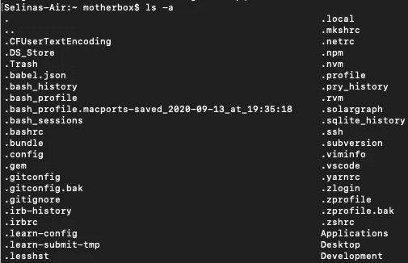

# 定义自定义 git 命令

> 原文：<https://medium.com/analytics-vidhya/define-custom-git-commands-e47106cd3075?source=collection_archive---------16----------------------->

在我的训练营笔记本的第十二页上，我有以下的笔记。这是迄今为止我翻得最多的一页。

```
PUSH CHANGES1\. git add .
2\. git commit -m "message"
3\. git push origin mavSWITCH TO MASTER1\. git checkout masterMERGE
in master,
1\. git merge mav
2\. git pushSWITCH BACK1\. git checkout mav
```

即使在做了这个小备忘单几个月之后，笔记本通常会打开这一页，这样我就可以确定我没有忘记任何东西。

每次我执行这个序列的时候，我的一小部分会想“一定有办法让我做一些宏，跳过所有这些浪费的时间，压缩命令”。

下面是一个 Mac 环境的教程。我知道在 Windows 上类似，但是我不想给出我没有测试过的建议。

# 打开。bash_profile

在您的主目录中，有一个名为。bash_profile”。您可以使用终端命令列出所有隐藏的目录:

```
ls -a
```



不要！我的秘密！

或者在 Finder 中按下 command-shift-句点。

用文本编辑器打开 bash_profile。

bash_profile 允许您以多种方式定制您的终端(更准确地说，您的 shell)。我们今天要使用的功能是**别名**。别名是您定义的自定义宏。我们可以将新的别名添加到。bash_profile 文件。(我们也可以在**这样做。巴沙尔**或**。轮廓**，达到大致相同的效果。这三个文件都配置了 shell。)

例如，我们刚刚使用了“ls -a”命令。比方说，我们希望能够少击两次键。我们可以使用下面的行:

```
alias lsa='ls -a'
```

现在我们可以只输入“lsa”而不是“ls -a”。(要使我们的更改生效，我们必须先重启终端)。

我们可以使用分号来组合几个命令，创建宏。

```
alias lsa='clear; ls -a'
```

这将清除终端窗口，然后列出文件。

别名是简单的文本替换，但是我们可以更进一步，编写函数。Bash 毕竟是一种语言。

```
function repeat {
  echo $1 
}
```

“$1”是该函数接收的参数。《回声》是巴什的作品。所以这个函数允许我们告诉终端重复一些东西给我们:

```
repeat hello
#=> hello
```

这就是我们在这里的 git 目的所需要的。如果你想了解更多，上面的链接很棒。

# 我的解决方案

以下是我添加到 bash_profile 中的内容。

```
function gacp() { git add . ; git commit -m "$1" ; git push; }alias gcmpc='git checkout master; git merge mav; git push; git checkout mav'
```

该函数接受一个参数，然后执行 **git add。**、 **git commit** 带参数、 **git push** 。现在，每当我想执行这一系列动作时，我只需键入“gacp”即可。

别名执行合并—切换到主节点，**合并**，**按下**，切换回来。我只需输入“gcmpc”(我擅长给事物命名吗？下面附和)。当然这只在我的分支被命名为“mav”时有用，所以它不会对每个项目都是理想的。