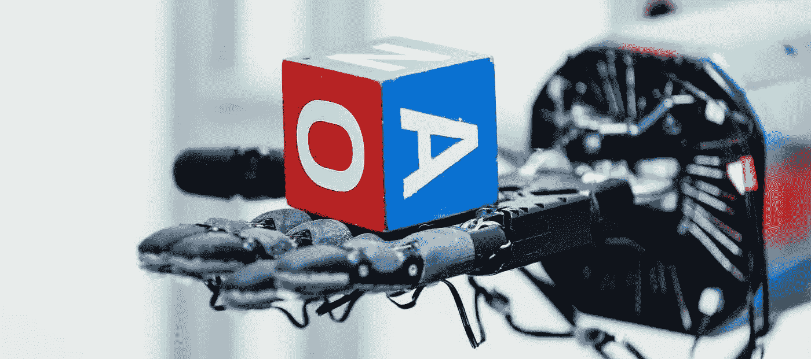

# OpenAI 的 GPT3 API 的产品创意汇编

> 原文：<https://medium.com/analytics-vidhya/definitive-product-ideas-compilation-for-openais-gpt3-api-784d242449aa?source=collection_archive---------10----------------------->

互联网上正在热议 OpenAI 最新的人工智能语言模型 GPT-3 福布斯报道。在人工智能的黎明，机会比比皆是。假设你已经从《福布斯》的文章中收集了基本知识，我们将设计一些应用程序，从最明显的到更微妙和深刻的想法。

## 明显的想法

*   创造性写作，特定风格的剧本写作。
*   内容写作:从搜索引擎中挖掘摘录。用 GPT3 总结、转述、综合成一篇文章。
*   报告生成:例如，根据患者遭遇记录撰写部分临床记录，或根据公司新闻和基本面撰写高质量的股票研究报告。
*   语义搜索:由 OpenAI 演示。给定一个案例和一大篇参考文章，帮助律师找到相关的法规或医生找到相关的指南。谷歌搜索已经用 BERT 做到了这一点，但 GPT-3 将查询的可能复杂性提升到了另一个层次。

## 坏主意

*   通过微调他人的推文、评论来扮演他人...为了喜剧，或者恶意。一些我们必须防范的东西，比如深度假货。
*   武器化的宣传:产生虚假的产品评论、论坛评论……最坏的情况是机器人——危险，类似于大规模洗脑。

## 无聊的想法

*   自然查询语言(NaQL，在 SQL 之后:)我们可以向 GPT3 询问任何文档或表格上的任何问题，它会很乐意挖掘信息。例如，给定一个自由文本医疗记录，您可以告诉 finetune GPT3“列出患者当前的哮喘药物”通常，您必须解析文档以提取实体，对它们进行分类以获得药物，将它们规范化为本体，考虑否定和时间上下文，并使用知识图或数据库来确定哪些与哮喘相关。需要精通 NLP 的机器学习工程师来创建管道。现在一个(聪明的)高中生都能做到！许多软件工程和数据科学关注于(重新)结构化数据，然后用严格的逻辑对其进行处理。GPT3 消除了这种僵化，**允许我们用英语教学，而不是用代码编程。一些人称之为“元工程”**
*   将非结构化数据转化为结构化形式:与上面类似。参见 OpenAI 关于自动生成汇总表的演示。
*   程序合成(自然语言编译器):参见从英语规范创建函数式 React 组件的演示。
*   让软件工程师失业；)虽然说实话，代码越少越好。

## 基础设施+生态系统理念

*   计算机变成了电。GPT 将成为计算商品化的基础设施。
*   做一个类似 OpenAI 的 API 的产品。虽然现在还为时过早。OpenAI 花了 1200 万美元在一个巨大的 GPU 集群上进行训练，但随着架构的改进，达到同等性能所需的计算量以类似摩尔定律的方式每年减少一半。为 GPT3 供电的变压器只有 3 年的历史，你可以对密集的注意力层进行大量的优化和压缩。参见谷歌的压缩变形金刚和稀疏变形金刚。所以还是等技术成熟吧。
*   打造一个中国的 GPT3，让巴巴或者腾讯或者百度快速收购。日语或法语版本也能吸引资本。
*   加分:在 ASIC 上实现。对阅读本文的电气工程师同仁大声喊出来:)同样的逻辑，考虑到算法变化的快速步伐，我至少会等上几年。但还记得 Bitman 的 ASICs 是如何在比特币挖矿中套现的吗？所以最终可能会有一出戏
*   Github 用于提示或微调模型:marketplace 用于提示推动 GPT3 执行各种任务，或者微调模型用于更复杂的任务。

关于为 GPT3 供电的变压器的深入而简明的解释，请阅读彼得·布鲁姆的《http://www.peterbloem.nl/blog/transformers 的 T2》。关于创业公司生产 GPT3 的挑战，请阅读马克斯·伍尔夫的《https://minimaxir.com/2020/07/gpt3-expectations/的 T4》

就我个人而言，我正在使用临床记录和生理信号在医疗保健领域进行预测建模。尽管我很乐意给你任何关于 GPT 或者变形金刚的建议。