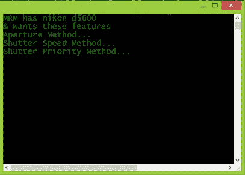
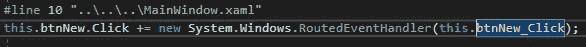

# C#中的委托-第 1 部分

> 原文：<https://medium.com/analytics-vidhya/delegates-in-c-part-1-3c577a7a5c52?source=collection_archive---------30----------------------->

带示例的代表初学者指南

## **委托-(名称空间:系统。代表)**

**定义:**委托是一种类型，它安全地**封装了**一个方法，类似于 C 和 C++中的函数指针。与函数指针不同，委托是**面向对象的**、**类型安全的**和**安全的**。委托的类型由委托的名称定义。

(以上定义来自 **MSDN** 。)

运筹学

委托是一种引用类型，它保存对**方法**或**方法**的组的引用

对于初学者来说，这些术语中的一些可能很陌生，人们可能会有几个问题:

问题 1-如何声明和实例化一个委托？

问题 2——如何将方法与它联系起来？

问题 3——在现实世界中，这些委托用在哪里？我是否有意或无意地遇到过它们？

让我们回到前两个问题:

## 问题 1——如何声明和实例化一个委托？

## 问题 2——如何将方法与它联系起来？

*语法:委托<返回类型> <委托名称> <参数表>*

**声明** *:-公共委托 int my delegate(string s)；*

" **MyDelegate** "这是一个接受字符串作为参数并返回整数的委托。委托和它希望引用的方法必须有**相同的签名**。

## 实例化一个委托&将一个或多个方法关联到它。

使用 **new** 关键字实例化一个委托，并将其与一个方法相关联。

例如: ***公共委托 int NumberTailor(int x，int y)****；*

我们是这样实例化它的:

***var delegate 1 = new number tailor(delegate helpers。add numbers)；***

***var delegate 2 = new number tailor(delegate helpers。多乘数)；***


函数和委托签名应该相同。

然后我们调用这些方法:

***控制台。WriteLine(delegate1(10，29))；***

**控制台*。WriteLine(delegate 2(252500))；***


通过委托调用方法及其输出。

正如前面在声明部分提到的，委托可以用来调用任何与其签名匹配的方法，但是，函数必须严格遵守其签名，否则它会抛出编译错误(后面显示的例子)。

## **组播代理**

我们现在来看一个例子，在这个例子中，我们可以向委托添加对多个方法的引用。

```
class DelegateHelpers{public static string TamperWithEvidence(string evidence){var tamperedEvidence = string.Empty;if (evidence.ToLower().Contains(“evidence”)){tamperedEvidence = evidence.Replace(“evidence”, “***d****”);}return tamperedEvidence;}public static string DoNotTamperWithEvidence(string evidence){return string.Empty;}}
```

上面的代码是我们将通过委托引用的两个方法中的一个。注意这里，**donottamperwitheevidence(string)**方法总是返回一个空字符串，而**tamperwitheevidence(string)**则返回一个被篡改的证据字符串。

```
class Program{public delegate string StringTailor(string str);static void Main(string[] args){var stringTailor = new StringTailor(DelegateHelpers.TamperWithEvidence);//stringTailor += DelegateHelpers.DoNotTamperWithEvidence;var oldString = “The was evidence against him.”;var newString = stringTailor(oldString);Console.WriteLine(“old string = “ + oldString+ “\nnew string = “ + newString);}}
```

上面的代码是我们的主要方法，其中我们通过委托调用我们的方法。这里需要注意的一点是，我们已经用**注释掉了向委托**添加新方法引用的那一行。让我们看看同样的输出。


没有多播委托的输出。

**可以使用“+=”将多个方法分配给一个委托，**让我们通过查看同一个示例来理解流程，只是我们取消了“+=”的注释。

```
class Program{public delegate string StringTailor(string str);static void Main(string[] args){var stringTailor = new StringTailor(DelegateHelpers.TamperWithEvidence);stringTailor += DelegateHelpers.DoNotTamperWithEvidence;var oldString = “The was evidence against him.”;var newString = stringTailor(oldString);Console.WriteLine(“old string = “ + oldString+ “\nnew string = “ + newString);}}
```

请注意，我们已经取消了对行**“string tailor+= delegate helpers”的注释。请勿篡改证据，**并且由于该方法的引用是最后添加到委托中的，因此它将最后执行，这意味着我们应该总是得到作为 **sting 的输出。空的**，因为委托**遍历了**所有被引用的方法。

**输出:**


返回单个值和解释的多播委托的输出。

## **将委托作为参数发送:**

设置类是我们打印相机设置的类。


设置类。

**Camera** 是接受委托然后调用设置类的类。


委托的相机类。

注意我们是如何在这里声明委托的，以及我们是如何将委托作为动作<setting>传递的，其中设置是一个类。</setting>

我们在 Main()中调用 Camera。


委托动作<setting>的主要方法和传递。</setting>

请注意，我们在这里只添加了设置类的三个方法的引用，结果可以在下面的输出中看到:



输出仅显示添加到操作项的方法。

注意**只有三个方法**被**调用**，这三个方法被我们明确地**添加了****引用**到我们的 **ActionHandler** 。AutoISO()被调用，因为我们没有将它添加到操作项中。

## **代表的属性**

1-代理允许**方法**作为**参数**被**传递。**

2-委托类似于函数指针，只是它们是**类型安全的**

**类型安全:**如果我们试图传递一个方法给不**“匹配模式”的委托，**我们将收到一个编译时错误**“方法不匹配委托模式！***。这里，模式意味着参数的类型和数量*

**

***当**委托**的**签名**与**方法**的**不一致**时，出现错误**消息。*

*3-委托可用于定义**回调方法**。*

***回调方法/函数:**一个**回调**是当一个进程完成执行一个特定任务时被调用的函数。回调在异步逻辑中使用。要创建一个回调，你需要**在一个变量中存储**一个函数地址，这是使用**委托**或新的 lambda 语义 **Func < >或 Action 实现的。***

*4- **事件** **处理**是使用委托完成的。*

**

*WPF 应用程序上单击事件的事件处理程序，将该事件分配给 **btnNew_Click()。***

**

***RoutedEventHandler** 是来自 C#的基本**路由事件处理程序**委托。*

*上面的例子是**隐式**使用 Visual Studio 2017 或更高版本创建事件时完成的。这是对问题 3 的回答，既是现实世界中委托的应用，也是我们在不知不觉中遇到它们的地方。*

*`var delegate2 = new NumberTailor(DelegateHelpers.MultiplyNumbers);`*