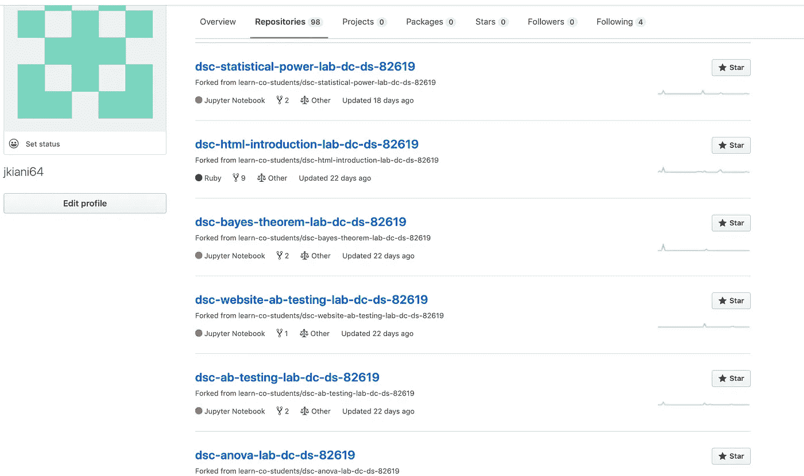
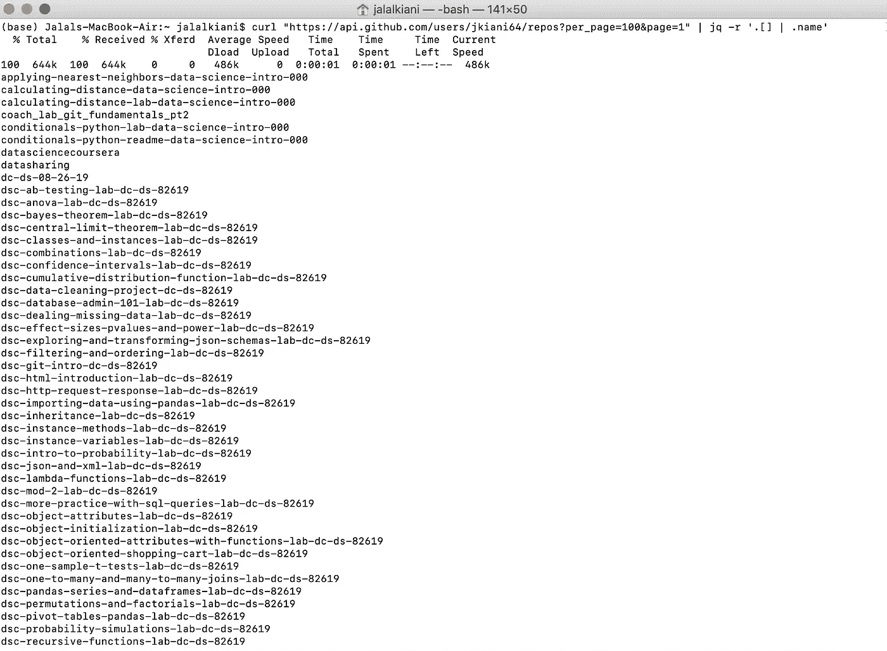
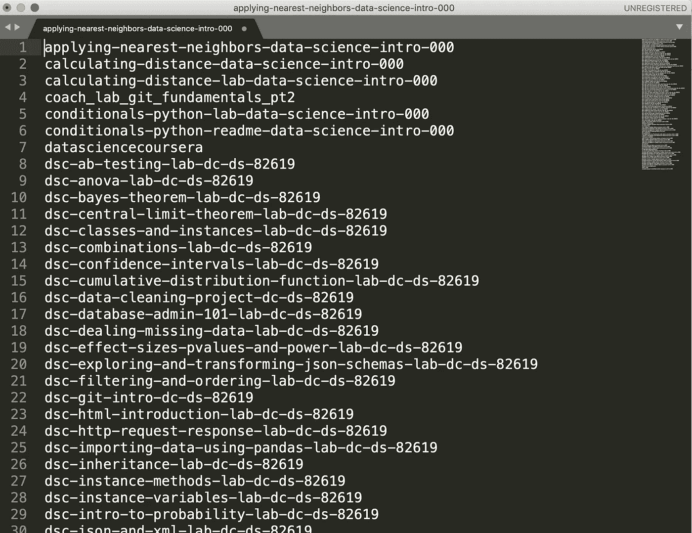
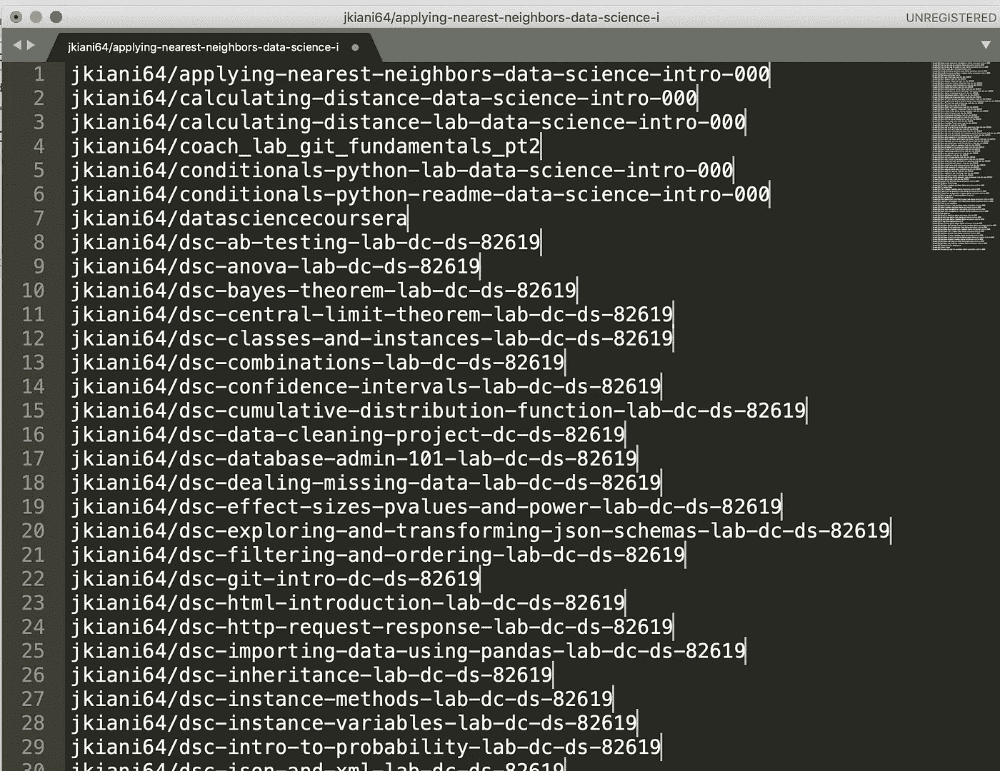
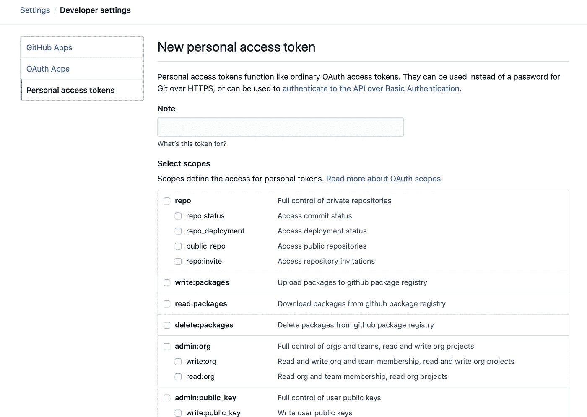
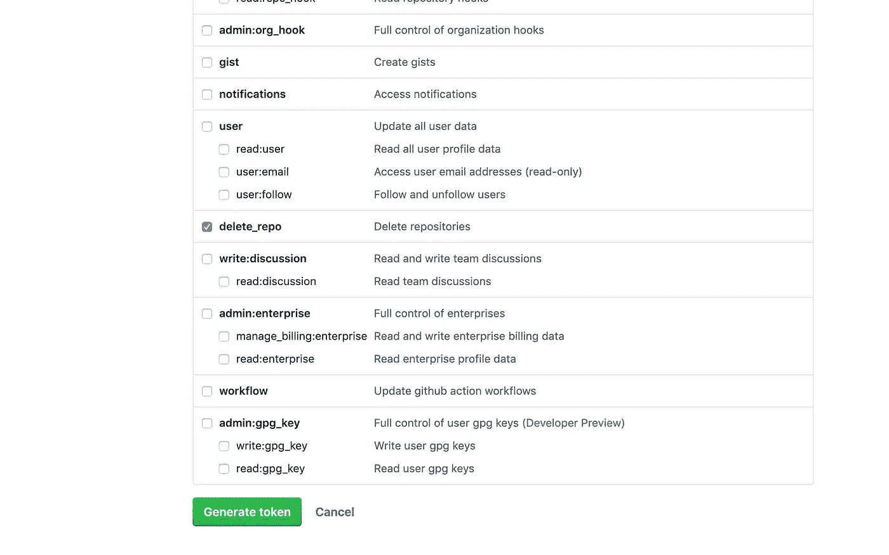
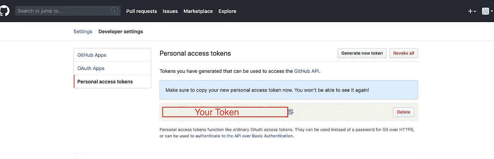

# 使用 GitHub API 删除所有未使用的 GitHub 库！

> 原文：<https://medium.com/analytics-vidhya/delete-all-unused-github-repositories-using-github-api-18ea4d17b8e9?source=collection_archive---------7----------------------->

我有大约 100 个分叉的 GitHub 库(如下图所示)，这让我的 GitHub 账号非常乱。GitHub 只允许用户一次删除一个库，这不是一个非常用户友好的过程。每次，它都会询问您的密码以及每个分支的存储库名称。因此，删除数百个存储库可能需要几个小时。



清理前我的 GitHub 配置文件

GitHub UI 中没有删除大量 GitHub 库的功能。然而，GitHub 有一个 web 服务 API，可以用来删除一堆存储库。在这篇文章中，我试图演示我们如何使用 GitHub 和 git 的 web 服务 API 来删除多个 GitHub 存储库。

1.  我们假设您已经安装了`curl`和`jq`。否则可以使用 Mac 上的`brew install jq` 或者 Windows 上的`chocolatey install jq`来安装`jq`。

2.使用下面的命令行获取 Github 帐户上所有库的名称。

```
curl "https://api.github.com/users/**your_GitHub_account**/repos?per_page=100&page=1" | jq -r '.[] | .name'
```



获取所有存储库的列表

这只返回第 1 页上的存储库，如果您有不止一个页面，您应该更改页码，以获得其他页面上的存储库列表。

3.复制所有存储库的名称并粘贴到一个文本编辑器中，比如 Sublime。 ***然后，只保留那些你想删除的库的名字*** 。在您的主目录下将该文件另存为“repo_list_deleting.txt”。



需要删除所有存储库的名称

4.现在，您需要将您的帐户名添加到每一行或每个存储库名称的第一行。一行一行地做这件事可能非常耗时而且无聊。在 Sublime 中，您可以通过以下方式自动完成:

*   选择所有线
*   转到菜单**选择- >拆分成行** (Cmd/Ctrl + Shift + L)

这允许您一次编辑多行。现在您可以在每一行的开头添加“您的帐户名称/*”*。



向所有存储库名称添加帐户名

5.在[https://github.com/settings/tokens/new](https://github.com/settings/tokens/new)注册一个具有 *delete_repo* 权限的新个人访问令牌



填写注释部分



选中 delete_repo，然后单击生成令牌



复制您的个人访问令牌

6.最后，在 Mac 上使用以下命令行:

```
while read repo; do curl -X DELETE -H "Authorization: token Your_TOKEN" "[https://api.github.com/repos/$](https://api.github.com/repos/$r)repo"; done < repo_list_deleting.txt
```

如果上述代码不起作用，请尝试在您的终端中重新键入引号。

在 Windows 上:

```
get-content C:\repo_list_deleting.txt | ForEach-Object { Invoke-WebRequest -Uri [https://api.github.com/repos/$_](https://api.github.com/repos/$_) -Method “DELETE” -Headers @{“Authorization”=”token Your_TOKEN”} }
```

请注意，要运行上述命令，您需要位于您的主目录下。