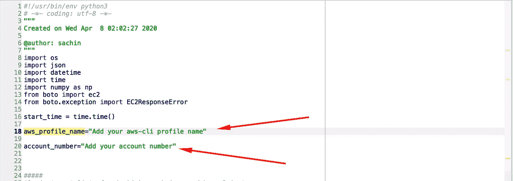

# 删除未使用的 AMI-Python

> 原文：<https://medium.com/analytics-vidhya/delete-unused-amis-python-f9db0102f12?source=collection_archive---------6----------------------->

> 现在节约成本，或者以后后悔。


来源:谷歌图片

AMI 在您的 AWS 帐户中创建的帐户对您每月的账单有很大的影响。当我们出于备份目的手动或通过脚本创建大量 AMI 时，就会发生这种情况。因此，为了优化成本，我们必须删除未使用的 AMI，因为即使它们被使用或未被使用，它们也会增加成本。**这些 AMI 由快照使用，在取消注册 AMI 之前不能删除这些快照。**

**AMI:** An [**Amazon 机器映像(AMI)**](https://docs.aws.amazon.com/AWSEC2/latest/UserGuide/AMIs.html) 提供启动 EC2 实例所需的信息，该实例包含一个或多个快照、启动权限和块设备映射。

整个过程的简要说明如下:

*   获取在您的帐户中创建的所有 AMI:
*   从 EC2 实例中查找未使用的 AMI。
*   取消 AMI 的注册。

# **问题陈述:**

注销/删除超过 3 个月且未使用的 AMI，以优化成本。

**脚本的逻辑和功能**

*   **ami_from_ami_list()** :从 aws cli 运行 *ec2 describe-images* 以获取您帐户中超过 3 个月的所有 ami 的列表(比如列表 1)。
*   **ami _ from _ ec2 _ instances()**:从 aws cli 运行*ec2 describe-instances***以获取附加 AMI 或使用中 AMI 的列表(比如列表 2)。**
*   ****ami_not_in_use():** 找到不在使用中的 ami，即*列表 1 中的 AMI，但不在列表 2 中。***
*   ****deregister_ami()** :运行 AWSderegister 函数，取消 ami 的注册。**

****要求****

*   **AWS 帐号:您的 AWS 帐号。**
*   **AWS (aws-cli)配置文件名称:您的 aws-cli 配置文件名称。**

***查看以下截图以添加要求。***

********

****代码****

```
#!/usr/bin/env python3
# -*- coding: utf-8 -*-
"""
Created on Wed Apr  8 02:02:27 2020[@author](http://twitter.com/author): sachin
"""
import os
import json
import datetime
import time
import numpy as np 
from boto import ec2
from boto.exception import EC2ResponseErrorstart_time = time.time() 
aws_profile_name="Add your aws profile name"
account_number="ADD your aws account number"  #logic to get list of ami which are being used by ec2-instances
def ami_from_ec2_instances():

    resp = f"aws ec2 describe-instances --profile {aws_profile_name} --query 'Reservations[*].Instances[*].[InstanceId , InstanceType, ImageId, State.Name, LaunchTime, Placement.AvailabilityZone, InstanceLifecycle, Platform ,VirtualizationType,PrivateIpAddress, PublicIpAddress, [Tags[?Key==`Name`].Value] [0][0], [Tags[?Key==`purpose`].Value] [0][0], [Tags[?Key==`team`].Value] [0][0], [Tags[?Key==`habitat`].Value] [0][0] , [Tags[?Key==`Project`].Value] [0][0],  [Tags[?Key==`provisioner`].Value] [0][0], [Tags[?Key==`spotinst:aws:ec2:group:id`].Value] [0][0] ]' --region ap-southeast-1 --output json"
    ec2_data = os.popen(resp)
    output = ec2_data.read()
    #converting the response into JSON
    ec2_data_json=json.loads(output)
    ami_from_ec2=[]

    #iterating the list 
    for i in ec2_data_json:
        for j in i:
            for k in j:
                res = [str(k or 'NA') for k in j]
                #print (res)
                #to convert the list to string since we cannot insert list into db directly as per our use case
                sac = ",".join(res)
                #print(sac)
                #print("\n")
                val=(sac)
                #to convert the string into tuple containing , in the string
                val_split=tuple(val.split(','))
        #print(val_split)
        instance_id=val_split[0]
        ami=val_split[2]
        private_ip=val_split[9]
        name=val_split[11]
        state=val_split[3]
        value=(instance_id,ami,state,private_ip,name)
        if state=="running":
            ami_from_ec2.append(ami)
            #print("\n")               
            #print (value)
        else:
            pass

    return (ami_from_ec2)#logic to get list of ami which exists in aws account
def ami_from_ami_list():

    ami_from_amilist=[]
    timeLimit=datetime.datetime.now() - datetime.timedelta(days=90)
    sachin=timeLimit.date()
    resp1 = f"aws ec2 describe-images --profile {aws_profile_name} --region ap-southeast-1 --filters --owners {account_number} --output json"
    #method
    config_data1 = os.popen(resp1)
    output1 = config_data1.read()
    config_data_json1=json.loads(output1)

    for num in config_data_json1['Images']:
        image_id=num['ImageId']
        creation_date_raw=num['CreationDate']
        owner_id=num['OwnerId']
        creation_date_raw_1=tuple(creation_date_raw.split('T'))
        creation_date=creation_date_raw_1[0]
        creation_date_object = datetime.datetime.strptime(creation_date, '%Y-%m-%d').date()
        state=num['State']
        try:
            name=num['Name']

        except KeyError as e:
            name="NA"

        if creation_date_object <  timeLimit.date() and state== "available":
                ami_from_amilist.append(image_id)    
                #print (image_id, name,creation_date, state,owner_id)
    return (ami_from_amilist)#function which returns list of AMI which are not in use and are older than 6 months
def ami_not_in_use():

    ami_from_ec2=ami_from_ec2_instances()
    ami_from_amilist=ami_from_ami_list()
    #Unique values in array1(ami_from_amilist) that are not in array2(ami_from_ec2)
    #Below array will give me list of ami which are not in use by any instance and are older than 6 months
    ami_not_inuse=(np.setdiff1d(ami_from_amilist,ami_from_ec2))

    print ("AMI which are not in use and are older than 6 months")
    print (ami_not_inuse)
    print("\n")
    return(ami_not_inuse)#function to deregister ami's which are not in use and are older than 3 months
def deregister_ami():
    connection=ec2.connect_to_region("ap-southeast-1",profile_name = aws_profile_name)
    ami_to_deregister=ami_not_in_use()
    print ("Degistering AMI's")
    print ("\n-----------------")
    print ("\n")
    for ami in ami_to_deregister:  
      try:
        connection.deregister_image(ami)
        print (" Deregistering AMI %s "  %(ami))    
      except EC2ResponseError as e:
        print ("exception in AMI: %s" %(ami))    
      else:
          pass

#calling function    
deregister_ami()total_ececution_time=(time.time() - start_time)
print ("\n")
print ("Total_ececution_time", total_ececution_time, "seconds")
```

****结果****

****

*****你可以在我的 Linkedin 个人资料上找到我的另一篇成本优化文章:***[*https://www.linkedin.com/in/sssachinsharma52/*](https://www.linkedin.com/in/sssachinsharma52/)**

****下面附上部分文章:****

**[](/lenskart-engineering/aws-infra-cost-optimisation-180e14a7e7ae) [## AWS 基础设施成本优化

### 存钱就是挣钱。如果你不能照顾好你的基础设施账单，没有人会去做…

medium.com](/lenskart-engineering/aws-infra-cost-optimisation-180e14a7e7ae) [](/@sssachinsharma52/aws-ri-normalised-factor-3f112279c2cd) [## AWS RI 标准化因子

### 亚马逊保留实例

medium.com](/@sssachinsharma52/aws-ri-normalised-factor-3f112279c2cd)**