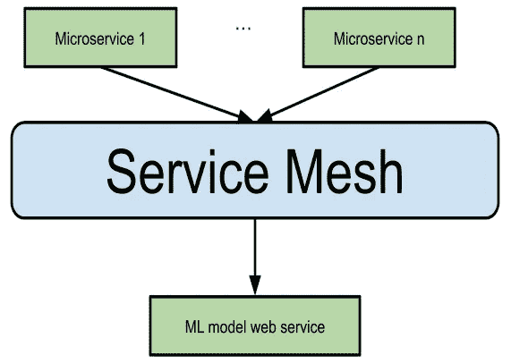

# 向业务 SOA 交付 ML 模型

> 原文：<https://medium.com/analytics-vidhya/delivering-ml-models-to-the-business-soa-47ee326674ec?source=collection_archive---------10----------------------->

作为你公司的机器学习工程师，你刚刚“烘焙”了你的机器学习预测模型，那么，现在呢？为了让你的公司从模型中获益，你需要交付它。我将通过一家科技公司的实际用例来展示如何做到这一点，该公司使用基于[微服务](https://microservices.io/)的[面向服务架构](https://en.wikipedia.org/wiki/Service-oriented_architecture)，并使用 Python 作为编程语言。

# 关于模型

对于那些不熟悉 ML 的人来说，预测模型是一个可以将输入 X 映射到预测输出 Y 的函数，如将图像映射为输入，将标记为猫或不猫作为输出(分类)，或将房子的一些特征(m、位置……)映射到预测价格(回归)。

对于我们的实际用例，假设我们是一家房地产代理机构，为了示例的目的，我们将只关注房屋租赁。我们的机构需要一种方法来预测基于某些特征的房价，如 m，因为有些房子不是由评估师定价的。为了预测价格，我们将使用一个最简单的预测模型，即[线性回归](https://en.wikipedia.org/wiki/Linear_regression)。

# 架构概述

微服务架构的一个基本规则是用一个应用程序来管理一个业务单元，就像我们机构的房屋。大多数关于如何将 ML 模型部署到生产的教程都将模型映射到 web 服务中，但请注意，模型本身并不是一个业务单位，它更像是 houses microservice 用来预测无价格房屋的工具。

为基本功能创建单一服务是一种微服务反模式，称为 nanoservice。为了避免这种情况，我们可以将我们的模型作为一个库来分发，houses microservice 将把它定义为一个依赖项。请注意，这种方法有一个缺点—如果您的微服务架构非常异构，并且您有很多编程语言，您的库可能不兼容，因此您仍然需要使用 web 服务作为公共集成接口。在这种情况下，我建议将您的模型作为一个库进行分发，并在一个单独的项目中创建 web 服务，然后将您的库设置为一个依赖项。这种方法尊重 [12factor](https://12factor.net/) 应用程序，将界面与功能分离将允许您为您的模型创建不同的界面，如 CLI 或桌面 GUI。

因此，我将向您展示两种方法，直接集成到 python houses 微服务中，并创建一个 web 服务作为公共接口，让您的不同微服务使用该模型。



通过独立的 web 服务连接 ML 模型。

# 构建模型

对于 Python 软件开发，我喜欢 PyCharm 作为 IDE，但是对于数据来说， [JupyterLab](https://jupyterlab.readthedocs.io/en/stable/) 是一个好得多的 IDE，它的接口在你的浏览器中运行，而内核(解释器)在主机中。您可以在单独的单元格中创建代码块，这样您就可以预处理一些需要花费大量时间的数据，然后在下一个单元格中处理这些数据，而不会在执行之间丢失它们。

JupyterLab 的问题是，它使用 ipynb 格式，你的库需要用 py 源代码来构建，而且版本化笔记本可能真的很难，因为它的格式。为了解决这个问题，我推荐 [Jupytext](https://github.com/mwouts/jupytext#jupytext-commands-in-jupyterlab) 扩展，它可以将你的笔记本同步到多种格式，包括 py 源。您需要从 [NodeJS](https://nodejs.org/en/) 安装第一个节点和 npm 包来管理 JupyterLab 扩展。我还推荐使用 [pipenv](https://docs.pipenv.org/en/latest/) 进行包含依赖锁的项目开发。

聊够了，让我们建立我们的线性回归模型吧！

首先，我们需要数据来训练，所以我从我的城市(巴塞罗那)拿了几个房屋租赁的例子，然后从原始的数据中合成了更多的数据。有了熊猫图书馆，我们可以轻松地保存/加载 csv 或 excel 文件和管理数据。一旦我们有了数据，我们应该把它分成 80%的训练和 20%的测试。然后，训练模型，测试，保存。出于示例的目的，我们将只使用 m 作为输入特征。

培训:

```
class HouseRentModelBuilder(object):
    ''' House rent model builder '''

    def __init__(self, rentals_dataset=None):
        ''' Model constructor '''
        self.model = linear_model.LinearRegression()
        self.rentals_dataset = rentals_dataset

    def train(self):
        ''' Use the dataset to train the model '''
        m2_X_train, price_Y_train = self.rentals_dataset.train_sample()
        self.model.fit(m2_X_train, price_Y_train)
```

使用 scikit-learn 库，训练代码就是这么简单！

一旦模型被训练，我们就可以用它来进行预测。我为模型用法创建了一个 facade 类，其中包含预测、加载和保存模型的方法:

```
class HouseRentModel(object):
    ''' House rent model with price predictions '''

    MODEL_FILE = 'model.pkl'

    def __init__(self, model):
        ''' Model constructor '''
        self.model = model

    def predict(self, m2):
        ''' Accepts a scalar or list of values, then returns the predicted value/s '''
        m2_type = type(m2)
        if m2_type == int or m2_type == float:
            m2_values = np.array([[m2]])
        elif m2_type == list or m2_type == tuple:
            m2_values = np.array([m2]).T
        elif m2_type == np.array:
            pass
        else:
            raise ValueError(f'Unexpected type {m2_type}, expected int/float as scalar or list/tuple of scalars')
        return self.model.predict(m2_values).astype(int)

    def save_model(self):
        ''' Saves the model into file '''
        module_path = os.path.dirname(os.path.abspath(__file__))
        model_file = os.path.join(module_path, self.MODEL_FILE)
        with open(model_file,'wb') as model_file:
            pickle.dump(self.model, model_file)

    def load_model(self):
        ''' Loads the model from file '''
        module_path = os.path.dirname(os.path.abspath(__file__))
        model_file = os.path.join(module_path, self.MODEL_FILE)
        with open(model_file,'rb') as model_file:
            self.model = pickle.load(model_file)
```

如您所见，要保存 scikit-learn 模型，您可以使用内置的 pickle 库将其序列化为一个文件，我们将[打包该文件并随源代码一起分发](https://packaging.python.org/tutorials/packaging-projects/)，因此导入我们模型的其他项目只需加载它，而无需再次训练它。

查看[项目](https://gitlab.com/ml-house-rent/housemodel/tree/master)以了解更多信息。

# 案例 1:将库直接导入微服务

首先，你需要 [docker](https://www.docker.com/) 和 [docker-compose](https://docs.docker.com/compose/) 来运行一切。

对于这个例子，我用 Flask 微框架和一些库创建了一个 RESTful 微服务。Connexion library 使用 API first 方法开发微服务，这意味着在编写 API 本身之前，以 OpenAPI 3 格式设计和记录 REST 接口。此外，elasticsearch-dsl 作为业务模型持久性的“ORM”。这个 API 的目的是对房屋执行 CRUD 操作，并在没有提供价格时预测价格。

我们可以使用以下命令从 PyPI 存储库或直接从 git 存储库安装我们的模型库:

```
pipenv install git+[https://gitlab.com/ml-house-rent/housemodel@1.0.0#egg=housemodel](https://gitlab.com/ml-house-rent/housemodel@1.0.0#egg=housemodel)
```

然后，我们将在管理房屋模型时包括此功能:

```
from ml.house import predictive_modelclass HouseService(object):
    def get_house(self) -> object:
        return HouseFactory.create()

    def fill_house(self, payload):
        house = self.get_house()
        if 'price' not in payload:
            # Predict price if not provided
            price = predictive_model.predict(payload['m2'])[0]
            predicted = True
        else:
            price = payload['price']
            predicted = False
        filled_house = house(
            uuid=payload['uuid'],
            m2=payload['m2'],
            rooms=payload['rooms'],
            location=payload['location'],
            zipcode=payload['zipcode'],
            price=price,
            predicted=predicted
        )
        return filled_house
```

predictive_model 对象只是一个从模块中导入的对象，该模块只是为我们加载它:

```
from housemodel.model import HouseRentModelBuilder

predictive_model = HouseRentModelBuilder().get_model()
predictive_model.load_model()
```

查看一下[项目](https://gitlab.com/ml-house-rent/house-rentals/tree/master)，了解关于构建微服务的更多信息。

# 案例 2:创建独立的 web 服务

如果您的 houses 微服务是 X 语言的，并且您不能导入您的模型库，您可以在 web 服务接口中映射它的功能。这一次，我们将制作一个香草烧瓶应用程序。

同样，我们将首先实例化我们的模型对象:

```
from housemodel.model import HouseRentModelBuilder

model = HouseRentModelBuilder().get_model()
model.load_model()
```

然后，这就是将它映射到一个简单的 web 服务所需的所有代码:

```
from flask import Flask, request, jsonify
from housemodel_service import model

app = Flask(__name__)

@app.route('/')
def url_doc():
    urls = {'predict': '/predict'}
    response = jsonify(urls)
    response.status_code = 200
    return response

@app.route('/predict')
def hello_world():
    m2_list = request.args.get('m2')
    if not m2_list:
        err = {'error': 'Need the m2 parameter'}
        response = jsonify(err)
        response.status_code = 400
        return response
    m2_list = m2_list.split(',')
    try:
        m2_list = list(map(int, m2_list))
    except ValueError as e:
        err = {'error': 'Some value is not an integer'}
        print(e)
        response = jsonify(err)
        response.status_code = 400
        return response
    predictions = model.predict(m2_list)
    results = {}
    i = 0
    for m2 in m2_list:
        results[m2] = int(predictions[i])
        i += 1
    response = jsonify(results)
    response.status_code = 200
    return response

if __name__ == '__main__':
    # WARNING: Only for development!
    app.run(port=8080)
```

见[项目](https://gitlab.com/ml-house-rent/housemodel-service/tree/master)文档获取并测试。

# 结论

将我们的模型作为一个库发布，将它的生命周期从微服务中分离出来，并将其集成到不同的接口中，如 web 服务或 GUI。保存/加载一个模块就是序列化/反序列化它。保持模型所需的最少信息是线性回归中的学习参数、线性函数的系数，但请注意，使用 scikit-learn 和 pickle 这样的高级库，我们可以从中抽象出我们。