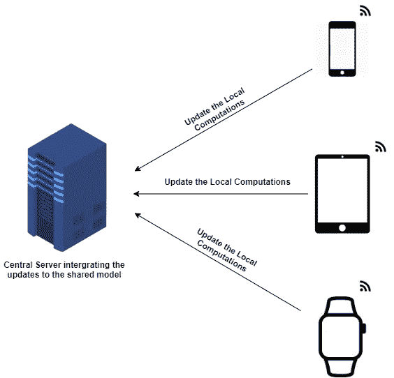
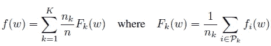

# 探究联邦学习——ML 中的一种分散式培训方法

> 原文：<https://medium.com/analytics-vidhya/delving-into-federated-learning-a-decentralized-training-approach-in-ml-69ae4cd65b6e?source=collection_archive---------20----------------------->

联邦学习的关键可以表述为，

> **“将代码转化为数据，而不是将数据转化为代码”**

在当今时代，全球数百万人通过智能手机、平板电脑和其他智能设备产生了前所未有的大量数据。摄像机、GPS 和麦克风等设备中的各种传感器可以访问大量数据，这些数据本质上是私有的。尽管这种数据对于训练各种基于监督学习的系统非常有用，但是不可能将它们存储在一个集中的位置。在这种情况下，可以应用联合学习。它不是将所有数据存储在一个地方，而是通过从客户端设备聚合和传送本地计算的更新来创建一个共享模型，从而分散了整个培训方法。

# 隐私和其他优势

在受到攻击时，存储用户的原始数据会使他们的隐私受到威胁。在联合学习中，只有必要的更新(包含的信息少于原始数据)才会从客户端设备而不是原始数据本身进行通信。在必须使用存储在集中位置的代理数据的真实场景中，理想情况下，代理数据不会与真实用户生成的数据相同。例如，任何标准的大型图像数据库都不会包含与用户使用智能手机摄像头点击的图像相似的所有类型的图像。类似地，任何大型文本语料库都不会包含与 WhatsApp、FB messenger 等中人们使用的语言等效的语言。为了使模型在实时场景中表现良好，用实时或接近实时的数据来训练它是极其重要的。在监督任务的情况下，标签可以从用户与应用程序的交互中收集，如标题、删除或共享图片等。这消除了在各种情况下手工注释数据的需要。

# 联邦优化

通常，在任何机器学习问题中，最终目标是最小化由目标函数定义的误差值，例如

机器学习问题的简单目标函数。

其中 ***w*** 表示权重，而 ***i*** 运行超过训练样本的数量，其中****n****是样本的总数， *f* 表示损失函数。在 f1 的情况下，由于数据是分散的，假设在每一轮更新的 ***K*** 个客户端中，选择一小部分 **C** 个客户端。在选择之后，服务器将模型的全局状态发送到这些客户端，并且根据该全局状态在本地进行计算，最后，更新从客户端发送到服务器。对于选择 K 个客户端的不同部分的每一轮，重复该过程。**

****

**联邦学习的重写目标函数。**

**其中|Pk| = nk。在训练时，分数 C 控制数据的全局批量大小。对于客户端中所有数据的丢失的那部分客户端梯度，计算设备。因此，如果 **C = 1** ，那么它将成为一个完整的批量训练。这种使用同步 SGD 的算法也被称为 **FederatedSGD** 或 **FedSGD。**这使得服务器对结果模型进行加权平均，在此之前，每个客户端向最佳解决方案前进一步。在多次进行平均之前，我们可以迭代整个计算步骤。这被称为**联合平均。**通过这种方式，经过多轮和多次更新，共享模型得到了微调。**

# **参考**

**[1] McMahan，H. B .，Moore，e .，Ramage，d .，& Hampson，S. (2016)。来自分散数据的深度网络的通信有效学习。 *arXiv 预印本 arXiv:1602.05629* 。**