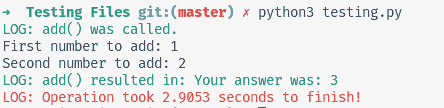

# 深入研究 Python Decorators:第 2 部分

> 原文：<https://medium.com/analytics-vidhya/delving-into-python-decorators-part-2-1936b25baf9d?source=collection_archive---------21----------------------->

这是关于 Python 中装饰者的四部分系列的第二部分。该系列的第一部分可以在这里找到。

在本系列的第一部分中，我们介绍了装饰者的基础知识，它们是什么，如何使用它们，以及为什么应该使用它们。Python 中有很多 decorators 的实际应用。有些是:

*   日志函数，用于调试函数。
*   速率限制函数，可用于降低检查某个资源自上次访问以来是否已被更改的函数的速度。
*   计时函数，可以用来检查一个函数执行需要多长时间。
*   登录功能；这主要用于 web 应用程序，如 Flask 和 Django，以确保有登录的用户。
*   插件注册，可以用来注册，添加新插件，编辑现有插件，使用插件。

本周，我们将讨论其中之一:对数函数。

日志记录有助于更好地理解代码是如何执行的，它通常是调试错误的基本方法。

> *调试[* [*1*](https://en.wikipedia.org/wiki/Debugging) *]指的是发现并解决计算机程序内的错误。*

装饰者可以对此有所帮助；您可以创建一个 logger 函数，然后将它用作您想要记录的任何函数的装饰器。

见下文:

my_logger 函数，一个简单的函数，用来记录函数被调用和执行的时间。

让我们详细回顾一下这段代码。

*第一步:定义 my_logger 函数。*

我们定义了 my_logger 函数，唯一的参数是`function`，修饰后的函数将作为输入传递。

*第二步:“函数被调用”输出。*

我们现在有了一个简单的打印语句，它使用了`.format()`方法和`__name__`方法来很好地输出函数名。`__name__`方法是 **Dunder** 方法[ [2](https://www.geeksforgeeks.org/dunder-magic-methods-python/) ]的一个例子。邓德代表分数下的*d*double*。这些方法用于运算符重载，这意味着为 Python 中的运算符提供扩展功能。*

*第三步:定义内部函数。*

这里，我们定义了内部函数，我们称之为包装器。包装器以`*args`和`**kwargs` [ [3](https://book.pythontips.com/en/latest/args_and_kwargs.html) 为参数。这是一个 Python 特性，它接受修饰函数的所有位置和关键字参数，并将它们存储为变量。*args 和**kwargs 传递尽可能多的参数，即使您并不真正知道需要传递多少个参数。

*第四步:执行修饰函数。*

在第 4 步中，我们执行函数并将函数的结果存储为`funcRes`变量。

> *记得在* [*这一系列的第一部分*](/@ashwin.nair1700/delving-into-python-decorators-part-1-a95b57d3a7bc) *中，Python 中的函数有***[*4*](https://www.geeksforgeeks.org/first-class-functions-python/)*。这意味着它们可以在其他函数中用作参数。***

***第五步:函数输出。***

**现在，我们用另一个 print 语句返回函数的输出。我们还显示了函数名，以准确显示正在显示的函数输出。**

**第六步:返回报表。**

**底部的两个 return 语句是拼图的最后一块。`return funcRes`作为`wrapper`功能的输出，`return wrapper`作为`logging`功能的输出。**

**现在我们已经组装好了日志记录函数，是时候测试它了。我写了一个简单的脚本来测试它:**

**add 函数用于测试 my_logger 函数。**

**输出:**

**成功！my_logger decorator 记录函数何时被调用，何时被执行。**

**有用！您已经成功地编写了一个日志记录函数，它会告诉您调用了什么函数，以及输出是什么！现在，如果我们更进一步，增加计时功能来计算修饰函数执行的时间，会怎么样呢？这其实很简单。然而，为了使输出更具视觉吸引力，让我们使用 python 的`colorama` [ [5](https://pypi.org/project/colorama/) ]模块。您需要使用 pip 来安装它:**

**`~ pip install colorama`**

**Colorama 允许您自定义终端输出的颜色。我们可以利用这一点使我们的日志输出从函数输出中脱颖而出，或者只是使您的输出更有吸引力。**

**my_logger 函数的更新版本，现在完成了终端内的颜色和计时。**

**这就是完成的`my_logger`功能。让我们像以前一样分解它:**

***第一步:导入报表。***

**我们有之前和 pip 一起安装的`colorama`模块，我们从其中导入了`Fore`和`Style`函数。`Fore`和`Style`是`colorama`提供的两个格式化常量。`Fore`可让您选择想要使用的颜色，而`Style`可帮助您选择风格。除了`colorama`，我们还有`time`模块，这是 Python 中包含的一个基本模块。**

***第二步:perfCounter()，start_time 变量。***

**我们之前导入了`time` [ [6](https://docs.python.org/3/library/time.html) 模块，这是 Python 标准库中的一个模块。它有一个函数叫做`perfCounter()` [ [7](https://www.geeksforgeeks.org/time-perf_counter-function-in-python/) ]，是“性能计数器”的简称。在这里，我们将它用作一种秒表，每当函数执行时开始计时，每当函数执行完毕时停止计时。这里，我们使用`start_time`变量来标记函数何时开始运行。**

***第三步:Fore 和 Style。***

**现在我们使用 colorama 定制终端输出颜色。通过在打印语句的开头使用`Fore.GREEN`，我们可以将打印语句的内容变成绿色。使用`Style.RESET_ALL`功能，我们结束 colorama 更改，确保其他打印语句不会受到此语句中颜色设置的影响。**

***第四步:end_time 变量。***

**我们再次利用来自`time`模块的`perfCounter()`函数，现在我们将`end_time`设为变量，它标记函数停止运行的时间。**

***第五步:time_taken 变量。***

**现在，我们引入`time_taken`变量，它是`end_time`减去`start_time`。这是 functiprint(user_input)在上执行所用的时间。**

***第六步:定时输出。***

**在第 6 步中，我们看到一个用红色格式化的打印语句，以区别于其他日志记录语句(用绿色完成)和修饰函数的输出。我们使用`.4f` [ [8](https://shocksolution.com/2011/11/03/python-string-format-examples/) ]格式说明符来指定打印输出时要显示多少个小数位。**

**现在我们已经创建了函数，让我们测试一下。我们可以使用之前使用过的相同的`add()`函数来测试第一个`my_logger()`函数。**

**输出:**

****

**最终产品；视觉吸引力和实用性。**

**我们已经创建了一个主日志记录函数，它有很好的输出，并记录了修饰函数执行的时间。当然，这是可以改进的。**

**总之，我们构建了一个主要的日志记录函数，记录调用了什么以及执行修饰函数花费了多长时间。我们还看了 Python 的标准库模块之一 time 模块和 colorama 使用 pip 安装的外部模块。这个简单的程序很大程度上是可扩展的；想怎么改进就怎么改进吧！**

**感谢阅读这篇文章。如果你觉得它有帮助，考虑给它鼓掌！如果你想在我发表更多文章时得到通知，请关注我。**

**在下一篇文章中，我们将使用 decorators 来尝试限制(或减慢)您的代码。留意它！**

1.  **[调试定义](https://en.wikipedia.org/wiki/Debugging)**
2.  **[极客为极客:邓德方法](https://www.geeksforgeeks.org/dunder-magic-methods-python/)**
3.  **[Python 提示:*args 和**kwargs](https://book.pythontips.com/en/latest/args_and_kwargs.html)**
4.  **[极客对极客:第一类对象](https://www.geeksforgeeks.org/first-class-functions-python/)**
5.  **[PyPi Colorama](https://pypi.org/project/colorama/)**
6.  **[Python 文档:时间模块](https://docs.python.org/3/library/time.html)**
7.  **[极客对极客:perfCounter()](https://www.geeksforgeeks.org/time-perf_counter-function-in-python/)**
8.  **[震撼解决方案:Python 字符串格式化](https://shocksolution.com/2011/11/03/python-string-format-examples/)**