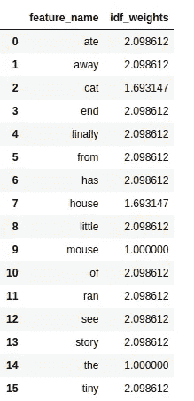
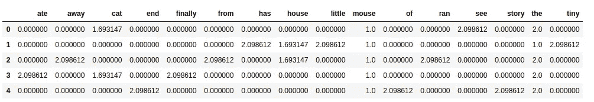

# Sklearn 的 TF-IDF 演示计算

> 原文：<https://medium.com/analytics-vidhya/demonstrating-calculation-of-tf-idf-from-sklearn-4f9526e7e78b?source=collection_archive---------0----------------------->

## python 中 sklearn 的 TF-IDF 模块背后的数学逻辑解释


图:1.1

## **什么是文本数据的特征工程？**

将原始文本数据转换成机器可理解的格式(数字)的过程称为文本数据的特征工程。机器学习和深度学习算法的性能和准确性从根本上取决于所使用的特征工程技术的类型。

在本文中，我们将看到使用 TF-IDF 的特征工程技术以及 TF、IDF 和 TF-IDF 的数学计算。读完这篇文章后，你会理解 python 中的*sk learn . feature _ extraction*包中的 *TfidfTransformer* 等库背后的数理逻辑。

## **TF(词频):**

*   词频就是一个单词在一个句子中出现的次数
*   TF 基本上是捕捉单词的重要性，而不考虑文档的长度。
*   一个词频为 3、句子长度为 10 的词和句子长度为 100 的词是不一样的。在第一种情况下，它应该变得更加重要；这就是 TF 的工作。

## **IDF(逆文档频率):**

*   每个单词的 IDF 是总行数与该单词所在的特定文档中的行数之比的对数。
*   IDF 将衡量一个术语的稀有程度。像“a”和“the”这样的词出现在语料库的所有文档中，但是稀有词并不在所有文档中。

## **TF-IDF:**

它是 TF 和 IDF 的最简单的产品，因此上面提到了两个缺点，这使得预测和信息检索相关。

我们将使用以下包含五个文档的语料库:

```
docs = ['the cat see the mouse',
      'the house has a tiny little mouse',
       'the mouse ran away from the house',
        'the cat finally ate the mouse',
       'the end of the mouse story'
       ]
```


图 1.2

> **使用**[**TfidfTransformer**](https://scikit-learn.org/stable/modules/classes.html#module-sklearn.feature_extraction)***从****[**sk learn . feature _ extraction**](https://scikit-learn.org/stable/modules/generated/sklearn.feature_extraction.text.TfidfTransformer.html#sklearn.feature_extraction.text.TfidfTransformer)**包中提取特征。***

*现在从 sklearn.feature_extraction 模块导入 TfidfTransformer 和 CountVectorizer。*

```
*from sklearn.feature_extraction.text import TfidfTransformer
from sklearn.feature_extraction.text import CountVectorizer*
```

*CountVectorizer 用于查找数据集的每个文档中的字数。也称为计算词频。要了解更多信息，请点击[此处](https://scikit-learn.org/stable/modules/generated/sklearn.feature_extraction.text.CountVectorizer.html#sklearn.feature_extraction.text.CountVectorizer)*

*让我们看一个例子，*

*从上面的文档中，我们将使用计数矢量器拟合所有的句子，并获得每个文档的字数数组。*

```
*import pandas as pd
cv = CountVectorizer()
word_count_vector = cv.fit_transform(docs)tf = pd.DataFrame(word_count_vector.toarray(), columns=cv.get_feature_names())
print(tf)*
```

*输出:*

**

*现在声明 TfidfTransformer()实例，用上面的 word_count_vector 拟合，得到 IDF 和最终的归一化特征。*

***注:**TfidfTransformer(*norm = ' l2 '*)默认使用' L2 '参数进行归一化，其中 vector(document)元素的平方和为 1，也称为欧氏范数。*

```
*tfidf_transformer = TfidfTransformer()
X = tfidf_transformer.fit_transform(word_count_vector)
idf = pd.DataFrame({'feature_name':cv.get_feature_names(), 'idf_weights':tfidf_transformer.idf_})
print(idf)*
```

*输出:*

**

*最终特征向量是:*

```
*tf_idf = pd.DataFrame(X.toarray() ,columns=cv.get_feature_names())
print(tf_idf)*
```

*输出:*

**

*图 1.3*

*对以上结果感到困惑？不要担心，让我们看看下面的矢量 0 的公式和计算。*

**

*图:1.4*

*在上面的文档集中，向量 0 是`docs[0]`，即`the cat see the mouse`*

*向量 0 的特征索引是:*

*{'the': 14，' see':12，' mouse':9，' cat':2} see 索引`idf`数据帧。*

*因此，*

******

*这就是 sklearn 软件包计算规格化特征的方法。*

*现在，如果你想看到 sklearn 背后的实用方法。我将在不使用 sklearn 库的情况下演示手动方法。只需要几行代码，我相信这将有助于更好地理解 TF-IDF 计算，让我们继续吧。*

*为上述文件创建一个数据框架`df`，*

```
*df = pd.DataFrame({‘docs’: [‘the cat see the mouse’,
 “the house has a tiny little mouse”,
 ‘the mouse ran away from the house’,
 ‘the cat finally ate the mouse’,
 ‘the end of the mouse story’
 ]})print(df)*
```

*输出:*

**

*创建一个名为`tokens`的额外列，包含我对上述语料库中的每个文档进行标记所形成的单词列表。*

```
*df[‘tokens’] = [x.lower().split() for x in df.docs.values] 
print(df)*
```

*输出:*

**

*现在，为了计算词频，在上面的 dataframe 列`tokens`上应用一个匿名函数，以便确定每行中每个单词的计数。用`0`填充`nan`值，最后使用 sort_index()函数按列名对结果数据帧进行排序，如以下代码所示。*

```
*tf = df.tokens.apply(lambda x: pd.Series(x).value_counts()).fillna(0)   
tf.sort_index(inplace=True, axis=1)
# 'a' feature doesn't seems good feature so, removing it from tf 
tf.drop('a', axis=1, inplace=True)
tf*
```

*输出:*

**

*现在，我们将使用与图 1.2 中相同的公式计算 IDF，即:*

**

*图:1.5*

*参考下面的代码实现上述公式，*

```
*import numpy as np
idf = pd.Series([np.log((float(df.shape[0])+1)/(len([x for x in df.tokens.values if token in x])+1))+1 for token in tf.columns])
idf.index = tf.columns
print(idf)*
```

*输出:*

**

*要计算 TF-IDF，只需将上面的`tf`数据帧和`idf`相乘，让我们看看下面的代码和最终结果。*

```
*tfidf = tf.copy()
for col in tfidf.columns:
 tfidf[col] = tfidf[col]*idf[col]

print(tfidf)*
```

*输出:*

**

*现在，我们必须使用欧几里德范数来归一化上述结果*

1.  *参考[图:1.3](https://cdn-images-1.medium.com/max/800/1*yYuR79ejxnVZKY5Ft6Bimg.png) 因此，为了实现这一点，我们将对上述`tfidf`数据帧中的一行的每个元素的平方和应用`numpy.sqrt()`，以获得`sqrt_vec`。*
2.  *使用数据帧`[DataFrame.div](https://pandas.pydata.org/pandas-docs/version/0.24.2/reference/api/pandas.DataFrame.div.html)`的浮点除法将`tfidf` 除以索引上的`sqrt_vec`。*

```
*sqrt_vec = np.sqrt(tfidf.pow(2).sum(axis=1))
tfidf.div(sqrt_vec, axis=0)*
```

*输出:*

**

*如果你在[看到使用 sklearn 库的`tfidf`的输出:图 1.3](https://cdn-images-1.medium.com/max/800/1*-bpwLYs6Bduo3390pntx7g.png) 和上面的输出是一样的。这就是 sklearn 如何从给定的文本数据语料库中找到归一化的 TF-IDF 特征值的方式。*

*在真实世界场景中，有大量的原始非结构化文本数据，因此为了处理这些数据，我们可以使用 sklearn 库中的 Tf-IDF 特征工程技术将原始文本数据转换为机器可读的格式。*

*你可以在下面我的 GitHub 链接上引用一个真实的文本数据用例。*

*[](https://github.com/shubhamchouksey/Consumer-Complaint-Classification) [## shubhamchouksey/消费者投诉分类

### 问题:消费者金融保护局每周都会发送数千份消费者关于金融…

github.com](https://github.com/shubhamchouksey/Consumer-Complaint-Classification) 

参考:

[](https://towardsdatascience.com/tf-term-frequency-idf-inverse-document-frequency-from-scratch-in-python-6c2b61b78558) [## python 中从头开始的 TF(词频)-IDF(逆文档频)。

### 从头开始创建 TF-IDF 模型

towardsdatascience.com](https://towardsdatascience.com/tf-term-frequency-idf-inverse-document-frequency-from-scratch-in-python-6c2b61b78558) 

我希望这篇文章对你有用！如果你有任何问题，请在下面留言。

> 您可以在[**LinkedIn**](https://www.linkedin.com/in/insvk/)**上联系我，或者在 [**GitHub**](https://github.com/shubhamchouksey) 上关注我***